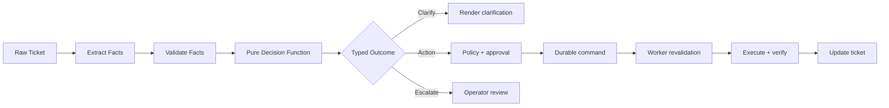

Да, можно сделать заметно элегантнее. Но оптимизация здесь достигается не добавлением большого Rule Engine или LLM, а сокращением числа состояний и введением строгих типов.

Лучший паттерн для IntraLink: Functional Core + Imperative Shell.



## Почему текущая реализация хрупкая

Главная проблема — `RuleDecision` допускает почти любое логически противоречивое состояние:

```python
RuleDecision(
    template_key="user_created",
    status_id=29,
    comment="Временный пароль: {password}",
)
```

Такой объект можно создать:

- до создания пользователя;
- без пароля;
- с несуществующим шаблоном;
- с неправильным статусом;
- без доказательства выполнения.

Кроме того:

- извлечение реквизитов независимо реализовано в Core API и Worker;
- правила одновременно классифицируют, выбирают статус и пишут текст;
- БД, JSON и Python конкурируют за роль SSOT;
- fallback скрывает отсутствие обязательного шаблона;
- `priority` имеет противоречивую семантику;
- свободные `dict[str, Any]` протаскивают ошибки через весь контур.

То есть хрупкость — следствие слишком слабых контрактов, а не недостатка искусственного интеллекта.

## Более элегантная модель: алгебраические результаты

Вместо универсального `RuleDecision` нужны взаимоисключающие Pydantic-модели:

```python
class ClarificationRequired(BaseModel):
    kind: Literal["clarification"]
    reason: ClarificationReason
    missing_fields: list[PersonField]
    context: ClarificationContext
    evidence: list[Evidence]


class ActionProposed(BaseModel):
    kind: Literal["action"]
    action: ActionType
    parameters: ActionParameters
    evidence: list[Evidence]
    risk: RiskLevel


class ManualReviewRequired(BaseModel):
    kind: Literal["manual_review"]
    reason: ReviewReason
    evidence: list[Evidence]


class NoMatch(BaseModel):
    kind: Literal["no_match"]


DecisionOutcome = Annotated[
    ClarificationRequired
    | ActionProposed
    | ManualReviewRequired
    | NoMatch,
    Field(discriminator="kind"),
]
```

Pydantic поддерживает discriminated unions, поэтому система валидирует конкретную ветку по `kind`, а не принимает произвольную комбинацию полей. [Документация Pydantic](https://pydantic.dev/docs/validation/2.3/usage/types/unions/).

Тогда физически невозможно вернуть «пользователь выполнен» из ветки уточнения:

```python
match validate_person(ticket.person):
    case InvalidPerson(errors=errors):
        return ClarificationRequired(
            kind="clarification",
            reason="invalid_person_details",
            missing_fields=fields_from(errors),
            context={},
            evidence=errors,
        )

    case ValidPerson(person=person):
        return ActionProposed(
            kind="action",
            action="create_ad_user",
            parameters=CreateUserParameters(person=person),
            evidence=[...],
            risk="high",
        )
```

Обратите внимание: даже `ActionProposed` ещё не говорит, что пользователь создан. Завершение появляется только из результата Worker.

## Три разных объекта вместо одного

Нужно строго разделить:

```text
DecisionOutcome
    Что система предлагает

Command
    Что разрешено исполнить

CommandResult
    Что фактически произошло
```

Пример жизненного цикла:

```python
ActionProposed(action="create_ad_user")
Command(status="awaiting_approval")
Command(status="running")
CommandResult(kind="verified_success", login="ivanov.i")
CompletedResolution(status_id=29, template="user_created")
```

`status_id=29` не должен существовать до `verified_success`.

## Какие инструменты действительно нужны

### 1. Pydantic v2 — да, уже есть

Это основной инструмент, которого достаточно для большей части рефакторинга:

- discriminated unions;
- строгие модели параметров каждого action;
- нормализация входных данных;
- JSON Schema для API и LLM;
- запрет лишних полей через `extra="forbid"`;
- типизированные error codes вместо строк.

Новый тяжёлый Rule Engine здесь не нужен.

### 2. Shared domain package — обязательно

В `shared/domain` должны жить:

```text
shared/domain/
├── ticket_facts.py
├── person.py
├── decisions.py
├── commands.py
├── results.py
├── validators.py
└── error_codes.py
```

Core API и Execution Worker используют одни типы и валидаторы. Worker всё равно повторяет критические проверки — не потому, что код дублируется, а потому что это отдельная trust boundary.

Общий алгоритм:

```python
raw input
→ normalize
→ Pydantic parse
→ domain validation
→ typed result
```

### 3. Jinja2 — опционально для шаблонов

Если шаблоны останутся простыми, текущего строгого formatter достаточно.

Если нужны условия, списки и склонения, можно использовать:

```python
ImmutableSandboxedEnvironment(
    undefined=StrictUndefined,
    autoescape=False,
)
```

Административно редактируемые шаблоны нельзя исполнять в обычном Jinja environment. Официальная документация рекомендует sandbox, ограниченный контекст и ресурсные лимиты для недоверенных шаблонов. [Jinja Sandbox](https://jinja.palletsprojects.com/en/stable/sandbox/).

При этом Jinja должна только формировать текст. Она не должна выбирать статус или запускать команды.

### 4. Hypothesis — да

Для валидаторов ФИО, hostname, IP, логинов и переходов состояний property-based tests полезнее десятков вручную придуманных случаев:

```python
@given(st.text())
def test_invalid_input_never_produces_create_user_command(value):
    outcome = decide(ticket_with_names(value, value))

    assert not (
        isinstance(outcome, ActionProposed)
        and outcome.action == "create_ad_user"
        and not is_valid_person(value, value)
    )
```

Hypothesis генерирует пограничные значения и уменьшает найденный сбой до минимального примера. [Документация Hypothesis](https://hypothesis.readthedocs.io/en/latest/).

### 5. CEL — только если администраторы действительно должны менять условия

Для простых конфигурируемых фильтров лучше использовать CEL, чем изобретать собственный `conditions_json`:

```cel
ticket.service_id in [42, 53, 54]
&& ticket.person.surname != ""
&& ticket.person.name != ""
```

CEL спроектирован как детерминированный, side-effect-free и не Turing-complete язык с ограниченными затратами исполнения. [Спецификация CEL](https://github.com/cel-expr/cel-spec).

Но ограничения должны быть жёсткими:

- CEL возвращает только `bool`;
- выражение выбирает intent, но не выполняет action;
- доступен только allowlist полей;
- выражение компилируется и тестируется до публикации;
- новая версия сначала работает в shadow mode;
- критические действия остаются rules-as-code.

Python-реализацию CEL следует отдельно проверить пилотом: экосистема заметно слабее официальных Go/Java/C++ реализаций. Поэтому сейчас это не обязательная зависимость.

## Нужен ли Temporal

Пока нет.

Temporal предоставляет durable execution с восстановлением workflow после сбоев и имеет официальный Python SDK. [Temporal Platform](https://docs.temporal.io/), [Python SDK](https://github.com/temporalio/sdk-python).

Он станет оправдан, если появятся десятки долгоживущих сценариев:

- ожидание пользователя днями;
- таймеры и эскалации;
- компенсационные операции;
- несколько worker-контуров;
- сложные retries;
- изменение workflow при уже работающих экземплярах.

Но IntraLink уже имеет:

- `TicketRun`;
- PostgreSQL command state;
- transactional outbox;
- leases;
- Redis Streams;
- approval flow.

Подключение Temporal сейчас создаст второй orchestration plane и дорогую миграцию. Сначала лучше довести существующий durable runner до строгой state machine. Через несколько месяцев можно измерить его сложность и снова принять решение.

## Нужна ли локальная LLM

Да, но не как Rule Engine и не как валидатор безопасности.

У LLM есть хорошая роль:

```text
Неструктурированный текст заявки
              ↓
LLM semantic extractor
              ↓
TicketFacts по JSON Schema
              ↓
Детерминированная валидация
              ↓
Rules / Policy / Worker
```

Пример результата:

```python
class ExtractedTicketFacts(BaseModel):
    intent: Intent | None
    person: PersonCandidate | None
    pc_name: str | None
    printer_address: str | None
    evidence_spans: list[EvidenceSpan]
    ambiguities: list[str]
```

Ollama уже умеет ограничивать ответ JSON Schema, поэтому результат можно сразу валидировать Pydantic-моделью. [Ollama Structured Outputs](https://docs.ollama.com/capabilities/structured-outputs). Аналогичное constrained generation доступно через грамматики llama.cpp. [llama.cpp grammars](https://github.com/ggml-org/llama.cpp/blob/master/grammars/README.md).

Но JSON Schema гарантирует форму, а не истинность содержания. Поэтому LLM нельзя разрешать:

- выбирать окончательный статус 29;
- объявлять AD-операцию выполненной;
- самостоятельно формировать command;
- обходить обязательные поля;
- принимать решение о безопасности;
- заменять AD preflight.

Для #140479 LLM вообще не нужна. Поля содержат `test`; обычный валидатор обязан их отклонить.

### Практичная LLM-стратегия

1. Сначала читать структурированные поля IntraService.
2. Если обязательные поля отсутствуют — извлекать кандидаты из текста локальной LLM.
3. Требовать evidence spans: откуда взято каждое значение.
4. Проверять результат Pydantic и доменными валидаторами.
5. При конфликте structured field и LLM доверять структурированному полю либо отправлять на review.
6. При низкой уверенности возвращать `ManualReviewRequired`.
7. Измерять качество на накопленном eval-наборе закрытых заявок.

Выбор конкретной модели нужно делать после проверки доступной RAM/VRAM и latency target. Маленькая модель может хорошо выполнять schema-constrained extraction, но это следует доказывать offline eval, а не выбирать по названию.

## Что не нужно добавлять

Я бы не добавлял сейчас:

- LangChain;
- LangGraph;
- Drools;
- generic Python rule-engine;
- отдельный микросервис правил;
- векторный поиск для проверки ФИО;
- LLM-агента, самостоятельно управляющего workflow.

Они увеличат количество абстракций, но не устранят слабый доменный контракт.

## Оптимальная целевая конструкция

```text
Core API
├── ingestion
│   ├── normalize structured fields
│   └── optional LLM fact extraction
├── domain
│   ├── strict Pydantic facts
│   ├── pure validators
│   ├── typed outcomes
│   └── rules-as-code
├── resolution
│   ├── decision policy
│   └── strict template renderer
├── workflow
│   ├── TicketRun state machine
│   ├── Command Bus
│   └── immutable audit
└── execution boundary
    └── worker performs preflight → execute → verify
```

Иными словами, элегантное решение — не «умнее выбирать ветвь», а сделать недопустимые состояния непредставимыми. Локальная LLM улучшит извлечение фактов из человеческого текста, но надёжность обеспечат типы, чистые функции, state machine, повторная валидация и доказательство фактического выполнения.