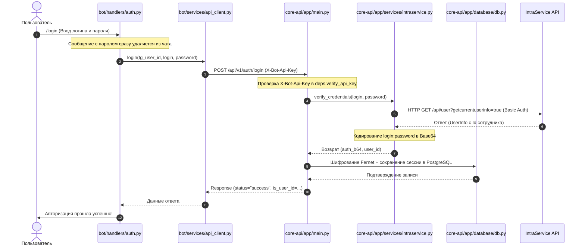
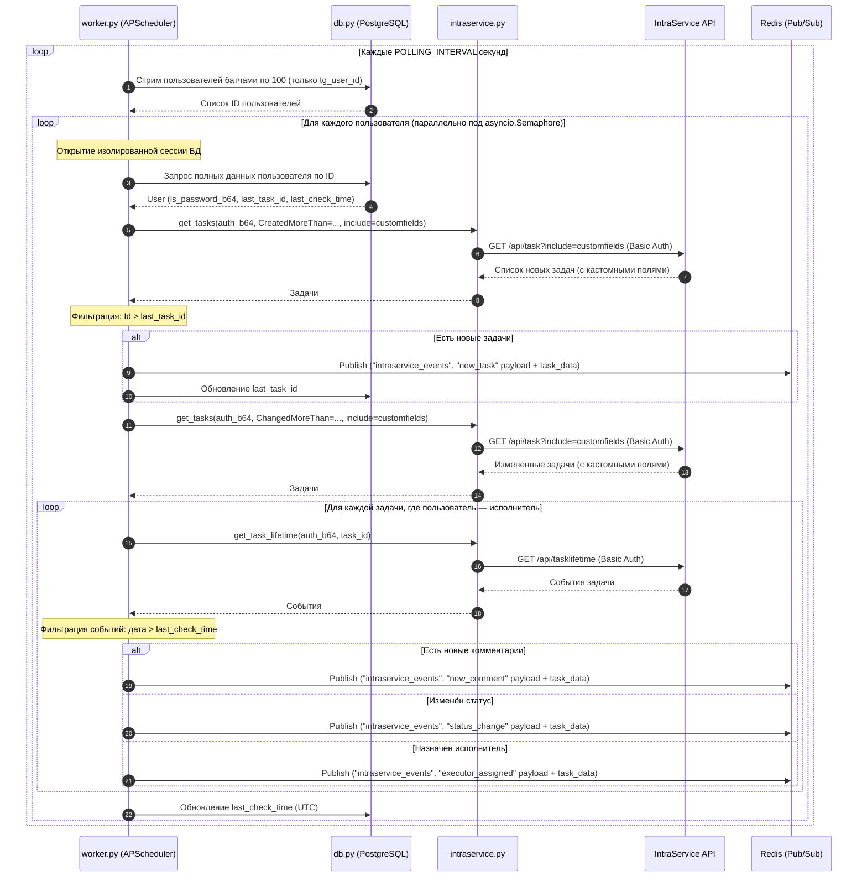
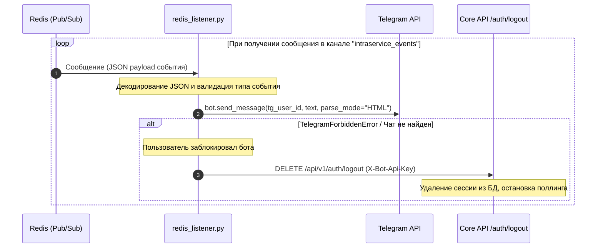
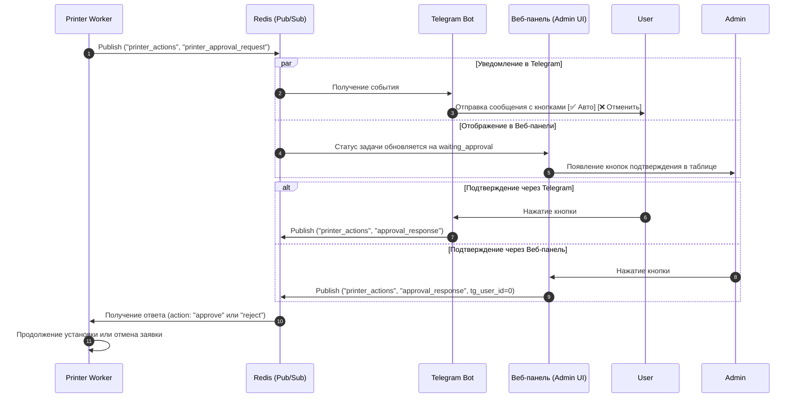

# Архитектура проекта IntraLink (intraservice-tg-bot)

Данный документ описывает архитектуру системы, её ключевые компоненты, потоки данных и принципы взаимодействия между сервисами.

---

## 🏗️ 1. Общий обзор системы

Проект построен по **микросервисной асинхронной архитектуре** и состоит из двух основных сервисов, разделяющих слой интерфейса пользователя и слой бизнес-логики/интеграции:

| Сервис | Технологии | Роль |
|---|---|---|
| **Core API** | FastAPI, SQLAlchemy 2.0, APScheduler | Шлюз к IntraService API, управление БД, фоновый мониторинг, диспетчеризация задач, API для веб-панели |
| **Telegram Bot** | aiogram 3.x, aiohttp | Пользовательский интерфейс, доставка уведомлений |
| **Printer Worker** | Pydantic, aioredis, pywinrm | Автоматическое подключение сетевых/локальных принтеров |
| **AI Worker** | Python, pgvector, LiteLLM, aioredis | Автоматическая классификация новых заявок с помощью RAG и LLM, отправка автоответов и перенаправление задач |

Для асинхронной связи между сервисами используются два канала:
- **HTTP REST** с заголовком `X-Bot-Api-Key` — для синхронных запросов от Бота к Core API.
- **Redis Pub/Sub** — для асинхронной доставки событий мониторинга от Core API к Боту и для передачи задач в Printer Worker.

### 1.1. Схема компонентов и слоёв системы

```mermaid
flowchart TB
    %% Определение стилей
    classDef userStyle fill:#2d3748,stroke:#4a5568,stroke-width:2px,color:#fff;
    classDef telegramStyle fill:#3182ce,stroke:#2b6cb0,stroke-width:2px,color:#fff;
    classDef handlerStyle fill:#dd6b20,stroke:#c05621,stroke-width:2px,color:#fff;
    classDef serviceStyle fill:#319795,stroke:#2c7a7b,stroke-width:2px,color:#fff;
    classDef dbStyle fill:#805ad5,stroke:#6b46c1,stroke-width:2px,color:#fff;
    classDef externalStyle fill:#e53e3e,stroke:#9b2c2c,stroke-width:2px,color:#fff;
    classDef redisStyle fill:#c53030,stroke:#9b2c2c,stroke-width:2px,color:#fff;

    subgraph Clients ["Пользовательский интерфейс"]
        User(["👤 Пользователь в Telegram"]):::userStyle
    end

    subgraph Telegram_Layer ["Внешний слой Telegram"]
        TG_API["💬 Telegram Bot API"]:::telegramStyle
    end

    subgraph Bot_Service ["Telegram Bot Service (Python / aiogram)"]
        direction TB
        B_Main["🚀 main.py"]:::serviceStyle
        B_Config["⚙️ config.py"]:::serviceStyle
        
        subgraph B_Handlers ["Слой представления (Handlers)"]
            H_Start["start_help.py<br/>(Старт / Помощь)"]:::handlerStyle
            H_Auth["auth.py<br/>(Вход / Выход)"]:::handlerStyle
            H_Tickets["tickets.py<br/>(Список заявок)"]:::handlerStyle
        end

        subgraph B_Logic ["Слой интеграции"]
            API_Client["api_client.py<br/>(HTTP Core API клиент)"]:::serviceStyle
            Redis_Listener["redis_listener.py<br/>(Redis Pub/Sub Subscriber)"]:::serviceStyle
        end
    end

    subgraph Broker_Layer ["Шина сообщений"]
        Redis_Broker[("Redis Pub/Sub")]:::redisStyle
    end

    subgraph Printer_Worker_Service ["Printer Worker Service"]
        direction TB
        PW_Main["🚀 worker_main.py"]:::serviceStyle
        PW_Orchestrator["orchestrator.py<br/>(Job Lifecycle)"]:::handlerStyle
        PW_WMI["wmi_executor.py<br/>(WinRM Bootstrap)"]:::serviceStyle
        PW_Strategies["strategies/<br/>(WinRM/SMB)"]:::dbStyle
    end

    subgraph AI_Worker_Service ["AI Worker Service"]
        direction TB
        AIW_Main["🚀 worker_main.py"]:::serviceStyle
        AIW_Classifier["classifier.py<br/>(AI Классификатор)"]:::serviceStyle
        AIW_Responder["responder.py<br/>(AI Автоответчик)"]:::serviceStyle
        AIW_RAG["rag_builder.py<br/>(Построение RAG)"]:::dbStyle
    end

    subgraph Core_API_Service ["Core API Service (Python / FastAPI)"]
        direction TB
        API_Main["🚀 main.py"]:::serviceStyle
        API_Config["⚙️ config.py"]:::serviceStyle
        
        subgraph API_Routers ["Роутеры API (Endpoints)"]
            R_Auth["auth.py<br/>(/auth/login, /auth/logout)"]:::handlerStyle
            R_Tasks["tasks.py<br/>(/tasks, /statuses)"]:::handlerStyle
            R_Users["users.py<br/>(/users)"]:::handlerStyle
            R_Admin["admin.py<br/>(Веб-панель: /admin/api/login, /logout, /me...)"]:::handlerStyle
        end

        subgraph API_Services ["Службы & База данных"]
            IS_Client["intraservice.py<br/>(aiohttp клиент)"]:::serviceStyle
            Worker["worker.py<br/>(APScheduler + Redis Publisher)"]:::serviceStyle
            DB_Module["db.py<br/>(SQLAlchemy async)"]:::dbStyle
        end
    end

    subgraph DB_Layer ["Слой данных"]
        Postgres_DB[("PostgreSQL (App Data & RAG KB)")]:::dbStyle
    end

    subgraph External_Systems ["Внешние системы"]
        IS_API["🌐 IntraService REST API"]:::externalStyle
        LiteLLM_API["🌐 LiteLLM Proxy / Gemini API"]:::externalStyle
    end

    %% Связи
    User <-->|Взаимодействие| TG_API
    TG_API <-->|Long Polling / Webhook| B_Main
    B_Main -->|Регистрация роутеров| B_Handlers
    B_Main -->|Запуск слушателя| Redis_Listener
    
    H_Start & H_Auth & H_Tickets -->|Вызов методов| API_Client
    
    %% Бот -> Core API
    API_Client <-->|REST HTTP (X-Bot-Api-Key)| API_Main
    
    API_Main -->|Маршрутизация| API_Routers
    
    R_Auth & R_Tasks & R_Users -->|Бизнес-логика| IS_Client
    R_Auth & R_Users -->|Работа с сессиями| DB_Module
    
    %% Воркер -> БД, IntraService и Redis
    Worker -->|Чтение пользователей & стейта| DB_Module
    Worker -->|Запрос обновлений| IS_Client
    Worker -->|Публикация событий| Redis_Broker
    
    %% AI-Worker -> БД, Redis, IntraService и LiteLLM
    Redis_Broker -->|События new_task / команды RAG| AIW_Main
    AIW_Main -->|Классификация заявок| AIW_Classifier
    AIW_Main -->|Генерация автоответов| AIW_Responder
    AIW_Main -->|Сборка базы| AIW_RAG
    AIW_Classifier & AIW_RAG -->|Поиск / Запись RAG кейсов| Postgres_DB
    AIW_Classifier & AIW_Responder -->|Запросы генерации (Gemini)| LiteLLM_API
    AIW_Classifier & AIW_Responder -->|Действия по задачам| IS_Client
    
    %% Redis -> Бот и Printer Worker
    Redis_Broker -->|Доставка событий| Redis_Listener
    Redis_Broker -->|Задачи на установку| PW_Main
    PW_Main -->|Оркестрация| PW_Orchestrator
    PW_Orchestrator -->|Включение WinRM (WMI)| PW_WMI
    PW_Orchestrator -->|WinRM/SMB команды| PW_Strategies
    Redis_Listener -->|Отправка уведомлений| TG_API
    
    DB_Module <-->|SQLAlchemy Async Connection| Postgres_DB
    IS_Client <-->|REST HTTP Basic Auth| IS_API
```

---

## 📂 2. Структура компонентов и файлов

### 🤖 А. Telegram-бот (`bot/`)

*   **`bot/main.py`** — Точка входа. Инициализирует бота, диспетчер `Dispatcher`, подключает роутеры и запускает фоновый процесс прослушивания Redis.
*   **`bot/config.py`** — Загрузка настроек (токен, URL-адреса, ключи) из переменных окружения.
*   **`bot/handlers/`** — Слой представления (обработка команд пользователя):
    *   **`auth.py`** — Логика авторизации (`/login`, `/logout`). Использует FSM для ввода учетных данных.
    *   **`tickets.py`** — Просмотр активных заявок пользователя с поддержкой пагинации.
    *   **`start_help.py`** — Обработка стартовых команд и отрисовка Reply-меню.
*   **`bot/services/`** — Интеграционный слой:
    *   **`api_client.py`** — HTTP-клиент `CoreAPIClient` для взаимодействия с Core API.
    *   **`redis_listener.py`** — Фоновый подписчик шины сообщений Redis.

### 🖨️ Б. Printer Worker (`printer-worker/`)

*   **`worker_main.py`** — Точка запуска. Инициализирует Redis-подписчика и оркестратор.
*   **`orchestrator/`** — Управляет жизненным циклом задачи (`PrintJob`).
*   **`llm/`** — Взаимодействие с LLM (Ollama/OpenAI) для разбора неструктурированных заявок.
*   **`strategies/`** — Реестр стратегий (Strategy Pattern) для различных типов принтеров (`TcpIpPortStrategy`, `UsbDiscoveryStrategy`).
*   **`executors/`** — Низкоуровневые классы для работы с WinRM, SMB и WMI (`wmi_executor.py` для динамического включения WinRM).
*   **`worker_services/`** — Клиент Core API и подписчик Redis. Включает механизм целевой ранней фильтрации задач по ID исполнителя (`PRINTER_EXECUTOR_IS_USER_ID`) или логину (`PRINTER_EXECUTOR_LOGIN`), защищающий воркер от холостых HTTP-запросов и обработки чужих заявок.
*   **`worker_config.py`** — Настройки и конфигурация микросервиса.

### 🧠 В. AI Worker (`ai-worker/`)

*   **`worker_main.py`** — Точка запуска. Инициализирует Redis-подписчика, клиентов баз данных и запускает фоновые обработчики событий.
*   **`core/`** — Конфигурация приложения (`config.py`) и утилиты шифрования.
*   **`services/`** — Бизнес-логика:
    *   **`classifier.py`** — AI-классификатор, определяющий соответствие разделов с помощью RAG и LLM.
    *   **`responder.py`** — AI-автоответчик для заявок на основе базы знаний RAG.
    *   **`rag_builder.py`** — Сборщик данных и наполнитель векторной базы (pgvector).
    *   **`is_client.py`** — Клиент взаимодействия с IntraService API.

### ⚡ Г. Core API (`core-api/app/`)

*   **`main.py`** — Точка запуска FastAPI. Управляет жизненным циклом (lifespan): инициализирует БД, HTTP-сессию IntraService и фоновый Worker.
*   **`config.py`** — Конфигурация на базе Pydantic Settings.
*   **`database/db.py`** — Настройка SQLAlchemy Async. Содержит ORM-модели.
*   **`models/schemas.py`** — Схемы Pydantic для валидации входных/выходных данных API.
*   **`routers/`** — Контроллеры (endpoints):
    *   **`auth.py`** — `/auth/login`, `/auth/logout` (API для Telegram-бота).
    *   **`admin.py`** — `/admin/api/login`, `/logout`, `/me`, `/print-jobs` (API для Веб-панели администратора).
    *   **`ai_worker.py`** — `/admin/api/ai-worker/...` (управление AI-воркером, настройки, запуск RAG, тестирование ответов).
    *   **`tasks.py`** — `/tasks`, `/tasks/{id}/lifetime`, `/statuses`.
    *   **`users.py`** — `/users/{tg_user_id}`.
    *   **`deps.py`** — Зависимости FastAPI (проверка токенов и JWT).
*   **`services/`** — Бизнес-логика:
    *   **`intraservice.py`** — Низкоуровневый aiohttp-клиент для REST API IntraService.
    *   **`worker.py`** — Воркер фонового опроса (APScheduler + Redis Publisher + Автомаршрутизация).
    *   **`crypto.py`** — Симметричное шифрование паролей пользователей (Fernet).

---

## 🔄 3. Потоки данных (Data Flow)

### 3.1. Авторизация пользователя

Бот не хранит пароли локально — все данные учетной записи отправляются и сохраняются только в Core API.



### 3.2. Фоновый мониторинг (Worker в Core API)

APScheduler запускает цикл опроса IntraService полностью независимо от Telegram-бота. Пользователи обрабатываются батчами под контролем семафора для ограничения нагрузки.



### 3.3. Доставка уведомлений пользователю (Redis Listener в Bot)

Redis Listener работает как отдельный асинхронный таск внутри процесса бота и не зависит от воркера.



### 3.4. Запрос на подтверждение установки (Approval Gate)

Перед переходом в статус ожидания подтверждения (`WAITING_APPROVAL`) микросервис `printer-worker` выполняет предварительные **Fail-Fast** проверки:
1. **Валидация данных:** Проверяется заполненность ключевых полей (`connection_type`, `target_pc`, `driver_info`).
2. **Сетевая доступность:** Выполняется параллельный пинг целевого ПК и МФУ (для сетевого подключения `tcpip`). Если устройства недоступны (оба или одно из них), процесс прерывается, а заявка переводится в статус «Требует уточнения» с уведомлением инициатора, минуя этап подтверждения администратором.

После успешной валидации заявка переходит в статус `WAITING_APPROVAL`. Одобрение можно дать двумя путями:



### 3.5. Алгоритм определения параметров установки (Smart Routing)

Воркер использует многоуровневый алгоритм (маршрутизатор) для определения модели принтера и целевого ПК:

1.  **SNMP Auto-Discovery (Высший приоритет):** Если в тексте заявки обнаружен IP-адрес или сетевое имя (hostname), воркер опрашивает устройство по SNMP. Полученная модель сравнивается с Базой Знаний. Это самый надежный метод, исключающий ошибки ручного ввода.
2.  **Fast-Track (Предзаполненные поля):** Если модель не определена по сети, воркер проверяет кастомные поля заявки в IntraService (номер ПК и модель). Если они заполнены корректно и модель есть в БЗ, используется этот вариант.
3.  **Smart-Track (LLM-анализ):** Если адрес не найден или SNMP/Fast-Track не дали результата, текст заявки отправляется в LLM (Ollama/OpenAI). Нейросеть извлекает параметры из неструктурированного описания ("поставьте принтер 2040 на комп Иванова"). Результат принимается только при высоком уровне уверенности (Confidence Score > 0.65).

### 3.6. Автоматическая классификация и перенаправление заявок (AI Classifier & RAG)

При обнаружении новых заявок воркер пропускает их через модуль `AIClassifier` для проверки корректности выбранного раздела. Алгоритм использует базу знаний RAG на основе PostgreSQL (расширение pgvector) и LLM (`gemini-2.5-flash` через LiteLLM Proxy):

```mermaid
sequenceDiagram
    autonumber
    participant Work as worker.py
    participant AIC as ai_classifier.py
    participant Redis as Redis (service_catalog)
    participant PG as PostgreSQL (pgvector)
    participant LiteLLM as LiteLLM (Gemini)
    participant IS as IntraService API

    Work->>IS: get_tasks (CreatedMoreThan)
    IS-->>Work: Новые заявки
    loop Для каждой новой заявки
        Work->>AIC: classify_task(task)
        AIC->>Redis: get("worker:service_catalog")
        Redis-->>AIC: Список всех разделов
        AIC->>PG: SQL (cosine_distance)
        PG-->>AIC: Похожие исторические кейсы
        AIC->>LiteLLM: parse (Промпт + Заявка + Кейсы + Каталог)
        LiteLLM-->>AIC: ClassifierResult (action, correct_service_name, comment_text, reason)
        AIC-->>Work: ClassifierResult
        alt action == "redirect"
            Work->>IS: add_task_comment(comment_text)
            Work->>IS: update_task_status(task_id, 30 [Отменена])
        end
    end

---

### 3.7. Автоматические ответы и диспетчеризация задач (AI Responder & Task Dispatcher)

После классификации (если заявка не была отменена) она проходит через диспетчер задач `TaskDispatcher` и AI-автоответчик `AIResponder`:

1. **Диспетчеризация задач (TaskDispatcher)**:
   * Проверяет ID услуги (`ServiceId`). Если услуга соответствует специализированному воркеру (например, подключение принтера), задача диспетчеризуется.
   * Во избежание гонок и повторной обработки, диспетчер проверяет и устанавливает guard-ключ `dispatched:{task_id}` в Redis.
   * Событие о задаче публикуется в соответствующий канал Redis Pub/Sub (например, `printer_actions`), откуда его забирает специализированный воркер.

2. **Автоматический ответ (AIResponder)**:
   * Если задача не была перехвачена специализированным воркером, она передается в `AIResponder`.
   * Выполняется семантический RAG-поиск по PostgreSQL (`pgvector`) для поиска схожих закрытых задач.
   * Текст заявки и найденные кейсы отправляются в LLM (Gemini 2.5 Flash).
   * Если LLM уверена в решении (confidence >= 0.6) и не требует уточнения данных от пользователя, формируется автоответ.
   * Ответ отправляется комментарием в IntraService. В зависимости от режима работы (`AUTO_REPLY_MODE`), статус заявки может быть изменен на "Выполнена" (29) или "Требует уточнения" (35).
```

---

## 🔒 4. Безопасность системы

| Меры | Детали |
|---|---|
| **Изоляция данных** | Бот не хранит учётные данные IntraService. При компрометации контейнера бота пароли недоступны. |
| **Шифрование паролей** | `login:password` → Base64 → Fernet (AES-128-CBC + HMAC-SHA256) → PostgreSQL. Без `ENCRYPTION_KEY` расшифровка невозможна. |
| **Шифрование доменных учетных данных** | Доменные учетные данные для WinRM/SMB-подключений шифруются Fernet и сохраняются в Redis, что исключает их хранение в открытом виде в переменных окружения `.env` для контейнера `printer-worker`. Ключ шифрования пробрасывается через Docker Secrets. |
| **API-аутентификация** | Все запросы Бот → Core API защищены заголовком `X-Bot-Api-Key`. Сравнение через `secrets.compare_digest` исключает timing-атаки. |
| **Защита веб-панели** | Доступ к API панели защищен JWT-токеном, хранящимся в `HttpOnly` cookie. Исключает утечку сессий через XSS. |
| **Безопасное хранение секретов** | Переход на **Docker Secrets**: критические секреты (`encryption_key`, `service_password`, `jwt_secret`) монтируются только в оперативную память контейнера, исключая утечку через `docker inspect` или логи. |
| **Удаление паролей из чата** | Сообщение с паролем удаляется из истории Telegram сразу после получения. |
| **Защита от конфликтов установки** | Все WMI/SMB-операции установки выполняются под распределенной блокировкой Redis (`aioredis.lock`), исключая одновременную установку на одном хосте. |
| **Динамическая защита WinRM** | При WMI бутстрапе правила брандмауэра для WinRM создаются временно. После окончания установки служба останавливается, кастомные правила удаляются, а встроенные правила WinRM ограничиваются локальной подсетью. |


---

## ⚡ 5. Производительность и масштабируемость

Для обеспечения стабильной работы под нагрузкой и при горизонтальном масштабировании внедрены следующие архитектурные решения:

1. **Изоляция блокирующих I/O вызовов:** Синхронные вызовы библиотек `impacket` (RPC/DCOM), `smbclient` (SMB-копирование) и `pywinrm` (PowerShell команды) вынесены в выделенный `ThreadPoolExecutor(max_workers=100)`. Это предотвращает блокирование основного цикла асинхронных событий (`asyncio.loop`).
2. **Кэширование подключений (Session Reuse):** Сессии `winrm.Session` кэшируются на уровне исполнителя, что устраняет накладные расходы на повторное прохождение авторизации NTLM для каждой отдельной PowerShell-команды на одном хосте.
3. **Оптимальное управление стейтом и диагностика:**
   - Опрос готовности целевого ПК (`probe()`) выделен в единый шаг перед началом установки. Данные о наличии драйвера транслируются через схему `PrintJob` в поле `driver_installed`.
   - Проверка доступности сетевой папки с драйвером по SMB вынесена в неблокирующий асинхронный метод `check_source_accessible`, который отрабатывает до WMI-подключения к хосту.
   - Жесткие паузы ожидания (`sleep`) заменены динамическим опросом (polling) состояния устройств с возможностью форсирования рескана PnP на Windows через `pnputil /scan-devices`.
