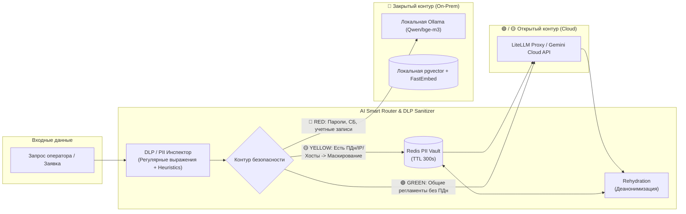
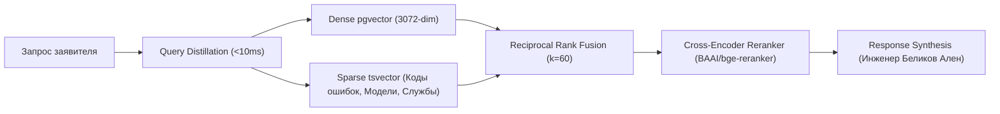

# Архитектура проекта IntraLink (intraservice-tg-bot)

Данный документ описывает целевую архитектуру системы, её ключевые компоненты, потоки данных и принципы взаимодействия между сервисами.

> **Главная цель проекта** — создание единой, надежной платформы автоматизации обработки и выполнения заявок в IntraService. Система сочетает детерминированный движок правил (Rule Engine), централизованный семантический RAG-поиск (FastEmbed/Gemini + pgvector) и модули прямого исполнения задач в инфраструктуре Windows (Active Directory, WinRM, SMB).

---

## 🏗️ 1. Общий обзор системы

Проект построен по **модульной сервисной архитектуре с единым источником правды (Single Source of Truth) в Core API**:

| Сервис / Модуль | Технологии | Роль |
|---|---|---|
| **Core API Gateway** | FastAPI, SQLAlchemy 2.0 (async), APScheduler, Redis, pgvector | Единый шлюз к IntraService API, хранилище состояния, движок правил (Rule Engine), централизованный RAG сервис, фоновый опрос очереди и хостинг веб-панели управления (`intra-web`) |
| **Telegram Bot** | aiogram 3.x, aiohttp | Мобильный интерфейс оператора и заявителей, доставка Push-уведомлений через Redis Streams |
| **Intra Web (Admin UI)** | React 19, Vite, Tailwind CSS v4 | Встроенная веб-панель мониторинга заявок, очередей и управления доступом (`/admin`) |
| **Helpdesk Agent (Execution Node)** | Python, aiohttp, PowerShell, WinRM | Интерактивный CLI-кокпит оператора в среде Antigravity (AGY). Делегирует логику данных в Core API, исполняя физические операции в Windows-домене (AD WLAN, создание УЗ, диагностика хостов) |

---

### 1.1. Схема взаимодействия компонентов

```mermaid
flowchart TB
    classDef userStyle fill:#2d3748,stroke:#4a5568,stroke-width:2px,color:#fff;
    classDef telegramStyle fill:#3182ce,stroke:#2b6cb0,stroke-width:2px,color:#fff;
    classDef handlerStyle fill:#dd6b20,stroke:#c05621,stroke-width:2px,color:#fff;
    classDef serviceStyle fill:#319795,stroke:#2c7a7b,stroke-width:2px,color:#fff;
    classDef dbStyle fill:#805ad5,stroke:#6b46c1,stroke-width:2px,color:#fff;
    classDef externalStyle fill:#e53e3e,stroke:#9b2c2c,stroke-width:2px,color:#fff;
    classDef redisStyle fill:#c53030,stroke:#9b2c2c,stroke-width:2px,color:#fff;

    subgraph Clients ["Пользовательские интерфейсы"]
        User(["👤 Пользователь в Telegram"]):::userStyle
        Admin_Web(["👨‍💻 Оператор в Web UI"]):::userStyle
        Admin_CLI(["⚡ Инженер в Antigravity CLI"]):::userStyle
    end

    subgraph Interface_Layer ["Слой интерфейсов"]
        TG_API["💬 Telegram Bot API"]:::telegramStyle
        Intra_Web["🖥️ Intra Web SPA (/admin)"]:::serviceStyle
        HD_CLI["🚀 helpdesk.py (CLI)"]:::serviceStyle
    end

    subgraph Bot_Service ["Telegram Bot Service"]
        B_Main["aiogram Bot"]:::serviceStyle
        B_Client["api_client.py"]:::serviceStyle
    end

    subgraph Helpdesk_Agent_Node ["Helpdesk Agent & Execution Node (Windows)"]
        HD_Client["core_api_client.py<br/>(HTTP REST)"]:::serviceStyle
        HD_Diag["diagnostics.py<br/>(Ping, DNS, SMB:445)"]:::serviceStyle
        
        subgraph Executors ["⚡ executors/ (Локальное исполнение)"]
            EX_AD["ad.py<br/>(WLAN-WORKNET / New User)"]:::serviceStyle
            EX_PRN["printers.py<br/>(WinRM / SMB Driver Store)"]:::serviceStyle
        end
    end

    subgraph Core_API_Service ["Core API Service (FastAPI / Single Source of Truth)"]
        direction TB
        API_Main["FastAPI Router Hub"]:::serviceStyle
        
        subgraph Routers ["API Роутеры (/api/v1/*)"]
            R_Triage["triage.py<br/>(Batch, Apply, Duplicates, RAG)"]:::handlerStyle
            R_Tasks["tasks.py & service_tasks.py"]:::handlerStyle
            R_Auth["auth.py & admin.py"]:::handlerStyle
        end

        subgraph Core_Engines ["Централизованные сервисы"]
            ENG_Rules["RuleEngine & Templates<br/>(Движок правил триажа)"]:::serviceStyle
            ENG_RAG["rag.py<br/>(pgvector семантический поиск)"]:::dbStyle
            IS_Client["intraservice.py<br/>(Circuit Breaker + Normalizer)"]:::serviceStyle
            Worker["worker.py<br/>(APScheduler + Redis Streams)"]:::serviceStyle
        end
    end

    subgraph Storage_Layer ["Слой данных и сообщений"]
        Postgres_DB[("PostgreSQL 16 (Data + pgvector RAG)")]:::dbStyle
        Redis_Broker[("Redis Streams & Cache")]:::redisStyle
    end

    subgraph External_Infrastructure ["Корпоративная инфраструктура"]
        IS_API["🌐 IntraService REST API"]:::externalStyle
        AD_Domain["🏢 Active Directory / WinRM (corporate.loc)"]:::externalStyle
    end

    %% Связи клиентов
    User <--> TG_API
    TG_API <--> B_Main
    B_Main --> B_Client
    B_Client <-->|HTTP REST (X-Bot-Api-Key)| API_Main

    Admin_Web <--> Intra_Web
    Intra_Web <-->|REST API / JWT| API_Main

    Admin_CLI <--> HD_CLI
    HD_CLI --> HD_Client & HD_Diag & Executors
    HD_Client <-->|HTTP REST (X-Bot-Api-Key)| API_Main
    Executors <-->|PowerShell / WinRM / AD| AD_Domain

    %% Связи внутри Core API
    API_Main --> Routers
    Routers --> ENG_Rules & ENG_RAG & IS_Client
    Worker --> IS_Client & Redis_Broker

    %% Связи с хранилищем и внешними системами
    ENG_RAG <--> Postgres_DB
    IS_Client <--> IS_API
    Redis_Broker -->|Events| B_Main
```

---

## 🔒 2. Ключевые архитектурные принципы

1. **Единый источник правды (No Standalone Fragmentation):**
   Все правила триажа, шаблоны ответов заявителям, семантический поиск в базе знаний RAG и нормализация кастомных полей сосредоточены в `core-api`. Агент Helpdesk и веб-интерфейс используют единый backend REST API.
2. **Защита от слепого закрытия (Verified Execution Only):**
   Статус `29 Выполнена` устанавливается **исключительно** после фактического успешного выполнения действия в инфраструктуре (добавление в группу AD `WLAN-WORKNET`, создание пользователя в AD, установка принтера по WinRM).
3. **Двухэтапный жизненный цикл финализации (`apply` / `wlan` / `create-user`):**
   Перевод в финальные статусы `29 Выполнена` или `30 Отменена` обязательно выполняется через статус `27 В работе` с фиксацией двух исполнителей (`Беликов Ален` - ID `8664` и `Беликов Ален_assitant` - ID `10502`) и списанием трудозатрат.
4. **Асинхронность и отказоустойчивость:**
   Все системные вызовы PowerShell в CLI обернуты в `asyncio.to_thread`. Вызовы к внешнему IntraService защищены Circuit Breaker с экспоненциальным backoff.
5. **Разделение детерминированного пайплайна и гибкого ИИ:**
   Вся механическая логика (DLP маскирование, Ping/WMI зонды хостов, редиректы каталога, исполнение в Active Directory, Redis-локи и списание трудозатрат) выполняется строго нативным детерминированным Python-кодом. Нейросеть (LLM/Vision) подключается исключительно в точках гибкости: интерпретация неструктурированного текста, семантический RAG-поиск, анализ скриншотов ошибок и синтез ответов заявителю.

---

## 🛡️ 3. Многоконтурная безопасность данных и гибридный AI-роутинг

Система реализует многоконтурную модель маршрутизации AI-инференса и RAG на принципах **Privacy-First & Zero Trust**:



### Контуры безопасности данных:
1. 🔴 **Красный контур (RED / On-Premise)**:
   - Применяется при наличии паролей, токенов, конфиденциальных заявок СБ или кадровой службы.
   - Обработка и векторизация выполняются **строго локально** (Ollama `qwen`/`bge-m3` и `FastEmbed`). Данные не покидают периметр.
2. 🟡 **Трансформируемый контур (YELLOW / Sanitized Cloud)**:
   - Применяется при наличии персональных данных (ФИО, телефоны, email), внутренних IP-адресов (`10.x.x.x`, `192.168.x.x`) и имен ПК (`NTEMW...`).
   - Перед отправкой в Cloud Gemini сущности заменяются на обратимые маркеры (`{{USER_1}}`, `{{INTERNAL_IP_1}}`), а маппинг сохраняется в **Redis PII Vault**. В ответе модели маркеры автоматически восстанавливаются (**Rehydration**).
3. 🟢 **Открытый контур (GREEN / Cloud Direct)**:
   - Применяется для публичных вопросов, синтаксиса скриптов и общих регламентов. Запрос направляется в Gemini Cloud напрямую.

---

## 🛡️ 4. Защитные механизмы (Safety & Resiliency)

- **Distributed Host Concurrency Locks (`safety.py`):**
  - Распределенная блокировка в Redis (`lock:host:<pc_name>`, TTL 30s) с уникальным токеном владельца и Lua-скриптом безопасного снятия.
  - Предотвращает гонки параллельных WinRM/WMI сессий к одному хосту и исключает системные сбои `0x80338029`.
- **Аварийный тормоз (Dead Man's Switch):**
  - Скользящее окно Redis ZSET (`ratelimit:triage:apply`) блокирует массовые применения > 10 заявок/мин без явного подтверждения инженером (`confirmed_by_human=True`).

---

## 📡 5. Фоновая экспресс-телеметрия хостов (Fail-Fast Pre-fetch)

- **Сетевой каскад (`host_telemetry.py`):**
  - Fast ICMP Ping (таймаут 400 мс) $\rightarrow$ при оффлайне моментальный возврат `OFFLINE` без блокировки WMI.
  - TCP-пробы портов `5985` (WinRM) и `445` (SMB) с таймаутом 300 мс.
  - Ограничение сетевой нагрузки: `subnet_rate_limit` (не более 3 одновременных зондов на подсеть `/24`).
- **Сбор системных метрик:**
  - При открытом WinRM под защитой `host_concurrency_lock` собираются: остаток диска `C:`, службы `Spooler` и `1C:Enterprise`, активный пользователь.
  - Кэширование в Redis (`diag:<task_id>`, TTL 10 мин) обеспечивает мгновенный вывод телеметрии (0ms latency).

---

## 🧠 6. Двухэтапный Advanced Hybrid RAG и Канонизация базы знаний



1. **Query Distillation:** отсечение эмоционального шума и выделение кодов ошибок (`0x80070005`, `0x0000011b`), моделей оборудования и служб.
2. **Hybrid Retrieval (Dense + Sparse RRF):** параллельный векторный поиск в `pgvector` и полнотекстовый поиск по техническим термам с объединением по формуле $RRF\_Score = \sum \frac{1}{60 + rank_i}$.
3. **Cross-Encoder Reranking:** локальная переоценка пар `(query, document)` через `BAAI/bge-reranker-base` в неблокирующем потоке (`asyncio.to_thread`) с порогом $\ge 0.85$.
4. **Auto-KB Canonization & Synthesis:** автоматическое извлечение триады `[Проблема] ➔ [Первопричина] ➔ [Решение]` из переписки закрытых заявок и генерация ответов в каноническом стиле инженера Беликова Алена.
