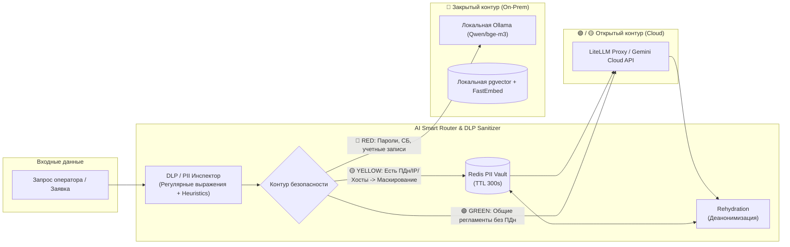

# Архитектура проекта IntraLink (intraservice-tg-bot)

Данный документ описывает целевую архитектуру системы, её ключевые компоненты, потоки данных и принципы взаимодействия между сервисами.

> **Главная цель проекта** — создание единой, надежной платформы автоматизации обработки и выполнения заявок в IntraService. Система сочетает детерминированный движок правил (Rule Engine), централизованный семантический RAG-поиск (BGE-M3/FastEmbed + pgvector) и модули прямого исполнения задач в инфраструктуре Windows (Active Directory, WinRM, SMB).

---

## 🏗️ 1. Общий обзор системы

Проект построен по **модульной сервисной архитектуре с единым источником правды (Single Source of Truth) в Core API**:

| Сервис / Модуль | Стек технологий | Роль в системе |
|---|---|---|
| **Core API Gateway** | FastAPI, SQLAlchemy 2.0 (async), pgvector, Redis, ldap3 | Единый шлюз состояния, Command Bus, ActionRegistry & PolicyEngine (Killswitch), AI Hub (DLP/PII Vault), семантический RAG, прямое управление AD по LDAPS (636), хостинг SPA (`/operator-panel` и `/admin`) |
| **Poller Service** | Python, aiohttp, Redis Leader Lock | Автономный фоновый демон опроса IntraService с распределенным замком лидера (`lock:poller_leader`) против Split-Brain |
| **Execution Worker** | Python, Redis Streams, PowerShell, WinRM | Windows Headless Daemon оркестрации принтеров (WinRM/CIM, WMI Bootstrap) и фоновых задач на базе `BaseActionExecutor` |
| **IntraLink MCP Hub** | Python, FastMCP (JSON-RPC 2.0 stdio) | Автономный шлюз инструментов Model Context Protocol для AI-агента Antigravity (AGY) |
| **Helpdesk CLI** | Python, aiohttp, Typer | Машинный инструментарий (Tooling SDK) исключительно для AI-агента Antigravity (AGY) при обработке слэш-команд |
| **Shared (SSOT)** | Python, orjson, Pydantic | Единый пакет общих алгоритмов нормализации оборудования (`normalizer.py`), экспресс-диагностики (`diagnostics.py`), базы знаний принтеров (`printers.py`) и сериализации |
| **Telegram Bot** | aiogram 3.x, aiohttp | Мобильный пейджер и HITL-согласования через Command Bus и персистентную доставку Redis Streams (`stream:intraservice_events`) |
| **Intra Web UI** | React 19, Vite, Tailwind CSS v4 | Двухконтурный интерфейс: операторский центр очереди 1-й линии (`/operator-panel`), Skills Hub с Live SSE Terminal и защищенная консоль администратора (`/admin`) |

---

### 1.1. Схема взаимодействия компонентов

```mermaid
flowchart TB
    classDef userStyle fill:#2d3748,stroke:#4a5568,stroke-width:2px,color:#fff;
    classDef clientStyle fill:#3182ce,stroke:#2b6cb0,stroke-width:2px,color:#fff;
    classDef coreStyle fill:#1a365d,stroke:#2b6cb0,stroke-width:2px,color:#fff;
    classDef workerStyle fill:#22543d,stroke:#2f855a,stroke-width:2px,color:#fff;
    classDef dbStyle fill:#805ad5,stroke:#6b46c1,stroke-width:2px,color:#fff;
    classDef extStyle fill:#742a2a,stroke:#9b2c2c,stroke-width:2px,color:#fff;
    classDef redisStyle fill:#c53030,stroke:#9b2c2c,stroke-width:2px,color:#fff;

    subgraph Clients ["Интерфейсные слои"]
        User(["👤 Пользователь в Telegram"]):::userStyle
        Admin_Web(["👨‍💻 Оператор в Web UI"]):::userStyle
        AGY_Agent(["🤖 AI-агент Antigravity (AGY)"]):::userStyle
    end

    subgraph Interface_Layer ["Слой интерфейсов и SDK"]
        TG_Bot["💬 Telegram Bot (aiogram 3.x)"]:::clientStyle
        Intra_Web["🖥️ Intra Web SPA (/admin)"]:::clientStyle
        HD_CLI["🛠️ helpdesk-cli (AGY Tooling SDK)"]:::clientStyle
    end

    subgraph Core_Layer ["Core API Gateway & Poller (SSOT)"]
        API_Main["⚡ FastAPI Gateway Hub"]:::coreStyle
        Command_Worker["📨 Command Outbox Worker"]:::coreStyle
        Poller_Daemon["👑 Poller Daemon (Leader Lock)"]:::coreStyle
        Rule_Engine["⚙️ Rule Engine & SSOT Templates"]:::coreStyle
        AI_Hub["🛡️ AI Hub & DLP Sanitizer"]:::coreStyle
        RAG_Engine["🧠 Hybrid RAG (pgvector + FastEmbed)"]:::coreStyle
    end

    subgraph Execution_Layer ["Слой исполнения (Windows Node)"]
        Win_Worker["⚙️ Execution Worker (Consumer Group)"]:::workerStyle
        AD_Exec["🏢 AD Executor (WLAN, User)"]:::workerStyle
        Prn_Exec["🖨️ Printer Executor (WinRM, SMB)"]:::workerStyle
    end

    subgraph Storage_Layer ["Слой данных и очередей"]
        Postgres_DB[("PostgreSQL 16 (pgvector HNSW)")]:::dbStyle
        Redis_Broker[("Redis 7 (Streams, Locks, PII Vault)")]:::redisStyle
        Ollama_Local[("Ollama (Qwen2.5:1.5B / bge-m3)")]:::dbStyle
    end

    subgraph External_Infrastructure ["Корпоративная инфраструктура"]
        IS_API["🌐 IntraService REST API"]:::extStyle
        AD_Domain["🏢 Active Directory / WinRM (corporate.loc)"]:::extStyle
    end

    %% Клиенты к интерфейсам
    User <--> TG_Bot
    Admin_Web <--> Intra_Web
    AGY_Agent <--> HD_CLI

    %% Интерфейсы к Core API
    TG_Bot <-->|HTTP REST (X-Bot-Api-Key)| API_Main
    Intra_Web <-->|REST API / JWT Session| API_Main
    HD_CLI <-->|HTTP REST (X-Bot-Api-Key)| API_Main

    %% Внутри Core
    API_Main --> Rule_Engine & AI_Hub & RAG_Engine
    Poller_Daemon -->|Leader Lock / SET NX EX| Redis_Broker
    Poller_Daemon -->|Polling / Service Account| IS_API
    Poller_Daemon -->|stream:intraservice_events| Redis_Broker

    %% Core к хранилищу
    RAG_Engine <--> Postgres_DB
    API_Main <--> Postgres_DB
    AI_Hub -->|RED Zone| Ollama_Local
    API_Main -->|Host Locks / Dead Man's Switch| Redis_Broker
    API_Main -->|Transactional Outbox| Postgres_DB
    Command_Worker <--> Postgres_DB
    Command_Worker -->|stream:execution_commands:v2| Redis_Broker

    %% Очереди исполнения и доставки
    Redis_Broker -->|stream:intraservice_events (XAUTOCLAIM)| TG_Bot
    Redis_Broker -->|stream:execution_commands:v2| Win_Worker
    Win_Worker --> AD_Exec & Prn_Exec
    AD_Exec & Prn_Exec --> AD_Domain
    Win_Worker -->|HTTP REST / Complete| API_Main
```

---

## 🔒 2. Ключевые архитектурные принципы

1. **Единый источник правды (No Standalone Fragmentation):**
   Все правила триажа, шаблоны ответов заявителям, семантический поиск в базе знаний RAG и нормализация кастомных полей сосредоточены в `core-api`. Агент Helpdesk и веб-интерфейс используют единый backend REST API.
2. **Защита от слепого закрытия (Verified Execution Only):**
   Статус `29 Выполнена` устанавливается **исключительно** после фактического успешного выполнения действия в инфраструктуре (добавление в группу AD `WLAN-WORKNET`, создание пользователя в AD, установка принтера по WinRM).
3. **Двухэтапный жизненный цикл финализации (`apply` / `wlan` / `create-user`):**
   Перевод в финальные статусы `29 Выполнена` или `30 Отменена` обязательно выполняется через статус `27 В работе` с фиксацией двух исполнителей (`Беликов Ален` - ID `8664` и `Беликов Ален_assitant` - ID `10502`) и списанием трудозатрат.
4. **Асинхронность и отказоустойчивость:**
   Все системные вызовы PowerShell в CLI обернуты в `asyncio.to_thread`. Вызовы к внешнему IntraService защищены Circuit Breaker с экспоненциальным backoff.
5. **Strict Grounding и Intent Gates (детерминированные шлюзы):**
   - Вся механическая логика (DLP маскирование, Ping/WMI зонды хостов, редиректы каталога, исполнение в Active Directory, Redis-локи и списание трудозатрат) выполняется строго нативным детерминированным Python-кодом.
   - Перед передачей запроса в LLM применяются **детерминированные Intent Gates** (`ai_synthesis.py`): не-IT заявки (АХО, канцелярия — `_NON_IT_KEYWORDS`) и RED-контур (пароли/AD) немедленно возвращают готовый ответ без обращения к нейросети.
   - LLM получает только задокументированные **факты**: подтверждённое решение из RAG и телеметрию хоста. Если фактов нет — модель обязана сообщить о принятии заявки в работу, а не сочинять выполненные действия (**Strict Grounding**).
   - Нейросеть (LLM/Vision) подключается исключительно в точках гибкости: синтез персонализированных ответов заявителю, интерпретация неструктурированного текста, семантический RAG-поиск, анализ скриншотов ошибок.

---

## 🛡️ 3. Многоконтурная безопасность данных и гибридный AI-роутинг

Система реализует многоконтурную модель маршрутизации AI-инференса и RAG на принципах **Privacy-First & Zero Trust**:



### Контуры безопасности данных:
1. 🔴 **Красный контур (RED / On-Premise)**:
   - Применяется при наличии паролей, токенов, конфиденциальных заявок СБ или кадровой службы.
   - Обработка и векторизация выполняются **строго локально** (Ollama `qwen`/`bge-m3` и `FastEmbed`). Данные не покидают периметр.
2. 🟡 **Трансформируемый контур (YELLOW / Sanitized Cloud)**:
   - Применяется при наличии персональных данных (ФИО, телефоны, email), внутренних IP-адресов (`10.x.x.x`, `192.168.x.x`) и имен ПК (`NTEMW...`).
   - Перед отправкой в Cloud Gemini сущности заменяются на обратимые маркеры (`{{USER_1}}`, `{{INTERNAL_IP_1}}`), а маппинг сохраняется в **Redis PII Vault**. В ответе модели маркеры автоматически восстанавливаются (**Rehydration**).
3. 🟢 **Открытый контур (GREEN / Cloud Direct)**:
   - Применяется для публичных вопросов, синтаксиса скриптов и общих регламентов. Запрос направляется в Gemini Cloud напрямую.

---

## 🛡️ 4. Защитные механизмы (Safety & Resiliency)

- **Distributed Host Concurrency Locks (`safety.py`):**
  - Распределенная блокировка в Redis (`lock:host:<pc_name>`, TTL 30s) с уникальным токеном владельца и Lua-скриптом безопасного снятия.
  - Предотвращает гонки параллельных WinRM/WMI сессий к одному хосту и исключает системные сбои `0x80338029`.
- **Аварийный тормоз (Dead Man's Switch):**
  - Скользящее окно Redis ZSET (`ratelimit:triage:apply`) блокирует массовые применения > 10 заявок/мин без явного подтверждения инженером (`confirmed_by_human=True`).

---

## 📡 5. Фоновая экспресс-телеметрия хостов (Fail-Fast Pre-fetch)

- **Сетевой каскад (`host_telemetry.py`):**
  - Fast ICMP Ping (таймаут 400 мс) $\rightarrow$ при оффлайне моментальный возврат `OFFLINE` без блокировки WMI.
  - TCP-пробы портов `5985` (WinRM) и `445` (SMB) с таймаутом 300 мс.
  - Ограничение сетевой нагрузки: `subnet_rate_limit` (не более 3 одновременных зондов на подсеть `/24`).
- **Сбор системных метрик:**
  - При открытом WinRM под защитой `host_concurrency_lock` собираются: остаток диска `C:`, службы `Spooler` и `1C:Enterprise`, активный пользователь.
  - Кэширование в Redis (`diag:<task_id>`, TTL 10 мин) обеспечивает мгновенный вывод телеметрии (0ms latency).

---

## 🧠 6. Двухэтапный Advanced Hybrid RAG, Скоринг ценности и Ночной аудит

```mermaid
flowchart TD
    subgraph Daytime ["Дневной экспресс-пайплайн (Быстрая индексация)"]
        Raw["Заявки IntraService (28, 29, 43, 30)"] --> L1["Level 1: Heuristics & Stop-Regex"]
        L1 --> L2{"Длина 20-150 симв?"}
        L2 -- "Да (пограничное)" --> QwenFast["Qwen 2.5 (RED GPU, экспресс)"]
        L2 -- "Нет (>150 симв)" --> AutoPass["Прямой пропуск (подробно)"]
        QwenFast --> DBInsert["Сохранение в pgvector (default quality=1.0)"]
        AutoPass --> DBInsert
    end

    subgraph Nightly ["Ночной глубокий аудит (Ежедневно в 19:00 MSK)"]
        Schedule["Cron 19:00 MSK / Ручной запуск"] --> Lock["Redis Lock: lock:nightly_rag_audit"]
        Lock --> ScanAll["100% активных записей базы знаний"]
        ScanAll --> QwenDeep["Qwen 2.5 (Обогащенный контекст, RED GPU)"]
        QwenDeep --> ScoreCalc["Расчет quality_score (0.0 - 1.0) + key_steps"]
        ScoreCalc --> QualitySplit{"quality_score < 0.4?"}
        QualitySplit -- "Да (< 0.4)" --> Blacklist["is_blacklisted = true"]
        QualitySplit -- "Нет (>= 0.4)" --> UpdScore["Обновление quality_score в БД"]
    end

    subgraph Search ["Гибридное ранжирование (Retrieval)"]
        Q["Запрос заявителя"] --> QD["Query Distillation (<10ms)"]
        QD --> Dense["Dense pgvector (1024-dim, BGE-M3)"]
        QD --> Sparse["Sparse tsvector (Коды ошибок, Службы)"]
        Dense --> RRF["RRF + Quality-Score Weighting"]
        Sparse --> RRF
        RRF --> Filter["Фильтр: quality_score >= 0.4"]
        Filter --> CE["Cross-Encoder Reranker (bge-reranker-base)"]
        CE --> Synth["Response Synthesis"]
    end
```



### 6.1. Двухконтурный жизненный цикл базы знаний
1. **Дневной экспресс-пайплайн (`sync_stratified_kb`):**
   * Предназначен для быстрой индексации без блокировки ресурсов.
   * **Уровень 1 (Quality Gate):** Мгновенная проверка по стоп-паттернам неинформативных отписок («не дозвонился», «дубликат», «ошиблись номером») и минимальной длине.
   * **Уровень 2 (AI Gate):** Локальная модель Qwen 2.5 (контур RED) привлекается только для пограничных решений (от 20 до 150 символов). Длинные развернутые инструкции пропускаются без задержек инференса.
   * **Мультистатусный охват:** Индексация заявок со статусами `28` («Закрыта»), `29` («Выполнена»), `43` («Обработано 1-й линией») и `30` («Отменена: решено обходным путем»).
2. **Тяжелый ночной аудит (`run_nightly_deep_audit_kb`):**
   * Запуск **ежедневно в 19:00 МСК** (окончание рабочего дня ИТ-подразделения) через автономный фоновый процесс `poller` и планировщик `worker` под защитой распределенного Redis-замка `lock:nightly_rag_audit` (TTL 7200с).
   * **Бескомпромиссная оценка:** 100% записей базы знаний оцениваются локальной моделью **Qwen 2.5 на GPU** без каких-либо эвристических ограничений длины.
   * **Обогащенный контекст оценки:**
     * Категория услуги (`service_name`) — для проверки предметной релевантности решения.
     * Тема заявки (`task_name`) vs Симптомы проблемы (`problem`).
     * Статус закрытия и тип резолюции (`status_name` + `resolution_label`).
     * Извлеченные из `lifetime` предшествующие технические комментарии (`diagnostic_steps`).
   * **Действия:** Вычисление `quality_score` (0.0–1.0), извлечение структурированных `key_steps`, автоматический блэклист неинформативных записей (`quality_score < 0.4`), онлайн-трансляция логов и прогресса в Redis (`kb:nightly_audit_progress`).

### 6.2. Скоринг ценности и гибридное ранжирование
* **PostgreSQL Schema:** Таблица `task_knowledge_base` оснащена выделенной колонкой `quality_score FLOAT NOT NULL DEFAULT 1.0` с B-tree индексом `ix_task_kb_quality_score`.
* **Взвешенная формула выдачи:**
  1. Жесткое отсечение неинформативных записей: `WHERE is_blacklisted = false AND quality_score >= 0.4`.
  2. Модуляция сходства весом полезности решения:
     $$\text{FinalScore} = \text{CosineSimilarity} \times (0.7 + 0.3 \times \text{QualityScore})$$
     Эталонные пошаговые инструкции (score 0.85–1.0) получают преимущество в выдаче перед краткими типовыми записями (score 0.4–0.5).

### 6.3. Конвейер извлечения и синтеза ответа
1. **Query Distillation:** отсечение эмоционального шума и выделение кодов ошибок (`0x80070005`, `0x0000011b`), моделей оборудования и служб.
2. **Hybrid Retrieval (Dense + Sparse RRF):** параллельный векторный поиск в `pgvector` (BGE-M3 1024-dim) и полнотекстовый поиск по техническим термам.
3. **Cross-Encoder Reranking:** локальная переоценка пар `(query, document)` через `BAAI/bge-reranker-base` в неблокирующем потоке (`asyncio.to_thread`) с порогом $\ge 0.85$.
4. **Auto-KB Canonization (`canonize_task_solution`):** автоматическое извлечение триады `[Проблема] ➔ [Первопричина] ➔ [Решение]`, очистка подписей по `_SIGNATURE_CLEANUP_RE` и сбор диагностических шагов из `lifetime`.
5. **Strict Grounding Synthesis (`synthesize_triage_resolution`):** синтез ответа строго на основе фактов RAG и телеметрии хоста в закрытом контуре.

---

## ⚙️ 7. Платформа автоматизации (Action Platform) и протокол MCP

### 7.1. Симметричная модель исполнения (Human & AI Co-Pilot)
Любое действие автоматизации (`install_printer`, `grant_wlan`, `create_ad_user`, `install_software`, `clear_1c_cache`) является первоклассным объектом (**First-Class Entity**) в системе:
- **Для AI-агента AGY:** типизированный инструмент `@mcp.tool` через FastMCP-шлюз `intralink-mcp`.
- **Для оператора Web UI:** 1-Click виджет в карточке тикета и Live SSE Terminal в `/admin`.
- **Для мобильного инженера в Telegram:** интерактивная HitL-кнопка в Pager-сообщении.
- **Для Windows Runner:** стандартизированный исполнитель с тремя фазами `Preflight ➔ Execute ➔ Verify`.

### 7.2. Безопасность и жизненный цикл WinRM (WMI Bootstrap)
- По умолчанию служба WinRM (порт 5985) на рабочих станциях домена отключена для минимизации поверхности атак.
- **WMI Bootstrap:** перед выполнением операции воркер удаленно запускает службу `WinRM` через WMI (RPC:135), выполняет установку или скрипт, а в блоке `finally` **гарантированно глушит WinRM обратно**.
- **Контекст подключения принтеров:** подключение выполняется от имени доменного сервисного аккаунта (UPN `svc_intralink@corporate.loc`), но принтер регистрируется на системном уровне (**Machine-Wide / All Users**). Пользователям не требуются локальные права администратора.

### 7.3. Омниканальный контур подтверждений (Unified HitL Inbox)
- Действия в режиме `Requires HitL` сохраняются в PostgreSQL со статусом `awaiting_approval`; до решения Outbox-сообщение не создаётся.
- Web UI отправляет решение с admin JWT. Telegram использует сервисный ключ бота и ID зарегистрированного оператора.
- Первое решение атомарно фиксируется в `command_approvals` и переводит команду в `queued` либо `rejected`; последующие ответы получают конфликт состояния.

---

## 🔐 8. Единый Vault учетных записей (SSOT Credentials Vault)

### 8.1. Консолидация секретов в PostgreSQL
Все доступы централизованы в таблице `system_settings` базы данных PostgreSQL с симметричным шифрованием Fernet (`ENCRYPTION_KEY`):
- `service_account_credentials` — авторизация сервисного аккаунта IntraService.
- `domain_credentials` — единая учетная запись домена (UPN) для **LDAPS:636** и **WinRM/SMB:5985/445**.
- `local_admin_credentials` — резервная локальная учетная запись (`.\Администратор`) для аварийного каскада.

### 8.2. Автоматический прогрев и синхронизация в Redis
- При сохранении настроек в Web UI (`/admin`) или при старте `core-api` (Lifespan) сервис `app/services/vault.py` вычитывает конфигурации из PostgreSQL, расшифровывает пароли и автоматически прогревает изолированные шифрованные ключи в Redis:
  - `worker:domain_auth` (для воркера WinRM/SMB).
  - `worker:service_auth_b64` (для фонового опроса IntraService).
- Это гарантирует отказоустойчивость: при перезапуске или аварийной очистке Redis опрос очередей и работа воркеров не прерываются.

