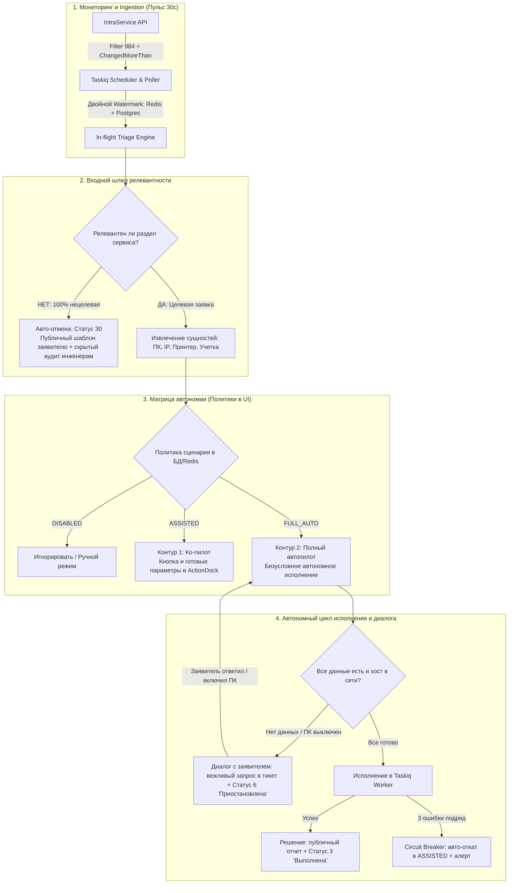

# 🤖 Архитектурная спецификация IntraLink v2: Автономный конвейер и система управления автопилотом

> **Статус:** Принято как фундаментальный архитектурный стандарт v2  
> **Связанные документы:** [v2-architecture-blueprint.md](file:///docs/architecture/v2-architecture-blueprint.md), [domain-model-and-contracts.md](file:///docs/architecture/domain-model-and-contracts.md), [GEMINI.md](file:///GEMINI.md)

---

## 🎯 1. Фундаментальная цель системы: Автономный Helpdesk

Главная цель IntraLink v2 — **максимально возможная автоматизация решения обращений Helpdesk**.  
Система спроектирована не как пассивный дашборд для инженеров, а как **автономный виртуальный инженер 1-й линии**, способный самостоятельно классифицировать, вести диалог с заявителями, устранять инфраструктурные препятствия и закрывать инциденты под надзором человека.

---

## 🏗️ 2. Архитектура фонового воркера и очередей (Taskiq Runtime)

* **Фреймворк фоновых задач:** **Taskiq** (`taskiq-redis` + `taskiq-fastapi` + `taskiq-scheduler`).
* **Разделение очередей по возможностям (Capabilities):**
  * `default` / `rag_compute` — Linux Docker-контейнер `worker` (опрос API, инкрементальный синк pgvector, операции с Active Directory напрямую через LDAP/LDAPS, сокетная диагностика Ping/TCP).
  * `windows_exec` — очередь задач для рабочих станций (установка принтеров, WMI bootstrap), которую слушает легковесный Windows-агент.
* **Планировщик (Scheduler):** `taskiq-scheduler` запускается изолированно, исключая дублирование периодических задач при масштабировании пула воркеров.
* **Обратная связь с интерфейсом:** **Short-Polling через TanStack Query v5** (`GET /api/v2/tasks/{task_id}` с интервалом 1.5 сек). Обеспечивает 100% надежность, устойчивость к перезагрузкам страницы (F5) и отсутствие проблем с сетевыми прокси.

---

## 📡 3. Мониторинг очереди и событийная модель (Ingestion)

1. **Стратегия двойного среза (Dual-Slice Polling):**
   * Интервал пульса: **каждые 30 секунд**.
   * Срез 1: Новые заявки из фильтра 1-й линии (`filterid=984`).
   * Срез 2: Измененные заявки (`ChangedMoreThan=<timestamp>`) для мгновенного отлова назначения сервисной учетной записи в `ExecutorIds` и ответов заявителей.
2. **Надежная фиксация точки отсчета (Watermark):**
   * Метка времени и максимальный `task_id` кэшируются в Redis для скорости и дублируются в таблицу PostgreSQL `system_state` при каждом цикле.
   * Строгая проверка идемпотентности: повторный запуск сценария над одним и тем же состоянием тикета невозможен.

---

## 🔍 4. Фоновый триаж, нормализация и извлечение сущностей

* **In-flight анализ всей очереди:** Анализ запускается поллером автоматически при обнаружении тикета. В веб-интерфейсе карточки тикетов открываются с нулевой задержкой (0 мс) с уже готовыми диагнозами. Если тикет находится в процессе анализа, отображается статус *«Анализируется ИИ...»*.
* **Контракт извлеченных сущностей (`ExtractedEntitiesDTO`):**
  * `pc_name`: нормализованное имя хоста (очищенное от спецсимволов и доменов).
  * `printer_address`: IPv4 адрес или сетевое имя принтера.
  * `printer_model`: вендор и модель оргтехники (для поиска в базе драйверов).
  * `target_user`: sAMAccountName или ФИО для операций в AD.
* **Шлюз релевантности (Фильтр №1):**
  * 100% нецелевые заявки (личные ЭЦП, вопросы по 1С) немедленно отменяются автопилотом со статусом **`30` («Отменена»)**.

---

## 🎛️ 5. Управляемая матрица автономии и защита (Governance & Circuit Breaker)

Уровень автономии не зашит в код, а управляется динамически:

### 5.1. Хранение и приоритет настроек
1. **Кодовый baseline (`config/autopilot_defaults.yaml`):** безопасные значения по умолчанию для всех сценариев.
2. **Живой оверрайд в Web UI:** таблица `autopilot_policies` в PostgreSQL с кэшированием в Redis. Изменение тумблера в веб-интерфейсе вступает в силу за 0 миллисекунд.

### 5.2. Уровни автономии для каждого сценария:
* **`FULL_AUTO` (Полный автопилот):** самостоятельное исполнение, общение с заявителем, закрытие заявки.
* **`ASSISTED` (Ко-пилот):** подготовка параметров и кнопок в ActionDock UI, ожидание подтверждения инженером.
* **`DISABLED`:** отключение сценария.

### 5.3. Предохранитель (Self-Healing Circuit Breaker):
Если по сценарию фиксируется **3 технические ошибки подряд за 10 минут** (например, недоступен сервер печати), система автоматически переводит сценарий из `FULL_AUTO` в `ASSISTED` и выводит предупреждение в панели оператора.

---

## 🤖 6. Искусственный интеллект: Двухуровневый LiteLLM Gateway

Вся работа с LLM маршрутизируется через локальный прокси `litellm`:

1. **Уровень 1: Локальная Ollama (`helpdesk-fast`, Qwen2.5:7b):**
   * Локально, бесплатно, минимальная задержка.
   * Первичный триаж, классификация, извлечение сущностей из комментариев заявителя, генерация уточняющих вопросов.
2. **Уровень 2: Рассуждающая модель (`helpdesk-reasoning`, DeepSeek-R1 / Fallback):**
   * Включается только при необходимости: сложные путанные описания, глубокий RAG-синтез по нескольким инструкциям.

---

## 🔄 7. Автономный диалоговый цикл (Autonomous Dialogue Loop)

Автопилот не передает заявку человеку при первой же нехватке данных, а ведет диалог:

1. **Не хватает данных (IP, ПК, логин):**
   * Автопилот сам задает вежливый точечный вопрос в тикет.
   * Статус переводится в **`6` («Приостановлена» / Ожидание ответа)**.
2. **Препятствие среды (ПК выключен):**
   * Автопилот пишет заявителю инструкцию: *«Пожалуйста, включите рабочий компьютер WKS-01 и оставьте ответный комментарий — настройка продолжится автоматически»*.
   * Статус переводится в **`6` («Приостановлена»)**.
3. **Возобновление цикла (Resume Loop):**
   * При появлении ответа заявителя поллер пробуждает автопилот. Локальная LLM парсит ответ, дообогащает сущности и возобновляет установку.
4. **Лимит уточнений (Anti-Loop):**
   * Не более 2 раундов уточняющих вопросов. Если данные не получены, заявка передается человеку.
5. **Эскалация на инженера:**
   * Происходит только при неустранимом сбое ОС/оборудования или превышении лимита попыток. Сопровождается подробным скрытым отчетом.

---

## 📚 8. Жизненный цикл Базы знаний (RAG & KB Sync)

* **Источники обучения:** Все терминальные статусы — `3` («Выполнена»), `4` («Закрыта»), `30` («Отменена»).
* **Фильтры качества:** Отсечение односложных отписок («ок», «сделано»), семантическая дедупликация (Cosine Gate > 0.90), квота 30–50 решений на листовой сервис.
* **Расписание:** Регулярный ночной батч раз в сутки (в 02:00 через Taskiq cron) за последние 24–48 часов.
* **Безопасность:** Маскирование персональных данных (телефоны, email), удаление паролей, обрезка дампов логов ошибок до 1500–2000 символов.
* **RAG-Автопилот (Консультации):** Типовые вопросы пользователей («как настроить почту», «где взять форму») решаются и закрываются автопилотом автономно на основе базы знаний без отвлечения инженеров.

---

## 🛡️ 9. Прозрачность и аудит (Zero Black-Box)

1. **Служебные скрытые заметки (`IsPrivateComment: true`):**
   * Каждое действие автопилота сопровождается техническим отчетом в истории тикета IntraService, видимым **только сотрудникам Helpdesk** (сработавшее правило, уверенность ИИ, извлеченные факты, результаты сетевых проб).
2. **Вкладка «Автопилот» в веб-панели:**
   * Специализированный раздел в интерфейсе оператора, отображающий живой журнал всех автономных действий, метрики экономии времени инженеров и активные предупреждения Circuit Breaker.
