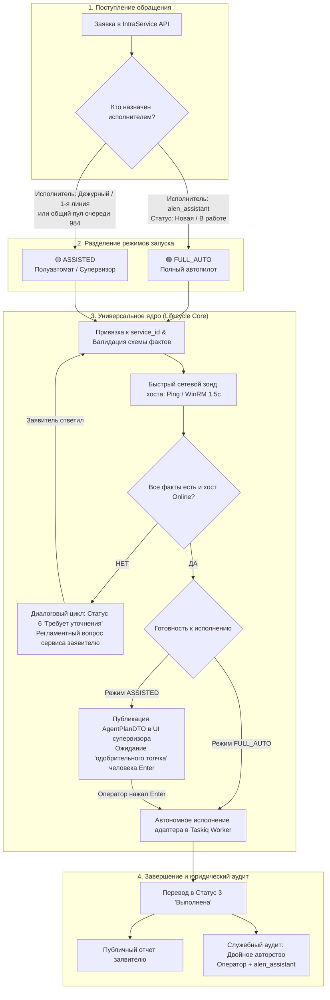

# 🧠 Архитектурная спецификация IntraLink v2: Универсальное ядро жизненного цикла сценариев (Universal Scenario Lifecycle Core)

> **Статус:** Принято как фундаментальный архитектурный стандарт v2  
> **Связанные документы:** [v2-architecture-blueprint.md](file:///docs/architecture/v2-architecture-blueprint.md), [domain-model-and-contracts.md](file:///docs/architecture/domain-model-and-contracts.md), [v2-automation-pipeline.md](file:///docs/architecture/v2-automation-pipeline.md), [GEMINI.md](file:///GEMINI.md)

---

## 🎯 1. Фундаментальная парадигма: Два режима одного ядра

IntraLink v2 спроектирован вокруг принципа: **«Единое универсальное ядро исполнения — два источника запуска»**. 

В системе нет двух разных кодовых баз для автоматического и ручного решения. Вся цепочка валидации, извлечения фактов, диагностики хоста и выполнения команд строго едина (**Zero Duplicate Logic**). Разница заключается исключительно в триггере запуска шага исполнения:



### 1.1. Режим FULL_AUTO (Полный автопилот)
> Механизм сохранён архитектурно и доступен в политике/UI, однако в текущей эксплуатационной конфигурации активных рабочих сценариев `FULL_AUTO` нет. Все рабочие сценарии используют `ASSISTED`; `ad_password_reset` отключён.

* **Условие запуска:** Заявка находится в статусе «Открыта» (1 «Новая» или 2 «В работе»), и исполнителем назначена сервисная учетная запись (например, `alen_assistant`).
* **Поведение:** Воркер подхватывает тикет в фоне, сам проверяет факты, сам исполняет сценарий, сам пишет публичный отчет заявителю и переводит заявку в статус 3 («Выполнена»).
* **Сценарий оператора («Назначил пачку и ушел»):** Оператор в начале смены или перед отходом от рабочего места выделяет в очереди пачку типовых заявок (чекбоксами) и нажимает **«Передать автопилоту (`alen_assistant`)»**. Заявки выполняются в фоне полностью автоматически, не отвлекая человека.

### 1.2. Режим ASSISTED (Полуавтоматический режим / Контур супервизора)
* **Условие запуска:** Оператор проверил план и параметры, назначил сервисную учётную запись техническим исполнителем заявки и подтвердил команду.
* **Поведение:** Автопилот выполняет **всю черновую работу до прихода человека**: определяет сервисный сценарий, проверяет доступность рабочего места по сети, извлекает логины и реквизиты, готовит команду и формулирует проект ответа.
* **Сценарий оператора («Одобрительный толчок»):** Оператор открывает заявку в UI супервизора, проверяет сценарий и параметры, назначает сервисную учётную запись и нажимает <kbd>Enter</kbd> («Одобрить»). Задача уходит в Taskiq и исполняет именно сохранённый план. После подтверждения не повторяются смысловая классификация, выбор сценария, confidence gate и проверка сервиса; остаются только технические guards состояния заявки, назначения, блокировки, обязательных параметров и идемпотентности.
* **Корректировка на лету (Ground Truth Loop):** Если заявитель опечатался в имени ПК, оператор правит поле (или кликает чип кандидата) и нажимает <kbd>Ctrl</kbd>+<kbd>Enter</kbd>. Заявка исполняется с исправленными данными, а в таблицу `autopilot_corrections` коммитится диф для дообучения модели.

---

## 🏛️ 2. Архитектура Универсального Ядра (Universal Scenario Lifecycle Core)

Ядро абстрагирует от прикладных сценариев **90% всей рутины Helpdesk** (сетевой ввод-вывод, распределенные замки, таймауты, переходы статусов IntraService, фильтрацию спама и аудит).

```
                      [Тикет #1042]
                            │
                            ▼
┌───────────────────────────────────────────────────────────────┐
│               LIFECYCLE CORE ENGINE (ЯДРО)                    │
│                                                               │
│ 1. Ingestion & Distributed Lock                               │
│    ├── Redis SETNX lock:task:{id} 60s (Zero Race Conditions)  │
│    └── Dual Watermark Tracker (Redis + PostgreSQL)            │
│                                                               │
│ 2. Service Catalog Schema Registry                            │
│    └── Маппинг service_id ➔ [Контракт фактов + Шаблоны]      │
│                                                               │
│ 3. Fact Extractor & Fast Network Probe                        │
│    ├── Экстракция: ФИО, логин, подразделение, имя ПК, IP      │
│    └── Сокетный опрос (1.5 сек таймаут): Ping / 5985 / 9100   │
│                                                               │
│ 4. Dialogue State Machine                                     │
│    ├── Статус 6 «Требует уточнения» при нехватке фактов       │
│    └── Intent Analyzer & Anti-Loop Guard (макс. 2 раунда)     │
│                                                               │
│ 5. Execution Orchestrator                                     │
│    ├── FULL_AUTO vs ASSISTED Dispatcher                       │
│    ├── Idempotent Reconciliation Guard                        │
│    ├── Concurrency Throttling (пул 4-6 воркеров с джиттером)  │
│    └── Self-Healing Circuit Breaker (3 ошибки подряд)         │
│                                                               │
│ 6. Async Thread Safety & Security Auditor                     │
│    ├── Изоляция блокирующего I/O (asyncio.to_thread для LDAP/WinRM) │
│    ├── Прямой транзит статусов без ограничений (1 ➔ 3, 1 ➔ 6) │
│    ├── Санитизация секретов (sanitize_secrets ***REDACTED***) │
│    └── Двойное авторство (Оператор + alen_assistant)          │
└───────────────────────────────┬───────────────────────────────┘
                                │ Вызов чистого адаптера
                                ▼
  ┌───────────────────────────────────────────────────────────┐
  │                 ПРИКЛАДНЫЕ СЕРВИСНЫЕ АДАПТЕРЫ             │
  │                 (50-80 строк чистой бизнес-логики)        │
  │                                                           │
  │  • AccountCreateAdapter (LDAP User Onboarding / Directum) │
  │  • AccountLockAdapter (LDAP User Offboarding / Disable)   │
  │  • PrinterSpoolerAdapter (WinRM Restart-Service Spooler)  │
  │  • DefaultPrinterAdapter (WinRM Set-DefaultPrinter)       │
  │  • SharedFolderAdapter (SMB Permissions Check)            │
  │  • RAGConsultationAdapter (Knowledge Base FTS + Dense)    │
  └───────────────────────────────────────────────────────────┘
```

---

## 🧩 3. Контракты данных и Реестр сервисов

### 3.1. Декларация контракта сервиса (`ServiceDefinition`)
Каждый сервис или группа сервисов каталога IntraService описывается декларативным контрактом:

```python
class ServiceDefinition(BaseModel):
    """Канонический контракт сервиса IntraService."""
    
    service_ids: List[int]                     # Поддерживаемые ID сервисов (напр. [55, 232])
    name: str                                  # «Создание учетной записи Directum / AD»
    required_facts: List[str]                  # Ключи обязательных реквизитов: ["first_name", "last_name", "department"]
    requires_online_host: bool = False         # Требуется ли включенный ПК заявителя (Ping/WinRM)
    probe_ports: List[int] = []                # Порты предварительной проверки: [5985, 9100]
    clarification_template: str                # Регламентный текст вопроса заявителю при нехватке данных
    adapter_key: str                           # Ключ прикладного адаптера (например, "account_create")
    min_confidence: float = 0.85               # Минимальный порог уверенности для FULL_AUTO
```

### 3.2. Прикладные исполнительные адаптеры
Сценарий `ad_password_reset` **полностью исключен из системы**.  
Основной фокус смещен на управление полным жизненным циклом сотрудников:

1. **`account_create` (Создание учетной записи / Онбординг):**
   * *Сервисы:* Сервис 55 («Заявка на пользователя Directum»), Сервис 232 («Доступ к корпоративным системам») — Тип заявки 1018.
   * *Обязательные факты:* `first_name`, `last_name`, `department`, `title`, `phone` (извлекаются в первую очередь из структурированных кастомных полей IntraService `1121-1135`, `1180`, `1488`).
   * *Исполнение:* Детерминированная генерация логина (транслитерация ГОСТ 7.79-2000: `ivanov.i`, при коллизии в AD инкремент `ivanov.i2`), создание пользователя в целевом OU подразделения через пул контроллеров домена, принудительный флаг `pwdLastSet=0`, генерация криптографически стойкого временного пароля (`secrets.token_urlsafe(12)`).
   * *Безопасность:* Provisioning-сервис записывает логин в `Field1488`, а временный пароль — в защищённое поле `Field1489`. Пароль не возвращается сценарию, модели агента, результату Taskiq, metadata, комментариям или журналам. Сценарий получает только квитанцию (`login`, `UPN`, `DN`, `credentials_written=true`). При созданном объекте AD и ошибке записи полей автоматический повтор запрещён.

2. **`account_lock` (Блокировка учетной записи / Оффбординг):**
   * *Сервисы:* Сервис 55, Сервис 8 («Увольнение / блокировка доступа»).
   * *Обязательные факты:* `target_user` (sAMAccountName или ФИО).
   * *Исполнение:* Проверка прав автора (руководитель / HR / ИБ), выставление бита `ACCOUNTDISABLE` (0x0002) в `userAccountControl`, отзыв активных Kerberos-тикетов, перемещение в Disabled OU.

3. **`printer_spooler_restart` & `default_printer_fix` (Оргтехника и печать):**
   * *Сервисы:* Сервисы 12, 40 («Оргтехника и печать»).
   * *Обязательные факты:* `pc_name`.
   * *Требование хоста:* `requires_online_host = True`, `probe_ports = [5985, 9100]`.

4. **`rag_consultation` (Универсальная консультация):**
   * *Fallback-контур:* Регламентные ответы и инструкции по базе знаний с RRF-поиском.

---

## 🛡️ 4. Реалистичная матрица надежности и краевые случаи (Edge Cases)

В таблице зафиксированы только реальные практические ситуации и их точные инженерные решения в Ядре:

| № | Краевой случай | Реальная ситуация на практике | Инженерное решение в Ядре |
| :- | :--- | :--- | :--- |
| **1** | **Разнородная пачка (Mixed Batch)** | Оператор выделил 30 заявок оптом. Часть — печать, часть — учетки, а часть — не поддерживается автопилотом. | **Поддерживаемые:** исполняются и закрываются (Статус 3).<br/>**Неполные / ПК выключен:** переводятся в Статус 6 («Требует уточнения»).<br/>**Неподдерживаемые:** автопилот не держит их на боте, а снимает `alen_assistant` с исполнителей, возвращая в пул дежурных с пометкой *«Сценарий не поддерживается»*. |
| **2** | **Перегрузка IntraService API при пачке** | При пачке из 50 заявок параллельные запросы могут вызвать 429 Too Many Requests на сервере IIS. | **Concurrency & Rate Limit:** Очередь Taskiq исполняется пулом `concurrency = 4` с интервалом между вызовами 150–200 мс. Пачка обрабатывается плавным конвейером. |
| **3** | **Изоляция сбоев в пачке (Failure Isolation)** | В пачке из 30 заявок на 12-й завис WMI или поврежден сервис печати. | **Изолированный сбой:** падает только эта 1 заявка (снимается с бота с аудитом ошибки). Остальные 29 заявок штатно доходят до конца. Сбой 1 тикета не ломает батч. |
| **4** | **Перехват заявки инженером (Human Preemption)** | Живой инженер открыл тикет в веб-клиенте IntraService и назначил на себя, пока бот готовит команду. | **Pre-Execution Optimistic Lock:** Перед вызовом сетевого адаптера и сменой статуса ядро сверяет `ExecutorIds`. Если там нет `alen_assistant` — бот мгновенно прерывает выполнение. |
| **5** | **Нехватка фактов или ПК выключен** | Заявитель написал «Не печатает», имя ПК не указано или ПК выключен. Заявка рискует зависнуть в SLA. | **Fast Socket Probe (1.5с) + Статус 6:** Ядро переводит в статус 6 («Требует уточнения») с вопросом сервиса заявителю. Пул воркеров не блокируется висящими сокетами. |
| **6** | **Факты заперты во вложении (Scan/Photo only)** | В теле тикета написано «См. скан», а реквизиты внутри вложенного PDF. Бот не должен слать глупый вопрос «Укажите ФИО». | **Attachment Heuristic:** Если есть вложения и не хватает фактов ➔ автоматическая передача человеку с превью файла в UI супервизора. |
| **7** | **Эмоциональный ответ в диалоге** | Заявитель отвечает на статус 6 не именем ПК, а нервным комментарием: «Срочно почините, отчет горит!». | **UI Mood Tag:** Заявка **не снимается** с автопилота. В UI очереди на карточке тикета зажигается бейдж `⚡ Заявитель обеспокоен / Срочно`, чтобы оператор обратил внимание, если решит вмешаться. |
| **8** | **Зацикливание автоответчиков (Email Loop)** | Заявитель включил Out of Office. Робот ответил роботу ➔ бесконечный спам в тикет. | **AntiLoopGuard:** Фильтрация служебных заголовков `Auto-Submitted` + жесткий лимит диалога: **строго максимум 2 раунда**. |
| **9** | **Одобрение устаревшего тикета (Stale Approval)** | Оператор открыл план в полуавтомате, отвлекся. Заявитель написал «Не надо, заработало». Оператор вернулся и нажал Enter. | **OCC Version Guard:** Запрос `/approve` сверяет `expected_status_id` и `last_event_id`. При расхождении возвращается `409 Conflict`, исключая фантомный запуск. |
| **10** | **Юридический след и ответственность** | В полуавтомате не должно быть путаницы, кто принял решение: человек или бот. | **Dual Attribution Audit:** Публичное решение подписывается логином оператора, нажавшего Enter. В скрытый аудит пишется: *«Одобрил: [Логин], Исполнил: alen_assistant»*. |
| **11** | **Безопасность временного пароля** | Временный пароль от новой учетки не должен быть доступен модели агента, комментариям, Taskiq и журналам. | **Zero-Plaintext Policy:** Provisioning-сервис напрямую записывает пароль в защищённое поле `Field1489`, логин — в `Field1488`; наружу возвращается только квитанция без секрета. Выставляется `pwdLastSet=0`. |
| **12** | **Таймаут неактивности заявителя в Статусе 6** | Заявка переведена в статус 6 («Требует уточнения»), заявитель ушел в отпуск или не отвечает несколько дней. | **Inactivity Watchdog:** Фоновый таймер: через 48 часов — регламентное авто-напоминание в тикет; через 5 рабочих дней без ответа — авто-перевод в статус 30 («Отменена») с регламентным комментарием закрытия по таймауту. |
| **13** | **Явный перехват заявки оператором (Human Reclaim)** | Заявка находится в `FULL_AUTO` на `alen_assistant`, но оператор замечает метку `⚡ Срочно` и решает разобрать тикет вручную. | **Instant Reclaim Action:** Кнопка `[Взять в ручную работу]` в UI назначает оператора и снимает бота из `ExecutorIds`. Воркер прерывает пайплайн исполнения при следующей сверке стейта. |
| **14** | **Структурированные кастомные поля онбординга** | В заявках на доступ (сервисы 55, 232, тип 1018) реквизиты хранятся в кастомных полях формы (1121-1135, 1180, 1488, 1489). | **Structured Schema First:** Приоритетное считывание реквизитов из типизированных полей `CustomFields` IntraService API. Парсинг неструктурированного текста описания используется только как fallback. |
| **15** | **Отказоустойчивость LDAP (DC Failover)** | При создании/блокировке учетки один из контроллеров домена Active Directory перезагружается или недоступен по сети. | **LDAP ServerPool:** Использование `ldap3.ServerPool` с пулом серверов домена, стратегией `ROUND_ROBIN` и сокетным таймаутом соединения 2.0с во избежание подвисания рабочего пула. |

---

## 🖥️ 5. Целевой UX консоли оператора-супервизора

В интерфейсе полностью устраняется двусмысленность между автоматическим и полуавтоматическим режимами:

1. **Полное удаление ручных рудиментов v1:**
   * Удалены все кнопки ручного анализа со звёздочками (`batchAnalyze`, `analyzeSingle`). Система анализирует всё непрерывно в фоне.
2. **Панель живого пульса (Pipeline Heartbeat):**
   * В шапке очереди отображается реальное состояние конвейера:  
     `🟢 Конвейер активен • Пульс каждые 30с (след. через 14с) • Режим ASSISTED • Очередь актуальна`
   * Кнопка `[Синхронизировать сейчас]` позволяет форсировать опрос без ожидания таймера.
3. **Групповое действие («Назначил пачку и ушел»):**
   * В списке тикетов оператор может отметить чекбоксами несколько заявок и нажать кнопку **«Передать автопилоту (`alen_assistant`)»**. Заявки назначаются на бота и уходят на автономное закрытие в `FULL_AUTO`.
4. **Консоль супервизора (ASSISTED):**
   * Карточка заявки открывается с уже рассчитанным планом за 0 мс.
   * Нажатие <kbd>Enter</kbd> дает «одобрительный толчок» и фиксирует связку `Оператор + Бот`.
   * Нажатие <kbd>Ctrl</kbd>+<kbd>Enter</kbd> фиксирует исправление параметров и обогащает обучающий датасет.
5. **Экстренный перехват (Reclaim / Manual Override):**
   * Кнопка `[Взять в ручную работу]` на карточке заявки позволяет оператору мгновенно забрать тикет на себя при обнаружении маркера `⚡ Срочно` или нестандартной специфики. При этом сервисный бот `alen_assistant` снимается с исполнителей, и воркер мгновенно прерывает фоновое исполнение.
6. **Просмотр вложений (Attachment Viewer):**
   * Список вложений тикета с прямыми ссылками и предпросмотром доступен прямо в консоли супервизора, исключая необходимость переключения во внешний веб-клиент IntraService при проверке сканов заявлений.

---

## 📌 6. План внедрения архитектуры в кодовую базу

1. **Модуль ядра и API (`core/` & `api/src/features/`):**
   * `ServiceDefinition`: контракты сервисов со списком `service_ids` и обязательными фактами.
   * `FastSocketProbe`: быстрый сокетный опрос доступности хоста и портов (1.5 сек таймаут).
   * `POST /api/v2/autopilot/batch-assign`: эндпоинт пакетного назначения выбранных заявок на `alen_assistant`.
   * Обогащение DTO очереди: добавление `scenario_key`, `scenario_name`, `confidence`, `is_tense` (эмоциональный маркер).
2. **Прикладные адаптеры и воркер (`worker/src/scenarios/`):**
   * Удаление устаревшего `ad_password_reset.py`.
   * Реализация `account_create.py` (онбординг в AD/Directum с защитой от коллизий и флагом `pwdLastSet=0`).
   * Реализация `account_lock.py` (оффбординг / блокировка в AD с отзывом сессий).
   * Обертка всех синхронных вызовов `ldap3` и `pywinrm` в `asyncio.to_thread`.
   * Изолированная обработка разнородной пачки: неподдерживаемые тикеты автоматически возвращаются дежурным.
3. **Фронтенд супервизора (`web/src/features/`):**
   * Вычищение кнопок со звездочками ручного анализа из `TriageQueue` и `TicketRow`.
   * Добавление чекбоксов выбора заявок в очереди и кнопки `[Передать выбранные автопилоту (alen_assistant)]`.
   * Добавление статус-бара пульса конвейера в шапке.
   * Отображение бейджа `⚡ Срочно` для эмоциональных тикетов.
