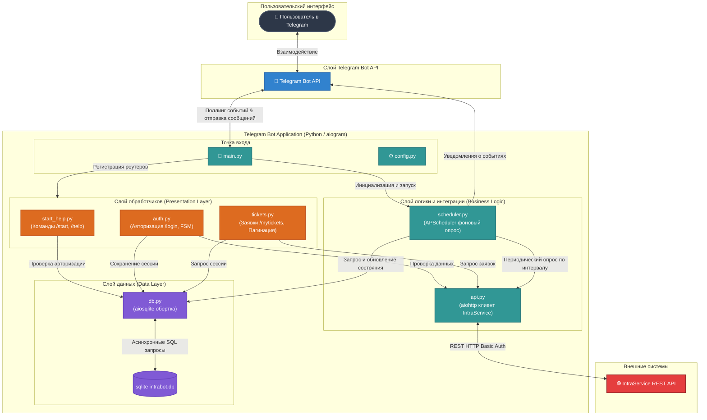
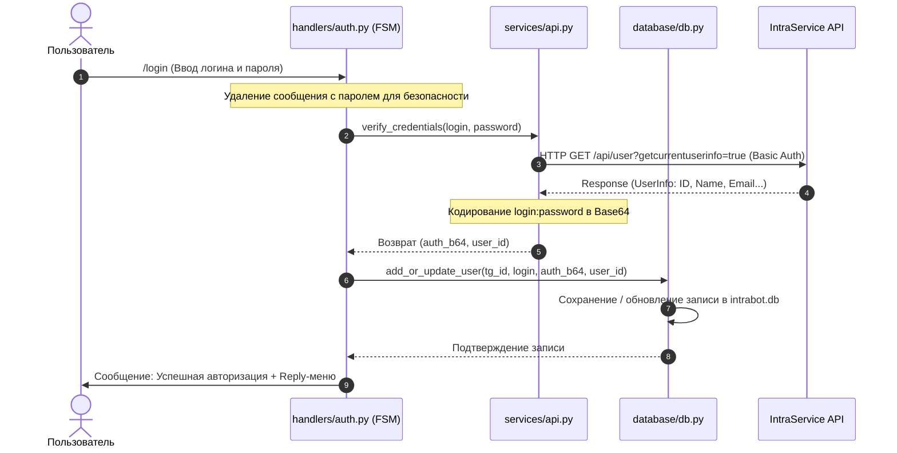
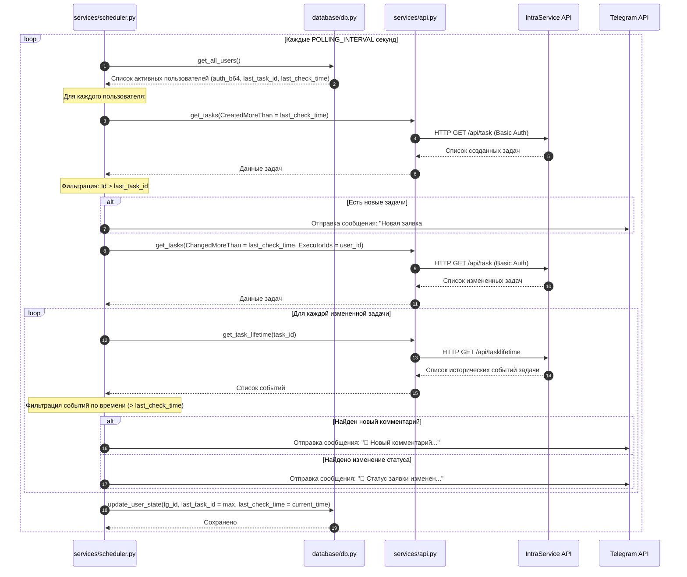

# Архитектура проекта IntraBot-gemini

Этот документ содержит визуальные схемы, описывающие архитектуру Telegram-бота, его внутренние компоненты, уровни абстракции и потоки данных при интеграции с IntraService и SQLite.

---

## 1. Схема компонентов и уровней системы

Данная блок-схема иллюстрирует разделение приложения на слои (Presentation, Business Logic, Data, External) и связи между ними:

---

## 2. Диаграмма потока данных (Data Flow)

Ниже представлена диаграмма, показывающая, как данные передаются между компонентами при выполнении типичных операций:

### А. Процесс авторизации и сохранения сессии

### Б. Фоновый опрос обновлений (Scheduler Loop)

