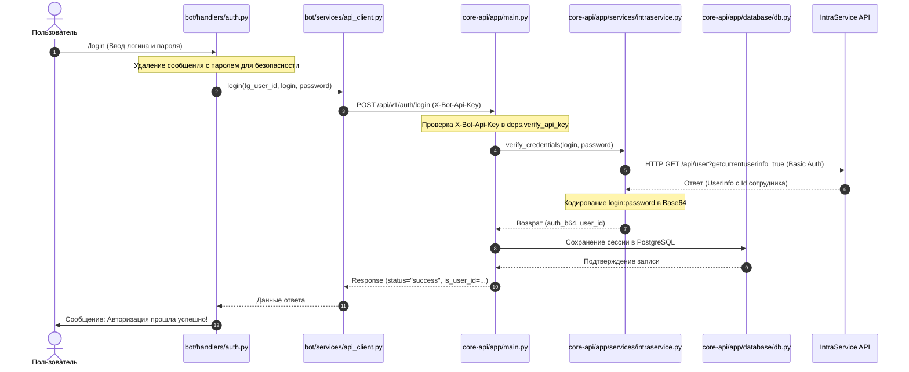
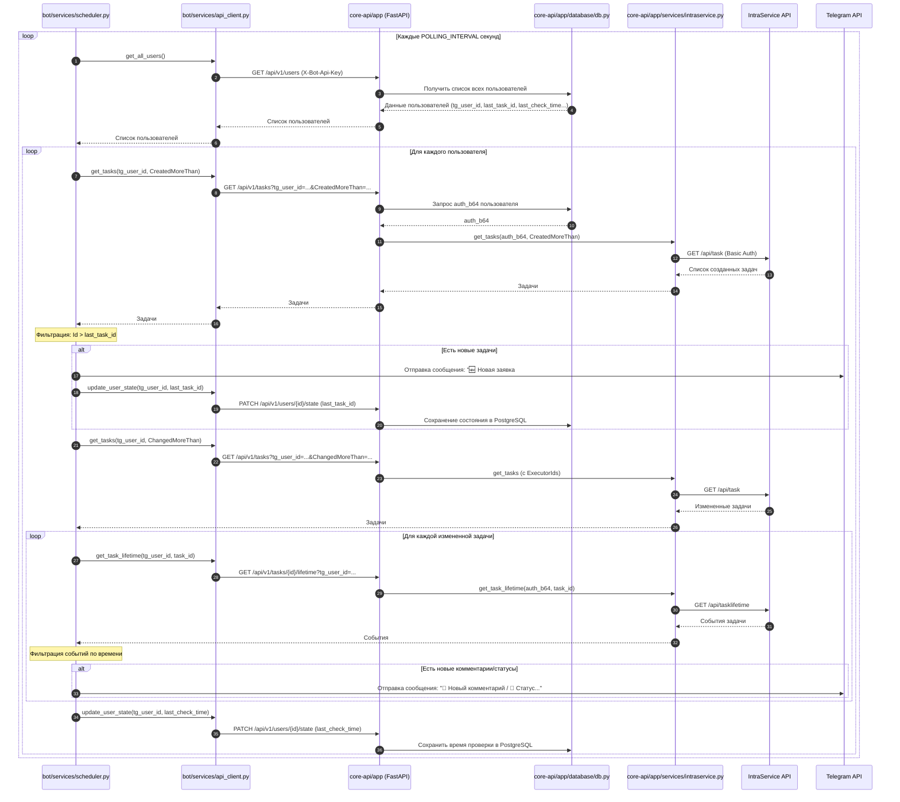

# Архитектура проекта IntraBot-gemini

Этот документ содержит визуальные схемы, описывающие микросервисную архитектуру проекта, разделенного на **Core API Gateway** и **Telegram Bot**, их внутренние компоненты, уровни абстракции и потоки данных.

---

## 1. Схема компонентов и слоев системы

Проект разделен на два основных сервиса, которые общаются по протоколу HTTP REST с использованием API-ключа авторизации (`X-Bot-Api-Key`):

```mermaid
flowchart TB
    %% Определение стилей
    classDef userStyle fill:#2d3748,stroke:#4a5568,stroke-width:2px,color:#fff;
    classDef telegramStyle fill:#3182ce,stroke:#2b6cb0,stroke-width:2px,color:#fff;
    classDef handlerStyle fill:#dd6b20,stroke:#c05621,stroke-width:2px,color:#fff;
    classDef serviceStyle fill:#319795,stroke:#2c7a7b,stroke-width:2px,color:#fff;
    classDef dbStyle fill:#805ad5,stroke:#6b46c1,stroke-width:2px,color:#fff;
    classDef externalStyle fill:#e53e3e,stroke:#9b2c2c,stroke-width:2px,color:#fff;

    subgraph Clients ["Пользовательский интерфейс"]
        User(["👤 Пользователь в Telegram"]):::userStyle
    end

    subgraph Telegram_Layer ["Внешний слой Telegram"]
        TG_API["💬 Telegram Bot API"]:::telegramStyle
    end

    subgraph Bot_Service ["Telegram Bot Service (Python / aiogram)"]
        direction TB
        B_Main["🚀 main.py"]:::serviceStyle
        B_Config["⚙️ config.py"]:::serviceStyle
        
        subgraph B_Handlers ["Слой представления (Handlers)"]
            H_Start["start_help.py<br/>(Старт / Помощь)"]:::handlerStyle
            H_Auth["auth.py<br/>(Вход / Выход)"]:::handlerStyle
            H_Tickets["tickets.py<br/>(Список заявок)"]:::handlerStyle
        end

        subgraph B_Logic ["Слой интеграции"]
            API_Client["api_client.py<br/>(HTTP Core API клиент)"]:::serviceStyle
            Scheduler["scheduler.py<br/>(APScheduler фоновый опрос)"]:::serviceStyle
        end
    end

    subgraph Core_API_Service ["Core API Service (Python / FastAPI)"]
        direction TB
        API_Main["🚀 main.py"]:::serviceStyle
        API_Config["⚙️ config.py"]:::serviceStyle
        
        subgraph API_Routers ["Роутеры API (Endpoints)"]
            R_Auth["auth.py<br/>(/auth/login, /auth/logout)"]:::handlerStyle
            R_Tasks["tasks.py<br/>(/tasks, /statuses)"]:::handlerStyle
            R_Users["users.py<br/>(/users, /users/state)"]:::handlerStyle
        end

        subgraph API_Services ["Службы & База данных"]
            IS_Client["intraservice.py<br/>(aiohttp клиент)"]:::serviceStyle
            DB_Module["db.py<br/>(SQLAlchemy async)"]:::dbStyle
        end
    end

    subgraph DB_Layer ["Слой данных"]
        Postgres_DB[("database PostgreSQL")]:::dbStyle
    end

    subgraph External_Systems ["Внешние системы"]
        IS_API["🌐 IntraService REST API"]:::externalStyle
    end

    %% Связи
    User <-->|Взаимодействие| TG_API
    TG_API <-->|Long Polling / Webhook| B_Main
    B_Main -->|Регистрация роутеров| B_Handlers
    B_Main -->|Запуск планировщика| Scheduler
    
    H_Start & H_Auth & H_Tickets -->|Вызов методов| API_Client
    Scheduler -->|Запрос обновлений & пользователей| API_Client
    
    %% Бот -> Core API
    API_Client <-->|REST HTTP (X-Bot-Api-Key)| API_Main
    
    API_Main -->|Маршрутизация| API_Routers
    
    R_Auth & R_Tasks & R_Users -->|Бизнес-логика| IS_Client
    R_Auth & R_Users -->|Работа с сессиями| DB_Module
    
    DB_Module <-->|SQLAlchemy Async Connection| Postgres_DB
    IS_Client <-->|REST HTTP Basic Auth| IS_API
```

---

## 2. Диаграмма потока данных (Data Flow)

Ниже представлены sequence-диаграммы, показывающие, как данные передаются между сервисами при выполнении типичных операций.

### А. Процесс авторизации пользователя
В новой архитектуре бот не хранит никаких паролей или токенов в своей локальной памяти. Все данные учетной записи отправляются и сохраняются в Core API:



### Б. Фоновый опрос обновлений планировщиком (Scheduler Loop)
Планировщик в боте периодически опрашивает Core API, который в свою очередь обращается к IntraService, используя сохраненный Base64 токен:


