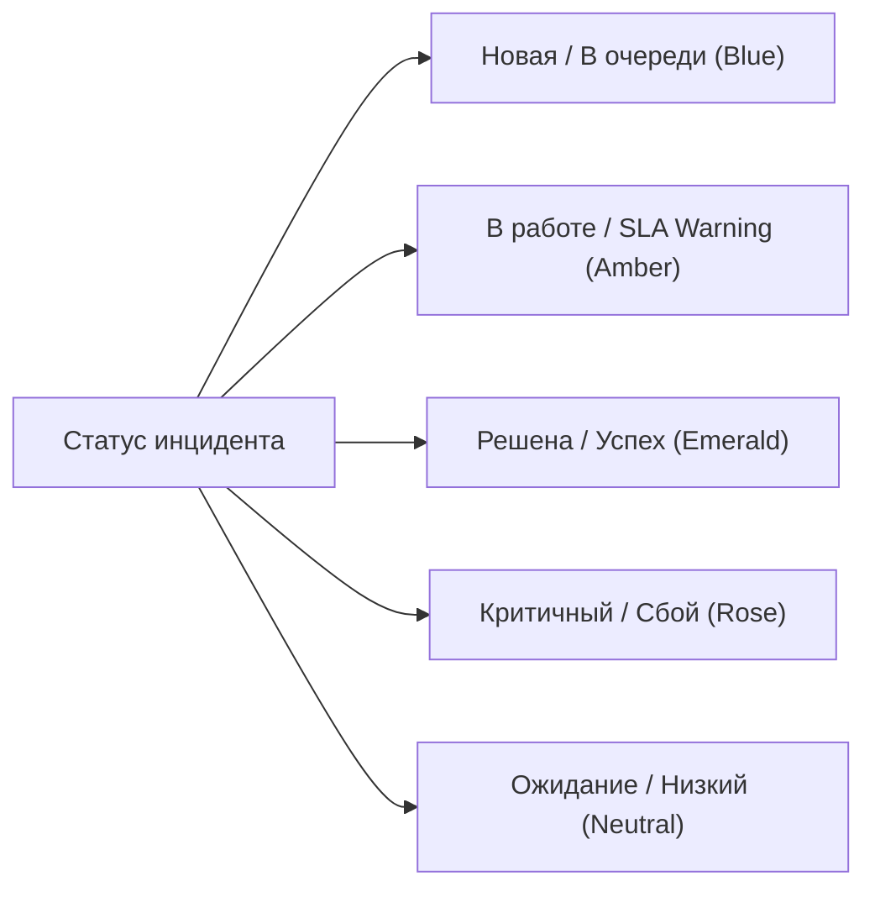

# Брендбук и дизайн-система — IntraLink Helpdesk

> **Версия:** 2.0 (Executive Enterprise Edition)  
> **Статус:** Действующий корпоративный стандарт  
> **Целевая аудитория:** Инженеры 1-й и 2-й линии технической поддержки, системные администраторы, DevOps.

---

## 1. Философия и принципы визуального стиля

**IntraLink** — это профессиональный инструмент управления инцидентами и автоматизации Helpdesk в закрытом корпоративном контуре.

### Главный манифест: *«Информация — это интерфейс»*
1. **Максимальная плотность информации (High Density):** Экран оператора предназначен для быстрой навигации по десяткам тикетов без лишнего скролла и визуального шума.
2. **Zero-Emoji Policy (Политика нулевого использования эмодзи):** Полный отказ от потребительских цветных эмодзи (`⚡`, `⚠️`, `🛠️`, `❌`, `🧠`, `🔴` и т.п.) в кнопках, бейджах, заголовках и системных уведомлениях. Любое визуальное разделение строится на **векторных геометрических SVG-пиктограммах** и строгой типографике.
3. **Сдержанная корпоративная палитра (Monochrome & Precision Accents):** Исключение «кислотных», перенасыщенных градиентов и ядовитых фонов. Базовый интерфейс нейтрально-монохромен, а цвет используется исключительно как функциональный маркер (статус, уровень критичности, ошибка).
4. **Швейцарская сетка (Swiss Grid & Geometry):** Точные границы (`1px border`), микроскругления (`rounded` — 4–6px), четкая иерархия отступов (шаг 4px: 8/12/16/24px).

---

## 2. Типографика

В системе используется строгое разделение на **текстовый шрифт (UI)** и **моноширинный шрифт (Данные и метаинформация)**.

| Назначение | Гарнитура | Вес | Размер | Tracking / Line-height |
|---|---|---|---|---|
| **Основной интерфейс (UI Sans)** | `Inter`, system-ui, -apple-system | Regular (400), Medium (500), SemiBold (600) | 12–15px | `-0.01em`, `1.4` |
| **Код, ID, IP, Хосты, Логи (UI Mono)** | `JetBrains Mono`, `Fira Code`, monospace | Regular (400), Medium (500) | 10–12px | `0.02em` (tracking-wide) |

### Иерархия заголовков и текста
- **H1 (Экранный заголовок):** `18px`, `font-semibold`, `tracking-tight`, `text-neutral-900 dark:text-neutral-50`
- **H2 (Секции и карточки):** `14–15px`, `font-semibold`, `text-neutral-900 dark:text-neutral-100`
- **H3 (Заголовки блоков):** `12–13px`, `font-medium`, `text-neutral-800 dark:text-neutral-200`
- **Body (Основной текст):** `13px`, `font-normal`, `leading-relaxed`, `text-neutral-700 dark:text-neutral-300`
- **Secondary / Captions:** `11–12px`, `text-neutral-500 dark:text-neutral-400`
- **Micro / Metadata Badges:** `10–11px`, `font-mono`, `font-medium`, `uppercase`, `tracking-wider`

---

## 3. Цветовая палитра (Color Tokens)

Дизайн-система построена на шкале **Neutral (Slate/Zinc neutral)** с точечными семантическими акцентами.

### 3.1. Нейтральная основа (Grayscale Foundation)
- **Фон приложения (Background):**
  - Light: `#f8f9fa` (`bg-neutral-50`)
  - Dark: `#0c0d0e` (`dark:bg-neutral-950`)
- **Поверхности карточек (Surfaces):**
  - Light: `#ffffff` (`bg-white`)
  - Dark: `#131517` (`dark:bg-neutral-900`)
- **Границы и разделители (Borders):**
  - Light: `#e5e7eb` / `#e2e8f0` (`border-neutral-200`)
  - Dark: `#22262a` / `#27272a` (`dark:border-neutral-800`)
- **Текст (Text Hierarchy):**
  - Primary: `text-neutral-900` / `dark:text-neutral-50`
  - Secondary: `text-neutral-600` / `dark:text-neutral-400`
  - Muted: `text-neutral-400` / `dark:text-neutral-600`

---

### 3.2. Семантические токены статусов и акцентов

Все бейджи и индикаторы статусов используют **приглушенные пастельные подложки низкой насыщенности**, контрастные границы `1px` и индикаторные точки `6px`.



| Токен | Dot Color | Badge Background & Border | Назначение |
|---|---|---|---|
| **Emerald (Success)** | `#10b981` (`bg-emerald-500`) | `bg-emerald-50/50 border-emerald-300 dark:bg-emerald-950/30 dark:border-emerald-800/80 text-emerald-800 dark:text-emerald-300` | Статус «Решена», успешные операции Execution Broker, активный сервис |
| **Rose (Critical / Error)** | `#f43f5e` (`bg-rose-500`) | `bg-rose-50/50 border-rose-300 dark:bg-rose-950/30 dark:border-rose-800/80 text-rose-800 dark:text-rose-300` | Критичный приоритет, ошибки RPC, сбой сервиса, Circuit Breaker OPEN |
| **Amber (Warning / Duplicates)** | `#f59e0b` (`bg-amber-500`) | `bg-amber-50/50 border-amber-300 dark:bg-amber-950/30 dark:border-amber-800/80 text-amber-800 dark:text-amber-300` | Высокий приоритет, обнаружение дубликатов, предупреждения SLA |
| **Blue (Info / In-Flight)** | `#3b82f6` (`bg-blue-500`) | `bg-blue-50/50 border-blue-200 dark:bg-blue-950/30 dark:border-blue-800/80 text-blue-800 dark:text-blue-300` | Новая заявка, активные потоки, подсветка выбранного тикета |
| **Neutral (Default / Inactive)** | `#737373` (`bg-neutral-400`) | `bg-neutral-100 border-neutral-200 dark:bg-neutral-800 dark:border-neutral-700 text-neutral-700 dark:text-neutral-300` | Ожидание, средний/низкий приоритет, системные метаданные |

---

## 4. Стандарты иконкографии (SVG Iconography)

1. **Единый геометрический каркас:** Векторные SVG с размерами `12x12`, `14x14` или `16x16` пикселей.
2. **Толщина штриха (Stroke Width):** Строго `1.2px` – `1.4px`.
3. **Линии и соединения:** `strokeLinecap="round"`, `strokeLinejoin="round"`.
4. **Цвет:** Всегда наследуется через `currentColor`.

## 5. Компонентные паттерны

### 5.1. Кнопки (Buttons)
- **Primary Action (Главное действие):**
  - Глубокий монохромный контраст: `bg-neutral-900 hover:bg-neutral-800 text-white dark:bg-neutral-100 dark:hover:bg-neutral-200 dark:text-neutral-900`.
  - Четкий размер: `px-3 py-1.5 text-[11–12px] font-medium rounded`.
- **Secondary Action (Вторичные / Контекстные действия):**
  - Строгий контурный аутлайн: `border border-neutral-200 dark:border-neutral-700 bg-neutral-100 dark:bg-neutral-800 text-neutral-800 dark:text-neutral-200 hover:bg-neutral-200 dark:hover:bg-neutral-700`.
- **Ghost / Icon Button:**
  - `w-6 h-6 flex items-center justify-center rounded text-neutral-400 hover:text-neutral-700 dark:hover:text-neutral-200 hover:bg-neutral-100 dark:hover:bg-neutral-800`.

### 5.2. Микро-бейджи (Micro Badges)
```html
<span class="px-1.5 py-0.5 border border-neutral-300 dark:border-neutral-700 bg-neutral-100 dark:bg-neutral-800 text-neutral-700 dark:text-neutral-300 rounded text-[10px] font-mono uppercase tracking-wider">
  wi-fi
</span>
```

### 5.3. Всплывающие уведомления (Toasts)
- Выполнены в стиле монохромных высококонтрастных плашек:
  - `bg-neutral-900 text-white dark:bg-neutral-100 dark:text-neutral-950 border border-neutral-800 dark:border-neutral-200 shadow-lg min-w-[280px] p-3 rounded`.
  - Статус отражается исключительно тонкой цветной векторной иконкой слева (`16x16px`).

---

## 6. Tone of Voice (Голос и текст интерфейса)

1. **Язык:** Строго русский технический язык без англицизмов там, где есть устоявшийся IT-термин.
2. **Краткость и командный залог:**
   - *«Выдать доступ»* вместо *«Нажмите сюда, чтобы выдать права Wi-Fi»*
   - *«Отменить как дубликат (Статус 30)»* вместо *«Заявка является копией, закрыть её?»*
   - *«Синхронизация завершена»* вместо *«Ура, база знаний успешно обучена!»*
3. **Техническая точность:** Указывать номера статусов (`Статус 29`, `Статус 30`, `Статус 48`), коды инцидентов (`#12450`), точные имена хостов (`WS-112-04`) и групп безопасности AD (`WLAN-WORKNET`).
