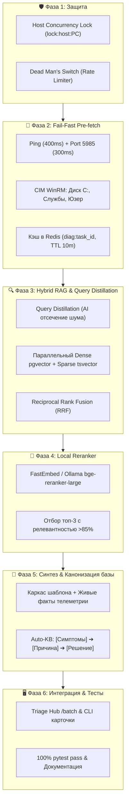

# 📋 План реализации: Этап 1 (Q3 2026) — Фоновая телеметрия, Защитные механизмы и Advanced Hybrid RAG

Данный документ является **техническим заданием и пошаговым руководством по реализации** для Этапа 1 развития системы IntraLink.

---

## 🎯 Архитектурный контекст и Инварианты

1. **Базис:** Модульный монорепозиторий (`core-api`, `execution-worker`, `helpdesk-cli`, `telegram-bot`, `shared`).
2. **Безопасность:** Двухконтурный DLP-роутинг (🔴 RED On-Prem / 🟡 YELLOW Sanitized + Redis Vault / 🟢 GREEN Cloud).
3. **Принцип построения:** **Native Async State Machine** на FastAPI + Redis вместо тяжелых Multi-Agent Swarms.
4. **Контроль задержки:** Фоновый Pre-fetch телеметрии с нулевой задержкой (0ms added latency) при открытии карточки в триаже.

---

## 🛠 Пошаговый план по фазам

### 🛡️ Фаза 1. Защитные механизмы (Host Locks & Dead Man's Switch)

**Цель:** Исключить сбои WinRM/WMI `0x80338029` при параллельных сессиях и защитить систему от лавины случайных массовых закрытий.

1. **Distributed Host Concurrency Lock:**
   - Файл: `core-api/app/services/worker.py` (или `core-api/app/services/safety.py`).
   - Реализация асинхронного контекстного менеджера `host_concurrency_lock(pc_name: str, ttl: int = 30)`.
   - Использование Redis ключа `lock:host:<pc_name>`. Запрет параллельного запуска более 1 сетевой сессии к конкретному ПК.
2. **Аварийный тормоз (Rate-Limit / Dead Man's Switch):**
   - Файл: `core-api/app/routers/triage.py` (в эндпоинте `/api/v1/triage/apply`).
   - Скользящее окно в Redis `ratelimit:triage:apply` (порог: не более 10 заявок в минуту без явного подтверждения оператором `confirmed_by_human=True`).
3. **Тестирование:**
   - Файл: `core-api/tests/test_safety_locks.py` (проверка захвата/освобождения лока и срабатывания лимитера).

---

### 📡 Фаза 2. Фоновый Fail-Fast Pre-fetch телеметрии хостов

**Цель:** Доставлять инженеру полную техническую картину по ПК с задержкой 0 мс при открытии заявки.

1. **Сервис телеметрии (`core-api/app/services/host_telemetry.py`):**
   - **Fail-Fast сетевой каскад:**
     - ICMP Ping — таймаут 400 мс.
     - TCP Port 5985 (WinRM) / 445 (SMB) — таймаут 300 мс.
     - Если хост оффлайн $\rightarrow$ статус `OFFLINE (Ping timeout)` без запуска WMI.
     - Если порт 5985 открыт $\rightarrow$ сбор через CIM WinRM: остаток места на диске `C:`, статус служб (`Spooler`, `1C:Enterprise`), активный пользователь.
2. **Обработка краевых кейсов:**
   - Нормализация `pc_name` через `shared/normalizer.py` (парсинг текста и кастомных полей).
   - Если имя ПК не найдено $\rightarrow$ статус `HOST_NOT_SPECIFIED`.
   - Защита от шторма запросов: Subnet Rate-Limiting (не более 3 параллельных зондов на подсеть `/24`).
3. **Интеграция в Poller / Worker:**
   - При обнаружении нового тикета в `check_updates` / `poller.py` запускается `asyncio.create_task` с сохранением в Redis по ключу `diag:<task_id>` (TTL 10 минут).
4. **Тестирование:** `core-api/tests/test_host_telemetry.py`.

---

### 🔍 Фаза 3. Query Distillation и Advanced Hybrid RAG

**Цель:** 100% нахождение прецедентов по кодам ошибок (`0x80070005`), моделям оборудования и устранение эмоционального шума.

1. **Query Distillation (AI-нормализация запроса):**
   - Файл: `core-api/app/services/rag.py`.
   - Функция `distill_search_query(raw_text: str) -> str`: легковесная модель за 200 мс отсекает эмоциональный шум (*«Шеф ругается, всё пропало!»*) и формирует четкий технический инвариант (*«Ошибка печати очереди Spooler»*).
2. **Полнотекстовый Sparse-поиск в PostgreSQL:**
   - Добавление расширения `pg_trgm` и GIN-индексов `to_tsvector('russian', problem)` в таблицу `task_knowledge_base`.
3. **Reciprocal Rank Fusion (RRF):**
   - Параллельное выполнение векторного поиска (`cosine_distance <=>`) и полнотекстового `tsvector`.
   - Слияние списков кандидатов по формуле $RRF\_Score = \sum \frac{1}{60 + rank_i}$.
4. **Тестирование:** `core-api/tests/test_rag_hybrid.py`.

---

### 🎯 Фаза 4. Локальный Cross-Encoder Reranker

**Цель:** Поднять релевантность топ-3 прецедентов до 95%+.

1. **Интеграция Cross-Encoder:**
   - Файл: `core-api/app/services/rag.py`.
   - Использование `FastEmbed.TextCrossEncoder` (модель `BAAI/bge-reranker-large`) в неблокирующем пуле потоков (`asyncio.to_thread`).
   - Резервный fallback на локальный Ollama API.
2. **Двухэтапный пайплайн:**
   - Hybrid RRF отбирает топ-15 кандидатов $\rightarrow$ Reranker оценивает семантическую релевантность $\rightarrow$ возвращаются топ-3 с порогом `score > 0.85`.
3. **Тестирование:** `core-api/tests/test_rag_reranker.py`.

---

### 🧠 Фаза 5. Интеллектуальный синтез ответа и Auto-KB Канонизация

**Цель:** Живые и точные ответы заявителю без галлюцинаций и автоматическая очистка базы знаний.

1. **Telemetry-Guided Response Synthesis:**
   - Файл: `core-api/app/services/ai/hub.py` / `template_engine.py`.
   - Каркас корпоративного шаблона инженера Беликова Алена наполняется реальными фактами телеметрии (диск, служба Spooler, заблокированный документ).
2. **Auto-KB Канонизация при закрытии заявок (`status 29/30`):**
   - Файл: `core-api/app/services/rag.py` (в `index_task_knowledge`).
   - Модель структурирует связку *[Проблема + История + Решение]* в каноническую статью:
     - `[Симптомы]` $\rightarrow$ `[Первопричина]` $\rightarrow$ `[Решение]`.
3. **Тестирование:** `core-api/tests/test_ai_synthesis.py`.

---

### 🖥️ Фаза 6. Интеграция в Triage Hub, CLI и Финальная верификация

1. **Triage Router (`core-api/app/routers/triage.py`):**
   - Добавление полей `telemetry` и `hybrid_kb_matches` в эндпоинты `/batch` и `/tasks/{task_id}`.
2. **Helpdesk CLI & AGY Skills:**
   - Отображение компактного бейджа:
     `[NTEMW0144: 🟢 Ping 2ms | 💾 C: 45GB | 🖨️ Spooler: OK | 👤 ivanov.ii]`
3. **Полный регрессионный тест:**
   - Запуск `pytest core-api/tests` (обеспечение прохождения 100% тестов).
4. **Обновление документации:** `docs/services/core-api/README.md` и `.agents/skills/`.
