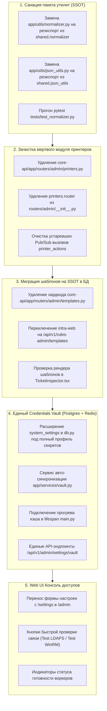

# 📋 План реализации: Первая фаза — Санация кодовой базы и Единый Credentials Vault

> **Статус реализации:** ✅ **Внедрено в Production (Успешно завершено)**
> Все 5 шагов реализованы, покрыты unit/API тестами (227/227 тестов core-api пройдены) и проверены в сборке singlefile SPA.

Этот документ содержит пошаговое инженерное руководство по реализации **Первой фазы** утвержденной дорожной карты развития **IntraLink** ([`docs/roadmap.md`](roadmap.md)).

---

## 🎯 Цели и границы первой фазы

1. **Ликвидация архитектурных рудиментов:**
   - Устранить дублирование библиотек между `core-api/app/utils/` и единым пакетом `shared/` (восстановление инварианта SSOT).
   - Удалить заброшенный роутер принтеров (`core-api/app/routers/admin/printers.py`) и мертвый Pub/Sub канал `printer_actions`.
   - Заменить захардкоженный каталог шаблонов `admin/templates.py` на динамическую базу PostgreSQL (`triage_templates` + `rules_admin.py`).
2. **Централизация секретов (SSOT Credentials Vault):**
   - Перенести все учетные записи инфраструктуры (IntraService, WinRM/LDAPS, Local Admin) в PostgreSQL (`system_settings`) с шифрованием Fernet.
   - Обеспечить автоматический прогрев и синхронизацию кэша в Redis (`worker:domain_auth`, `worker:service_auth_b64`) при старте и обновлении.
   - Свести разрозненные формы настройки доступов в единый интерфейс Web UI (`/admin`) с 1-клик проверкой связности.

---

## 🏛️ Архитектурные инварианты и правила

- **Пакет `shared/` — единственный источник правды (SSOT):** Никаких дубликатов алгоритмов нормализации (`normalizer.py`), экспресс-диагностики (`diagnostics.py`) и сериализации (`json_utils.py`) внутри сервисов.
- **PostgreSQL — персистентное хранилище, Redis — шина и кэш:** При перезапуске или очистке Redis система должна автоматически и прозрачно восстанавливать рабочее состояние из PostgreSQL.
- **Безопасность учетных данных:** Запрещено хранить доменные и сервисные пароли в открытом виде. Все секреты шифруются Fernet с использованием мастер-ключа из окружения (`ENCRYPTION_KEY`).

---

## 🛠 Пошаговый план работ (WBS)

---

### Блок 1. Санация кодовой базы (Фаза 0 Roadmap)

#### Задача 1.1: Восстановление инварианта SSOT в `core-api/app/utils/`
* **Проблема:** Файлы `app/utils/normalizer.py` (512 строк) и `app/utils/json_utils.py` дублируют код из `shared/`.
* **Действие:**
  1. Отрефакторить `core-api/app/utils/normalizer.py`: сделать его легковесным фасадом, реэкспортирующим все функции из `shared.normalizer` (аналогично тому, как это сделано в `execution-worker/normalizer.py` и `helpdesk-cli/normalizer.py`).
  2. Отрефакторить `core-api/app/utils/json_utils.py`: сделать реэкспорт из `shared.json_utils`.
  3. Убедиться, что все внутренние модули `core-api` продолжают работать без поломки импортов.

#### Задача 1.2: Удаление мертвого модуля принтеров
* **Проблема:** Файл `core-api/app/routers/admin/printers.py` (465 строк) шлет события в заброшенный Pub/Sub канал `printer_actions` и проверяет устаревший статус `printer_worker:status`.
* **Действие:**
  1. Удалить файл `core-api/app/routers/admin/printers.py`.
  2. Удалить импорт и маунтинг `printers.router` из `core-api/app/routers/admin/__init__.py`.
  3. Согласовать единый ключ Heartbeat воркера: `worker:health:win_daemon`.

#### Задача 1.3: Миграция каталога шаблонов на базу данных
* **Проблема:** В `core-api/app/routers/admin/templates.py` зашит словарь `DEFAULT_TEMPLATES_CATALOG` на 190 строк. В то же время в PostgreSQL есть таблица `triage_templates` и готовый роутер `rules_admin.py`.
* **Действие:**
  1. Удалить `core-api/app/routers/admin/templates.py` и его маунтинг в `admin/__init__.py`.
  2. Перевести метод `fetchTemplatesCatalog()` в `intra-web/src/lib/tasks.ts` на использование эндпоинта `/api/v1/rules-admin/templates` (или предоставить алиас в `triage.py`).
  3. Проверить корректность выбора шаблонов в `TicketInspector.tsx`.

---

### Блок 2. Единый Credentials Vault (Фаза 1 Roadmap)

#### Задача 2.1: Моделирование единого профиля учетных записей в PostgreSQL
* **Файл:** `core-api/app/database/db.py`
* **Действие:** Добавить или расширить структуру настроек в `system_settings`:
  * `service_account_config`:
    - `login`: str
    - `password_encrypted`: str (Fernet)
    - `base_url`: str
  * `domain_config`:
    - `username`: str (UPN, e.g. `svc_intralink@corporate.loc`)
    - `password_encrypted`: str (Fernet)
    - `domain`: str (`corporate.loc`)
    - `dc_host`: str (`dc01.corporate.loc`)
    - `ldaps_port`: int (636)
  * `local_admin_config`:
    - `username`: str (`.\Администратор`)
    - `password_encrypted`: str (Fernet)

#### Задача 2.2: Сервис синхронизации и авто-прогрева кэша (`vault.py`)
* **Файл:** `core-api/app/services/vault.py` [NEW]
* **Действие:**
  1. Создать функции:
     - `sync_vault_to_redis(db: AsyncSession)`: вычитывает все конфигурации из `system_settings`, расшифровывает пароли и сохраняет шифрованные токены в Redis (`worker:domain_auth`, `worker:service_auth_b64`).
     - `get_vault_status(db: AsyncSession) -> dict`: возвращает статус настроенности без раскрытия паролей (`is_domain_configured`, `is_service_user_configured`, `is_local_admin_configured`).
  2. Интегрировать `sync_vault_to_redis()` в lifespan `core-api/app/main.py`: при старте контейнера Redis автоматически наполняется свежими кредами.

#### Задача 2.3: Унификация роутеров аутентификации и доступов
* **Файлы:** `core-api/app/routers/admin_settings.py`, `core-api/app/routers/admin/auth.py`
* **Действие:**
  1. Создать единый набор API-эндпоинтов для управления инфраструктурными учетными записями:
     - `GET /api/v1/admin/vault/status` — сводная проверка наличия всех доступов.
     - `POST /api/v1/admin/vault/service-account` — сохранение сервисного аккаунта IntraService.
     - `POST /api/v1/admin/vault/domain` — сохранение единой доменной учетки (WinRM + LDAPS).
     - `POST /api/v1/admin/vault/local-admin` — сохранение резервного локального админа.
     - `POST /api/v1/admin/vault/test-ldaps` — моментальная проверка соединения с Active Directory.
     - `POST /api/v1/admin/vault/test-winrm` — моментальная проверка тестового WinRM подключения.
  2. Удалить дублирующий эндпоинт `/admin/api/domain-auth` из `routers/admin/auth.py`.

#### Задача 2.4: Модернизация Web UI (`intra-web`)
* **Файлы:** `intra-web/src/pages/AdminPanelPage.tsx`, `intra-web/src/pages/SettingsPage.tsx`
* **Действие:**
  1. Вынести блок настройки доменных учетных данных из устаревшего `SettingsPage.tsx` в единую вкладку **«Инфраструктурные доступы и Vault»** на странице `AdminPanelPage.tsx`.
  2. Реализовать карточки статуса с кнопками моментального тестирования связности (*«Проверить LDAPS»*, *«Проверить WinRM»*).
  3. Добавить визуальный бейдж готовности: 🟢 Настроено / 🔴 Требует настройки.

---

## 🧪 План верификации и приемочного тестирования

| № | Этап проверки | Команда / Сценарий | Ожидаемый результат |
|---|---|---|---|
| 1 | Тесты SSOT утилит | `uv run pytest core-api/tests/ -v -k normalizer` | Все тесты нормализации проходят через `shared` (PASSED) |
| 2 | Целостность API | `uv run pytest core-api/tests/ -v` | Отсутствие ошибок импорта после удаления `printers.py` и `templates.py` |
| 3 | Авто-прогрев Redis | Перезапуск `core-api` при пустом Redis | Ключи `worker:domain_auth` и `worker:service_auth_b64` автоматически созданы |
| 4 | Проверка API Vault | `GET /api/v1/admin/vault/status` | HTTP 200 с корректными булевыми флагами готовности |
| 5 | Web UI Admin Panel | Открытие `/admin` в браузере | Единая вкладка доступов отображает статусы и позволяет выполнить тест связи |

---

## 🚀 Готовность к началу работы

После подтверждения данного плана выполнение начнется строго последовательно:
1. **Шаг 1:** Санация `app/utils/` (нормализатор и JSON-сериализатор).
2. **Шаг 2:** Удаление `printers.py` и зачистка роутов.
3. **Шаг 3:** Перевод шаблонов на `triage_templates`.
4. **Шаг 4:** Реализация сервиса `vault.py` и миграция базы данных.
5. **Шаг 5:** Обновление Web UI.
