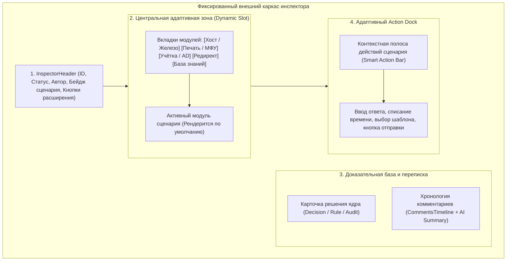

# 🧩 Архитектурный план: Модульный и адаптивный Инспектор заявок (Adaptive Ticket Inspector)

**Архитектурный стандарт:** Slot-Based Adaptive Workspace  
**Дата согласования (/grill-me):** 2026-09-09  
**Статус:** Согласовано, готово к реализации  

---

## 1. Концепция и цель модернизации

Текущий инспектор заявок (`TicketInspector.tsx`) отображает монолитный фиксированный набор секций для любой заявки: даже если обращение касается создания учетной записи в Active Directory или каталожного перенаправления, интерфейс принудительно рендерит блоки сетевой телеметрии хоста, порты SMB/WinRM и кнопки подключения LiteManager.

### Целевое состояние
Инспектор становится **слот-ориентированным и контекстно-адаптивным**:
1. **Автоматический выбор профиля:** По `scenario_key` из сценарного ядра (`DecisionEnvelope`) с fallback на категорию раздела каталога (`ServiceId`).
2. **Адаптивная центральная зона:** Центральный слот подменяется специализированным модулем (Хост/Железо, Принтер/МФУ, Учетная запись/AD, Редирект каталога, База знаний RAG).
3. **Свобода оператора (Operator Override):** Инженер в 1 клик через вкладки рабочей зоны может переключиться в любой другой модуль (например, посмотреть характеристики ПК в тикете на доступы).
4. **Контекстные быстрые действия:** Над полем ввода комментариев в Action Dock динамически отображаются смарт-кнопки активного сценария («Сбросить Spooler», «Разблокировать УЗ», «Очистить диск C:», «Запросить реквизиты»).
5. **Нативные факты:** Каждый модуль отображает свои факты с бейджами валидности (`valid` / `missing` / `stale`), а общая карточка аудита решения остаётся закреплённой в правой колонке.

---

## 2. Архитектура компоновки (Slot-Based Layout)



---

## 3. Реестр специализированных модулей (Module Registry)

Инспектор получает реестр из 5 модулей, реализующих общий интерфейс `InspectorModuleProps`:

```typescript
export interface InspectorModuleProps {
  ticket: Ticket;
  details: TaskDetails | null;
  rawId: number;
  scenarioKey: string;
  facts: Record<string, any>;
  onToast: (toast: { type: 'success' | 'error' | 'warning' | 'info'; message: string }) => void;
  onRefreshDetails: () => void;
  onExecuteAction?: (actionId: string, params?: Record<string, any>) => Promise<void>;
}
```

### Спецификация 5 модулей:

| Модуль | Триггеры (`scenario_key` / ServiceId) | Что отображает в центральной зоне | Специфичные быстрые действия |
|---|---|---|---|
| **1. `HostHardwareModule` (Хост / Железо)** | `offline_host`, жалобы на ПК, раздел каталога `02` (ПО), `03` (ПК) | - Экспресс-паспорт железа: CPU, RAM, SSD/HDD, Uptime;<br>- Сетевая телеметрия (Ping, SMB, WinRM);<br>- Кнопки подключения (LiteManager, RDP, DameWare);<br>- Статус служб Spooler и 1C. | `[Перезагрузить ПК]`<br>`[Очистить Temp / кэш 1C]`<br>`[Проверить службы]` |
| **2. `PrinterModule` (Печать / МФУ)** | `install_printer`, `printer_*`, раздел каталога `03. Оргтехника` | - Карточка принтера: модель, IP-адрес/порт, привязанный ПК;<br>- Драйверная карта и статус локального Spooler;<br>- Количество зависших заданий в очереди печати. | `[Сбросить Spooler и очередь]`<br>`[Установить принтер]`<br>`[Проверить порт 9100]` |
| **3. `IdentityModule` (Учётная запись / AD)** | `create_user`, `grant_wlan`, раздел каталога `01. Учётные записи` | - Карточка сотрудника: ФИО, организация, отдел, должность, OU;<br>- Статус УЗ в AD (Lockout, PasswordExpiry, активность);<br>- Поля фактов с бейджами `valid`/`missing`. | `[Разблокировать УЗ]`<br>`[Запросить реквизиты (35)]`<br>`[Подтвердить создание]` |
| **4. `RedirectModule` (Каталог / Редирект)** | `redirect`, `catalog_redirect` | - Сравнение текущего и рекомендуемого сервиса каталога;<br>- Детектор производственных простоев (Downtime Warning);<br>- Обоснование перенаправления. | `[Перенаправить и отменить (30)]`<br>`[Оставить в работе (27)]` |
| **5. `KnowledgeBaseModule` (База знаний / RAG)** | `consultation`, `rag_consultation`, default fallback | - Сниппеты найденных решений из базы знаний pgvector;<br>- Прецеденты похожих закрытых заявок;<br>- AI-сводка переписки с заявителем. | `[Вставить ответ AI]`<br>`[Подобрать аналоги]`<br>`[Добавить в базу знаний]` |

---

## 4. Контекстная полоса действий (Smart Action Bar)

Над стандартным полем ввода комментария в [`UnifiedActionDock.tsx`](file:///C:/Users/belikov.a/Desktop/Акты,%20документы/Work/!Projects/intralink/intra-web/src/components/inspector/UnifiedActionDock.tsx) монтируется динамическая полоса быстрых действий:

```tsx
<div className="flex items-center gap-1.5 px-3 py-1.5 bg-neutral-100/80 dark:bg-neutral-800/60 border-b border-neutral-200 dark:border-neutral-700 overflow-x-auto text-xs">
  <span className="text-neutral-400 text-[10.5px] uppercase font-bold tracking-wider shrink-0 mr-1">
    Быстрые действия:
  </span>
  {activeScenarioActions.map((action) => (
    <button
      key={action.id}
      type="button"
      onClick={() => handleActionClick(action)}
      className="inline-flex items-center gap-1 px-2.5 py-1 rounded-md bg-white dark:bg-neutral-900 border border-neutral-200 dark:border-neutral-700 text-neutral-800 dark:text-neutral-200 font-medium hover:bg-neutral-50 dark:hover:bg-neutral-800 shadow-2xs transition-colors shrink-0 cursor-pointer"
    >
      {action.icon}
      <span>{action.label}</span>
    </button>
  ))}
</div>
```

---

## 5. Пошаговый план внедрения (Phased Execution)

### Этап 1. Базовый каркас адаптивности (Core Refactor)
1. **Компонент `InspectorWorkspace.tsx`:**  
   Выделение центральной зоны инспектора в слот с поддержкой вкладок:
   - Автоматический выбор дефолтной вкладки по `scenario_key` / `ServiceId`.
   - Вкладки с индикаторами наличия данных (например, точка на вкладке «Хост», если ПК обнаружен в заявке).
2. **Типизированный реестр `moduleRegistry.ts`:**  
   Маппинг `scenario_key ➔ ReactComponent` с fallback на `KnowledgeBaseModule`.

### Этап 2. Разработка и адаптация модулей
1. **`HostHardwareModule.tsx`:**  
   Интеграция паспорта железа (CPU, RAM, SSD/HDD, Uptime) и существующих кнопок LiteManager/DameWare/RDP.
2. **`IdentityModule.tsx`:**  
   Карточка сотрудника для `create_user` (с валидацией недостающих реквизитов) + статус УЗ в AD с кнопкой «Разблокировать УЗ».
3. **`PrinterModule.tsx`:**  
   Выделение логики принтеров из `DiagnosticsSection` в специализированную карточку с очередью печати и сбросом Spooler.
4. **`RedirectModule.tsx`:**  
   Карточка сравнения сервисов каталога с подтверждением перенаправления.
5. **`KnowledgeBaseModule.tsx`:**  
   Фокус на RAG-прецедентах, похожих заявках и AI-сводке.

### Этап 3. Адаптивный Action Dock
1. Расширение [`UnifiedActionDock.tsx`](file:///C:/Users/belikov.a/Desktop/Акты,%20документы/Work/!Projects/intralink/intra-web/src/components/inspector/UnifiedActionDock.tsx) полосой `SmartActionBar`.
2. Проброс обработчиков быстрых действий сценария без необходимости ручной вставки сниппетов.

---

## 6. Критерии приемки (Definition of Done)

- [ ] При открытии заявки на создание пользователя (`create_user`) по умолчанию открывается `IdentityModule`, а нерелевантные сетевые пробы хоста скрыты.
- [ ] При открытии заявки на принтер по умолчанию открывается `PrinterModule` со статусом очереди печати и кнопкой рестарта Spooler.
- [ ] При открытии заявки с жалобой на ПК по умолчанию открывается `HostHardwareModule` с паспортом железа и Uptime.
- [ ] Оператор может в 1 клик переключить вкладку и посмотреть данные любого другого модуля.
- [ ] Над полем ответа отображаются быстрые кнопки, специфичные для выбранного модуля.
- [ ] Все существующие функции (отправка комментариев, списание времени, смена статуса, Desktop Companion) сохраняют полную работоспособность.

---

## 7. Слепые зоны (Blind Spots) и архитектурные решения

1. **Смена активной вкладки при листании очереди заявок:**
   - *Проблема:* Ручной выбор вкладки на тикете #1 может залипнуть на тикете #2 другого сценария.
   - *Решение:* Сброс активного таба на дефолтный для сценария (`scenarioDefaultTab`) строго при смене `rawId`. В рамках текущего `rawId` выбор оператора сохраняется.
2. **Мультихостовые заявки (`hostList.length > 1`):**
   - *Проблема:* В заявке указано несколько ПК.
   - *Решение:* Модуль `HostHardwareModule` содержит селектор хостов (`HostSelectorPills`), позволяющий переключать паспорт железа между хостами в 1 клик.
3. **Двухуровневая привязка кнопок Action Dock:**
   - *Проблема:* Оператор открыл чужую вкладку (например, железо в заявке на учетку).
   - *Решение:* Основная кнопка проводки (`primaryActionLabel`) всегда привязана к сценарию тикета (`create_user`). Верхняя полоса смарт-кнопок (`SmartActionBar`) отображает быстрые утилиты текущей открытой вкладки.
4. **Адаптивность при узкой ширине панели (440px):**
   - *Проблема:* 5 текстовых вкладок переполняют панель при `minW=440px`.
   - *Решение:* Компактные иконки с краткими лейблами и точками-индикаторами наличия данных (`Dot Indicator`).
5. **Защита набранного черновика ответа:**
   - *Проблема:* Клик по быстрой кнопке шаблона может затереть уже набранный оператором текст.
   - *Решение:* Дописывание шаблона в конец существующего текста через двойной перенос строки `\n\n` без перезаписи.
6. **Реактивность при правке фактов (`FactOverrideModal`):**
   - *Проблема:* Изменение имени ПК или принтера требует обновления данных в модуле.
   - *Решение:* Вызов `onRefreshDetails()`, сбрасывающий кэш телеметрии и перезапускающий опрос для нового хоста.

---

## 8. Граничные случаи (Edge Cases)

- **EC-1 (WinRM Access Denied):** При ошибках авторизации 401/RPC WMI не ломает рендер; отображается бейдж ошибки и One-Liner ассистент.
- **EC-2 (Терминальный статус 29/30):** Если заявка уже закрыта, все изменяющие кнопки действий блокируются (`disabled`).
- **EC-3 (Пустые факты / Empty State):** При отсутствии темы/текста отображается чистый fallback `KnowledgeBaseModule` без исключений `undefined`.
- **EC-4 (Защита от двойного клика):** Кнопки действий блокируются флагом `isExecutingAction` со спиннером до завершения запроса.
- **EC-5 (Длинные строки оборудования):** Обязательный CSS `truncate` с всплывающей подсказкой `title={specs.cpu_name}`.


