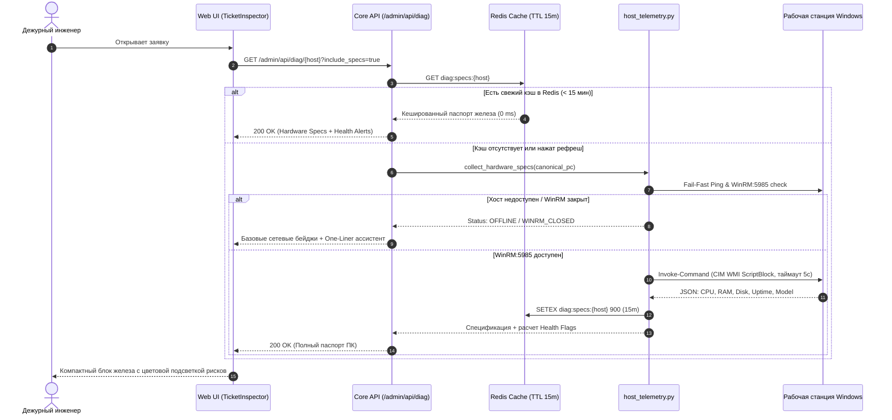

# 📋 План реализации: Экспресс-паспорт «Железо и Uptime ПК» (Hardware & Health Inspector)

**Сценарий:** `hardware_health_inspector` (Tier 2, Quick Win для Web UI)  
**Дата разработки:** 2026-09-09  
**Срок реализации:** 1–2 рабочих дня  
**Статус:** План готов к реализации  

---

## 1. Цель и решаемые задачи

### Проблема
В Helpdesk до 40% обращений первой линии содержат жалобы на производительность: *«Компьютер тормозит»*, *«Зависает 1С»*, *«Вылетают вкладки в браузере»*, *«Долго загружается»*.  
Сейчас дежурный инженер вынужден:
1. Запускать сторонний клиент (LiteManager / DameWare / RDP);
2. Ждать авторизации и перехвата сессии;
3. Открывать Диспетчер задач / `msinfo32` / `dxdiag`;
4. В 70% случаев обнаружить тривиальную причину: ПК не перезагружался 45 дней (утечки памяти), диск C: заполнен на 99% или в компьютере установлен старый HDD и 4 ГБ RAM.

### Решение
Автоматический сбор и отображение ключевых характеристик ПК (**CPU, RAM, SSD/HDD, Uptime, модель системного блока**) прямо в карточке инспектора заявок Web UI при наличии связи по WinRM:5985. Время получения данных — **< 1 секунды** при фоновом кэшировании (0 ms added latency для оператора).

---

## 2. Архитектура и поток данных (Data Flow)



---

## 3. Технический дизайн бэкенда (Core API)

### 3.1. Расширение WMI/CIM скрипта в [`host_telemetry.py`](file:///C:/Users/belikov.a/Desktop/Акты,%20документы/Work/!Projects/intralink/core-api/app/services/host_telemetry.py)

В функцию сбора системных метрик добавляется оптимизированный PowerShell-запрос, выполняемый в едином процессе `Invoke-Command`:

```powershell
$ErrorActionPreference = 'SilentlyContinue'
try {
    $res = Invoke-Command -ComputerName "$target_pc" -ScriptBlock {
        # 1. Процессор
        $cpu = Get-CimInstance Win32_Processor | Select-Object -First 1 Name, NumberOfCores, NumberOfLogicalProcessors, MaxClockSpeed

        # 2. Память и Uptime
        $os = Get-CimInstance Win32_OperatingSystem | Select-Object TotalVisibleMemorySize, FreePhysicalMemory, LastBootUpTime, Caption, OSArchitecture
        $now = Get-Date
        $uptimeSec = [int]($now - $os.LastBootUpTime).TotalSeconds

        # 3. Дисковая подсистема
        $diskC = Get-CimInstance Win32_LogicalDisk -Filter "DeviceID='C:'" | Select-Object Size, FreeSpace
        $physDisk = Get-PhysicalDisk -ErrorAction SilentlyContinue | Where-Object DeviceId -eq 0 | Select-Object -First 1
        $mediaType = if ($physDisk -and $physDisk.MediaType) { $physDisk.MediaType.ToString() } else { 'Unknown' }

        # 4. Компьютерная система и пользователь
        $cs = Get-CimInstance Win32_ComputerSystem | Select-Object Manufacturer, Model, UserName

        # 5. Службы
        $spooler = Get-Service -Name Spooler -ErrorAction SilentlyContinue | Select-Object -ExpandProperty Status

        [PSCustomObject]@{
            CpuName = $cpu.Name
            CpuCores = $cpu.NumberOfCores
            CpuThreads = $cpu.NumberOfLogicalProcessors
            TotalRamKB = $os.TotalVisibleMemorySize
            FreeRamKB = $os.FreePhysicalMemory
            BootTime = $os.LastBootUpTime.ToString("yyyy-MM-ddTHH:mm:ss")
            UptimeSeconds = $uptimeSec
            OsCaption = $os.Caption
            OsArch = $os.OSArchitecture
            DiskSize = $diskC.Size
            DiskFree = $diskC.FreeSpace
            DriveType = $mediaType
            Manufacturer = $cs.Manufacturer
            Model = $cs.Model
            ActiveUser = $cs.UserName
            SpoolerStatus = if ($spooler) { $spooler.ToString() } else { 'NotInstalled' }
        }
    } -ErrorAction Stop

    Write-Output (ConvertTo-Json @{ success = $true; data = $res })
} catch {
    Write-Output (ConvertTo-Json @{ success = $false; error = $_.Exception.Message })
}
```

### 3.2. Доменная модель Pydantic (`shared/domain` или `core-api/app/schemas`)

```python
class HardwareSpecs(BaseModel):
    pc_name: str
    manufacturer: str | None = None
    model: str | None = None
    cpu_name: str | None = None
    cpu_cores: int | None = None
    cpu_threads: int | None = None
    total_ram_gb: float | None = None
    free_ram_gb: float | None = None
    ram_used_percent: float | None = None
    disk_c_total_gb: float | None = None
    disk_c_free_gb: float | None = None
    disk_c_free_percent: float | None = None
    disk_type: str = "Unknown"  # "SSD" | "HDD" | "Unknown"
    uptime_days: int = 0
    uptime_hours: int = 0
    boot_time_iso: str | None = None
    os_caption: str | None = None
    logged_in_user: str | None = None
    spooler_status: str | None = None
    
    # Расчётные индикаторы рисков (Health Flags)
    flag_uptime_warning: bool = False      # Uptime > 14 дней
    flag_uptime_critical: bool = False     # Uptime > 30 дней
    flag_disk_low: bool = False            # Диск C: < 10% или < 10 ГБ
    flag_ram_low: bool = False             # Всего RAM < 8 ГБ или занято > 90%
    flag_hdd_bottleneck: bool = False      # Установлен HDD вместо SSD
```

### 3.3. Бизнес-логика формирования флагов (Health Flags Evaluation)

```python
def compute_health_flags(data: dict[str, Any]) -> dict[str, bool]:
    uptime_sec = data.get("uptime_seconds", 0)
    uptime_days = uptime_sec // 86400
    
    total_ram_kb = data.get("total_ram_kb", 0)
    free_ram_kb = data.get("free_ram_kb", 0)
    total_ram_gb = total_ram_kb / (1024 * 1024) if total_ram_kb else 0
    ram_used_pct = ((total_ram_kb - free_ram_kb) / total_ram_kb * 100) if total_ram_kb else 0
    
    disk_free_b = data.get("disk_free", 0)
    disk_total_b = data.get("disk_size", 0)
    disk_free_gb = disk_free_b / (1024**3) if disk_free_b else 0
    disk_free_pct = (disk_free_b / disk_total_b * 100) if disk_total_b else 0
    
    drive_type = str(data.get("drive_type", "")).upper()

    return {
        "flag_uptime_warning": 14 <= uptime_days < 30,
        "flag_uptime_critical": uptime_days >= 30,
        "flag_disk_low": disk_free_gb < 10.0 or disk_free_pct < 10.0,
        "flag_ram_low": total_ram_gb < 7.5 or ram_used_pct > 90.0,
        "flag_hdd_bottleneck": "HDD" in drive_type,
    }
```

### 3.4. Обновление эндпоинта диагностики [`/admin/api/diag/{host}`](file:///C:/Users/belikov.a/Desktop/Акты,%20документы/Work/!Projects/intralink/core-api/app/routers/admin/diag.py#L154)

- В сигнатуру роутера добавляется флаг: `include_specs: bool = True`.
- Если хост в сети и порт 5985 открыт, в JSON-ответ добавляется блок `specs: HardwareSpecs | None`.
- Кэш в Redis пишется по ключу `diag:specs:{canonical_host}` с TTL 900 сек (15 минут).

---

## 4. Технический дизайн фронтенда (Web UI)

### 4.1. Обновление типов в `intra-web/src/lib/types.ts`

```typescript
export interface HardwareSpecs {
  manufacturer?: string;
  model?: string;
  cpu_name?: string;
  cpu_cores?: number;
  cpu_threads?: number;
  total_ram_gb?: number;
  free_ram_gb?: number;
  ram_used_percent?: number;
  disk_c_total_gb?: number;
  disk_c_free_gb?: number;
  disk_c_free_percent?: number;
  disk_type?: 'SSD' | 'HDD' | 'Unknown';
  uptime_days: number;
  uptime_hours: number;
  boot_time_iso?: string;
  os_caption?: string;
  logged_in_user?: string;
  flag_uptime_warning: boolean;
  flag_uptime_critical: boolean;
  flag_disk_low: boolean;
  flag_ram_low: boolean;
  flag_hdd_bottleneck: boolean;
}

export interface HostDiagnostics {
  // Существующие поля
  is_online: boolean;
  smb_ok: boolean;
  winrm_ok: boolean;
  avg_rtt?: string;
  status_label: string;
  
  // Новое поле спецификации
  specs?: HardwareSpecs | null;
}
```

### 4.2. Компонент `HardwareSpecsCard.tsx`

Расположение: `intra-web/src/components/inspector/HardwareSpecsCard.tsx` (встраивается в [`TicketContextSummary.tsx`](file:///C:/Users/belikov.a/Desktop/Акты,%20документы/Work/!Projects/intralink/intra-web/src/components/inspector/TicketContextSummary.tsx)).

**Визуальный стиль:** Строгий Vercel/Linear стиль без визуального мусора.

```tsx
<div className="rounded-lg border border-neutral-200/80 bg-neutral-50/50 p-2.5 dark:border-neutral-800 dark:bg-neutral-900/40 space-y-2">
  {/* Заголовок с моделью и ОС */}
  <div className="flex items-center justify-between text-xs">
    <div className="flex items-center gap-1.5 font-medium text-neutral-900 dark:text-neutral-100">
      <IconCpu size={14} className="text-neutral-500" />
      <span>{specs.manufacturer} {specs.model}</span>
      <span className="text-neutral-400 font-normal">({specs.os_caption})</span>
    </div>
    <button onClick={copySpecs} title="Скопировать паспорт железа" className="...">
      <IconCopy size={12} />
    </button>
  </div>

  {/* Грид ключевых характеристик */}
  <div className="grid grid-cols-2 sm:grid-cols-4 gap-1.5 text-[11px] font-mono">
    {/* CPU */}
    <div className="p-1.5 rounded bg-white dark:bg-neutral-800/60 border border-neutral-200/60 dark:border-neutral-700/60">
      <div className="text-neutral-400 text-[9.5px] uppercase font-sans">CPU</div>
      <div className="font-semibold truncate" title={specs.cpu_name}>
        {specs.cpu_cores}C/{specs.cpu_threads}T · {cleanCpuName(specs.cpu_name)}
      </div>
    </div>

    {/* RAM с алертом */}
    <div className={`p-1.5 rounded border ${specs.flag_ram_low ? 'bg-amber-50/80 border-amber-200 text-amber-900 dark:bg-amber-950/40 dark:border-amber-900 dark:text-amber-200' : 'bg-white dark:bg-neutral-800/60 border-neutral-200/60 dark:border-neutral-700/60'}`}>
      <div className="text-neutral-400 text-[9.5px] uppercase font-sans">ОЗУ (RAM)</div>
      <div className="font-semibold">
        {specs.total_ram_gb} ГБ ({specs.ram_used_percent}% занято)
      </div>
    </div>

    {/* Диск C: с типом накопителя */}
    <div className={`p-1.5 rounded border ${specs.flag_disk_low ? 'bg-rose-50/80 border-rose-200 text-rose-900 dark:bg-rose-950/40 dark:border-rose-900 dark:text-rose-200' : 'bg-white dark:bg-neutral-800/60 border-neutral-200/60 dark:border-neutral-700/60'}`}>
      <div className="text-neutral-400 text-[9.5px] uppercase font-sans">Диск C: ({specs.disk_type})</div>
      <div className="font-semibold">
        {specs.disk_c_free_gb} ГБ своб. ({specs.disk_c_free_percent}%)
      </div>
    </div>

    {/* Uptime с алертом по порогам */}
    <div className={`p-1.5 rounded border ${specs.flag_uptime_critical ? 'bg-rose-50/80 border-rose-200 text-rose-900 dark:bg-rose-950/40 dark:border-rose-900 dark:text-rose-200' : specs.flag_uptime_warning ? 'bg-amber-50/80 border-amber-200 text-amber-900 dark:bg-amber-950/40 dark:border-amber-900 dark:text-amber-200' : 'bg-white dark:bg-neutral-800/60 border-neutral-200/60 dark:border-neutral-700/60'}`}>
      <div className="text-neutral-400 text-[9.5px] uppercase font-sans">Аптайм</div>
      <div className="font-semibold">
        {specs.uptime_days}д {specs.uptime_hours}ч
      </div>
    </div>
  </div>

  {/* Информационные плашки рисков (если сработали флаги) */}
  {specs.flag_uptime_critical && (
    <div className="text-[11px] text-rose-700 dark:text-rose-300 flex items-center gap-1.5 bg-rose-50 dark:bg-rose-950/30 p-1.5 rounded border border-rose-200 dark:border-rose-900">
      <IconAlertTriangle size={13} className="shrink-0" />
      <span>ПК не перезагружался более 30 дней. Высокий риск накопленных утечек памяти и зависания системных служб.</span>
    </div>
  )}
</div>
```

---

## 5. Граничные случаи и отказоустойчивость (Resilience)

| Граничный случай | Поведение системы | Защитный механизм |
|---|---|---|
| **Хост выключен (OFFLINE)** | Мгновенный ответ `is_online = false`, `specs = null`. | Fail-Fast Ping 400ms отсекает запуск тяжёлого WMI. |
| **Порт 5985 закрыт** | Возврат `winrm_ok = false`, `specs = null`, показ One-Liner ассистента. | Экспресс TCP-проба порта 5985 (таймаут 300мс). |
| **Зависание WMI на целевом ПК** | Завершение процесса с ошибкой таймаута через 5 секунд. | Жесткий `timeout_sec=5` в `subprocess.run` и `asyncio.wait_for`. |
| **Одновременные запросы к одному ПК** | Выполняется один WMI-запрос, второй ждёт или берёт результат из Redis. | Распределённый замок `host_concurrency_lock(pc, ttl=15)`. |
| **Несколько ПК в тексте заявки** | Опрос первого валидного хоста по умолчанию, остальные доступны по клику. | Нормализация имён хостов через `extract_pc_names_from_text`. |

---

## 6. План тестирования (Testing & Verification)

### Автоматические тесты
1. **Unit-тест парсера CIM-ответа (`test_host_telemetry.py`):**
   - Мокирование успешного JSON-ответа `Invoke-Command`.
   - Проверка корректного расчёта `total_ram_gb`, `free_ram_gb`, `uptime_days`.
   - Проверка граничных условий флагов: Uptime 5 дней (нет флага), 15 дней (warning), 32 дня (critical).
2. **Интеграционный тест роутера (`test_admin_diag.py`):**
   - Вызов `GET /admin/api/diag/{host}?include_specs=true`.
   - Проверка кэширования в Redis: первый вызов обращается к функции, второй берёт значение из Redis без повторного WMI.
3. **Фронтенд-тест рендеринга (`intra-web`):**
   - Рендеринг `HardwareSpecsCard` при наличии и отсутствии `specs`.
   - Отображение предупреждающих бейджей при критическом аптайме и переполнении диска.

### Ручная приёмка на тестовом стенде
- Проверка на реальном корпоративном ПК с Windows 10/11:
  1. Вызов ручной диагностики в Web UI по кнопке «Диагностика».
  2. Проверка соответствия выведенных данных реальным характеристикам (`msinfo32`).
  3. Проверка поведения при отключении сетевого кабеля на целевом ПК (корректный Fail-Fast переход в оффлайн без ошибок в интерфейсе).

---

## 7. Пошаговый чек-лист внедрения

- [ ] **Шаг 1 (Backend CIM Script):** Добавить класс `HardwareSpecs` в схемы и расширить PowerShell ScriptBlock в `host_telemetry.py`.
- [ ] **Шаг 2 (Backend Cache & Flags):** Реализовать функцию `compute_health_flags` и кэширование паспорта в Redis (`diag:specs:{host}`).
- [ ] **Шаг 3 (API Endpoint):** Добавить поддержку `include_specs` в эндпоинт `/admin/api/diag/{host}` в `core-api/app/routers/admin/diag.py`.
- [ ] **Шаг 4 (Frontend Types):** Расширить интерфейсы `HostDiagnostics` и `HardwareSpecs` в `intra-web/src/lib/types.ts`.
- [ ] **Шаг 5 (Frontend Component):** Создать `intra-web/src/components/inspector/HardwareSpecsCard.tsx` со строгим дизайном.
- [ ] **Шаг 6 (Frontend Integration):** Встроить `HardwareSpecsCard` в `TicketContextSummary.tsx`.
- [ ] **Шаг 7 (Тесты):** Написать unit-тесты в `core-api/tests/test_host_telemetry.py` и прогнать полный тестовый suite.
- [ ] **Шаг 8 (Commit & Release):** Оформить коммит в ветку и проверить сквозной сценарий на живой заявке.

