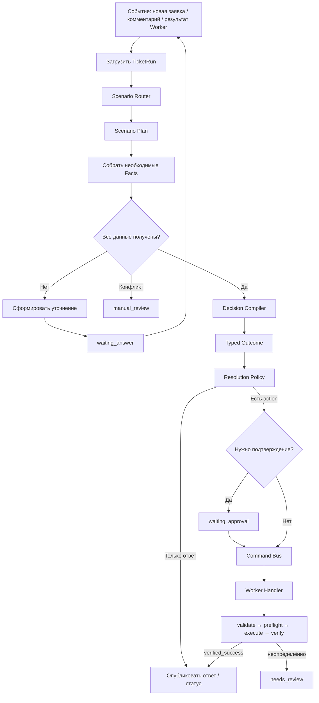

# План модернизации исполнения заявок IntraLink

## Краткое решение

Перейти к модели **единого долговечного жизненного цикла, типизированных сценариев, динамического сбора фактов и evidence-based компиляции решения**.

```text
Event → TicketRun → Scenario → Fact Plan
      → collect / clarify / validate
      → Rule + RAG + Diagnostics candidates
      → Decision Compiler
      → Typed Outcome
      → Resolution Policy
      → Approval / Command
      → Worker Verify
      → Final Response / Status
```

Отдельный pipeline для каждой заявки не создаётся. Каждая заявка получает экземпляр версионированного сценария, а общий оркестратор определяет необходимые данные и следующий допустимый шаг.



Процесс представляет собой небольшой Saga/process manager: он может ждать комментарий несколько дней, переживать перезапуск сервиса и продолжаться с сохранённого шага.

## Сценарии вместо индивидуальных pipeline

| Сценарий | Необходимые факты | Возможное выполнение |
|---|---|---|
| `create_user` | ФИО, организация, подразделение, должность, OU | AD create → verify → статус 29 |
| `install_printer` | ПК, принтер/IP/share, тип подключения | диагностика → установка → verify |
| `offline_host` | имя ПК, DNS, ping, порты | уточнение или дальнейшая диагностика |
| `grant_wlan` | логин/UPN, существование пользователя | AD group membership → verify |
| `redirect` | текущий сервис, целевой сервис, основание | комментарий + статус 30 |
| `file_lock` | путь, сервер, блокирующий пользователь | диагностика → безопасное действие |
| `consultation` | описание проблемы, RAG evidence | ответ без инфраструктурной команды |

Каждая конкретная заявка получает зафиксированный экземпляр сценария:

```text
scenario_key = "install_printer"
scenario_version = 3
ticket_run_id = ...
current_step = "collect_printer_address"
```

## Фаза 1. Контракты фактов и evidence

Создать в `shared/domain`:

- `FactKey`;
- `FactState`: `missing | valid | invalid | ambiguous | conflicting | stale`;
- `FactSource`: `structured_field | directory | diagnostic | comment | parser | llm | operator`;
- `FactObservation`;
- `ResolvedFact`;
- `FactBag`;
- `FactRequirement`;
- `EvidenceReference`;
- `ScenarioMatch`;
- `ScenarioDefinition`;
- `ExecutionPlan`;
- `SynthesisProposal`;
- `DecisionEnvelope`.

Каждый факт должен содержать значение, состояние и происхождение:

```json
{
  "key": "pc_name",
  "value": "NTEMW0144",
  "state": "valid",
  "source": "structured_field",
  "source_ref": "field:1042",
  "evidence": "Имя ПК: NTEMW0144",
  "observed_at": "2026-09-08T10:15:00Z",
  "schema_version": 1
}
```

Правила контрактов:

- `extra="forbid"`;
- значение не существует без source/evidence;
- LLM не может перезаписать явно заполненное поле;
- конфликт не разрешается молча;
- RAG не является источником фактов текущей заявки.

Критерий приёмки: все типы проходят Pydantic round trip, недопустимые комбинации отвергаются.

## Фаза 2. Fact Registry и коллекторы

Создать:

```text
core-api/app/services/facts/
├── registry.py
├── collector.py
├── merger.py
├── structured_fields.py
├── comments.py
├── deterministic.py
├── directory.py
├── diagnostics.py
└── llm_fallback.py
```

Для каждого факта объявить:

- тип значения;
- обязательность;
- приоритет источников;
- валидатор;
- срок актуальности;
- уровень чувствительности;
- допустимость LLM extraction;
- текст уточнения.

Порядок сбора:

1. Поля IntraService.
2. AD, каталог сервисов, DNS, CMDB и диагностика.
3. Комментарии заявителя.
4. Детерминированный parser.
5. LLM только для отсутствующих данных.
6. Операторский override с обязательным аудитом.

Независимые read-only коллекторы выполняются параллельно.

Критерий приёмки: один и тот же snapshot заявки детерминированно создаёт одинаковый `FactBag`, кроме явно обозначенных внешних наблюдений.

## Фаза 3. Персистентность фактов и состояния

Добавить Alembic-миграцию.

### Таблица `ticket_fact_observations`

- `id`;
- `ticket_run_id`;
- `fact_key`;
- `value_json`;
- `state`;
- `source_kind`;
- `source_ref`;
- `evidence_span`;
- `sensitivity`;
- `observed_at`;
- `supersedes_id`;
- `schema_version`.

Наблюдения являются append-only.

### Расширение `ticket_runs`

Добавить нормализованные поля:

- `scenario_key`;
- `scenario_version`;
- `fact_revision`;
- `context_fingerprint`;
- `decision_version`.

Не хранить `scenario_key` только внутри `trigger_snapshot_json`.

Использовать существующие структуры:

- `TicketRunEvent` — журнал переходов;
- `DecisionRecord` — candidates, evidence, итоговый outcome и policy;
- Command Bus — единственный путь side effects.

Критерий приёмки: процесс восстанавливается после перезапуска Core API без повторного выполнения завершённых шагов.

## Фаза 4. Scenario Registry

Создать:

```text
core-api/app/services/scenarios/
├── base.py
├── registry.py
├── create_user.py
├── install_printer.py
├── offline_host.py
├── grant_wlan.py
├── redirect.py
├── physical_device.py
├── file_lock.py
└── consultation.py
```

Интерфейс сценария:

```python
class Scenario:
    key: str
    version: int

    def match(self, context) -> ScenarioMatch: ...
    def requirements(self, facts) -> tuple[FactRequirement, ...]: ...
    def decide(self, context, facts, evidence) -> DecisionOutcome: ...
    def build_action(self, outcome) -> TypedAction | None: ...
```

Сценарии остаются типизированным Python-кодом. В PostgreSQL хранятся только:

- включение сценария;
- безопасные параметры;
- разрешённые service IDs;
- rollout mode;
- версия конфигурации.

Не создавать JSON DSL для бизнес-логики.

Критерий приёмки: новый сценарий регистрируется без изменения центрального оркестратора.

## Фаза 5. Универсальный TicketRun Orchestrator

Разделить текущий `TicketRunRunner`:

```text
TicketRunOrchestrator
├── ScenarioRouter
├── FactCollectionPlanner
├── ScenarioRegistry
├── DecisionCompiler
├── PolicyResolver
├── ResponseComposer
└── CommandDispatcher
```

Универсальный `advance(run, event)`:

1. Заблокировать текущую версию `TicketRun`.
2. Применить входное событие.
3. Определить или восстановить сценарий.
4. Построить список необходимых фактов.
5. Запустить доступные read-only коллекторы.
6. Если данные отсутствуют — создать одно уточнение.
7. Если есть конфликт — вернуть `ManualReviewRequired`.
8. Если всё готово — получить typed outcome.
9. Разрешить resolution policy.
10. Создать command или финальный ответ.
11. Сохранить события и новое состояние.

Входные события:

- `ticket_created`;
- `ticket_changed`;
- `comment_added`;
- `operator_override`;
- `approval_granted`;
- `approval_rejected`;
- `command_started`;
- `command_completed`;
- `command_failed`;
- `timeout_reached`.

Критерий приёмки: в `TicketRunRunner` отсутствуют ветви вида `if scenario_key == ...`.

## Фаза 6. Цикл уточнения данных

Если обязательных фактов нет:

```text
collecting_facts
    → clarification_required
    → waiting_answer
    → новый комментарий
    → extract_delta
    → merge facts
    → resume
```

Требования:

- не спрашивать повторно уже полученные данные;
- сохранять перечень заданных вопросов;
- анализировать только новые комментарии;
- ограничить количество циклов уточнения;
- после неоднозначных ответов переводить в `manual_review`;
- изменение структурированных полей инвалидирует старое решение;
- повторный event не создаёт дублирующий комментарий.

Критерий приёмки: после ответа заявителя процесс продолжается с сохранённого шага, а не рассчитывается с нуля.

## Фаза 7. Evidence Board и Decision Compiler

Нормализовать входы:

- typed outcomes от Rule Engine;
- RAG-прецеденты;
- диагностические наблюдения;
- факты из заявки;
- история переписки;
- ограничения resolution policy.

Алгоритм:

1. Применить Hard Guards.
2. Отбросить кандидатов без evidence.
3. Проверить конфликты и свежесть.
4. Выполнить детерминированное ранжирование.
5. Если результат однозначен — выбрать без LLM.
6. Если допустима неоднозначность — передать кандидатов LLM.
7. Проверить структурированный ответ LLM.
8. Выпустить один `DecisionEnvelope`.

LLM возвращает:

- выбранный candidate;
- использованные evidence IDs;
- причины отклонения альтернатив;
- ambiguities;
- response plan.

LLM не возвращает административный статус и не создаёт command.

Confidence рассчитывается системой из:

- полноты фактов;
- надёжности источников;
- согласованности;
- специфичности правила;
- качества и актуальности RAG;
- наличия конфликтов.

Не использовать самооценку confidence от модели.

Критерий приёмки: любое решение можно объяснить через конкретные evidence IDs.

## Фаза 8. Единый Response Composer

Устранить конкуренцию между:

```text
suggested_action.comment
vs
ai_suggested_resolution
```

Ввести один официальный результат:

```python
DecisionEnvelope.response_draft
```

Режимы формирования ответа:

- `strict_template` — AD, пароли и безопасность;
- `template_with_slots` — управляемая диагностика;
- `grounded_generation` — низкорисковая консультация.

После `verified_success` создаётся новая версия `DecisionEnvelope` с финальным ответом. Только она может утверждать, что действие выполнено.

На одно релизное окно оставить совместимые поля:

- `suggested_action`;
- `ai_suggested_resolution`.

Оба поля временно формировать из `DecisionEnvelope`, а не независимо.

Критерий приёмки: UI никогда не выбирает между двумя несогласованными ответами.

## Фаза 9. Исполнение и безопасность

Сохранить текущий Worker SDK:

```text
validate
→ preflight
→ prepare
→ execute
→ verify
→ reconcile
→ cleanup
```

Общие гарантии:

- typed action parameters;
- idempotency key: `run_id:decision_version:action_id`;
- повторная критическая валидация на Worker;
- статус 29 только после `verified_success`;
- неизвестный результат переводится в `needs_review`;
- изменяющие действия требуют HITL;
- read-only диагностика может выполняться автоматически;
- LLM не получает доступ к Command Bus;
- Redis используется как транспорт, PostgreSQL — как SSOT состояния.

Для необратимых операций компенсация означает controlled reconciliation/manual review, а не автоматический rollback.

## Фаза 10. Поэтапная миграция сценариев

### 10.1. Reference implementation

Перевести `create_user` на новый Scenario API в shadow mode:

- regression #140479;
- валидное ФИО;
- отсутствующее подразделение;
- неизвестный OU;
- duplicate login;
- DC timeout;
- verification mismatch;
- доставка временного пароля.

### 10.2. Низкорисковые сценарии

- `offline_host`;
- `redirect`;
- `consultation`.

Их можно переключить первыми.

### 10.3. Инфраструктурные сценарии

- `install_printer`;
- `grant_wlan`;
- `physical_device`;
- `file_lock`.

### 10.4. Generic/RAG fallback

Последним переносится общий консультационный маршрут, поскольку он имеет самую широкую область совпадения.

Каждый сценарий проходит:

```text
legacy only
→ shadow comparison
→ operator canary
→ partial cutover
→ full cutover
→ legacy removal
```

## Фаза 11. UI и операторский контроль

В единой панели показывать:

- выбранный сценарий и версию;
- собранные факты;
- отсутствующие и конфликтующие данные;
- Rule candidates;
- RAG evidence;
- выбранный outcome;
- причины отклонения альтернатив;
- уровень риска;
- required approval;
- текущий шаг `TicketRun`;
- результат Worker verification.

Оператор может:

- исправить факт;
- выбрать другой допустимый candidate;
- отправить уточнение;
- подтвердить или отклонить action;
- перевести заявку в manual review.

Каждое изменение создаёт новую версию решения.

## Фаза 12. Тесты и критерии cutover

### Контрактные тесты

- Pydantic round trip;
- запрет неизвестных полей;
- допустимость outcome/action/policy;
- существование evidence references.

### Property-based тесты

- Unicode;
- конфликтующие источники;
- пробелы и дефисы;
- повторные комментарии;
- перестановка порядка observations;
- stale facts.

### State-machine тесты

- ожидание ответа;
- несколько уточнений;
- approval;
- restart;
- timeout;
- duplicate event;
- потерянный Worker response;
- reconcile.

### Safety regression

- заявка #140479 даёт уточнение, статус 35 и ноль команд;
- RAG не создаёт action;
- LLM не перезаписывает структурированное поле;
- статус 29 невозможен без verification;
- повторный event не повторяет side effect.

### Метрики shadow mode

- scenario match rate;
- fact completeness;
- clarification rate;
- conflict rate;
- old/new decision divergence;
- AI proposal rejection rate;
- manual-review rate;
- invalid-action prevention;
- time in each `TicketRun` state;
- Worker verification failures.

Cutover сценария разрешён только после ручной проверки всех high-risk расхождений и при нулевом количестве unsafe actions.

## Рекомендуемая последовательность коммитов

1. `feat(domain): add typed facts and scenario contracts`
2. `feat(decisioning): add fact registry and provenance merge`
3. `feat(db): persist ticket facts and scenario versions`
4. `refactor(orchestration): introduce scenario registry`
5. `refactor(ticket-runs): add generic event-driven orchestrator`
6. `feat(decisioning): add evidence board and constrained compiler`
7. `refactor(responses): introduce unified decision envelope`
8. `feat(scenarios): migrate create-user in shadow mode`
9. `feat(scenarios): migrate low-risk ticket workflows`
10. `feat(scenarios): migrate infrastructure workflows`
11. `refactor(web): consume unified decision envelope`
12. `cleanup(decisioning): remove legacy branching and dual responses`

## Принятые архитектурные решения

- Использовать один общий жизненный цикл и реестр сценариев вместо индивидуального pipeline для каждой заявки.
- Сохранять сценарии и бизнес-логику типизированным Python-кодом.
- Не создавать собственный JSON DSL.
- Не передавать LLM право изменять статусы или создавать команды.
- Использовать LLM только для extraction, разрешения допустимой неоднозначности и grounded synthesis.
- Использовать RAG только как источник прецедентов и evidence, а не фактов текущей заявки.
- Сохранить `TicketRun`, PostgreSQL, Command Bus, Worker SDK, Pydantic и Jinja.
- Не внедрять Temporal или LangGraph на текущем масштабе.
- Выполнять миграцию по сценарию через shadow mode и canary без big-bang cutover.

