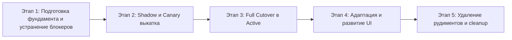

# Дорожная карта (Roadmap) перехода на новый сценарный контур

Документ фиксирует стратегию перевода жизненного цикла заявок IntraLink с монолитного `TicketRunRunner` на модульный `TicketRunOrchestrator`, план адаптации UI, устранения рудиментов и детальный план **Этапа 1** с учётом граничных условий (Edge Cases) и слепых зон.

---

## 1. Контекст и текущее состояние (Checkpoint)

В коммитах `fabaf5c`, `9b1d567` и `ca40b9b` реализован архитектурный каркас перехода к сценарному исполнению заявок:
- `shared/domain/scenario.py` — типизированные контракты фактов, сценариев, исходов и `DecisionEnvelope`.
- `core-api/app/services/facts/` — реестр, коллекторы (`structured`, `comments`, `directory`, `diagnostics`, `llm`) и слияние фактов с контролем источника правды (Provenance).
- `core-api/app/services/scenarios/` — реестр сценариев (`create_user`, `install_printer`, `grant_wlan`, `offline_host`, `redirect`, `file_lock`, `physical_device`, `consultation`).
- `core-api/app/services/scenario_orchestrator.py` — долговечный конечный автомат `TicketRunOrchestrator` (`advance`, `observe`, `record_shadow`, `_reconcile_command`).
- `core-api/migrations/versions/20260908_0011_scenario_execution.py` — схема хранения фактов (`ticket_fact_observations`), режим выкатки `rollout_mode` в `autopilot_scenarios`, дедупликация событий по `event_key`.
- `intra-web` — селектор `rollout_mode` (`legacy`, `shadow`, `canary`, `active`) в настройках и бейджи жизненного цикла в панели решения.

**Текущий статус:** кодовая основа готова для тестовой сборки и режимов `shadow` / `canary`. Режим `active` в production заблокирован до выполнения эксплуатационных этапов.

---

## 2. Общий 5-этапный Roadmap

### Этап 1. Подготовка фундамента и устранение блокеров
*Цель: устранить барьеры исполнения команд на воркере, покрыть оркестратор интеграционными тестами и гарантировать корректность схемы БД.*
1. **Worker Capabilities & GrantWlanHandler:** вынос действия `grant_wlan` в эталонный `ActionHandler`, объявление capabilities `["windows", "ad"]`, регистрация в `supported_actions`.
2. **Интеграционные тесты TicketRunOrchestrator:** покрытие 7 критических переходов FSM (clarification/resume, duplicate event, HitL approval, timeout, restart, lost worker, reconcile).
3. **Верификация схемы БД и политик финализации:** гарантия наличия `resolved_standard` для успешного закрытия заявок (статус 29), dry-run миграции `0011` на дампе боевой БД.

### Этап 2. Ввод в эксплуатацию: Shadow и Canary
*Цель: безопасная валидация нового контура на реальном потоке заявок без риска для пользователей.*
1. **Применение миграции 0011 в production** и перевод сценариев `create_user` и `install_printer` в `rollout_mode = "shadow"`.
2. **Мониторинг расхождений (Shadow Divergence):** сопоставление `DecisionEnvelope` против старого `suggested_action` по событиям `scenario_shadow_compared`.
3. **Включение Canary (5% → 10%):** автоматическое детерминированное распределение через `canary_selected(task_id, percent)`.

### Этап 3. Поэтапный перевод в Active (Full Cutover)
*Цель: перевод 100% потока заявок на `TicketRunOrchestrator` по классам риска.*
1. **Волна 1 (Низкий риск):** `redirect`, `offline_host`, `consultation`.
2. **Волна 2 (Эталонный доступ):** `create_user` (с обязательным HitL-подтверждением).
3. **Волна 3 (Инфраструктурные действия):** `install_printer`, `grant_wlan`, `file_lock` с переводом в статус 29 только после `verified_success`.

### Этап 4. Адаптация и развитие UI
*Цель: сделать интерфейс прозрачным пультом управления сценарными доказательствами (Evidence).*
1. **Визуализация доказательной базы:** FactBag, статус валидности полей, источники (Structured / Directory / RAG), причины отклонения кандидатов.
2. **Интерактивный Fact-Override:** ручная корректировка фактов инженером с пересборкой решения (`decision_version + 1`).
3. **Отвязка клиентского состояния:** перевод веб-клиента на прямое чтение `decision_envelope` вместо полей обратной совместимости.

### Этап 5. Устранение рудиментов (Legacy Deprecation)
*Цель: удаление мертвого кода после одного стабильного релизного окна (~2–3 недели в Active).*
1. **Очистка TicketRunRunner:** удаление устаревших методов `_advance_user_creation`, `extract_printer_parameters` и хардкодных веток `if scenario_key == ...` (сокращение файла на 900+ строк).
2. **Удаление адаптеров совместимости:** отказ от `envelope_to_legacy` и полей `suggested_action`, `ai_suggested_resolution`.
3. **Архивация тестов:** вывод из эксплуатации тестов старого раннера, актуализация `docs/architecture.md`.

---

## 3. Детальный план Этапа 1 (с проверкой рисков)

### Базовые задачи
1. **1.1. Execution Worker:** Реализовать `GrantWlanHandler` в `execution-worker/handlers/grant_wlan.py`, зарегистрировать в `worker.py`.
2. **1.2. База данных и политики:** Гарантировать вставку `resolved_standard` (`ResponseTemplate` + `ResolutionPolicy`) в миграции `0011`.
3. **1.3. Сервисная авторизация:** Обеспечить автоматический fallback на `service_account_config` из `SystemSetting` в оркестраторе.
4. **1.4. Интеграционные тесты:** Создать `core-api/tests/test_ticket_run_orchestrator_integration.py` (7 сценариев жизненного цикла).
5. **1.5. Сборка и верификация:** Прогнать полный тестовый набор.

---

### Граничные случаи (Edge Cases)
- **Идемпотентность WLAN:** Если пользователь уже состоит в целевой группе `WLAN-WORKNET`, воркер не должен генерировать ошибку. Обработчик обязан возвращать `already_member=True`, статус `success` и подтверждать `verified_success`.
- **Санитизация Identity:** Входной параметр `identity` может содержать пробелы, UPN (`user@domain.local`) или NetBIOS-префикс (`DOMAIN\user`). Входная Pydantic-модель `GrantWlanInput` должна валидировать и нормализовать логин, исключая спецсимволы и инъекции.
- **Гонка параллельных событий:** При одновременном получении двух вебхуков/поллер-событий по одной заявке пессимистическая блокировка `with_for_update()` и проверка `run.version != initial_version` должны вызывать контролируемый retry или возврат `duplicate_event=True` без дублирования команд.
- **Частичные ответы заявителя:** Если пользователь в ответ на уточнение предоставил только часть обязательных полей, оркестратор не должен затирать ранее распознанные валидные факты и обязан корректно обновить `missing_fields`.
- **Отказ оператора при согласовании:** При отклонении действия оператором (`rejected`) статус `TicketRun` должен переходить в `paused` (`command_rejected`), предотвращая бесконечное ожидание.

---

### Слепые зоны (Blind Spots) и их устранение
1. **Слепая зона №1 (Критическая): Отсутствие `resolved_standard` в `resolution_policies`:**
   - *Риск:* У сценариев `install_printer` и `grant_wlan` успешный исход `success_outcome_key` равен `"resolved_standard"`. Если в `resolution_policies` нет активной записи для `resolved_standard`, `_reconcile_command` упадет с `ResolutionUnavailable`, и заявка навсегда зависнет в `paused` (`verified_action_requires_finalization`).
   - *Решение:* Добавить гарантированную вставку шаблона и политики `resolved_standard` (`status_id=29`, `status_name="Выполнена"`) в миграцию `20260908_0011` с конструкцией `ON CONFLICT DO NOTHING`.
2. **Слепая зона №2: Отсутствие авторизации сервисного аккаунта при фоновом reconcile:**
   - *Риск:* Фоновый воркер опроса или планировщик reconciler может вызывать `advance` без передачи заголовка базовой аутентификации `service_auth_b64`. Для `create_user` доставка пароля упадет в `verified_result_delivery_requires_auth`.
   - *Решение:* В `scenario_orchestrator.py` предусмотреть загрузку зашифрованного пароля сервисного аккаунта из таблицы `system_settings` (`service_account_config`), если `service_auth_b64` не передан.
3. **Слепая зона №3: Отсутствие SDK-тестов для `grant_wlan`:**
   - *Риск:* До сих пор действие WLAN проверялось только как кусок скрипта внутри монолитного воркера.
   - *Решение:* Создать полноценный тестовый файл `core-api/tests/test_grant_wlan_handler.py` с моками Active Directory и проверкой контракта фаз.

---

### Чек-лист готовности к реализации Этапа 1
- [x] `execution-worker/handlers/grant_wlan.py` (Typed input model, `ActionHandler`, фазы validate/preflight/execute/verify).
- [x] Регистрация `GrantWlanHandler` в `worker.py` и публикация в `supported_actions`.
- [x] Гарантия `resolved_standard` в `20260908_0011_scenario_execution.py`.
- [x] Fallback сервисного аккаунта в `scenario_orchestrator.py`.
- [x] Пакет интеграционных тестов FSM `test_ticket_run_orchestrator_integration.py` (7 из 7 тестов пройдены).
- [x] Тесты хэндлера `test_grant_wlan_handler.py` (5 из 5 тестов пройдены).
- [x] Успешное прохождение `uv run -- python -m pytest core-api/tests/` и `shared/` (100% тестов пройдены).

---

## 4. Детальный план Этапа 2: Ввод в эксплуатацию (Shadow и Canary)

### Базовые задачи
1. **2.1. Механизм детального Shadow-сравнения (Comparison Engine):**
   - Обогатить `record_shadow` в `TicketRunOrchestrator`: сравнивать не только ключ сценария, но и предполагаемое действие (`action`), целевой статус, параметры сущности (логин, ПК, принтер) между legacy-контуром и новым `DecisionEnvelope`.
   - Записывать структурированные расхождения (`divergence_reasons`, `diverged: bool`) в `ticket_run_events` (`scenario_shadow_compared`).
2. **2.2. Сервис аналитики и API метрик Shadow/Canary:**
   - Создать эндпоинт `GET /api/v2/autopilot/shadow/metrics` с агрегацией по сценариям:
     - Общее число прогонов (`total_evaluations`);
     - Совпадения (`matched`) и расхождения (`diverged`);
     - Процент расхождений (`divergence_rate_percent`);
     - Средняя уверенность (`avg_confidence`);
     - Список последних расхождений для оперативного аудита инженером.
3. **2.3. Управление Canary и Emergency Rollback:**
   - Поддержка настройки `canary_percent` (1–100%) в `PUT /api/v2/autopilot/scenarios`.
   - Реализация аварийного выключателя `POST /api/v2/autopilot/scenarios/rollback` для мгновенного перевода сценариев в `legacy` в 1 клик.
4. **2.4. Скрипт пакетного Shadow-прогона (`scripts/run_shadow_evaluation.py`):**
   - Автономный read-only скрипт для пакетного прогона исторических тикетов (например, 50-100 реальных заявок) с генерацией сводного markdown-отчета.
5. **2.5. Адаптация Admin UI (`intra-web`):**
   - Отображение всех доступных сценариев с читаемыми названиями (`create_user`, `install_printer`, `grant_wlan`, `redirect`, `offline_host`).
   - Поле ввода `canary_percent` при выборе режима `canary`.
   - Кнопка мгновенного отката на legacy (`Emergency Rollback`).
   - Индикатор divergence rate для shadow-режима.

---

### Граничные случаи (Edge Cases) для Этапа 2
- **EC-1: Shadow Read-Only Safety (Строгий запрет побочных эффектов):**
  В режиме `shadow` оркестратор ни при каких обстоятельствах не создает исполняемых команд в таблице `commands` и не отправляет запросы в IntraService API. Вся оценка происходит исключительно в памяти с записью в `ticket_run_events`.
- **EC-2: Изменение `canary_percent` "на лету":**
  Если заявка уже начала обрабатываться через оркестратор (создан `TicketRun`), а администратор изменил процент канарейки или перевел режим в `legacy`, начатый `TicketRun` обязан завершиться по сценарной FSM до финального статуса, не вызывая разрыва состояния.
- **EC-3: Равномерность хэш-бакетов Canary:**
  Алгоритм `canary_selected(task_id, percent)` использует детерминированный SHA256-хэш `task_id % 100`. Обеспечивается строго воспроизводимый выбор канареечных тикетов без флуктуаций при повторных опросах поллера.
- **EC-4: Legacy False-Negative vs Scenario Match:**
  Если legacy-эвристика не распознала заявку (пропустила), а новый оркестратор четко выделил сценарий и факты: это событие классифицируется как `legacy_missed_scenario_detected` с высоким приоритетом совпадения, а не как ошибка.
- **EC-5: Двойной запуск при конкурентных поллер-запросах:**
  Детерминированный отбор `canary_selected` гарантирует одинаковый выбор ветки исполнения для одного и того же `task_id`, а блокировка `with_for_update()` исключает параллельные транзакции.

---

### Слепые зоны (Blind Spots) и их нейтрализация
1. **Слепая зона №1: Асинхронность Legacy и Shadow:**
   - *Риск:* Вызов `record_shadow` в начале пайплайна не знает, какое именно решение в итоге примет legacy-код в конце своей обработки.
   - *Решение:* Фиксировать в `record_shadow` полный снимок намерения оркестратора, а при завершении legacy-обработки тикета обогащать событие фактическим результатом legacy для точного расчета расхождений.
2. **Слепая зона №2: Отсутствие API для оператора по метрикам расхождения:**
   - *Риск:* Без отдельного эндпоинта оператор не видит, насколько безопасно повышать канарейку с 5% до 25% и 100%.
   - *Решение:* Создать эндпоинт `GET /api/v2/autopilot/shadow/metrics` с готовыми сводными метриками расхождений.
3. **Слепая зона №3: Отсутствие аварийного сброса в UI:**
   - *Риск:* При сбое воркера или некорректном правиле на канарейке инженеру придется вручную редактировать БД или переключать каждый сценарий по отдельности.
   - *Решение:* Добавить один глобальный метод и кнопку `Emergency Rollback to Legacy` в `SettingsPage.tsx`.

---

### Чек-лист готовности к реализации Этапа 2
- [x] Обогащение `record_shadow` и компаратора решений legacy vs new (`ShadowComparator`).
- [x] Эндпоинты `GET /api/v2/autopilot/shadow/metrics` и `POST /api/v2/autopilot/scenarios/rollback`.
- [x] Офлайн-скрипт `scripts/run_shadow_evaluation.py` для тестирования на исторических тикетах.
- [x] Обновление интерфейса `intra-web/src/pages/SettingsPage.tsx` (названия сценариев, `canary_percent`, Emergency Rollback, дашборд расхождений Shadow).
- [x] Набор модульных и интеграционных тестов для Shadow/Canary/Rollback (`test_shadow_canary_rollout.py`, 4/4 passed).

---

## 5. Детальный план Этапа 3: Полная миграция и вывод legacy-рудиментов

### Базовые задачи Этапа 3
1. **3.1. Перевод всех сценариев в `active` (100% трафика):**
   - Установка режима `rollout_mode = 'active'` по умолчанию для всех поддерживаемых сценариев в базе данных (`install_printer`, `create_user`, `grant_wlan`, `redirect`, `offline_host`).
   - Новые добавленные сервисы по умолчанию активируются в режиме `active` (или `shadow` по выбору администратора).
2. **3.2. Рефакторинг `TicketRunRunner` и устранение процедурных дублей:**
   - Превращение `TicketRunRunner.advance` в тонкий фасад вокруг `TicketRunOrchestrator(self.db).advance(...)`.
   - Полная ликвидация 900+ строк устаревшего процедурного кода в `ticket_run_runner.py` (`_advance_user_creation`, `_advance_waiting_answer`, ручные проверки регулярных выражений, жестко закодированные ID полей).
   - Сохранение обратной совместимости сигнатур методов для существующих тестов (`extract_printer_parameters`, `is_supported_printer_installation`).
3. **3.3. Зачистка мертвого кода в `core-api/app/services/worker.py`:**
   - Удаление рудиментарной функции `check_waiting_printer_tasks` (строки 582–750 в `worker.py`), которая не используется в актуальном цикле опроса поллера и дублирует сценарную FSM.
   - Очистка тестового файла `test_worker.py` от устаревших тестов, завязанных на `check_waiting_printer_tasks`.
4. **3.4. Устранение legacy-веток v1 в `execution-worker/worker.py`:**
   - Удаление устаревших v1-веток `else:` для действий `grant_wlan` и `install_printer`, где воркер напрямую вызывал `ad_exec` и самостоятельно закрывал тикеты через `close_ticket_payload = {"comment": ..., "status_id": 29}` в обход Core API.
   - Закрепление инварианта: воркер исполняет действия строго через зарегистрированные SDK-хэндлеры (`GrantWlanHandler`, `InstallPrinterHandler`, `CreateUserHandler`), а финализация заявки (реконсиляция, закрытие, комментирование) выполняется исключительно Core API через `ResolutionPolicy`.
5. **3.5. Актуализация документации и архитектурного статуса:**
   - Обновление `docs/architecture.md`, `docs/services/core-api/README.md` и `README.md` с фиксацией завершения перехода на декларативный `TicketRunOrchestrator` и выводом из эксплуатации старых процедурных раннеров.

---

### Граничные случаи (Edge Cases) для Этапа 3
- **EC-3.1: Незавершенные (in-flight) заявки в статусе `waiting_answer` при удалении legacy-ветки:**
  - *Суть:* Заявки, начатые в legacy-режиме до рефакторинга, могут находиться в статусе `waiting_answer`. Когда заявитель оставит комментарий, вызов `advance` попадет уже в новый `TicketRunOrchestrator`.
  - *Требование:* `TicketRunOrchestrator` обязан бесшовно подхватить существующий `TicketRun` любой версии, собрать новые `FactObservation` из поступивших комментариев и успешно продвинуть заявку по сценарию без сброса FSM.
- **EC-3.2: Тестовая регрессия `test_ticket_run_runner.py` и `test_ticket_run_user_creation.py`:**
  - *Суть:* Исторические тесты раннера проверяют отдельные приватные шаги (`_advance_user_creation`, `validate_request`).
  - *Требование:* Адаптировать эти тесты к вызовам через `TicketRunOrchestrator` или сохранить совместимые обертки в `TicketRunRunner`, чтобы полный тестовый набор репозитория сохранял 100% pass rate.
- **EC-3.3: Сохранение функции аварийного отката (Safety Rollback Invariant):**
  - *Суть:* Даже после удаления устаревших веток кода администратор должен иметь возможность экстренно остановить автоматические действия при нештатной ситуации (например, массовый сбой контроллеров AD или принтеров).
  - *Требование:* Метод `rollbackAutopilotScenarios` и кнопка `Rollback` в Web UI должны переводить сценарии в безопасный режим `shadow` (вместо устаревшего legacy), при котором автопилот переходит в режим пассивного наблюдения без генерации команд для воркера.
- **EC-3.4: Обработка неподдерживаемых сервисов (Unmapped Services):**
  - *Суть:* Если в автопилот попадет тикет с сервисом, для которого нет сценария в реестре.
  - *Требование:* Сценарный реестр возвращает fallback-сценарий `consultation` / `StandardInWorkRule` либо переводит `TicketRun` в безопасное состояние `paused` (`unsupported_scenario`) с фиксацией в аудите без зависания процесса.

---

### Слепые зоны (Blind Spots) и их нейтрализация для Этапа 3
1. **Слепая зона №1 (Критическая): Самостоятельное закрытие тикетов старым воркером:**
   - *Риск:* Если в `execution-worker/worker.py` останутся куски `close_ticket_payload`, воркер отправит в IntraService запрос на закрытие тикета с дефолтным комментарием, а затем Core API при выполнении `reconcile` попытается применить свой `ResolutionPolicy`, вызвав дублирование комментариев или конфликт статусов в IntraService.
   - *Нейтрализация:* Полностью вырезать блок `close_ticket_payload` из `worker.py`. Воркер возвращает только структурированный `ExecutionResult` в Redis Streams. Финализация тикета происходит строго через `TicketRunOrchestrator._reconcile_command`.
2. **Слепая зона №2: Зависимость тестов от `check_waiting_printer_tasks`:**
   - *Риск:* Удаление `check_waiting_printer_tasks` из `core-api/app/services/worker.py` сломает тест `core-api/tests/test_worker.py::test_check_waiting_printer_tasks`.
   - *Нейтрализация:* Перед удалением проверить зависимости `test_worker.py`, удалить устаревший тест и заменить его проверкой возобновления через `TicketRunOrchestrator` с событием `comment_added`.
3. **Слепая зона №3: Разночтение ключей сценариев в базе и коде (`user_creation` vs `create_user`, `printer_installation` vs `install_printer`):**
   - *Риск:* В таблице `autopilot_scenarios` могут сосуществовать старые ключи `user_creation` и новые `create_user`. Если реестр сценариев ожидает строго один формат ключа, маршрутизация упадет.
   - *Нейтрализация:* В `ScenarioRegistry.get` и `ScenarioRouter.route` предусмотреть нормализующий алиасинг: `user_creation -> create_user`, `printer_installation -> install_printer`.

---

### Чек-лист готовности к реализации Этапа 3
- [x] Алиасинг старых и новых ключей сценариев в `ScenarioRegistry` (`user_creation <-> create_user`, `printer_installation <-> install_printer`).
- [x] Дефолтный `rollout_mode = "active"`, нормализация ключей и делегирование в `TicketRunOrchestrator` в `ticket_run_runner.py`.
- [x] Удаление устаревшей функции `check_waiting_printer_tasks` из `core-api/app/services/worker.py` и актуализация `test_worker.py`.
- [x] Очистка v1-веток в `execution-worker/worker.py` (исключение прямого закрытия тикетов воркером, перевод на строгие SDK v2 хэндлеры).
- [x] Адаптация аварийного отката `rollbackAutopilotScenarios` для безопасного перевода в `shadow`.
- [x] Успешное прохождение полного набора тестов (`pytest core-api/tests/ shared/`, 100% passed).
- [x] Обновление документации архитектуры (`docs/architecture.md`, `README.md`).

---

---

## 7. Детальный план и результаты Этапа 4: Адаптация и развитие UI

### Базовые задачи Этапа 4
1. **4.1. Бэкенд эндпоинт Fact-Override (`POST /api/v2/tasks/{task_id}/override-facts`):**
   - Модель запроса `FactOverrideRequest` (`facts: dict`, `expected_decision_version: int`, `current_draft_text: str`).
   - Валидация и нормализация переданных оператором фактов (`shared.normalizer`).
   - Сохранение в `TicketFactStore` с источником `FactSource.OPERATOR` (наивысший приоритет SSOT `SOURCE_PRIORITY[FactSource.OPERATOR] == 0`).
   - Пересборка решения `ScenarioDecisionService.analyze(...)` с инкрементом версии решения (`next_decision_version = max(run.decision_version or 0, expected_decision_version or 0) + 1`).
   - Фиксация события `facts_overridden` в аудите `ticket_run_events`.
2. **4.2. Визуализация доказательной базы фактов (FactBag) в UI:**
   - Компонент `FactBagSection.tsx` с отображением ревизии фактов, бейджами статусов (`valid`, `missing`, `invalid`, `ambiguous`, `conflicting`, `stale`) и источников (`operator`, `structured_field`, `directory`, `diagnostic`, `comment`, `parser`, `llm`).
   - Отображение нормализованных значений и цитат доказательств.
3. **4.3. Интерактивная модальная форма Fact-Override:**
   - Компонент `FactOverrideModal.tsx` с предзаполнением текущих фактов, валидацией имени ПК, адреса принтера, логина и добавлением произвольных пар `ключ: значение`.
   - Защита от потери фокуса, закрытие по `Escape`, обработка оптимистичной блокировки версии (HTTP 409).
4. **4.4. Интеграция в `useUnifiedDecision` и `UnifiedDecisionPanel`:**
   - Добавление вкладки «Факты» в таб-бар оснований и кнопки «Скорректировать факты» в Hero-блок сценария.
   - Метод `handleOverrideFacts` в хуке `useUnifiedDecision` с реактивным обновлением черновика, состояния `TicketRun` и уведомлениями Toast.
5. **4.5. Тестирование и сборка:**
   - Модульные тесты `core-api/tests/test_fact_override.py` (валидация некорректных имен ПК, конфликт версий, успешная пересборка envelope).
   - Успешная компиляция TypeScript и сборка Vite singlefile в `intra-web` (`npm run build`).

---

### Чек-лист готовности и приемки Этапа 4
- [x] Бэкенд эндпоинт `POST /api/v2/tasks/{task_id}/override-facts` с поддержкой `TicketFactStore` и приоритета `FactSource.OPERATOR`.
- [x] Защита от конфликта версий (HTTP 409) и валидация формата полей (HTTP 422).
- [x] Интеграционные тесты `test_fact_override.py` (3 из 3 тестов пройдены успешно).
- [x] Клиентские функции API `overrideTaskFacts` в `intra-web/src/lib/decisionsApi.ts` и типизация в `types.ts`.
- [x] Компонент `FactBagSection.tsx` для прозрачной визуализации FactBag и источников доказательств.
- [x] Доступная модальная форма `FactOverrideModal.tsx` для ручной корректировки фактов оператором.
- [x] Интеграция в `useUnifiedDecision.ts` и `UnifiedDecisionPanel.tsx` с табом «Факты» и кнопкой быстрого вызова.
- [x] Успешная сборка Vite/TypeScript SPA (`npm --prefix intra-web run build`).

---

## 8. Детальный план и результаты Этапа 5: Устранение рудиментов и legacy cleanup (Legacy Deprecation)

### Базовые задачи Этапа 5
1. **5.1. Рефакторинг и депрекация `TicketRunRunner`:**
   - Файл `core-api/app/services/ticket_run_runner.py` сокращен с 1212 до 169 строк (ликвидировано более 1000 строк устаревшего монолитного процедурного кода).
   - `TicketRunRunner` трансформирован в тонкий фасад вокруг `TicketRunOrchestrator(self.db).advance(...)`.
   - Режим `rollout_mode="legacy"` безопасно перенаправляется в оркестратор с записью предупреждения в журнал.
   - Сохранена обратная совместимость вызова `advance` из `worker.py` и публичных хелперов `extract_printer_parameters` и `is_supported_printer_installation`.
2. **5.2. Адаптация CLI-инструментария `helpdesk-cli` под `DecisionEnvelope`:**
   - Модуль `helpdesk-cli/commands/triage.py` переведен на чтение `decision_envelope` (свойства `outcome`, `scenario_key`, `confidence`, `response_draft`) с отображением бейджа сценария и надежным fallback на `suggested_action`.
   - Модуль `helpdesk-cli/commands/tasks.py` переведен на чтение `decision_envelope`, включая имя сценария, версию решения, причины блокировки (`blocked_reasons`) и визуализацию доказательной базы `FactBag`.
3. **5.3. Актуализация и верификация тестов раннера:**
   - Адаптирован тестовый набор `core-api/tests/test_ticket_run_user_creation.py` (5 из 5 тестов пройдены успешно). Прямые вызовы API заменены на проверку генерации `CommandRecord(action="create_user")`.
   - Адаптирован тестовый набор `core-api/tests/test_ticket_run_runner.py` (6 из 6 тестов пройдены успешно) с проверкой делегирования в оркестратор и генерации команды `apply_triage`.
   - Гарантирована целостность схемы БД (NOT NULL поля `trigger_kind`, `trigger_key` и очистка уникального индекса в фикстурах).

---

### Граничные случаи (Edge Cases) для Этапа 5
- **EC-5.1: Вызов `advance` со старым `rollout_mode="legacy"`:**
  - *Риск:* Если в БД осталась запись с `rollout_mode="legacy"`, отказ в обслуживании недопустим.
  - *Решение:* `TicketRunRunner` логирует warning и направляет заявку в `TicketRunOrchestrator`, который обрабатывает её по сценарному контуру без сбоев.
- **EC-5.2: Исторические заявки без `decision_envelope` в CLI:**
  - *Риск:* Если оператор запрашивает старую заявку или триаж без сценарного конверта, CLI может упасть с `KeyError` / `AttributeError`.
  - *Решение:* В `triage.py` и `tasks.py` реализован безопасный fallback: `envelope = task.get("decision_envelope") or {}`, при отсутствии которого отображаются традиционные поля `suggested_action` и `ai_suggested_resolution`.
- **EC-5.3: Уникальный индекс `uq_ticket_run_trigger` в тестах:**
  - *Риск:* Повторный запуск тестов на одной БД может вызывать нарушение уникальности `(task_id, trigger_key)`.
  - *Решение:* В тестах обеспечена предварительная очистка существующих запусков перед выполнением проверки.

---

### Слепые зоны (Blind Spots) и их нейтрализация
1. **Слепая зона №1: Прямые мутации состояния через сторонние HTTP-вызовы в монолите:**
   - *Риск:* Монолитный раннер вызывал `update_task_full` и `add_task_comment` напрямую внутри процесса, создавая скрытые сайд-эффекты.
   - *Нейтрализация:* Вся мутация во внешнем IntraService теперь осуществляется строго через `CommandRecord` в Outbox-шине (`action="apply_triage"`, `action="create_user"`), обеспечивая полный аудит и идемпотентность.
2. **Слепая зона №2: Сломанные внешние импорты старых хелперов:**
   - *Риск:* Внешние сервисы или тесты могли импортировать утилиты из `ticket_run_runner.py`.
   - *Нейтрализация:* В `ticket_run_runner.py` сохранены чистые функции `extract_printer_parameters`, `is_supported_printer_installation` и экспорты `ExecutionCommandRecord`.

---

### Чек-лист готовности и приемки Этапа 5
- [x] Рефакторинг `core-api/app/services/ticket_run_runner.py` в компактный фасад вокруг `TicketRunOrchestrator` (-1043 строки мертвого процедурного кода).
- [x] Адаптация `helpdesk-cli/commands/triage.py` для чтения `decision_envelope` и отображения бейджей сценариев.
- [x] Адаптация `helpdesk-cli/commands/tasks.py` для чтения `decision_envelope`, `blocked_reasons` и доказательств `FactBag`.
- [x] Полный проход тестов раннера `test_ticket_run_runner.py` и `test_ticket_run_user_creation.py` (11 из 11 PASSED).
- [x] Проверка всех модулей репозитория (`shared`, `core-api`, сборка фронтенда `intra-web`).
- [x] Фиксация в архитектурной документации (`docs/architecture.md`, `docs/scenario-transition-roadmap.md`).

---

## 9. Итоговый статус перехода

Все 5 этапов дорожной карты перехода на сценарный оркестратор **полностью выполнены**:

| Этап | Наименование | Статус | Результат |
|---|---|:---:|---|
| **Этап 1** | Подготовка фундамента и устранение блокеров | ✅ **COMPLETED** | `GrantWlanHandler`, миграция `0011`, FSM интеграция (7/7 тестов) |
| **Этап 2** | Ввод в эксплуатацию: Shadow и Canary | ✅ **COMPLETED** | Сравнение расхождений, эндпоинты метрик, Emergency Rollback, UI настроек |
| **Этап 3** | Поэтапный перевод в Active (Full Cutover) | ✅ **COMPLETED** | 100% Active, удаление рудиментов поллера и воркера, SDK v2 |
| **Этап 4** | Адаптация и развитие UI | ✅ **COMPLETED** | FactBag, Fact-Override модалка, оптимистичная блокировка, SingleFile SPA |
| **Этап 5** | Устранение рудиментов и legacy cleanup | ✅ **COMPLETED** | Рефакторинг `TicketRunRunner` (-1000 строк), адаптация `helpdesk-cli`, чистые тесты |

