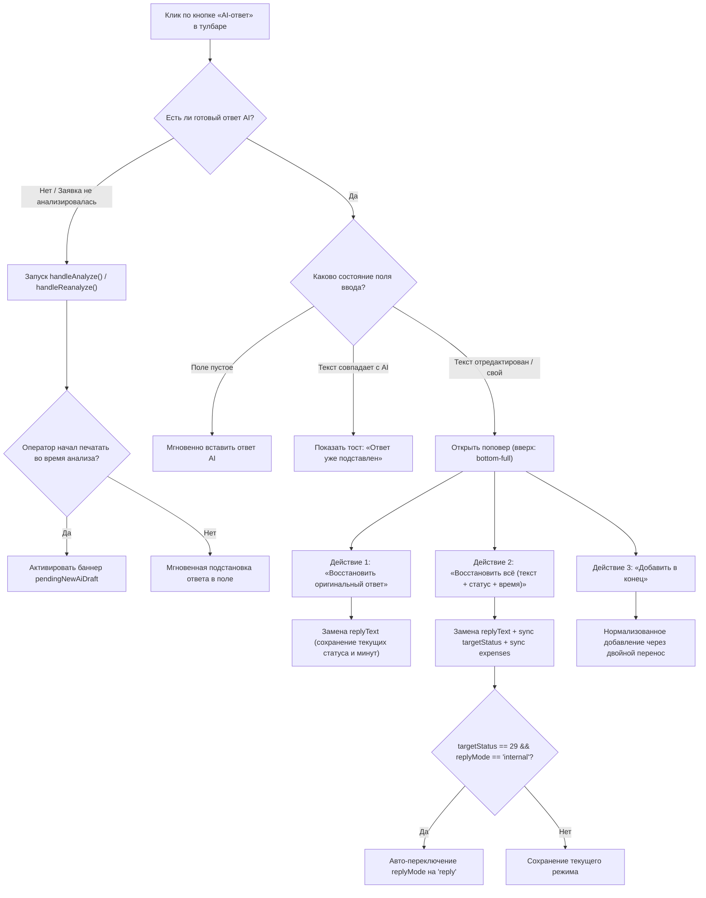

# План реализации: Кнопка вставки ответа нейросети в Инспекторе заявок (IntraLink)

## 1. Обзор задачи

В интерфейсе инспектора заявок ([TicketInspector.tsx](file:///C:/Users/belikov.a/Desktop/Акты,%20документы/Work/!Projects/intralink/intra-web/src/components/TicketInspector.tsx)) оператор 1-й линии Helpdesk имеет возможность просматривать рекомендации сценариев, сгенерированные AI Hub. Однако при ручном редактировании текста, очистке поля ввода или применении шаблонов регламентов отсутствует удобный механизм быстрого возврата или добавления оригинального ответа нейросети в поле комментария.

Данный план описывает внедрение кнопки **«AI-ответ»** с контекстным поповером в тулбар нижней панели действий ([UnifiedActionDock.tsx](file:///C:/Users/belikov.a/Desktop/Акты,%20документы/Work/!Projects/intralink/intra-web/src/components/inspector/UnifiedActionDock.tsx)).

---

## 2. Архитектура и поток данных (State Flow)



---

## 3. UI/UX Спецификация компонентов

### 3.1. Кнопка в тулбаре `UnifiedActionDock`
- **Расположение**: В левой группе элементов верхней строки управления тулбара, сразу справа от выпадающего меню регламентных шаблонов (`templates`).
- **Стилизация**:
  - Базовое состояние: `border-purple-200 bg-purple-50/70 text-purple-700 hover:bg-purple-100 dark:border-purple-900/60 dark:bg-purple-950/40 dark:text-purple-300 dark:hover:bg-purple-900/50`
  - Состояние «Ответ подставлен» (`isAiDraftApplied`): `border-emerald-200 bg-emerald-50 text-emerald-700 dark:border-emerald-800 dark:bg-emerald-950/40 dark:text-emerald-300` с иконкой `IconCheck`.
  - Состояние «Анализ/генерация»: иконка `IconSparkles` с анимацией `animate-spin` и `disabled`.
- **Текст кнопки**: `AI-ответ` с иконкой `IconSparkles` (12px).

### 3.2. Контекстный поповер (Popover Menu)
- **Направление раскрытия**: Строго вверх (`absolute left-0 bottom-full mb-1.5 w-72 z-30`).
- **Поведение**: Закрытие при клике вне компонента (`mousedown`) или нажатии клавиши `Escape`.
- **Пункты меню**:
  1. **«Восстановить оригинальный ответ»**:
     - *Подзаголовок*: «Заменит набранный текст, сохранив текущий статус и трудозатраты».
     - *Иконка*: `IconRefresh` (13px).
  2. **«Восстановить всё (текст, статус, время)»**:
     - *Подзаголовок*: «Синхронизирует статус ([Статус]) и трудозатраты ([N] мин) с рекомендацией».
     - *Иконка*: `IconSparkles` (13px).
  3. **«Добавить в конец текста»**:
     - *Подзаголовок*: «Допишет ответ нейросети после текущего текста».
     - *Иконка*: `IconChevronDown` / `IconPlus` (13px).

---

## 4. Обработка краевых случаев (Edge Cases & Guard Rails)

| № | Краевой случай | Опасность | Реализуемый механизм защиты |
|---|---|---|---|
| **1** | **Конфликт статуса 29 («Выполнена») и скрытого режима** | Если оператор находился во вкладке «Скрытый комментарий», а рекомендация AI закрывает тикет (статус 29), закрытие заблокируется валидатором. | При выборе «Восстановить всё», если `recommendedStatusId === 29` и `replyMode === 'internal'`, автоматически переключать `replyMode` в `'reply'` («Ответ заявителю») и выдавать информационный тост. |
| **2** | **Позиционирование меню внизу экрана** | Поповер, открывающийся стандартно вниз, выйдет за пределы окна браузера или перекроет поле ввода. | Использование класса `bottom-full mb-1.5` для раскрытия строго вверх над кнопкой. |
| **3** | **Гонка состояний при первичном анализе** | Если оператор начал набирать текст, пока крутится фоновый анализ AI Hub, полученный ответ может затереть ручной ввод. | Использование встроенного в хук механизма `pendingNewAiDraft`: если поле перестало быть пустым к моменту завершения анализа, показывать плашку предложения замены вместо принудительной перезаписи. |
| **4** | **Защита от дублирования текста** | Повторный клик «Добавить в конец» приводит к дублированию текста ответа. | Функция `appendAiDraft` проверяет `replyText.includes(originalAiDraft.trim())`. При наличии фрагмента выдаётся тост `«Этот ответ уже содержится в тексте»`. |
| **5** | **Изоляция сессионных черновиков** | При переключении тикетов (#100 -> #101) открытый поповер или черновик предыдущей заявки может отобразиться в новой. | Сброс локального состояния `isAiMenuOpen` в `false` при смене `rawId`. Синхронизация строго с `sessionStorage` по ключу `getDraftKey(rawId, mode)`. |

---

## 5. Пошаговый план реализации

### Этап 1: Доработка хука состояния [useUnifiedDecision.ts](file:///C:/Users/belikov.a/Desktop/Акты,%20документы/Work/!Projects/intralink/intra-web/src/components/inspector/useUnifiedDecision.ts)
- [ ] 1.1. Вычислить мемоизированный `originalAiDraft`:
  ```ts
  const originalAiDraft = useMemo(() => {
    return (
      safeDetails?.decision_envelope?.response?.text ||
      ticket.aiPlan?.comment ||
      ticket.aiSuggestion ||
      ''
    ).trim();
  }, [safeDetails?.decision_envelope?.response?.text, ticket.aiPlan?.comment, ticket.aiSuggestion]);
  ```
- [ ] 1.2. Вычислить рекомендуемый AI-статус `recommendedStatusId` и рекомендуемые трудозатраты `recommendedExpenses`:
  ```ts
  const recommendedStatusId = safeDetails?.decision_envelope?.outcome?.target_status_id ?? ticket.aiPlan?.targetStatusId ?? null;
  const recommendedExpenses = safeDetails?.decision_envelope?.policy?.expenses ?? ticket.aiPlan?.expensesMinutes ?? ticket.expenses ?? 10;
  ```
- [ ] 1.3. Реализовать вычисляемые флаги:
  - `isAiDraftApplied = Boolean(originalAiDraft && replyText.trim() === originalAiDraft);`
  - `isAiDraftEdited = Boolean(originalAiDraft && replyText.trim() && replyText.trim() !== originalAiDraft);`
- [ ] 1.4. Реализовать метод `handleRestoreAiDraft(syncMetadata?: boolean)`:
  - Подстановка `originalAiDraft` через `setReplyText(originalAiDraft)`.
  - При `syncMetadata === true`:
    - Обновление `expenses` до `recommendedExpenses`.
    - Если `recommendedStatusId`: вызов `setSelectedStatusOverride(recommendedStatusId)`.
    - Если `recommendedStatusId === 29 && replyMode === 'internal'`: переключение `setReplyMode('reply')`.
- [ ] 1.5. Реализовать метод `handleAppendAiDraft()` с дедупликацией и красивым разделением `\n\n`.
- [ ] 1.6. Экспортировать новые поля в интерфейс `UseUnifiedDecisionReturn`.

### Этап 2: Доработка компонента тулбара [UnifiedActionDock.tsx](file:///C:/Users/belikov.a/Desktop/Акты,%20документы/Work/!Projects/intralink/intra-web/src/components/inspector/UnifiedActionDock.tsx)
- [ ] 2.1. Добавить новые пропсы в `UnifiedActionDockProps`:
  - `originalAiDraft: string`
  - `isAiDraftApplied: boolean`
  - `isAiDraftEdited: boolean`
  - `onRestoreAiDraft: (syncMetadata?: boolean) => void`
  - `onAppendAiDraft: () => void`
  - `recommendedStatusName?: string`
  - `recommendedExpenses?: number`
- [ ] 2.2. Добавить состояние `isAiMenuOpen` и `aiMenuRef = useRef<HTMLDivElement>(null)`.
- [ ] 2.3. Добавить обработчик закрытия по клику снаружи и по нажатию клавиши `Escape`.
- [ ] 2.4. Встроить кнопку `AI-ответ` в тулбар рядом со списком шаблонов.
- [ ] 2.5. Сверстать поповер с тремя вариантами действий и вспомогательными бейджами.

### Этап 3: Связывание в [TicketInspector.tsx](file:///C:/Users/belikov.a/Desktop/Акты,%20документы/Work/!Projects/intralink/intra-web/src/components/TicketInspector.tsx)
- [ ] 3.1. Передать новые свойства из `decisionState` в `UnifiedActionDock`.

---

## 6. Чеклист верификации и тестирования

1. **Вставка в пустое поле:**
   - Открыть тикет с готовым решением AI, поле ответа пустое.
   - Нажать `AI-ответ`. Текст должен мгновенно появиться в поле, поповер не должен открываться.
2. **Индикация актуальности:**
   - После вставки кнопка должна изменить визуальный стиль (иконка галочки, спокойный зеленый/нейтральный фон).
3. **Редактирование текста и открытие поповера:**
   - Дописать символ в поле. Кнопка возвращается к фиолетовому стилю AI.
   - Кликнуть по кнопке — должен открыться поповер строго над кнопкой.
4. **Проверка действия «Восстановить оригинальный ответ»:**
   - Выбрать данный пункт. Ручные правки заменяются на оригинальный ответ. Текущие трудозатраты и статус остаются неизменными.
5. **Проверка действия «Восстановить всё» и защита статуса 29:**
   - Включить «Скрытый комментарий», изменить минуты на 45.
   - Выбрать «Восстановить всё». Минуты должны сброситься на рекомендованные (например, 10), а если целевой статус 29 — режим должен автоматически стать «Ответ заявителю».
6. **Проверка «Добавить в конец»:**
   - Набрать свой ввод, выбрать «Добавить в конец». Текст должен добавиться через `\n\n`. Повторный выбор должен выдать тост об уже присутствующем фрагменте.
7. **Клавиатурная доступность и клик снаружи:**
   - Нажатие `Escape` закрывает открытый поповер. Клик в любую другую область окна закрывает поповер.
