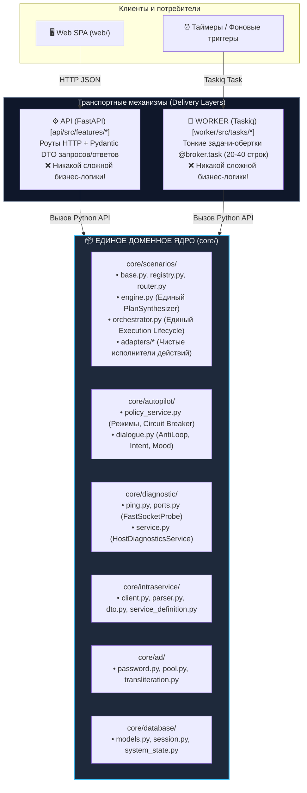
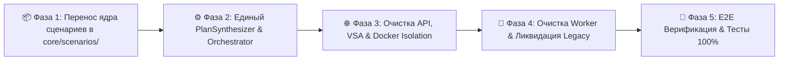

# 🏛️ Архитектурный план оздоровления: Унификация Доменного Ядра и Изоляция Слоев (Architecture Realignment & Core Unification)

> **Статус:** Утверждено к исполнению  
> **Цель:** Ликвидировать архитектурный разрыв между `core`, `api` и `worker`, устранить дублирование логики («Zero Duplicate Logic»), восстановить строгие границы Vertical Slice Architecture (VSA) и обеспечить чистый фундамент для сервисных адаптеров (M4–M7).  
> **Связанные документы:** [`docs/architecture/v2-architecture-blueprint.md`](file:///docs/architecture/v2-architecture-blueprint.md), [`docs/plans/v2-universal-scenario-core-plan.md`](file:///docs/plans/v2-universal-scenario-core-plan.md), [`GEMINI.md`](file:///GEMINI.md)

---

## 🧭 1. Фундаментальный архитектурный водораздел

В системе существует только **один домен** — **`core/`**. 
Слои `api/` и `worker/` являются **механизмами доставки (Delivery Mechanisms)**, не содержащими своей тяжелой бизнес-логики:



### Главные инварианты:
1. **API НИКОГДА не импортирует Worker (`api ➔ worker` СТРОГО ЗАПРЕЩЕН).**
2. **Срезы API НИКОГДА не импортируют друг друга (`features/A ➔ features/B` СТРОГО ЗАПРЕЩЕН).**
3. **Worker НИКОГДА не импортирует API (`worker ➔ api` СТРОГО ЗАПРЕЩЕН).**
4. **Контейнер `intralink_api` монтирует только `core` и `api` (никакого монтирования `worker`!).**
5. **Вся доменная логика (синтез плана, исполнение, сопоставление, валидация) живет СТРОГО в `core/`.**

---

## 🗺️ 2. Этапы выполнения плана (Roadmap)



---

## 📦 Фаза 1: Перенос ядра сценариев и адаптеров в `core/scenarios/`

### Цель:
Ликвидировать захват домена воркером. Сделать сценарии доступными как для API, так и для Worker без межпакетных нарушений.

### Задачи:
1. Создать пакет `core/scenarios/`:
   * Перенести `worker/src/scenarios/base.py` ➔ `core/scenarios/base.py` (`BaseScenario`, `ScenarioExecutionResult`, `PreconditionResult`, `ScenarioMatch`).
   * Перенести `worker/src/scenarios/registry.py` ➔ `core/scenarios/registry.py` (`ScenarioRegistry`, `get_default_scenario_registry`).
   * Перенести `worker/src/scenarios/router.py` ➔ `core/scenarios/router.py` (`ScenarioRouter`).
   * Перенести `worker/src/scenarios/semantic_index.py` ➔ `core/scenarios/semantic_index.py`.
   * Перенести `worker/src/scenarios/catalog_prior.py` ➔ `core/scenarios/catalog_prior.py`.
   * Перенести `worker/src/scenarios/coherence_guard.py` ➔ `core/scenarios/coherence_guard.py`.
2. Создать каталог адаптеров `core/scenarios/adapters/`:
   * Перенести `worker/src/scenarios/install_printer.py` ➔ `core/scenarios/adapters/install_printer.py`.
   * Перенести `worker/src/scenarios/grant_wlan.py` ➔ `core/scenarios/adapters/grant_wlan.py`.
   * Перенести `worker/src/scenarios/service_redirect.py` ➔ `core/scenarios/adapters/service_redirect.py`.
   * Перенести `worker/src/scenarios/offline_host.py` ➔ `core/scenarios/adapters/offline_host.py`.
   * Перенести `worker/src/scenarios/rag_consultation.py` ➔ `core/scenarios/adapters/rag_consultation.py`.
3. Физически удалить `worker/src/scenarios/ad_password_reset.py`.
4. Перенести сервисы диалога в доменное ядро:
   * Объединить `worker/src/services/intent_analyzer.py`, `worker/src/services/anti_loop.py` и `core/autopilot/intent.py` в канонический модуль `core/autopilot/dialogue.py` (чистый домен: `AntiLoopGuard`, `UserReplyIntentAnalyzer`, `detect_tense_tone`).
   * Перенести `worker/src/services/auth.py` ➔ `core/intraservice/auth.py` (`ServiceAuthBootstrap`, `ServiceAuthCredentials`).
5. Удалить пустую свалку `worker/src/services/`.

---

## ⚙️ Фаза 2: Единый `PlanSynthesizer` и `ScenarioLifecycleOrchestrator`

### Цель:
Ликвидировать 120 строк копипасты между API и воркером, централизовать жизненный цикл тикета.

### Задачи:
1. **Реализовать `core/scenarios/engine.py` (`PlanSynthesizer`):**
   * Класс `PlanSynthesizer`:
     ```python
     class PlanSynthesizer:
         async def synthesize_plan(self, task: TaskDTO, auth_b64: Optional[str] = None) -> AgentPlanDTO:
             ...
         async def get_or_synthesize_cached(self, ticket_id: int, redis_client: Redis) -> AgentPlanDTO:
             ...
     ```
   * Инкапсулирует:
     * Извлечение кандидатов хостов через `PC_EXTRACT_REGEX`;
     * Поиск сценария через `ScenarioRegistry` и `ScenarioRouter`;
     * Проверку preconditions (`validate_preconditions`);
     * Получение политики через `AutopilotPolicyService`;
     * Формирование дефолтных комментариев и DTO плана;
     * Кэширование в Redis (`cache:autopilot:plan:{ticket_id}`, TTL 300с).
2. **Реализовать `core/scenarios/orchestrator.py` (`ScenarioLifecycleOrchestrator`):**
   * Класс `ScenarioLifecycleOrchestrator`:
     ```python
     class ScenarioLifecycleOrchestrator:
         async def execute_scenario(
             self,
             ticket_id: int,
             action: str,
             initiator: str,
             override_params: Optional[Dict[str, Any]] = None,
             expected_status_id: Optional[int] = None,
             last_event_id: Optional[int] = None,
         ) -> ScenarioExecutionResult:
             ...
     ```
   * Инкапсулирует:
     * Проверку флага кооперативной отмены (`autopilot:abort:{ticket_id}`);
     * Взятие распределенного замка (`lock:task:{ticket_id}`);
     * Вычитку свежего состояния тикета и OCC-проверку (`expected_status_id`, `terminal status`);
     * Обогащение сущностей тикета параметрами оператора;
     * Вызов `scenario.execute(task, policy)`;
     * Прямой перевод статуса в IntraService API (статус 3 или 6);
     * Публикацию регламентного ответа заявителю;
     * Фиксацию скрытой заметки (`IsPrivateComment: true`) с дуальным аудитом («Одобрил: [Логин], Исполнил: alen_assistant»);
     * Инвалидацию кэша плана в Redis.

---

## 🌐 Фаза 3: Очистка API, VSA и изоляция Docker-контейнеров

### Цель:
Сделать срезы API тонкими транспортными фасадами, устранить межсрезовую связанность и изолировать контейнер API.

### Задачи:
1. **Перенос сетевой диагностики хоста в `core/diagnostic/`:**
   * В `core/diagnostic/service.py` создать `HostDiagnosticsService`:
     * DNS-резолв (`resolve_dns_fast`);
     * Конкурентный пинг (`fast_ping`) и опрос портов (`probe_diagnostic_ports`);
     * Кэширование результатов в Redis (`diag:host:{hostname}`, TTL 600с).
   * В `api/src/features/diagnostics/service.py`: сделать тонкую обертку над `core/diagnostic/service.py`.
   * В `api/src/features/autopilot/service.py`: удалить импорт `from api.src.features.diagnostics.service import DiagnosticsService` и вызывать `core.diagnostic.service.HostDiagnosticsService`. **Связь между срезами ликвидирована!**
2. **Рефакторинг `api/src/features/autopilot/service.py`:**
   * Удалить все импорты `from worker.src...`.
   * Метод `get_agent_plan()` сократить до 10 строк — вызов `PlanSynthesizer.get_or_synthesize_cached()`.
   * Одобрение плана `approve_plan()` перевести на постановку команды `CommandRecord` или прямой вызов `ScenarioLifecycleOrchestrator`.
3. **Рефакторинг `api/src/features/tickets/service.py`:**
   * Удалить импорт `from worker.src.tasks.command_dispatcher import dispatch_command_task`.
   * Постановку задач выполнять через единый фасад команд или `broker.send_task`.
4. **Очистка `deploy/docker-compose.yml`:**
   * Из сервиса `intralink_api` **удалить костыльный маунт**:
     ```yaml
     - ../worker:/workspace/worker # ❌ УДАЛИТЬ!
     ```
   * Теперь контейнер API зависит ТОЛЬКО от `/workspace/core` и `/workspace/api`.

---

## 🔨 Фаза 4: Очистка Worker и удаление рудиментов Legacy

### Цель:
Превратить задачи воркера в тонкие декларативные триггеры (20–40 строк), полностью очистить диспетчер от старых процедурных костылей.

### Задачи:
1. **Рефакторинг `worker/src/tasks/plan_prefetch.py`:**
   * Сократить функцию `prefetch_agent_plan_task` со 125 строк до 15 строк:
     ```python
     @broker.task(task_name="prefetch_agent_plan_task", queue_name=QUEUE_DEFAULT)
     async def prefetch_agent_plan_task(ticket_id: int) -> Dict[str, Any]:
         synthesizer = PlanSynthesizer()
         plan = await synthesizer.synthesize_and_cache(ticket_id)
         return plan.model_dump()
     ```
2. **Рефакторинг `worker/src/tasks/command_dispatcher.py`:**
   * Удалить процедурные хэндлеры `_handle_install_printer`, `_handle_ad_password_reset`, `_handle_ad_account_unlock`.
   * Удалить ложный fallback-откат на устаревшие хэндлеры.
   * Вызов сценария для тикета свести к вызову `ScenarioLifecycleOrchestrator.execute_scenario()`.
3. **Рефакторинг `worker/src/tasks/autopilot.py`:**
   * Устранить дублирование логики переходов статусов и аудита — использовать `ScenarioLifecycleOrchestrator`.
4. **Устранение глобальных тестовых переопределений (`_override_*`):**
   * Заменить разрозненные глобальные переменные на явное внедрение зависимостей (Dependency Injection) через фабрики ядра `core`.
   * Исправить падение 2 тестов в `worker/tests/test_command_dispatcher.py` и `worker/tests/test_plan_prefetch.py`, гарантировав отсутствие неявных коннектов к PostgreSQL при запуске без базы данных.

---

## 🧪 Фаза 5: E2E Верификация и регрессионный контроль

### Критерии готовности (DoD):
1. **Чистота зависимостей:**
   * Поиск `grep -r "from worker" api/` возвращает **0 совпадений**.
   * Поиск межсрезовых импортов `grep -r "from api.src.features\.[^.]*\.service" api/src/features/` возвращает **0 совпадений**.
2. **Docker-контейнеры:**
   * Контейнер `intralink_api` стартует и работает **без** монтирования каталога `worker`.
3. **Тестовое покрытие:**
   * Все unit и integration тесты монорепозитория (`core/tests`, `api/tests`, `worker/tests`) проходят со 100% успехом (`pytest`: 198+ passed, 0 failed).
4. **Фронтенд:**
   * Сборка `cd web && npm run build` завершается без единой ошибки типов TypeScript.
5. **Линтинг:**
   * `ruff check .` завершается без замечаний.

---

## 📋 Итоговая матрица ответственности файлов

| Было (Хаос и раздвоение) | Стало (Каноническая архитектура) | Назначение |
| :--- | :--- | :--- |
| `worker/src/scenarios/base.py` | `core/scenarios/base.py` | Контракты сценариев и DTO результатов |
| `worker/src/scenarios/registry.py` | `core/scenarios/registry.py` | Реестр сервисных сценариев |
| `worker/src/scenarios/router.py` | `core/scenarios/router.py` | Многофакторный роутер (Factor A + E) |
| `worker/src/scenarios/install_printer.py` | `core/scenarios/adapters/install_printer.py` | Адаптер настройки принтера |
| `worker/src/scenarios/ad_password_reset.py` | ❌ **УДАЛЕНО НАВСЕГДА** | Исключено по Zero-Plaintext Policy |
| Копипаста в `plan_prefetch.py` и `api/.../service.py` | `core/scenarios/engine.py` | Единый `PlanSynthesizer` (0 строк дублирования) |
| Копипаста в `command_dispatcher.py` и `autopilot.py` | `core/scenarios/orchestrator.py` | Единый `ScenarioLifecycleOrchestrator` |
| `worker/src/services/intent_analyzer.py` | `core/autopilot/dialogue.py` | Анализ реплик заявителя и защита от зацикливания |
| `worker/src/services/auth.py` | `core/intraservice/auth.py` | Авторизация сервисного бота в IntraService |
| `api/.../diagnostics/service.py` (импортируемый в autopilot) | `core/diagnostic/service.py` | Сетевая диагностика хоста с кэшем Redis |
| `deploy/docker-compose.yml` (`- ../worker:...`) | ❌ **УДАЛЕН МАУНТ ИЗ API** | Полная сервисная изоляция |
