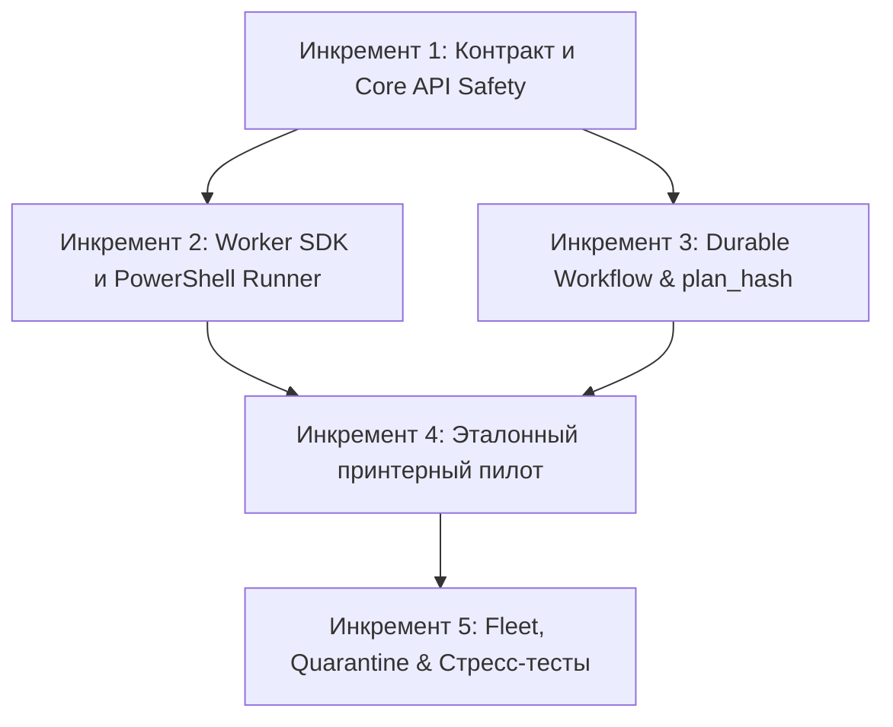

# 🧭 Worker Platform: Декомпозиция и дорожная карта реализации

Статус: активный  
Дата создания: 2026-09-07  
Базовый план: [`../worker-platform-evolution.md`](../worker-platform-evolution.md)  
Архитектурный контракт: [`../../adr/0002-modular-worker-platform.md`](../../adr/0002-modular-worker-platform.md)

---

## 1. Архитектурные инварианты монорепозитория

1. **PostgreSQL — SSOT:** Единственный источник истины для команд, approvals, attempts, evidence и результатов.
2. **Redis Streams — транспорт:** Доставка at-least-once, без хранения долгоживущего мастер-состояния.
3. **Execution Evidence:** Статус заявки не финализируется без проверяемого подтверждения фактического выполнения.
4. **Запрет автоповтора mutating-действий:** Неизвестный исход изменяющей команды всегда переходит в `needs_review`.
5. **Fail-Closed & Read-Only Preflight:** До подтверждения оператора разрешены только валидация и read-only диагностика. Любые изменения (включая WinRM bootstrap) выполняются строго после approval.
6. **Immutable Approval (`plan_hash`):** Подтверждение оператора связано с версией команды, preflight evidence, сроком годности и неизменяемым `plan_hash`.
7. **Best-Effort Cooperative Cancellation:** Потеря lease или lock закрывает вход в следующую фазу и останавливает локальный runner.
8. **Безопасность транспорта PowerShell:** Исключена строковая интерполяция на обеих границах (локальный runner + `-ArgumentList` в WinRM).
9. **Защита от PEL-голодания:** Маршрутизация по пулам воркеров; ошибочная доставка обрабатывается через durable routing quarantine в Core API.

---

## 2. Матрица декомпозиции на инкременты

| Инкремент | Файл плана | Фокус реализации | Ключевые компоненты | Статус |
|---|---|---|---|---|
| **Инкремент 1** | [`01-contract-and-core-safety.md`](01-contract-and-core-safety.md) | Контракт и Core API Safety | ADR 0002, `command_outbox.py`, `policy.py`, `/heartbeat` | ✅ Завершен |
| **Инкремент 2** | [`02-worker-sdk-and-runner.md`](02-worker-sdk-and-runner.md) | Worker SDK и доверенный PowerShell Runner | `ActionHandler` (7 фаз), runner stdin/tempfile, `LeaseRenewer` | ✅ Завершен |
| **Инкремент 3** | [`03-durable-workflow-and-plan-hash.md`](03-durable-workflow-and-plan-hash.md) | Durable Workflow & Approval с `plan_hash` | preflight evidence, `plan_hash`, `CommandApproval`, phase transitions | ✅ Завершен |
| **Инкремент 4** | [`04-printer-pilot-and-staging.md`](04-printer-pilot-and-staging.md) | Эталонный `InstallPrinterHandler` (Пилот) | CIM/WMI Spooler, SMB Staging, SHA-256, WMI bootstrap, cleanup | ✅ Завершен |
| **Инкремент 5** | [`05-fleet-routing-and-resilience.md`](05-fleet-routing-and-resilience.md) | Worker Fleet, Routing Quarantine & Тесты | Fleet registry, routing quarantine, fault injection tests | ✅ Завершен |

---

## 3. Граф зависимостей инкрементов

---

## 4. Контрольные точки приемки (Quality Gates)

- **Gate A (Безопасность):** Отсутствие интерполяции в PowerShell, передача JSON через stdin/-ArgumentList, запрет автоповтора mutating-команд, fail-closed при потере lock/lease.
- **Gate B (Контракт):** Все handler-ы проходят contract test suite с 7 фазами, `plan_hash` и evidence сохраняются в PostgreSQL.
- **Gate C (Надежность):** Тесты потери связи, истечения lease, дрейфа конфигурации WinRM и routing quarantine пройдены успешно.
- **Gate D (Пилот):** Контролируемый E2E принтера на тестовом хосте с проверкой SMB staging, точного `verify` и зачистки WinRM.
