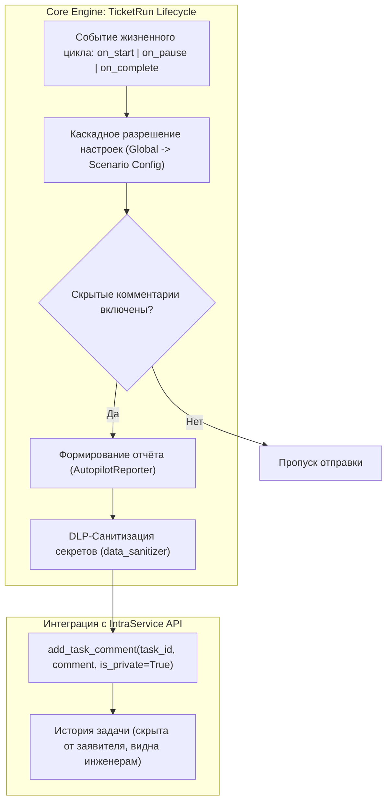
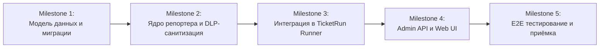

# 🗺️ План реализации: Скрытые служебные комментарии автопилота в IntraService

**Статус:** ✅ Реализован и принят (100% выполнения, 26/26 тестов PASSED)  
**Связанный RFC:** [`autopilot-internal-comments-rfc.md`](file:///C:/Users/belikov.a/.gemini/antigravity-cli/brain/85234743-c523-4633-8926-fbce3d460cad/autopilot-internal-comments-rfc.md)  
**Микропланы:**
- [Milestone 1: Модель данных, схема и миграции](file:///C:/Users/belikov.a/Desktop/Акты,%20документы/Work/!Projects/intralink/docs/plans/autopilot-internal-comments-m1.md)
- [Milestone 2: Ядро генерации отчётов и DLP-санитизация](file:///C:/Users/belikov.a/Desktop/Акты,%20документы/Work/!Projects/intralink/docs/plans/autopilot-internal-comments-m2.md)
- [Milestone 3: Интеграция в сценарный оркестратор](file:///C:/Users/belikov.a/Desktop/Акты,%20документы/Work/!Projects/intralink/docs/plans/autopilot-internal-comments-m3.md)
- [Milestone 4: API управления и интерфейс администратора](file:///C:/Users/belikov.a/Desktop/Акты,%20документы/Work/!Projects/intralink/docs/plans/autopilot-internal-comments-m4.md)
- [Milestone 5: E2E тестирование и приёмка](file:///C:/Users/belikov.a/Desktop/Акты,%20документы/Work/!Projects/intralink/docs/plans/autopilot-internal-comments-m5.md)
**Область:** `core-api`, `intra-web`, `shared/domain`  

---

## 1. Обзор задачи и цели

В рамках перевода автопилота на этап промышленной эксплуатации требуется обеспечить **прозрачность работы автономного контура для дежурных инженеров первой линии** непосредственно внутри заявки IntraService, не нарушая при этом пользовательский опыт заявителя.

### Ключевые требования:
1. **Скрытость:** Использование поля `IsPrivateComment = true` в IntraService API — комментарии доступны только инженерам и не видны заявителям.
2. **Точечные триггеры:** Отправка строго на ключевых этапах (`on_start`, `on_pause_or_error`, `on_complete`) без замусоривания истории заявки.
3. **Уровни глубины:**
   - **Прикладной (`applied`):** 1–2 понятных предложения на русском языке для оперативного понимания ситуации дежурной сменой.
   - **Технический (`technical`):** Полный структурированный JSON-дамп контекста (`FactBag`, `Evidence`, `ExecutionProof`) для глубокого аудита.
4. **Безопасность (DLP):** Автоматическая маскировка паролей и токенов (`***REDACTED***`).
5. **Двухуровневое управление:** Глобальные настройки в админ-панели с возможностью точечного переопределения для конкретных сценариев.
6. **Отказоустойчивость:** Сбой отправки скрытого комментария не должен прерывать выполнение самого инфраструктурного сценария.

---

## 2. Архитектура и поток данных



---

## 3. Деление на Milestones (Этапы реализации)



---

### 🏛️ Milestone 1: Модель данных, схема и миграции
**Цель:** Заложить основу хранения настроек на глобальном уровне и на уровне отдельных сценариев.

* **1.1. Расширение таблицы `autopilot_global_settings`:**
  * Добавление полей:
    * `internal_comments_enabled: bool` (default: `True`, nullable: `False`);
    * `internal_comments_depth: str` (default: `"applied"`, values: `'applied' | 'technical'`, nullable: `False`).
* **1.2. Alembic миграция (`core-api/migrations`):**
  * Создание миграции добавления колонок с дефолтными значениями без простоя (Zero-Downtime).
* **1.3. Pydantic-схемы валидации (`shared/domain` и `core-api/app/schemas`):**
  * Обновление `GlobalAutopilotSettingSchema` (чтение/запись).
  * Обновление схемы `ScenarioConfig` для поддержки опциональных ключей переопределения:
    ```json
    {
      "internal_comments_enabled": true,
      "internal_comments_depth": "technical"
    }
    ```
* **1.4. Модульные тесты миграции и моделей.**

---

### 🛡️ Milestone 2: Ядро генерации отчётов и DLP-санитизация
**Цель:** Создать изолированный, протестированный сервис формирования служебных комментариев с гарантией маскировки секретов.

* **2.1. Сервис `AutopilotReporter` ([`core-api/app/services/autopilot_reporter.py`](file:///C:/Users/belikov.a/Desktop/Акты,%20документы/Work/!Projects/intralink/core-api/app/services/autopilot_reporter.py)):**
  * Методы формирования текстов:
    * `format_start_comment(run, scenario, depth) -> str`
    * `format_pause_comment(run, reason, missing_facts, depth) -> str`
    * `format_complete_comment(run, proof, outcome, depth) -> str`
* **2.2. Реализация уровня «Прикладной» (`applied`):**
  * Лаконичные шаблоны на русском языке с префиксом `[IntraLink Autopilot: Статус]`.
* **2.3. Реализация уровня «Технический» (`technical`):**
  * Форматирование структурированного дампа в блоке ````json ... ````:
    `run_id`, `task_id`, `scenario_key`, `confidence`, `target_host`, `facts`, `execution_proof`.
* **2.4. Модуль санитизации данных (`DLP Sanitizer`):**
  * Расширение существующего `data_sanitizer` для глубокой рекурсивной очистки JSON-словарей:
    маскирование паролей, токенов, ключей авторизации строкой `"***REDACTED***"`.
* **2.5. Набор изолированных unit-тестов:**
  * Тесты на генерацию обоих уровней, корректность JSON и 100% маскировку тестовых паролей (`Password123`, `temp_pass`).

---

### ⚙️ Milestone 3: Интеграция в сценарный оркестратор и Runner
**Цель:** Подключить отправку комментариев к реальным точкам жизненного цикла выполнения заявки.

* **3.1. Функция каскадного разрешения конфигурации:**
  * Логика объединения: если в сценарии задан оверрайд — использовать его, иначе брать глобальный дефолт.
* **3.2. Хуки в [`TicketRunRunner`](file:///C:/Users/belikov.a/Desktop/Акты,%20документы/Work/!Projects/intralink/core-api/app/services/ticket_run_runner.py) и [`TicketRunOrchestrator`](file:///C:/Users/belikov.a/Desktop/Акты,%20документы/Work/!Projects/intralink/core-api/app/services/scenario_orchestrator.py):**
  * **Точка 1 (`on_start`):** вызов при создании/запуске цикла в режиме автопилота.
  * **Точка 2 (`on_pause_or_error`):** вызов при переходе в `paused`, нехватке фактов (статус 35) или сбое воркера.
  * **Точка 3 (`on_complete`):** вызов при успешной верификации и закрытии тикета (статус 29/30).
* **3.3. Безопасная отправка через IntraService API:**
  * Вызов `add_task_comment(..., is_private=True)`.
  * Оборачивание в `try/except`: логирование предупреждения при сбое сети IntraService без падения основного цикла выполнения (`Fault Tolerance`).
* **3.4. Идемпотентность и защита от повторной отправки:**
  * Проверка `TicketRunEvent` — исключение дублирования стартовых или завершающих комментариев при перезапусках воркера.

---

### 🖥️ Milestone 4: API управления и интерфейс администратора (Web UI)
**Цель:** Предоставить администраторам и инженерам удобный веб-интерфейс включения и настройки глубины отчётов.

* **4.1. Доработка эндпоинтов Core API:**
  * Обновление `GET/PUT /api/v1/ticket-runs/settings`: поддержка полей `internal_comments_enabled`, `internal_comments_depth`.
  * Обновление роутера сохранения сценариев `PUT /api/v1/ticket-runs/scenarios/{service_id}` с поддержкой ключей переопределения в `config_json`.
* **4.2. Frontend: Глобальные настройки в Admin Web UI:**
  * Секция «Скрытые служебные комментарии»:
    * Тумблер `[ Включено / Выключено ]`
    * Селектор `Глубина отчёта`: `Прикладной (1-2 предложения)` / `Технический (JSON-дамп)`.
* **4.3. Frontend: Настройки конкретного сценария:**
  * В модальном окне редактирования сценария: переключатель «Использовать глобальные настройки» / «Индивидуальная настройка для этого сценария».
* **4.4. Добавление Toast-уведомлений и валидации формы.**

---

### 🧪 Milestone 5: Комплексное тестирование, канареечная верификация и приёмка
**Цель:** Убедиться в корректности сквозной работы на живых сценариях и актуализировать документацию.

* **5.1. Интеграционные тесты (E2E):**
  * Сквозной тест сценария `install_printer` от `on_start` до `on_complete` с проверкой отправленных в mock IntraService скрытых комментариев.
  * Тест аварийного сценария: имитация недоступности ПК / сбоя воркера ➔ проверка комментария `on_pause_or_error`.
  * Тест санитизации в сквозном сценарии `create_user` (пароль учетной записи скрыт).
* **5.2. Проверка работы в Shadow и Canary режимах:**
  * В режиме `shadow` скрытые комментарии в IntraService **не отправляются** (только внутренние логи).
  * В режиме `canary` скрытые комментарии отправляются только для выбранного процента задач.
* **5.3. Актуализация документации:**
  * Обновление [`docs/web-autopilot/operations.md`](file:///C:/Users/belikov.a/Desktop/Акты,%20документы/Work/!Projects/intralink/docs/web-autopilot/operations.md) и руководства инженера.

---

## 4. Чеклист критериев приёмки (Definition of Done)

- [x] Все 5 майлстоунов реализованы и покрыты тестами (26/26 тестов PASSED).
- [x] Ни при каких обстоятельствах пароли и токены не попадают в открытом виде в IntraService (Zero Trust DLP Sanitizer).
- [x] Ошибки отправки комментария в IntraService не блокируют выполнение инфраструктурных команд (Fault Tolerance).
- [x] В админ-панели работает переключение режимов как глобально, так и для отдельных сценариев (Admin Web UI).
- [x] Все новые тесты проходят без регрессий на PostgreSQL 16 (intraservice_test).

