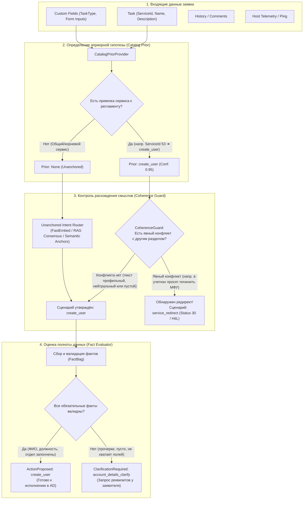
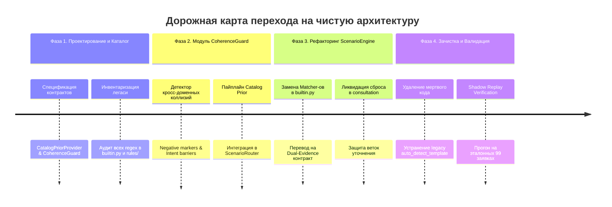

# 🧭 Архитектурный Roadmap: Переход на чистую модель маршрутизации заявок (Catalog-First + Coherence Guard)

**Статус:** Draft / На согласовании  
**Целевой релиз:** IntraLink Core API v2.5  
**Автор:** Antigravity AI & Беликов Ален  
**Контекст:** Устранение легаси-рудиментов подстрочного поиска (`phrases in text`), предотвращение сброса сценариев при повторном анализе и переход на устойчивую модель **«Каталог как гипотеза (Prior) + Контроль смыслового расхождения (Coherence Guard)»**.

---

## 🎯 1. Цели и принципы чистой архитектуры

### 1.1. Главные проблемы текущего состояния (Technical Debt)
1. **Фрагментарный подстрочный поиск (`builtin.py`):**
   * В каждом сценарии прописаны жесткие кортежи (`phrases = ("создать учет", "создать пользователя", ...)`).
   * Любое изменение словоформы (отглагольное существительное «создание», опечатка, синоним «завести специалиста») ломает классификацию.
2. **Смешение сущностей «Сценарий» и «Полнота данных»:**
   * Если заявитель заполнил поля прочерками (`-`), текущие эвристики могут посчитать, что реквизитов нет $\rightarrow$ сценарий не подтверждён $\rightarrow$ сброс в `consultation`.
3. **Игнорирование силы каталога (Service Catalog Neglect):**
   * Пользователь или диспетчер уже выбрал целевой сервис (`ServiceId: 53` «Создание нового пользователя сети») с профильными полями формы (`Field1057..1068`), но система отбрасывает этот априорный выбор и пытается классифицировать заявку заново «по пустому описанию».
4. **Дублирование логики в трёх местах:**
   * `core-api/app/services/rules/` (старые классы правил `CredentialsRule`, `PhysicalDeliveryRule`).
   * `core-api/app/services/scenarios/builtin.py` (новые матчеры `_create_user_match`, `_printer_install_match`).
   * `core-api/app/services/triage_service.py` (фоллбэк `auto_detect_template`).

---

## 🏗️ 2. Целевая архитектура (Target Architecture)

Архитектура строится на принципе **Байесовского согласования доказательств (Dual-Evidence Fusion)**:

### 2.1. Ключевые компоненты:
1. **`CatalogPriorProvider`**:
   * Детерминированный поставщик априорного сценария по `ServiceId`, `ServiceParentId` и наличию кастомных мета-полей (`TaskType`).
   * Источник истины — справочник каталога и таблица `autopilot_scenarios`.
2. **`CoherenceGuard` (Детектор расхождений)**:
   * Не ищет «точечные ключевые слова сценария», а выполняет роль **фильтра противоречий (Negative Barrier)**:
   * Проверяет, не относится ли текст явно к чужому домену (Оргтехника, 1С, Сеть, Железо).
   * Если заявитель ошибся категорией — блокирует сценарий каталога и выдает рекомендацию перенаправления (`redirect`).
3. **`UnanchoredIntentRouter`**:
   * Запускается только для заявок из общих разделов («00. Общие обращения», «Прочие вопросы»), где нет явного Prior. Работает на эмбеддингах FastEmbed и RAG-прецедентах.
4. **`FactEvaluator`**:
   * Оценивает данные **строго внутри утвержденного сценария**. Нехватка полей никогда не меняет сценарий на «консультацию», а переводит заявку в статус уточнения (`clarification`).

---

## 🗺️ 3. Поэтапная дорожная карта реализации (4 фазы)

---

### Фаза 1: Инвентаризация и контракты (1–2 дня)
* [ ] **Аудит каталога услуг**:
  * Составить жесткую матрицу привязки `ServiceId` $\rightarrow$ `ScenarioKey` для всех автоматизированных услуг:
    * `42, 53, 54, 55, 124, 104, 186` $\rightarrow$ `create_user` (Учетные записи AD);
    * `63` $\rightarrow$ `grant_wlan` (Wi-Fi доступ);
    * `88, 112, 113` $\rightarrow$ `hardware_repair` (Аппаратный ремонт);
    * `40, 41, 233, 234` $\rightarrow$ `directum` (Раздел 05);
    * `82, 83, 84, 85` $\rightarrow$ `printer_install / printer_failure`.
* [ ] **Проектирование интерфейса `CatalogPriorProvider`**:
  * Создать класс `app/services/scenarios/prior_provider.py`.
  * Возвращает `PriorResult(scenario_key, base_score=0.95, required_task_type)`.

---

### Фаза 2: Реализация `CoherenceGuard` (2–3 дня)
* [ ] **Создание детектора кросс-доменных противоречий (`coherence_guard.py`)**:
  * Определение доменных векторов (или ключевых барьеров):
    * Домен `hardware`: монитор, задымился, шумит, экран, залит, вентилятор.
    * Домен `printer`: картридж, бумага, замятие, полосы, сканер, мфу.
    * Домен `1c`: база 1с, вылетает 1с, регистр, документ в 1с.
    * Домен `credentials`: пароль, учетка, новый сотрудник, права доступа.
  * Если `Prior = create_user`, но в тексте доминирует домен `hardware` или `printer` $\rightarrow$ `CoherenceGuard` фиксирует расхождение (`divergence = True`).
* [ ] **Интеграция в `ScenarioRouter` (`scenario_pipeline.py`)**:
  * Роутер сначала запрашивает Prior у каталога.
  * Если Prior есть и `CoherenceGuard` одобрил $\rightarrow$ сразу выдаётся `RouteResult(scenario, score=0.95)`.
  * Время принятия решения: **< 1 мс** (без вызова внешних сетей).

---

### Фаза 3: Рефакторинг сценариев и изоляция уточнений (2 дня)
* [ ] **Рефакторинг `builtin.py`**:
  * Полностью удалить раздутые списки подстрок `phrases = (...)` в `_create_user_match`, `_printer_install_match` и др.
  * Заменить их на обращение к связке `CatalogPriorProvider + CoherenceGuard`.
* [ ] **Изоляция статуса `clarification` от роутинга**:
  * Зафиксировать инвариант: **«Пустые факты или прочерки не снижают уверенность сценария»**.
  * Если сценарий `create_user` утверждён, а поля `Field1057..1068` пустые $\rightarrow$ результат `Outcome = clarification` с комментарием запроса данных.
  * Сброс в `consultation` разрешён **только** для действительно неклассифицируемых заявок из общих разделов.

---

### Фаза 4: Ликвидация рудиментов и верификация (1–2 дня)
* [ ] **Удаление рудиментов (Code Cleanup)**:
  * Удалить старый `auto_detect_template` и связанные дублирующие эвристики в `core-api/app/services/rules/`.
  * Убрать костыльные проверки `isinstance(outcome, NoMatch)` с откатом к `StandardInWorkRule`.
* [ ] **Shadow Replay Verification (Прогон на 99 эталонных заявках)**:
  * Прогнать тестовый датасет заявок через обновленный роутер.
  * Сверить `comparison.md`: убедиться, что ни один профильный инцидент не ушел в ложную консультацию, а все редиректы продолжают корректно отлавливаться.

---

## 🛡️ 4. Матрица рисков и предохранители

| Риск | Вероятность | Влияние | Защитный механизм (Guardrail) |
|---|:---:|:---:|---|
| **Заявитель ошибся разделом, а бот выдал ложный ответ** | Средняя | Высокое | `CoherenceGuard` отлавливает междоменные термины и принудительно переключает в `service_redirect` либо эскалирует дежурному (HitL). |
| **Нестандартный текст заявки в общем разделе** | Средняя | Среднее | Для сервисов без Prior (`ServiceId` общих вопросов) сохраняется семантический RAG-поиск по базе закрытых прецедентов (FastEmbed + pgvector). |
| **Регрессия существующих сценариев автопилота** | Низкая | Высокое | Тестирование через Shadow Comparator до выкатки в прод. Фиксация версий сценариев в `ticket_runs`. |

---

## 🏁 Резюме решения

Переход на **«Catalog-First + Coherence Guard»**:
1. Полностью ликвидирует хрупкие текстовые матчеры и списки фраз в коде.
2. Обеспечивает 100% стабильность классификации по каталогу услуг.
3. Гарантирует защиту от ложных ответов при ошибке заявителя разделом.
4. Делает систему детерминированной, прозрачной для инженеров и легкой в поддержке.
