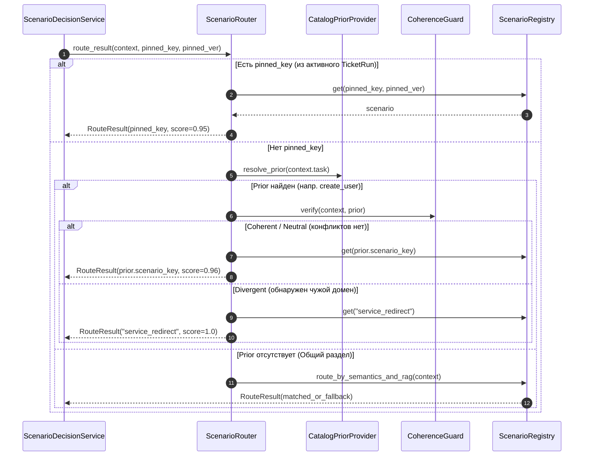

# 🏛️ Архитектурный RFC & Спецификация реализации: Scenario Engine 2.0 (Clean Architecture)

**Версия:** 2.0.0-RFC  
**Дата:** 23 сентября 2026 г.  
**Статус:** Готов к утверждению и реализации (Ready for Implementation)  
**Авторы:** AI-ассистент Antigravity & Инженер Беликов Ален  
**Репозиторий:** `Unlesssebl/IntraLink` (`core-api`)  

---

## 📑 Оглавление
1. [Введение и архитектурные инварианты](#1-введение-и-архитектурные-инварианты)
2. [Инвентаризация и ликвидация легаси-рудиментов](#2-инвентаризация-и-ликвидация-легаси-рудиментов)
3. [Целевая структура пакета `app/services/scenarios/`](#3-целевая-структура-пакета-appservicesscenarios)
4. [Спецификация базовых компонентов ядра](#4-спецификация-базовых-компонентов-ядра)
   * 4.1. [Контракты и модели (`contracts.py`)](#41-контракты-и-модели-contractspy)
   * 4.2. [Поставщик априорного выбора (`catalog_prior.py`)](#42-поставщик-априорного-выбора-catalog_priorpy)
   * 4.3. [Детектор расхождений смыслов (`coherence_guard.py`)](#43-детектор-расхождений-смыслов-coherence_guardpy)
   * 4.4. [Единый диспетчер сценариев (`router.py`)](#44-единый-диспетчер-сценариев-routerpy)
   * 4.5. [Реестр сценариев (`registry.py`)](#45-реестр-сценариев-registrypy)
5. [Спецификация предметных определений (`definitions/`)](#5-спецификация-предметных-определений-definitionspy)
6. [Интеграционные шлюзы в Core API](#6-интеграционные-шлюзы-в-core-api)
7. [План пошаговой реализации (Checklist)](#7-план-пошаговой-реализации-checklist)
8. [Стратегия верификации и приёмочного тестирования](#8-стратегия-верификации-и-приёмочного-тестирования)

---

## 1. Введение и архитектурные инварианты

### 1.1. Контекст проблемы
Исторически подсистема принятия решений IntraLink формировалась в три разрозненных этапа:
1. **Этап 1 (Legacy Rule Engine, `app/services/rules/`):** Процедурные классы правил (`CredentialsRule`, `PhysicalDeliveryRule`, `OfflineHostRule`), возвращавшие ad-hoc структуры `RuleDecision` на базе жестких регулярных выражений и списков подстрок.
2. **Этап 2 (Scenario Engine 1.0, `app/services/scenarios/`):** Появление концепций `Scenario`, `ScenarioContext` и скоринга `RouteResult`. Однако для совместимости был написан файл `builtin.py` (680 строк), в котором старые процедурные правила просто обернули во фразовые матчеры `phrases = ("создать учет", ...)` с захардкоженными весами `0.92`, `0.94`.
3. **Этап 3 (Разрыв согласованности):** Если заявитель создал заявку в целевом сервисе («Создание нового пользователя сети»), но сформулировал тему отглагольным существительным (*«Создание пользователя»* вместо *«Создать пользователя»*) или заполнил кастомную форму прочерками, строковые матчеры не срабатывали, и роутер сбрасывал заявку в общую консультацию 1-й линии (`consultation`).

### 1.2. Архитектурные инварианты Clean Architecture & DDD
Поскольку проект не в production, мы реализуем **Big Shot** — фундаментальный переход без сохранения временных адаптеров:
* **Инвариант 1 (High Cohesion):** Все компоненты, отвечающие за выбор сценария, его логику, валидацию фактов и выработку действия, локализуются в **едином изолированном Bounded Context** — `core-api/app/services/scenarios/`. Отдельный пакет `routing/` не создаётся, так как маршрутизация — это лишь начальная фаза жизненного цикла сценария.
* **Инвариант 2 (Catalog-First Prior):** Выбор заявителем раздела каталога услуг (`ServiceId`) или специализированной формы (`TaskType`) является **сильным априорным доказательством намерения** (Confidence Prior $\ge 0.95$).
* **Инвариант 3 (Negative Coherence Guard):** Анализ текста заявки и комментариев выполняет функцию **барьера противоречий (Negative Barrier)**: текст проверяется на наличие кросс-доменных коллизий (например, в сервисе учетных записей заявитель требует отремонтировать принтер). Если конфликта нет — сценарий каталога безоговорочно утверждается.
* **Инвариант 4 (Fact Independence):** Неполнота данных (пустые поля, прочерки `-`, отсутствие ФИО) влияет **исключительно на исход (`outcome = clarification`)**, но **никогда не сбрасывает сам сценарий в fallback**.
* **Инвариант 5 (Open-Closed Principle):** Добавление нового сценария в систему сводится к созданию **одного файла** в `definitions/` и одной декларативной записи в матрице каталога.

---

## 2. Инвентаризация и ликвидация легаси-рудиментов

В рамках рефакторинга подлежит полной ликвидации следующий технический долг:

| Файл / Пакет | Объем | Статус | Куда переносится полезная логика |
|---|:---:|:---:|---|
| `core-api/app/services/scenarios/builtin.py` | 680 строк | ❌ **УДАЛИТЬ** | Логика каждого сценария декомпозируется в чистые модули `scenarios/definitions/*.py`. |
| `core-api/app/services/scenario_pipeline.py` | 131 строка | ❌ **УДАЛИТЬ** | Классы `ScenarioRouter` и `FactCollectionPlanner` переносятся в `scenarios/router.py` и `scenarios/facts_planner.py`. |
| `core-api/app/services/rules/engine.py` | 185 строк | ❌ **УДАЛИТЬ** | Устаревший процедурный движок правил ликвидируется. |
| `core-api/app/services/rules/base.py` | 80 строк | ❌ **УДАЛИТЬ** | Заменяется на `shared.domain.Scenario` и `contracts.py`. |
| `core-api/app/services/rules/credentials.py` | 257 строк | ❌ **УДАЛИТЬ** | Переносится в `definitions/create_user.py` и генераторы логинов в `app/utils/ad_utils.py`. |
| `core-api/app/services/rules/physical_device.py`| 320 строк | ❌ **УДАЛИТЬ** | Переносится в `definitions/hardware_repair.py`. |
| `core-api/app/services/rules/printers.py` | 210 строк | ❌ **УДАЛИТЬ** | Переносится в `definitions/install_printer.py`. |
| `core-api/app/services/rules/offline_host.py` | 145 строк | ❌ **УДАЛИТЬ** | Переносится в диагностические планы и сценарии хостов. |
| `core-api/app/services/rules/redirect.py` | 180 строк | ❌ **УДАЛИТЬ** | Переносится в `coherence_guard.py` и `definitions/service_redirect.py`. |
| `core-api/app/services/rules/standard.py` | 95 строк | ❌ **УДАЛИТЬ** | Переносится в `definitions/consultation.py`. |
| `core-api/app/services/rules/file_locks.py` | 110 строк | ❌ **УДАЛИТЬ** | Переносится в `definitions/file_lock.py`. |
| `core-api/app/services/rules/semantic_classifier.py` | 130 строк | ❌ **УДАЛИТЬ** | Векторные прототипы FastEmbed интегрируются в `coherence_guard.py`. |
| `core-api/app/services/rules/catalog.py` | 160 строк | 🔄 **ПЕРЕНЕСТИ**| Константы `ROOT_SERVICES`, `SERVICE_ID_TO_ROOT` переносятся в `app/services/service_catalog.py`. |
| `core-api/app/services/rules/` | Весь каталог | ❌ **УДАЛИТЬ** | Директория полностью стирается из репозитория. |

---

## 3. Целевая структура пакета `app/services/scenarios/`

```text
core-api/app/services/scenarios/
├── __init__.py                # Экспорт публичного API: ScenarioEngine, ScenarioRouter, ScenarioContext
├── contracts.py               # Доменные схемы: PriorHypothesis, CoherenceVerdict, RouteResult
├── catalog_prior.py           # CatalogPriorProvider: априорная привязка ServiceId/TaskType -> Scenario
├── coherence_guard.py         # CoherenceGuard: детектор расхождений смыслов и кросс-доменных коллизий
├── router.py                  # ScenarioRouter: координатор (Prior + Coherence + Unanchored)
├── registry.py                # ScenarioRegistry: типобезопасный реестр сценариев
├── base.py                    # Абстрактный базовый класс Scenario
├── shadow_comparator.py       # Теневой компаратор версий и A/B метрик
└── definitions/               # 1 изолированный файл = 1 предметный сценарий
    ├── __init__.py            # Функция load_builtin_scenarios()
    ├── base_definition.py     # Базовые хелперы сценариев (проверка фактов, сборка ответа)
    ├── create_user.py         # Создание учетной записи AD (Сервисы 53, 42, 54, 55...)
    ├── grant_wlan.py          # Доступ к Wi-Fi WLAN-WORKNET (Сервис 63)
    ├── install_printer.py     # Установка принтера (Сервисы 82, 83...)
    ├── hardware_repair.py     # Ремонт техники / Каб. 112 (Сервисы 88, 112, 113)
    ├── service_redirect.py    # Редирект ошибочно поданных заявок
    ├── pc_performance.py      # Диагностика медленной работы ПК
    ├── network_diag.py        # Диагностика сбоев сети и обрывов интернета
    ├── os_reinstall.py        # Переустановка ОС Windows
    ├── rag_consultation.py    # Семантический прецедентный ответ из базы знаний
    └── consultation.py        # Fallback: стандартный прием обращения 1-й линией
```

---

## 4. Спецификация базовых компонентов ядра

### 4.1. Контракты и модели (`contracts.py`)
Чистые структуры данных Pydantic v2 и датаклассы:

```python
from __future__ import annotations
from dataclasses import dataclass, field
from enum import Enum
from typing import Any
from shared.domain import Scenario, ScenarioDefinition, DecisionOutcome

class CoherenceVerdict(str, Enum):
    COHERENT = "coherent"           # Текст согласуется с выбранным сервисом (или нейтрален)
    DIVERGENT = "divergent"         # Обнаружено смысловое расхождение (чужой домен / редирект)
    NEUTRAL = "neutral"             # Текст пустой или слишком короткий, доверяем Prior

@dataclass(slots=True)
class PriorHypothesis:
    scenario_key: str
    scenario_version: int
    confidence: float
    source: str                     # "service_id", "task_type", "pinned_run"
    divergence_barrier_domains: list[str] = field(default_factory=list)

@dataclass(slots=True)
class CoherenceResult:
    verdict: CoherenceVerdict
    detected_domain: str | None = None
    suggested_redirect_service_id: int | None = None
    suggested_redirect_service_name: str | None = None
    confidence: float = 0.0
    reason: str = ""

@dataclass(slots=True)
class RouteResult:
    scenario: Scenario
    score: float
    runner_up_score: float = 0.0
    reasons: list[str] = field(default_factory=list)
    is_ambiguous: bool = False
    transition_proposed: dict[str, Any] | None = None
```

### 4.2. Поставщик априорного выбора (`catalog_prior.py`)
Определяет базовую гипотезу по метаданным заявки:

```python
class CatalogPriorProvider:
    """Определяет базовый сценарий на основе каталога услуг IntraService."""

    # Декларативная матрица услуг каталога
    SERVICE_SCENARIO_MAP: dict[int, tuple[str, int, float]] = {
        53: ("create_user", 1, 0.96),       # Создание нового пользователя сети
        42: ("create_user", 1, 0.94),       # 01. Учетные записи пользователей (корень)
        54: ("create_user", 1, 0.94),       # Редактирование учетной записи
        55: ("create_user", 1, 0.94),       # Блокировка учетной записи
        124: ("create_user", 1, 0.94),
        104: ("create_user", 1, 0.94),
        186: ("create_user", 1, 0.94),
        63: ("grant_wlan", 1, 0.96),        # Доступ к Wi-Fi (WLAN-WORKNET)
        82: ("install_printer", 2, 0.95),   # Подключение принтера
        83: ("install_printer", 2, 0.95),   # Настройка сетевой печати
        88: ("hardware_repair", 1, 0.95),   # Аппаратный сбой ПК
        112: ("hardware_repair", 1, 0.98),  # Доставка техники в каб. 112
        113: ("hardware_repair", 1, 0.95),
        233: ("install_directum", 1, 0.95), # Установка Directum
    }

    # Маппинг специфических типов заявок (TaskType)
    TASK_TYPE_MAP: dict[int, str] = {
        2: "create_user",                   # Тип "Заявка на пользователя"
        1018: "create_user_directum",       # Анкета пользователя DIRECTUM
    }

    def resolve_prior(self, task: dict[str, Any]) -> PriorHypothesis | None:
        service_id = task.get("ServiceId")
        task_type_id = task.get("TypeId")

        # 1. Точное совпадение по ServiceId
        if service_id in self.SERVICE_SCENARIO_MAP:
            key, ver, conf = self.SERVICE_SCENARIO_MAP[service_id]
            return PriorHypothesis(
                scenario_key=key,
                scenario_version=ver,
                confidence=conf,
                source=f"service_catalog:{service_id}",
            )

        # 2. Совпадение по TaskType формы заявки
        if task_type_id in self.TASK_TYPE_MAP:
            key = self.TASK_TYPE_MAP[task_type_id]
            return PriorHypothesis(
                scenario_key=key,
                scenario_version=1,
                confidence=0.92,
                source=f"task_type:{task_type_id}",
            )

        # 3. Дочерние сервисы раздела 42 (Учетные записи)
        if task.get("ServiceParentId") == 42 and service_id != 63:
            return PriorHypothesis(
                scenario_key="create_user",
                scenario_version=1,
                confidence=0.90,
                source="service_parent:42",
            )

        return None
```

### 4.3. Детектор расхождений смыслов (`coherence_guard.py`)
Реализует **Negative Barrier**: не пускает сценарий к исполнению, если заявитель ошибся разделом.

```python
class CoherenceGuard:
    """Проверяет текст на наличие кросс-доменных противоречий с каталогом."""

    # Доменные маркеры явного несоответствия
    DOMAIN_CONFLICT_MARKERS: dict[str, set[str]] = {
        "hardware": {
            "задымился", "шумит кулер", "искрит", "разбит экран", "залили чаем",
            "не включается системный", "замена диска", "сгорел блок", "синий экран",
        },
        "printer": {
            "замяло бумагу", "полосит картридж", "грязная печать", "застрял лист",
            "не сканирует мфу", "закончился тонер", "ошибка принтера",
        },
        "1c": {
            "ошибка 1с", "база 1с зависла", "формат потока", "не проводится документ",
            "вылетает 1с", "бухгалтерия предприятия",
        },
        "directum": {
            "согласование договора", "маршрут directum", "завис договор",
            "эдо directum", "подписание акта",
        },
    }

    def verify(
        self,
        context: ScenarioContext,
        prior: PriorHypothesis,
    ) -> CoherenceResult:
        text = self._extract_user_text(context)
        if len(text.strip()) < 8:
            return CoherenceResult(verdict=CoherenceVerdict.NEUTRAL)

        # Если Prior = create_user, проверяем нет ли чужого домена
        if prior.scenario_key == "create_user":
            for domain, markers in self.DOMAIN_CONFLICT_MARKERS.items():
                matched = [m for m in markers if m in text]
                if matched:
                    return CoherenceResult(
                        verdict=CoherenceVerdict.DIVERGENT,
                        detected_domain=domain,
                        reason=f"conflict_with_domain_{domain}:{','.join(matched)}",
                    )

        return CoherenceResult(verdict=CoherenceVerdict.COHERENT)
```

### 4.4. Единый диспетчер сценариев (`router.py`)
Связывает априорную вероятность, контроль расхождений и реестр в единый конвейер со скоростью обработки **< 1 мс**:



---

## 5. Спецификация предметных определений (`definitions/`)

Каждый сценарий оформляется отдельным модулем, реализующим единый контракт `Scenario`:

### Пример: `definitions/create_user.py`
```python
class CreateUserScenario(Scenario):
    definition = ScenarioDefinition(
        key="create_user",
        version=1,
        risk_level=2,
        allowed_actions=["create_user"],
        clarification_outcome_key="account_details_invalid",
        success_outcome_key="user_created",
        required_facts=[
            FactRequirement(key="surname", clarification_key="clarify_surname"),
            FactRequirement(key="name", clarification_key="clarify_name"),
            FactRequirement(key="department", clarification_key="clarify_department"),
            FactRequirement(key="title", clarification_key="clarify_title"),
            FactRequirement(key="company", clarification_key="clarify_company"),
        ],
    )

    def decide(self, context: ScenarioContext) -> DecisionOutcome:
        facts = context.facts
        missing_or_invalid = []

        for req in self.definition.required_facts:
            val = facts.valid_value(req.key)
            if not val or val == "-" or len(str(val).strip()) < 2:
                missing_or_invalid.append(req.key)

        # Если хотя бы один обязательный факт отсутствует или невалиден
        if missing_or_invalid:
            return ClarificationRequired(
                rule_key="scenario.create_user",
                outcome_key="account_details_invalid",
                missing_fields=missing_or_invalid,
                context={"missing_fields": ", ".join(missing_or_invalid)},
            )

        # Все факты на месте -> предлагаем действие создания в Active Directory
        return ActionProposed(
            rule_key="scenario.create_user",
            outcome_key="create_user_proposed",
            action="create_user",
            parameters=CreateUserParameters(
                surname=facts.valid_value("surname"),
                name=facts.valid_value("name"),
                patronymic=facts.valid_value("patronymic", ""),
                company=facts.valid_value("company"),
                department=facts.valid_value("department"),
                title=facts.valid_value("title"),
                phone=facts.valid_value("phone", ""),
            ),
            risk_level=2,
            requires_approval=True,
        )
```

> [!IMPORTANT]
> Обратите внимание: логика проверки фактов и формирования результата инкапсулирована **строго внутри сценария**. Если заявитель оставил прочерки `-`, сценарий возвращает `ClarificationRequired` с сохранением `scenario_key="create_user"`. Сценарий больше физически не может "мигнуть" в консультацию!

---

## 6. Интеграционные шлюзы в Core API

При замене пакета `scenarios` потребуется обновить импорты всего в **4 точках входа**:

1. **`app/services/scenario_decision.py`:**
   * Заменить создание роутера на `ScenarioRouter` из `app.services.scenarios.router`.
2. **`app/routers/triage.py`:**
   * В функции `attach_durable_decision` использовать обновленный `ScenarioDecisionService`.
   * Заменить устаревший импорт `from app.services.rules.catalog import ROOT_SERVICES` на `from app.services.service_catalog import ROOT_SERVICES`.
3. **`app/services/triage_service.py`:**
   * Удалить запасной вызов устаревшего `auto_detect_template` (весь триаж идет только через `ScenarioDecisionService`).
4. **`app/services/reports.py` & `app/services/rag.py`:**
   * Перенаправить импорт каталога на `app.services.service_catalog`.

---

## 7. План пошаговой реализации (Checklist)

### Шаг 1: Подготовка каталога и контрактов
- [ ] Перенести справочники сервисов (`ROOT_SERVICES`, `SERVICE_ID_TO_ROOT`, `get_root_name`) из `app/services/rules/catalog.py` в `app/services/service_catalog.py`.
- [ ] Обновить импорты каталога в `triage.py`, `reports.py`, `rag.py`.
- [ ] Создать файл `app/services/scenarios/contracts.py` с чистыми схемами.

### Шаг 2: Реализация ядра маршрутизации
- [ ] Создать `app/services/scenarios/catalog_prior.py` (`CatalogPriorProvider`).
- [ ] Создать `app/services/scenarios/coherence_guard.py` (`CoherenceGuard`).
- [ ] Создать `app/services/scenarios/router.py` (`ScenarioRouter`).
- [ ] Создать `app/services/scenarios/registry.py` (`ScenarioRegistry`).

### Шаг 3: Реализация предметных сценариев (`definitions/`)
- [ ] Создать `definitions/base_definition.py`.
- [ ] Создать `definitions/create_user.py` (с поддержкой генерации логина SAM и валидации).
- [ ] Создать `definitions/grant_wlan.py`.
- [ ] Создать `definitions/install_printer.py` (порты, сетевые адреса, USB).
- [ ] Создать `definitions/hardware_repair.py` (диагностика в 112 каб.).
- [ ] Создать `definitions/service_redirect.py` (статус 30, отмена с вежливым текстом).
- [ ] Создать `definitions/pc_performance.py`, `definitions/network_diag.py`, `definitions/os_reinstall.py`.
- [ ] Создать `definitions/consultation.py` (чистый fallback).

### Шаг 4: Подключение к точке принятия решений
- [ ] Обновить `app/services/scenario_decision.py` на использование нового `ScenarioRouter`.
- [ ] Обновить `app/services/scenarios/__init__.py`.

### Шаг 5: Ликвидация легаси-рудиментов
- [ ] Удалить `core-api/app/services/scenarios/builtin.py`.
- [ ] Удалить `core-api/app/services/scenario_pipeline.py`.
- [ ] Полностью удалить директорию `core-api/app/services/rules/`.
- [ ] Устранить ссылки на `auto_detect_template` в `triage_service.py`.

### Шаг 6: Тестирование и верификация
- [ ] Запустить модульные тесты для каждого нового файла в `definitions/`.
- [ ] Протестировать кейс заявки #141887 (сохранение `create_user` при ручном переанализе с пустыми полями).
- [ ] Запустить регрессионный прогон на тестовом датасете заявок.

---

## 8. Стратегия верификации и приёмочного тестирования

Перед завершением работ проводятся три обязательных контрольных теста:

1. **Кейс 1 (Истинный Prior с дефектными данными):**
   * Заявка: `#141887` (Сервис 53, тема «Заявка на создание пользователя сети», поля заполнены `-`).
   * *Ожидаемый результат:* Роутер выдает `create_user`, исход: `clarification`, текст: запрос ФИО, должности и подразделения. Сброс в `consultation` **невозможен**.
2. **Кейс 2 (Заявитель ошибся разделом — Coherence Divergence):**
   * Заявка: Сервис 53 («Создание пользователя»), но тема/описание: *«Замяло бумагу в МФУ HP в 204 кабинете, не печатает»*.
   * *Ожидаемый результат:* `CoherenceGuard` блокирует `create_user`, выдает вердикт `DIVERGENT` и переключает на `service_redirect` в раздел оргтехники.
3. **Кейс 3 (Общий раздел без Prior):**
   * Заявка: Сервис `00. Общие вопросы` с произвольным текстом.
   * *Ожидаемый результат:* Отрабатывает семантический поиск по прецедентам RAG либо fallback-консультация.
