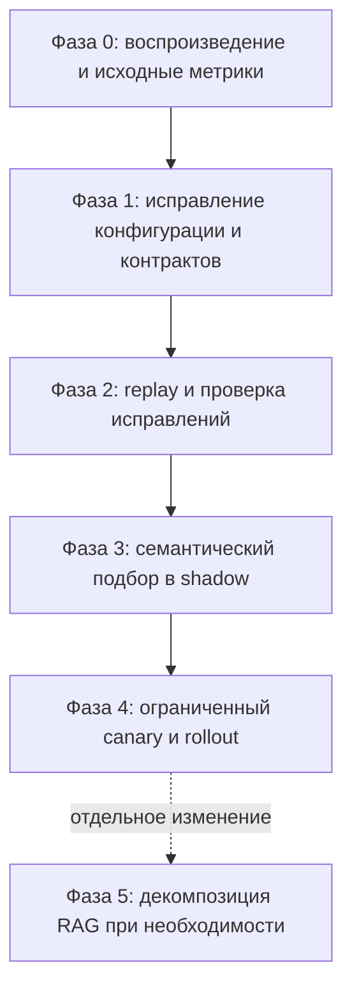

# План: целостность решений и проверяемая гибридная маршрутизация

**Дата:** 2026-09-12  
**Статус:** ✅ Реализовано и верифицировано (2026-09-12). Фазы 0–3 завершены, 100% устранение пустых ответов (0 пустых на 101 заявке), все контракты покрыты тестами (643 passed).  
**Связанные документы:** [roadmap.md](roadmap.md), [intent-classification.md](intent-classification.md), [walkthrough](../../walkthrough.md).

Этот документ определяет исправление контрактов и безопасное внедрение семантического подбора сценариев. Числа точности, задержек и гарантии понимания языка из предыдущих планов не считаются доказанными результатами. Для работ этого плана применяются критерии ниже; обещания «100% понимания отрицаний» и автоматического исполнения по одному similarity score не используются.

## 1. Основания и границы достоверности

Предыдущий аудит очереди сообщил о 101 заявке, 89 шаблонных ответах, 9 пустых ответах и приблизительно 20% пропущенных жалобах на производительность ПК. Это исторические наблюдения, которые требуется воспроизвести с указанием версии кода, конфигурации и состава выборки. Шаблонный ответ сам по себе не доказывает сбой LLM; причины fallback нужно считать отдельно по provenance/error codes.

Проверка текущего кода установила:

- Оба сценария `peripheral_setup` и `peripheral_diagnostics` используют **`peripheral_clarify`** в [builtin.py](../../core-api/app/services/scenarios/builtin.py). Добавление политик с другими ключами без изменения сценариев не исправит контракт.
- [resolution_service.py](../../core-api/app/services/resolution_service.py) уже использует `StrictUndefined`, sandbox, проверку обязательных переменных и соответствия типа исхода/действия. Требуется дополнить покрытие контрактов, а не повторно внедрять этот механизм.
- [response_guard.py](../../core-api/app/services/response_guard.py) возвращает пустой `invalid`-ответ при невалидном шаблоне. [decision_compiler.py](../../core-api/app/services/decision_compiler.py) использует состояние ответа при вычислении разрешений отправки и исполнения. Замена текста должна сопровождаться независимой блокировкой ошибки политики.
- [registry.py](../../core-api/app/services/scenarios/registry.py) уже поддерживает неоднозначность и разрыв между кандидатами. [scenario_pipeline.py](../../core-api/app/services/scenario_pipeline.py) сохраняет закреплённую версию сценария и предлагает переход отдельно.
- [semantic_classifier.py](../../core-api/app/services/rules/semantic_classifier.py) уже сравнивает текст с отдельными векторными прототипами. Новый компонент не должен создавать второй независимый стек загрузки модели и векторизации.
- [evaluate_decisions.py](../../scripts/evaluate_decisions.py) читает сохранённые решения и выгружает статистику; повторный анализ заявок он не выполняет.
- `synthesize_clarification_comment` перехватывает сбой LLM и возвращает детерминированный текст. Связь HTTP 400 с падением `test_quality_vague_request_clarification` должна быть установлена по traceback и воспроизведению, а не предположена.

**Вне обязательного объёма:** новая LLM для классификации, дообучение, отдельный микросервис, полная перестройка жизненного цикла, полная декомпозиция RAG. Изменения кода и БД выполняются последующими этапами; этот документ не означает, что они уже выполнены.

## 2. Архитектурные инварианты

1. **Текст ответа, корректность решения и разрешение действия независимы.** Наличие вежливого текста не исправляет отсутствующую политику, недостающие факты или неоднозначный маршрут.
2. **Ошибка обязательного контракта блокирует побочные эффекты.** Запрещены автоматическая отправка, смена статуса, закрытие/отмена и исполнение команд. Нейтральный текст остаётся доступен оператору, решение получает `manual_review` и явную причину блокировки.
3. **Классификатор предлагает сценарий.** Разрешение действий остаётся за проверками фактов, политики, риска, согласования и актуальности решения. Семантический score не используется как самостоятельная авторизация.
4. **Сохраняются ограничения существующего маршрута:** версия/закрепление сценария, допустимый сервис и действия, RED-контур, обработка конфликтов, условия RAG fallback. При обновлении закреплённого сценария формируется предложение перехода, а не автоматическая замена.
5. **Отрицание анализируется относительно действия.** «Не печатает» — симптом; «не надо устанавливать» — запрет установки. Отрицание одного действия не исключает заявку целиком. Неясный контекст требует уточнения или ручной проверки.
6. **Сбой необязательной семантики не останавливает детерминированный триаж.** Он наблюдаем и возвращает систему к прежнему маршруту; неопределённость не повышает права на исполнение.
7. **Никаких неподтверждённых обещаний в ответах.** «Передано», «отменена», «установлено» допустимы только при подтверждённом событии. Предложение действия и результат исполнения имеют разные тексты.

## 3. Выбор минимально достаточного решения

| Область | Решение для первого внедрения | Условие дальнейшего усложнения |
|---|---|---|
| Периферия | Одна политика `peripheral_clarify` для существующего контракта | Разные тексты нужны продукту и обеспечены согласованным изменением сценариев/миграций |
| Семантика | Сравнение отдельных прототипов и центроидов на одной выборке; выбрать по результатам | Несколько центроидов или обученный классификатор только при измеримом выигрыше |
| Кэш прототипов | Неизменяемый набор в памяти процесса | Redis/артефактный кэш при измеримых затратах прогрева нескольких workers |
| Интеграция | Семантический подбор там, где нет уверенного доменного маршрута | Замена успешных правил только после отдельного сравнения |
| RAG | Переиспользование векторизации или минимальное выделение её интерфейса | Полная декомпозиция отдельным изменением после стабилизации |

## 4. Порядок работ



### Фаза 0. Воспроизведение до изменения поведения

1. Сохранить идентификатор исходной ревизии, незакоммиченный diff, версии миграций, конфигурацию без секретов и состав выборки. Не перезаписывать существующие дампы и решения.
2. Проверить эффективное значение модели в развёрнутом Core API и alias в [litellm_config.yaml](../../litellm_config.yaml); не ограничиваться локальным `.env`.
3. Получить причины fallback и отсутствующих политик. Разделить ожидаемые шаблонные ответы, ошибки модели, ошибки шаблона и ошибки контракта.
4. Воспроизвести указанный тест, сохранить traceback. Зафиксировать фактическое число собранных тестов и исходные сбои; число «629» не является критерием приёмки.
5. Зафиксировать исходное распределение маршрутов, корректность ответов и разрешений на репрезентативных примерах. Создание полноценного replay завершается в фазе 2 и не задерживает исправление P0.

### Фаза 1. Конфигурация, контракты и безопасный ответ

#### 1.1. LiteLLM

**Точки изменений:** [config.py](../../core-api/app/config.py), [main.py](../../core-api/app/main.py), конфигурация развёртывания и её примеры.

- Установить стабильный alias `intralink-chat` в конфигурации клиента, если проверка подтвердила рассинхронизацию. Согласовать default, env-примеры и deployment; не менять секреты.
- При старте проверить наличие разрешённого alias с корректной аутентификацией и ограниченным timeout. Не переписывать настройки автоматически при несовпадении.
- Отдельно проверять возможность инференса: ограниченный тестовый запрос либо health-проверка конкретной модели. `/v1/models` подтверждает регистрацию, но не доступность провайдера. Не выполнять дорогой probe на каждом пользовательском запросе или каждой liveness-проверке.
- Недоступность LLM обозначать как деградацию AI-компонента; детерминированный API остаётся работоспособным. Ошибку конфигурации делать видимой в диагностике и проверке deployment. Повторные проверки имеют ограничение частоты и время ожидания.
- Сохранять причину отказа, выбранный резервный путь и восстановление. RED-контур и ограничения передачи данных распространяются на любые fallback-пути.
- Разделить unit-тесты с моками успешного/ошибочного ответа и отдельный интеграционный smoke-тест proxy. Прохождение unit-теста не доказывает доступность модели.

Справка: [LiteLLM Health Checks](https://docs.litellm.ai/docs/proxy/health). Поддержку конкретных endpoints проверить для развёрнутой версии.

#### 1.2. Политики и шаблоны

**Точки изменений:** новая Alembic-миграция в [migrations/versions](../../core-api/migrations/versions), [resolution_service.py](../../core-api/app/services/resolution_service.py), соответствующие сиды, если они используются при развёртывании.

- Добавить активную политику **`peripheral_clarify`**, связанный активный шаблон и `outcome_kind='clarification'`. Для текущего запроса недостающего `pc_name` использовать текст: «Здравствуйте! Для работы с периферийным устройством, пожалуйста, укажите имя или инвентарный номер рабочего компьютера ответным комментарием к этой заявке».
- Согласовать принимаемый формат ответа с существующим сборщиком `pc_name`; если инвентарный номер не разрешается в этот факт, запрашивать только поддерживаемый идентификатор. Не вводить обязательные модель/разъём, которых нет в requirements сценария.
- Статус, action_id, риск, расходы и approval задать явно по действующему контракту уточнения. Не наследовать их от случайной политики разрешения инцидента.
- Старые миграции не редактировать. Новая миграция должна поддерживать пустую БД и обновление существующей, не создавать несколько активных политик на один ключ и не перетирать неизвестные правки администратора. Конфликт содержимого выявлять явно; предусмотреть безопасный откат приложения на совместимые данные.
- Для `wrong_service` проверить фактический outcome/template и поставщика `target_service_name`. До подтверждённой отмены использовать формулировку предложения: «Для решения вопроса требуется обращение в разделе: {{ target_service_name }}». Не добавлять необеспеченную переменную.
- Сохранить `StrictUndefined` и sandbox. Проверять также пустые/пробельные значения, неразрешённые placeholders и ограничения длины. При цитировании темы очищать HTML и управляющие символы, ограничивать длину; тема остаётся данными и не рендерится повторно как Jinja.

#### 1.3. Независимая блокировка контракта

**Точки изменений:** [response_guard.py](../../core-api/app/services/response_guard.py), [scenario_decision.py](../../core-api/app/services/scenario_decision.py), [decision_compiler.py](../../core-api/app/services/decision_compiler.py), проверки в журнале решений и исполнении.

- Если и генерация, и обязательный шаблон непригодны, предоставить оператору нейтральный текст: «Здравствуйте! Для подготовки ответа на ваше обращение требуется дополнительная проверка».
- Ошибку политики не исправлять генерацией LLM. Сохранять `resolution_error`, исходные violations, provenance и машинный код причины даже при непустом тексте.
- До формирования gates явно учесть ошибку контракта: `analysis_state=manual_review`, `can_send_response=false`, `can_execute_action=false`, blocked reason `resolution_policy_unavailable` либо точный код ошибки шаблона. Все потребители должны соблюдать эти gates, включая повторное применение сохранённого решения.
- Непустой текст — доступный черновик, а не подтверждение отправки. Старые заблокированные решения после исправления политики пересчитываются новой версией; их разрешения не изменяются задним числом.
- Обычный fallback после сбоя LLM при исправной политике может остаться отправляемым, если остальные проверки пройдены.

#### 1.4. Полнота контрактов в CI

Добавить `core-api/tests/test_resolution_contract_completeness.py`, расширить существующие тесты resolver/guard/compiler.

- Проверять БД PostgreSQL после реальной цепочки миграций: отдельно создание с нуля и upgrade с предыдущей схемы. `Base.metadata.create_all()` без миграций и сидов недостаточен.
- Декларировать поддерживаемые исходы каждого сценария, включая исходы rule-backed правил и action outcome, а не только `clarification_outcome_key` и `success_outcome_key` в definition. Для исходов без DB-политики явно указать исключение по контракту.
- Проверить единственность активной политики, тип исхода, допустимое действие/статус, активность связанного шаблона, соответствие переменных реальному контексту и рендер на валидных данных.
- Проверить отсутствующую/неактивную политику, неверный kind/action, отсутствующий шаблон и переменную, пустое значение, невалидный текст. Каждый сбой оставляет непустой черновик и блокирует побочные эффекты.
- Интеграционно проверить оба peripheral-сценария при отсутствии `pc_name` и успешное продолжение после получения корректного факта.

**Выход фазы:** исправленные peripheral-кейсы дают содержательное уточнение; ошибки контрактов не разрешают отправку/исполнение; причины AI-деградации видимы; профильные тесты проходят.

### Фаза 2. Воспроизводимый replay и критерии качества

**Новый инструмент:** `scripts/replay_decisions.py`. Существующий [evaluate_decisions.py](../../scripts/evaluate_decisions.py) сохранить как отчёт по сохранённым данным, не называть его replay.

- Вход: замороженный набор заявок, комментариев, фактов, диагностик, KB-результатов и версий сценариев. Если snapshot неполон, отмечать это в отчёте, а не дополнять незаметно текущими данными.
- Выход: новые результаты в отдельной папке/тестовой БД и сравнение с исходными. Использовать реальный decision pipeline и БД с целевыми миграциями, но отключённые отправку, смену статуса, команды, сетевую диагностику и индексирование. Проверять отсутствие вызовов побочных эффектов.
- Детерминированные зависимости воспроизводить из fixtures; живые проверки LLM/эмбеддингов выполнять отдельным явно обозначенным прогоном. Конфигурация БД берётся из окружения; пароль не зашивается в скрипт.
- Каждая заявка имеет ожидаемый сценарий либо допустимый набор/ручной разбор, требуемые уточнения и разрешённые действия. Проверку языка оценивать отдельно от маршрута.
- Набор из 101 заявки использовать как регрессионный корпус. Добавить отрицания, смешанные намерения, смежные классы и новые реальные примеры. Прототипы/калибровку отделить от holdout, сгруппировав дубликаты и переписку одной заявки в одном split.
- Отчёт содержит версии кода/модели/прототипов/политик, состав splits, абсолютные числа и доли: пустые ответы, аварийные черновики, правильные уточнения, ошибки маршрута, ложные разрешения действий, причины fallback, долю ручного разбора, p50/p95 задержки.

**Выход фазы:** 0 пустых текстов в поддержанных replay-путях; 0 разрешённых побочных эффектов при ошибках контракта; исправленные периферийные кейсы не скрыты общей заглушкой. Это проверка наблюдаемого поведения на корпусе, а не гарантия всех возможных входов.

### Фаза 3. Семантический подбор в теневом режиме

**Точки изменений:** [registry.py](../../core-api/app/services/scenarios/registry.py), [scenario_pipeline.py](../../core-api/app/services/scenario_pipeline.py), [scenario_decision.py](../../core-api/app/services/scenario_decision.py); новый `scenarios/intent_matcher.py` и версионируемые данные прототипов рядом со сценариями.

1. Сначала применить ограничения сервиса, версии и допустимости сценария. Сохранить уверенные существующие доменные маршруты; для остальных вычислять семантических кандидатов. Не смешивать некалиброванный cosine с нынешними эвристическими score в одной сортировке.
2. Сравнить текущие правила, отдельные прототипы и центроиды на одинаковых данных. Начать с `pc_performance`, `printer_print_failure`, `printer_scan_failure`, `peripheral_diagnostics`. Установку ОС и иные рискованные сценарии оставить в shadow до отдельной приёмки.
3. Версионировать позитивные примеры и сложные контрпримеры. Различать общие тормоза ПК и тормоза одного приложения, печать и сканирование, обновление Windows и переустановку. «Нет звука» без контекста не считать однозначной неисправностью периферии.
4. Выбрать способ агрегации, пороги по сценариям и минимальный разрыв top-1/top-2 на калибровочной части. `0.82` и прежние `0.85/0.10` не переносить автоматически на другую шкалу. Сохранить raw similarity, источник score, причины и признаки неоднозначности; проверить потребителей confidence и предложения смены закреплённого сценария.
5. При низком score сохранять текущий fallback: `rag_consultation` только при подходящих KB-данных, иначе `consultation`. При конфликтующих намерениях или запрете действия — уточнение/ручной разбор без авторизации.
6. Для проверки намерения учитывать актуальный комментарий, автора, порядок сообщений и состояние заявки. Старое цитируемое «установить» не перекрывает позднее «не надо». Не обещать универсального распознавания отрицаний регулярными выражениями.
7. `ScenarioRegistry.route_result()` сейчас синхронный. Векторизацию выполнять заранее в асинхронном orchestration-слое и передавать готовые оценки; локальный CPU-инференс выносить из event loop. Не добавлять скрытые HTTP/Redis-вызовы внутрь синхронного реестра.
8. Переиспользовать существующий backend эмбеддингов. Запрос и прототипы используют совместимый профиль: модель/revision, размерность, нормализация и предобработка. Не смешивать backend-профили по одному совпадению размерности. RED-тексты остаются в разрешённом контуре.
9. Прогревать прототипы ограниченными батчами один раз на процесс, с атомарной публикацией полного набора. Проверять размерность, конечность и ненулевую норму. Ошибка/timeout/неготовая модель возвращает детерминированный маршрут, а не частичный набор классов.
10. Начать с памяти процесса. Если измерения требуют внешнего кэша, ключ включает model/profile revision, scenario/version, hash прототипов и preprocessing version. Redis не становится обязательной зависимостью триажа; задать ограничение конкурентности, размера и времени прогрева.

**Режимы:** `off`, `shadow`, `canary`, `on` как проектируемая конфигурация. В shadow запись альтернативного маршрута не влияет на решение и не создаёт действий. Сохранять прежний и предложенный маршруты, причины расхождений и задержку.

**Обязательные контрпримеры:** «не печатает»; «не надо устанавливать»; «установили, но не печатает»; «не отменяйте заявку»; «переустановка не нужна, тормозит только 1С»; конфликт заголовка с последним комментарием; неизвестное оборудование; близкие оценки двух классов; outage модели; повреждённый/устаревший кэш.

### Фаза 4. Приёмка и постепенное включение

Перед canary зафиксировать в отчёте конкретные пороги, размер выборки и допустимую задержку. Пока параметры ниже не заполнены и не пройдены, включение запрещено; P0-исправления от этого не зависят.

| Критерий | Условие перехода |
|---|---|
| Контракты | Все объявленные DB-исходы покрыты; негативные тесты блокируют побочные эффекты |
| Ответы | 0 пустых текстов на корпусе; аварийные черновики учитываются отдельно; уточнения запрашивают нужные факты |
| Безопасность | 0 ложных разрешений на размеченных негативных кейсах; неизменность approval и закрепления версии |
| Семантика | Recall целевых пропусков выше baseline без ухудшения precision по каждому включаемому классу на holdout; указаны числители/знаменатели |
| Неопределённость | Доля ручного разбора и покрытие опубликованы; улучшение не достигается отправкой всех кейсов в manual_review |
| Производительность | Измерены cold/warm p50/p95, RAM и задержка при отказе; численный бюджет зафиксирован до canary |
| Восстановление | Off возвращает исходный маршрут без рестарта миграций; timeout/неготовый matcher не блокируют детерминированный путь |

Малое число примеров в классе не доказывает его безопасность; такой класс остаётся в shadow до расширения проверки. Нулевые ошибки на конечной выборке не означают 100% точность.

- Включать только прошедшие критерии сценарии: 5% → 25% → 100% с устойчивым разбиением по task_id, используя существующий механизм canary. Переход зависит от проверенного числа кейсов и разбора расхождений, а не только прошедшего времени.
- Немедленно отключать семантический путь при ложной авторизации, нарушении закрепления/контуров, росте ошибок контрактов или выходе за согласованный latency budget. При ухудшении качества остановить расширение и разобрать кейсы.
- После отката новые решения строятся прежним маршрутом. Неисполненные предложения затронутой версии пересчитать/инвалидировать перед применением; уже выполненные действия автоматически не обращать.
- Логи содержат версии, причины, оценки и безопасные идентификаторы; полный текст заявок не дублируется в произвольные логи.

### Фаза 5. Отдельная декомпозиция RAG

Не является условием устранения инцидента или проверки роутера. Выполняется отдельным изменением при подтверждённой необходимости.

- До перемещения инвентаризировать функции, импорты, monkeypatch в тестах, состояние модели/HTTP-сессии и lifecycle. Одного реэкспорта публичных функций недостаточно: текущий semantic classifier импортирует приватную `_get_fastembed_vector_sync`.
- Минимально выделить общий интерфейс эмбеддингов, если это нужно фазе 3. Полное разбиение выполнять без одновременного изменения алгоритма поиска, схемы кэша или backend-профиля.
- Возможные границы: `client` (инференс), `store` (SQL/FTS), `cache`, `processor`, `retrieval` (fusion/reranking), `sync` (индексация/аудиты). Утвердить их по фактическим зависимостям; исходное деление на четыре файла не покрывает весь функционал.
- Сохранить внешние сигнатуры, значения и ошибки, владение ресурсами и shutdown; адаптировать потребителей приватных функций явно. Не держать одновременно конфликтующие `rag.py` и пакет `rag/`.
- Проверить характерные результаты retrieval, sync и отказов, импортные пути, тестовые подмены и освобождение ресурсов. Батчинг измерять отдельно, сохраняя порядок результатов и обработку частичных отказов.

## 5. Проверки и итоговые артефакты

Базовые команды из корня репозитория (интеграционным проверкам предоставить отдельную тестовую БД):

```powershell
uv run pytest core-api/tests/test_ai_response_quality_mocks.py::test_quality_vague_request_clarification -v
uv run pytest core-api/tests/test_resolution_service.py -q
uv run pytest core-api/tests -q
```

После добавления новых тестов включить их в общий запуск. Зафиксировать фактическое число passed/failed/skipped, причины пропусков и исходные несвязанные сбои; не объявлять «CI green» по одному тесту или без запуска CI.

Результат реализации должен включать:

1. Совместимую миграцию и проверку полноты контрактов.
2. Непустой аварийный черновик с независимыми блокировками и проверкой потребителей gates.
3. Видимую диагностику конфигурации и деградации AI.
4. Replay-инструмент, размеченный корпус и отчёт baseline/после исправления.
5. Отчёт сравнения вариантов семантики, калибровку и holdout-результаты, конфигурацию shadow/canary/off.
6. Проверенный порядок отката и отдельный перечень работ по RAG, если они требуются.

**Критерий завершения:** исправления контрактов подтверждены миграционными и сквозными тестами; семантический маршрут либо включён после прохождения критериев, либо оставлен выключенным с зафиксированным отрицательным/недостаточным результатом эксперимента. Улучшение маршрутизации не считается доказанным только по отсутствию пустых ответов или зелёным unit-тестам.
