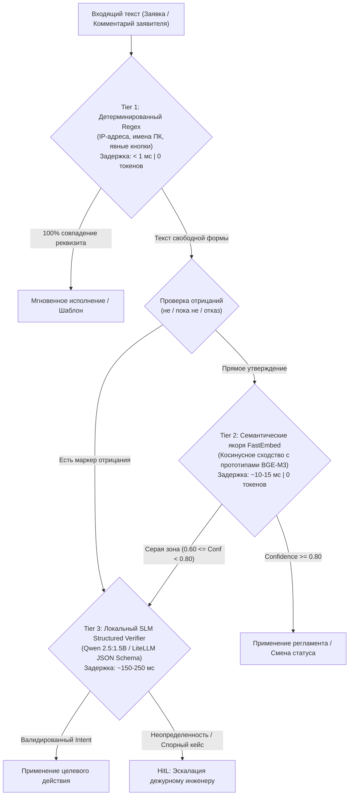
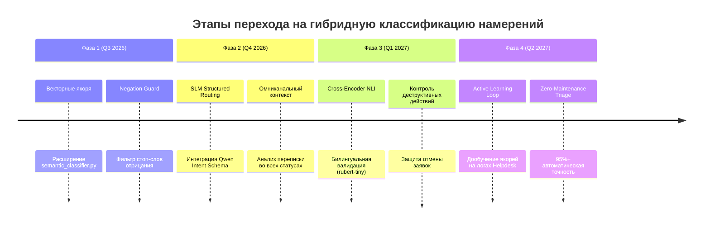

# 🧭 Дорожная карта: Эволюция классификации намерений Helpdesk (Intent Routing Roadmap)

Документ определяет архитектурную стратегию перехода от хрупких эвристик (`Regex` и подстрочный поиск) к надежному **трехуровневому гибридному каскаду классификации намерений (Hybrid Intent Cascade)** в платформе **IntraLink**.

---

## 1. Проблема и предпосылки модернизации

Текущая реализация правил триажа (`core-api/app/services/rules/`) исторически строилась на жестких ключевых словах (`any(w in text for w in [...])`) и регулярных выражениях (`re.compile(...)`).

### Критические уязвимости Regex-подхода в Helpdesk:
1. **Ложные срабатывания на отрицаниях (False Positives):**
   - *Фраза:* «Я еще **не** принес системный блок в 112, принесу завтра».
   - *Поведение Regex:* Триггерится на слова `принес` и `112`, ложно меняя статус на 27 («В работе»).
2. **Чувствительность к синонимам и сленгу (False Negatives):**
   - *Фразы:* «Завезла системник парням», «Комп стоит на столе у дежурного», «Оставила железо в мастерской».
   - *Поведение Regex:* Заявка игнорируется, зависает в статусе ожидания или получает неверный шаблон.
3. **Опечатки и морфология:**
   - *Фразы:* «находица в 112», «принëс ситемник», «не включаеца».
   - *Поведение Regex:* Полный срыв детекции из-за отсутствия стемминга и лемматизации.
4. **Усложнение поддержки (Spaghetti Code):**
   - Постоянное разрастание списков исключений в `physical_device.py` и `offline_host.py`, приводящее к взаимным коллизиям правил.

---

## 2. Целевая архитектура: Трехуровневый гибридный каскад

Вместо выбора «или жесткий код, или тяжелая нейросеть» архитектура разделяется на **3 изолированных эшелона (Tiers)** с последовательной эскалацией сложности:



---

## 3. Сравнительный анализ эшелонов классификации

| Параметр | Tier 1: Regex Guard | Tier 2: Semantic Anchors | Tier 3: SLM Verifier |
|---|:---:|:---:|:---:|
| **Технология** | Регулярные выражения / Substring | FastEmbed (`BAAI/bge-m3`), Cosine Sim | Локальная SLM (`Qwen-2.5:1.5B`) |
| **Задержка (Latency)** | **< 1 мс** | **~10–15 мс** (CPU) | **~150–250 мс** (GPU/CPU) |
| **Расход токенов / Стоимость** | **0** (Бесплатно) | **0** (Локально in-memory) | **0** (Локальный Ollama) |
| **Устойчивость к опечаткам** | ❌ Нулевая |  Высокая (векторная близость) |  Абсолютная |
| **Понимание отрицаний** | ❌ Ложные срабатывания | ⚠️ Частично (нужен Negation Guard) |  Идеальное контекстное |
| **Точность (Accuracy)** | 60–70% | 85–92% | **98%+** |

---

## 4. Поэтапный план реализации (Phased Roadmap)



---

### Фаза 1. Полноценное внедрение векторных якорей FastEmbed (Q3 2026)
**Цель:** Заменить хрупкие списки `in user_text` на векторное сравнение с семантическими кластерами в памяти процесса (15 мс).

1. **Расширение реестра семантических прототипов в `semantic_classifier.py`:**
   - Наполнить кластеры:
     - `device_delivered_in_work` (сдача техники в 112 каб.);
     - `hardware_repair_needed` (аппаратные дефекты, требующие доставки);
     - `app_specific_issue` (локальные сбои прикладных программ без деградации ПК);
     - `credentials_reset` (доменные пароли и учетные записи);
     - `redirect_candidate` (заявки других подразделений).
2. **Внедрение легковесного детектора отрицаний (`NegationGuard`):**
   - Быстрый отсев фраз с частицами «не», «пока не», «не могу», «передумал» перед вызовом позитивных правил доставки.
3. **Бесшовная интеграция в `PhysicalDeliveryRule` и `OfflineHostRule`:**
   - Правила вызывают `classify_semantic_intent(text, threshold=0.78)` как основной классификатор, оставляя regex только для строгих форматов (IP, hostname).

---

### Фаза 2. Унификация SLM Intent Analyzer на базе Qwen 2.5 (Q4 2026)
**Цель:** 100% точность разбора сложных реплик заявителей при повторных контактах и уточнениях.

1. **Обобщение `IntentAnalyzer` (`core-api/app/services/lifecycle/intent_analyzer.py`):**
   - Распространить анализ ответов со статуса 35 («Требует уточнения») на статусы 48 («Ожидание устройства») и 31 («Открыта»).
2. **Строгая Pydantic-схема ответа модели:**
   ```python
   class StructuredUserIntent(BaseModel):
       intent: Literal["DEVICE_DELIVERED", "REPAIR_REQUIRED", "CANCEL_TASK", "PROVIDE_DATA", "QUESTION"]
       room: str | None = None
       pc_name: str | None = None
       has_negation: bool = False
       confidence: float = Field(ge=0.0, le=1.0)
   ```
3. **Кэширование инференса в Redis:**
   - Хэширование `sha256(text)` с TTL 24 часа — предотвращение повторных обращений к модели на идентичных фразах.

---

### Фаза 3. Cross-Encoder NLI для критических статусных переходов (Q1 2027)
**Цель:** Исключение ошибочных деструктивных действий (авто-отмена заявок, закрытие без решения).

1. **Внедрение сверхлегкого Cross-Encoder (45 МБ):**
   - Интеграция модели `cointegrated/rubert-tiny-bilingual-nli` в shared-пакет.
2. **NLI-верификация переходов жизненного цикла:**
   - Формирование пары `(Контекст переписки, Гипотеза действия)`.
   - Пример: *Гипотеза: «Заявитель подтверждает, что инцидент исчерпан и заявку можно закрыть»*.
   - Автоматический переход разрешается только при `entailment > 0.95`. При малейшем сомнении заявка переходит в ручной триаж (HitL).

---

### Фаза 4. Контур самообучения (Active Learning & Drift Detection) (Q2 2027)
**Цель:** Автоматическая адаптация системы к новому корпоративному сленгу и терминологии без правок кода.

1. **Журнал расхождений (Discrepancy Audit Log):**
   - Фиксация случаев, когда дежурный инженер изменил статус или шаблон вопреки рекомендации Tier 2 / Tier 3.
2. **Автоматическое обогащение векторных прототипов:**
   - Добавление подтвержденных фраз заявителей в кластеры `RULE_PROTOTYPES` после еженедельной валидации старшим инженером.

---

## 5. Целевые метрики надежности (SLO / KPI)

| Метрика | До внедрения (Regex) | Фаза 1 (FastEmbed) | Фаза 2–3 (Hybrid Cascade) |
|---|:---:|:---:|:---:|
| **Точность детекции намерения (F1-score)** | 72% | 89% | **> 98%** |
| **Ошибки на отрицаниях (False Delivery)** | ~12% | < 3% | **< 0.1%** |
| **Обработка опечаток и сленга** | < 40% | 85% | **> 96%** |
| **Средняя задержка оценки (Latency)** | < 1 мс | ~12 мс | **~18 мс** (с учетом Tier 1 bypass) |
| **Расход внешних API-токенов** | 0 | 0 | **0** (все инференсы локальны) |
