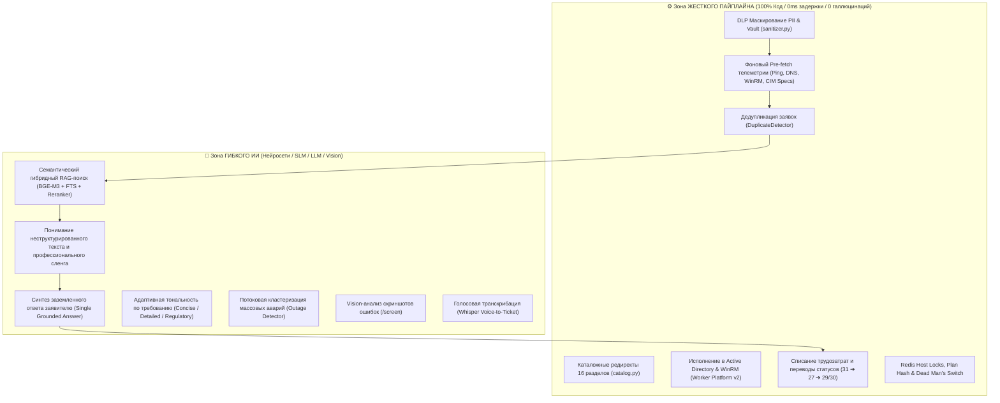
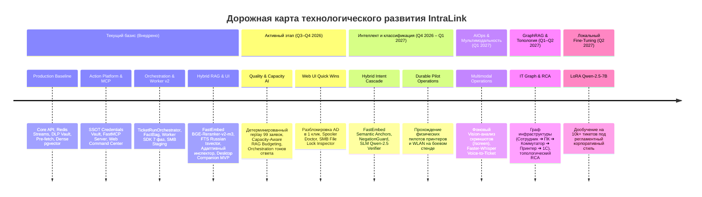
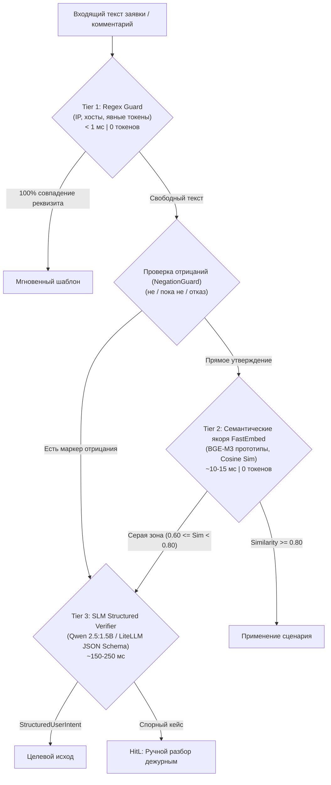

# 🗺️ Дорожная карта развития проекта IntraLink (Product & AI Roadmap)

Документ фиксирует стратегические горизонты, этапы технологической эволюции, текущий статус реализации и архитектурные инварианты платформы **IntraLink**.

---

## 🧭 Навигатор активных и реализованных планов

### 🎯 Активные этапы реализации (В работе / Q3–Q4 2026):
1. **[Качество сценариев и маршрутизация (Этап 2)](ticket-scenario-quality-stage-2-plan.md)** (и общий [Roadmap качества сценариев](ticket-scenario-quality-roadmap.md)) — детерминированный replay 99 контрольных заявок, типизация `device_type`, нормализация `printer_targets` (USB vs Network), статусы свежести диагностики (`available`/`unavailable`), исключение ложных отмен и редиректов.
2. **[Адаптивный контекст RAG и оркестрация тональности ответов AI](model-adaptive-rag-and-tone-orchestration.md)** — Capacity-Aware Context Budgeting: срез RAG-контекста под размер модели (1 прецедент для локальной Ollama 1.5B/7B vs 3–4 для облачной LiteLLM/Gemini), Single Grounded Answer по умолчанию и переключение тональности по требованию (`concise`, `detailed`, `regulatory`).
3. **[Сценарии автоматизации Helpdesk: Web UI Quick Wins & Пилоты](scenarios-roadmap.md)** — внедрение быстрых диагностических действий: бэкенд разблокировки УЗ в AD (`POST /api/v1/ad/users/{username}/unlock`), Spooler Doctor (сброс очереди печати), инспектор блокировок SMB (`Get-SmbOpenFile`), очистка диска C: и кэша 1С.
4. **[Гибридный каскад классификации намерений (Intent Routing Cascade)](intent-classification.md)** — замена хрупких регулярных выражений: `Regex Guard (Tier 1) ➔ FastEmbed Semantic Anchors BGE-M3 + NegationGuard (Tier 2) ➔ SLM Qwen-2.5 Intent Verifier (Tier 3) ➔ Cross-Encoder NLI (Tier 4)`.

### 📦 Реализованные и архивированные этапы (Внедрено в Baseline):
* **[Сценарный контур и TicketRunOrchestrator](archive/scenario-orchestration/transition-roadmap.md)** — модульный FSM жизненного цикла заявок, сбор фактов с Provenance (`FactBag`), Fact-Override в Web UI, компиляция `DecisionEnvelope v2`, 100% перевод трафика в `active`, депрекация процедурного раннера. Спецификация: [архитектурный план](archive/scenario-orchestration/execution-plan.md).
* **[Отказоустойчивость ядра сценариев](archive/scenario-core-readiness.md)** — атомарные транзакции `CommandService.create_internal`, надежная очередь отложенных событий `ticket_event_deferred`, сохранение ручных правок оператора без схлопывания, единый цикл продолжения.
* **[Модульная Worker Platform v2 (5 инкрементов)](archive/worker-platform/README.md)** — интерфейс 7 фаз `ActionHandler`, доверенный PowerShell runner, durable workflow с `plan_hash`, SMB staging драйверов с SHA-256, распределение флота воркеров и антиголодный карантин.
* **[Качество поиска RAG v2](archive/rag-quality-roadmap.md)** — гибридный поиск (pgvector BGE-M3 1024-dim + PostgreSQL FTS Russian tsvector со `setweight` и GIN-индексом) + Cross-Encoder `BAAI/bge-reranker-v2-m3` на FastEmbed (Recall@5 97.5%, Hit@5 100%).
* **[Экспресс-паспорт железа и Uptime ПК](archive/hardware-specs-implementation-plan.md)** — опрос CPU, RAM, накопителей, времени непрерывной работы и модели ПК через CIM WinRM в `host_telemetry.py` с кэшированием в Redis и индикацией проблем.
* **[Адаптивный инспектор заявок](archive/adaptive-inspector-implementation-plan.md)** — слот-ориентированный интерфейс `TicketInspector.tsx` с 5 специализированными модулями (Железо, Принтер, AD/Учетка, Редирект, База знаний) и контекстным доком действий.
* **[Desktop Companion MVP](archive/desktop-companion-blueprint.md)** — нативный Windows tray-клиент на Tauri 2 (Rust) для мгновенного запуска DameWare, LiteManager и RDP из веб-интерфейса по защищенным одноразовым deep links `intralink://`.
* **[Асинхронная платформа пакетного триажа (ADR 0003)](archive/async-triage-implementation-plan.md)** — неблокирующий шлюз `202 Accepted`, Redis Job Queue, Single-flight lock и стриминг прогресса через SSE.

---

## 🏛️ Ключевой архитектурный принцип: Детерминизм vs Гибкий ИИ

Система строго разделяет зоны ответственности, избегая недетерминированных тяжелых агентских фреймворков в критических контурах:

---

## 📊 Матрица технологической эволюции (2026–2027)

---

## 📍 Текущее состояние платформы (Production Baseline — Внедрено)

> [!NOTE]
> Полная детальная спецификация компонентов системы зафиксирована в [**docs/architecture.md**](../architecture.md).

* **Ядро и шина:** FastAPI Gateway + Poller Daemon (Leader Lock) + Redis Streams (`stream:intraservice_events`) с Consumer Groups, `XAUTOCLAIM` и асинхронным батч-триажем (`202 Accepted`, SSE Terminal).
* **Сценарный оркестратор:** Долговечный конечный автомат [`TicketRunOrchestrator`](archive/scenario-orchestration/transition-roadmap.md) со 100% трафика в режиме `active`, доказательной базой фактов [`FactBag`](archive/scenario-orchestration/execution-plan.md), оптимистичной блокировкой версий решения и возможностью Fact-Override в Web UI. Процедурный раннер депрекейтнут и сокращен до тонкого фасада.
* **Платформа исполнения воркеров:** Модульная [`Worker Platform v2`](archive/worker-platform/README.md) на Windows: 7-фазный контракт `ActionHandler`, изолированный PowerShell runner, привязка подтверждений к `plan_hash`, SMB staging драйверов с SHA-256, распределение по пулам возможностей и антиголодный карантин.
* **База знаний (RAG v2):** Гибридный поиск: Dense pgvector (1024-dim, BGE-M3) + лексический полнотекстовый поиск PostgreSQL FTS (`search_vector` Russian tsvector + GIN) + Cross-Encoder [`BAAI/bge-reranker-v2-m3`](archive/rag-quality-roadmap.md) на базе FastEmbed. Recall@5 — 97.5%, Hit@5 — 100%.
* **Безопасность (Zero Trust DLP):** Трехконтурная маршрутизация инференса (🔴 RED On-Prem / 🟡 YELLOW PII Vault Fernet / 🟢 GREEN Cloud), Dead Man's Switch, Distributed Host Concurrency Lock (`lock:host:<pc>`, TTL 30s).
* **Клиентский контур:** 
  - Адаптивный React 19 SPA [`TicketInspector.tsx`](archive/adaptive-inspector-implementation-plan.md) с 5 специализированными модулями (Хост/Железо, Принтер, AD/Учетка, Редирект, RAG) и экспресс-паспортом оборудования (CIM WinRM CPU, RAM, Disk C:, Uptime).
  - Нативный tray-клиент [`Desktop Companion`](archive/desktop-companion-blueprint.md) на Tauri 2 (Rust) с deep links `intralink://` для запуска DameWare, LiteManager и RDP.
  - Инструментальный FastMCP сервер [`intralink-mcp`](../../intralink-mcp/README.md) для управления через AI-агента AGY.
  - Мобильный Telegram-бот (aiogram 3.x) для HITL-согласований.

---

## 🚀 Активный этап 1. Качество сценарных решений и адаптивный AI (Q3–Q4 2026)

**Цель:** Доведение точности классификации и решений первой линии до эталонного уровня на основе верифицированных регрессий и оптимизация контекста генерации под возможности локальных GPU.

### Ключевые направления:

#### 1.1. Исправление фактов, маршрутизации и валидация ([`ticket-scenario-quality-stage-2-plan.md`](ticket-scenario-quality-stage-2-plan.md))
* **Детерминированный Replay 99 заявок:** Реализация команд `replay` и `compare` в `ticket_quality_baseline.py` для автономного прогона контрольной выборки без сайд-эффектов и сетевых обращений.
* **Типизация оборудования (`device_type`):** Введение детерминированного факта `device_type` (`printer`, `audio`, `other`, `unknown`) для исключения ложных установок принтера на аудиопериферии (#140408, #140511).
* **Связность параметров принтеров (`printer_targets`):** Хранение отдельных кортежей «модель — адрес — тип подключения». Исключение навязывания общего IP всем устройствам; USB требует ПК, но не сетевой IP.
* **Статусы свежести диагностики:** Различение состояний `available`, `unavailable`, `error`, `unknown`. Отрицательный ответ формируется только при подтвержденной недоступности («не удалось связаться», без утверждений о выключении ПК).
* **Маршрутизация и скоринг (`RouteResult`):** Введение внутреннего `RouteResult`, устранение ложных редиректов в 1С при сопутствующих симптомах тормозов (#139762), распознавание явных запросов КриптоПро (#140094). Добавление ручных меток: `peripheral_setup`, `peripheral_diagnostics`, `pc_performance`, `network_diagnostics`, `os_reinstallation`.

#### 1.2. Model-Adaptive RAG & Tone Orchestration ([`model-adaptive-rag-and-tone-orchestration.md`](model-adaptive-rag-and-tone-orchestration.md))
* **Fast Fix AI-контура (✅ Реализовано):**
  - **Capacity-Aware Context Budgeting:** Внедрено адаптивное усечение прецедентов RAG на уровне `ai_synthesis.py`: Ollama (`RED` контур / локальный режим) получает строго `AI_OLLAMA_MAX_RAG_MATCHES=1` (порог 0.80), а облачный контур (`YELLOW`/`GREEN`) — до `AI_CLOUD_MAX_RAG_MATCHES=3`. Исключен эффект *Lost in the Middle* и перегрузка VRAM локальной GPU.
  - **Dual-Key ротация и Failover в LiteLLM:** Подключен пул деплойментов с двумя бесплатными ключами (`GEMINI_API_KEY`, `GEMINI_API_KEY_2`) с балансировкой `least-busy` и кулдауном 60 сек при 429 ошибках. В случае исчерпания облачной квоты запрос автоматически перенаправляется на локальную Ollama (`intralink-local`).
  - **Устранение обрывов генерации Gemini:** Исправлен скрытый баг бюджетирования токенов рассуждений (`thoughtsTokenCount` в семействе Gemini 2.5/3.x). В `app/services/ai/hub.py` зафиксирован динамический потолок `AI_CLOUD_MAX_TOKENS = 1536`, исключающий обрыв ответов по `MAX_TOKENS`.
  - **Защита от зацикливания повторов токенов:** Внедрена клиентская regex-санитация повторяющихся фраз в `AIHub` (`re.sub`), предотвращающая патологические повторы слов без риска получить `HTTP 400 Penalty is not enabled` от Gemini API.
  - **Ролевое заземление инженера в `system_prompt`:** Зафиксирован запрет на перекладывание переустановки ОС/правки реестров на рядового пользователя и блокировка требований IP принтера для аудиоустройств и манипуляторов.
* **Single Grounded Answer по умолчанию:** Один каноничный, заземленный на факты ответ от первого лица дежурного инженера Helpdesk.
* **On-Demand Tone Orchestration (⏳ Запланировано в UI):** Выпадающее меню в `UnifiedActionDock.tsx` с перегенерацией по требованию оператора:
  - ⚡ **Краткий статус (`concise`):** 1–2 лаконичных предложения о статусе диагностики или принятии в работу.
  - 📋 **Подробная инструкция (`detailed`):** Пошаговый алгоритм, команды cmd/powershell для заявителя.
  - 🏛️ **По регламенту (`regulatory`):** Детерминированный корпоративный шаблон компании без обращения к LLM.
  - Изоляция кэша в Redis по составному ключу `ai:resolution:{task_id}:{digest}:{tone}`.
* **Долгосрочные Best Practices (Production Evolution):**
  1. *3-Уровневый каскад LiteLLM:* Flash (2 ключа) ➔ Flash-Lite (2 ключа) ➔ Ollama (RTX 3050).
  2. *Сквозная телеметрия моделей:* фиксация фактического провайдера в `decision_envelope` и отображение бейджа в UI Инспектора.
  3. *Автоматический бенчмарк-раннер (`tools/benchmark_rag_capacity.py`):* мониторинг задержек, VRAM и качества синтеза при обновлении весов моделей.

#### 1.3. Обратная связь оператора и аудит ([`ticket-scenario-quality-roadmap.md`](ticket-scenario-quality-roadmap.md))
* Фиксация этапов анализа в `decision_steps`, подтверждений и ручных правок оператора в `decision_feedback` с привязкой к версии решения для постоянного пополнения регрессионного датасета.

---

## ⚡ Активный этап 2. Web UI Quick Wins и завершение пилотов (Q4 2026)

**Цель:** Сокращение рутинных переключений окон инженера первой линии и безопасная эксплуатация автоматических действий ([`scenarios-roadmap.md`](scenarios-roadmap.md)).

### Ключевые задачи:
1. **Виджет аудита и экспресс-разблокировки УЗ в Active Directory:**
   - Полноценный эндпоинт `POST /api/v1/ad/users/{username}/unlock` на бэкенде.
   - 1-клик разблокировка пользователя прямо из заголовка инспектора при статусе `Locked Out`.
2. **Spooler Doctor (Диагностика и сброс зависшей очереди печати):**
   - Получение числа зависших заданий очереди через WinRM.
   - 1-клик действие через воркер: безопасная остановка Spooler, очистка каталога `PRINTERS` и перезапуск службы.
3. **Инспектор файловых блокировок SMB (SMB File Lock):**
   - Автоматический парсинг путей `\\server\share\...` из описания заявки.
   - Запрос к файловому серверу через `Get-SmbOpenFile` с определением логина сотрудника и ПК, заблокировавшего файл.
   - Кнопка вставки вежливого комментария заявителю и принудительное снятие блокировки инженером.
4. **Очистка диска C: и кэша 1С:**
   - 1-клик действие при критическом свободном месте (`DiskFree < 10 GB`): безопасное удаление временных файлов `Temp` и поврежденных кэшей баз 1С (`AppData\Local\1C\1Cv8\*`).
5. **Эксплуатационные пилоты автоматизации:**
   - Завершение натурных испытаний `install_printer` и `grant_wlan` на физических рабочих станциях домена.

---

## 🧠 Активный этап 3. Гибридная классификация намерений (Q4 2026 – Q1 2027)

**Цель:** Полный отказ от хрупких регулярных выражений и ключевых слов в пользу трехуровневого каскада, устойчивого к опечаткам, отрицаниям и корпоративному сленгу ([`intent-classification.md`](intent-classification.md)).

### Фазы внедрения:
1. **Фаза 1 (Q4 2026):** Векторные якоря FastEmbed BGE-M3 и фильтр отрицаний `NegationGuard` (отсев ложных доставок техники на фразах *«еще не принес»*).
2. **Фаза 2 (Q4 2026):** Локальный верификатор на SLM Qwen 2.5:1.5B со строгой Pydantic-схемой `StructuredUserIntent`.
3. **Фаза 3 (Q1 2027):** Сверхлегкий Cross-Encoder NLI (`cointegrated/rubert-tiny-bilingual-nli`, 45 МБ) для валидации критических переходов жизненного цикла (защита от ложной авто-отмены).
4. **Фаза 4 (Q2 2027):** Контур самообучения (Active Learning Loop): автоматическое обогащение векторных прототипов подтвержденными формулировками из Helpdesk.

---

## 🌐 Стратегический горизонт (2027)

### Этап 4. Мультимодальность и AIOps (Q1 2027)
1. **Автономный Vision-анализ скриншотов (`/screen`):**
   - Фоновый запуск Vision-модели при создании заявки с графическими вложениями.
   - Извлечение системных кодов ошибок Windows, синих экранов (BSOD) и номеров сбоев прямо в `FactBag`.
2. **Голосовой ввод (Faster-Whisper Voice-to-Ticket):**
   - Локальная транскрибация аудиосообщений пользователей в Telegram-боте с выделением сущностей (ФИО, кабинет, ПК, проблема).
3. **Потоковая кластеризация аварий v2:**
   - Автоматическое превентивное связывание дубликатов при объявлении Master-инцидента с баннером [`OutageAlertBanner.tsx`](../../intra-web/src/components/queue/OutageAlertBanner.tsx).

### Этап 5. GraphRAG и Топология ИТ-инфраструктуры (Q1–Q2 2027)
1. **Граф зависимостей оборудования:**
   - Моделирование связей: `Сотрудник ➔ Кабинет ➔ Коммутатор ➔ ПК ➔ Сетевой порт ➔ Принтер ➔ Сервер 1С`.
2. **Топологический Root Cause Analysis (RCA):**
   - Локализация источника сбоя до конкретного сетевого узла при одновременной деградации группы хостов.

### Этап 6. Локальный Fine-Tuning модели (Q2 2027)
1. **LoRA / QDoRA на базе тикетов:**
   - Дообучение модели `Qwen-2.5-7B-Instruct` на корпусе из 10 000+ исторических закрытых тикетов компании.
   - Полное воспроизведение авторского стиля и регламентов инженера Беликова Алена без раздувания системных промптов.

---

## 📈 Целевые метрики эффективности (KPI)

| Метрика | Исходный уровень (Legacy) | Текущий уровень (Внедрено) | Целевой уровень (2026–2027) |
|---|:---:|:---:|:---:|
| **Среднее время первичного триажа (MTTA)** | 15–30 мин | **< 1 мин** (асинхронный батч-триаж) | **< 10 сек** (авто-триаж + pre-fetch) |
| **Время закрытия типовых заявок (MTTR)** | 20–40 мин | **3–5 мин** (FSM оркестратор + AD/WLAN) | **< 1 мин** (Zero-Touch execution) |
| **Качество RAG-поиска (Recall@5 / Hit@5)** | ~60% (только ILIKE) | **97.5% / 100%** (BGE-Reranker-v2-m3 + FTS) | **> 98%** (с учетом Capacity-Aware Budgeting) |
| **Точность классификации намерений (F1-score)** | ~72% (Regex) | ~85% (базовые прототипы) | **> 98%** (Hybrid Intent Cascade) |
| **Ошибки детекции на отрицаниях** | ~12% (False Delivery) | ~8% | **< 0.1%** (NegationGuard + SLM Verifier) |
| **Утечки персональных данных (DLP)** | Высокий риск | **0%** (Fernet PII Vault + DLP Sanitizer) | **0%** (Формально верифицировано) |
| **Доля рутинных операций (Zero-Touch)** | 0% | **25%** | **65%+** |
