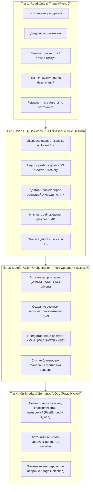
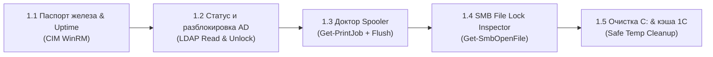

# 🗺️ Дорожная карта сценариев автоматизации IntraLink (Scenarios Roadmap)

Документ определяет полную матрицу и этапы развития сценариев автоматизации заявок в платформе **IntraLink**: от экспресс-диагностики в Web UI оператора до автономного исполнения через Transactional Command Platform.

---

## 🧭 Архитектурные уровни зрелости сценариев (Maturity Tiers)

Все сценарии классифицированы по 4 уровням воздействия и риска:

---

## 📊 Сводная матрица сценариев

| Сценарий | Класс риска | Исполнитель | Интерфейс | Текущий статус | Горизонт реализации |
|---|:---:|:---:|:---:|:---:|:---:|
| **Редирект каталога (`redirect`)** | 1 | Core API | Автопилот / Web UI | 🟢 Production Ready | Внедрено |
| **Дедупликация (`duplicates`)** | 1 | Core API | Автопилот / Web UI | 🟢 Production Ready | Внедрено |
| **Опрос доступности ПК (`offline_host`)** | 0 | Core API / Redis | Web UI / Автопилот | 🟢 Production Ready | Внедрено |
| **База знаний RAG (`consultation`)** | 0 | FastEmbed / pgvector | Web UI / Автопилот | 🟢 Production Ready | Внедрено |
| **Типовые сбои оргтехники (C7990/Scan/Print)** | 0 | Core API | Web UI / Автопилот | 🟢 Production Ready | Внедрено |
| **Паспорт железа и Uptime ПК** | 0 | Core API / WinRM | **Web UI Inspector** | 🟡 **Quick Win (Специфицирован)** | **Q3 2026 (Спринт 1)** |
| **Аудит и Unlock УЗ в Active Directory** | 0/1 | Core API / LDAP | **Web UI Header** | 🟡 **Quick Win (Специфицирован)** | **Q3 2026 (Спринт 1)** |
| **Сброс очереди печати (Spooler Doctor)** | 1 | Windows Worker / WinRM | **Web UI Diagnostics** | 🟡 **Quick Win (Специфицирован)** | **Q3 2026 (Спринт 2)** |
| **Инспектор файловых блокировок SMB** | 0/1 | Windows Worker / SMB | **Web UI Inspector** | 🟡 **Quick Win (Специфицирован)** | **Q3 2026 (Спринт 2)** |
| **Очистка диска C: и кэша 1С** | 1 | Windows Worker / WinRM | **Web UI Diagnostics** | 🟡 **Quick Win (Специфицирован)** | **Q3 2026 (Спринт 2)** |
| **Установка принтеров (`install_printer`)** | 1 | Windows Worker | Web UI / HitL | 🟡 Доработка ядра FSM (Пилот) | Q3–Q4 2026 |
| **Создание пользователя (`create_user`)** | 2 | Windows Worker / AD | Web UI / HitL | 🟡 Доработка доставки / HitL | Q3–Q4 2026 |
| **Выдача Wi-Fi (`grant_wlan`)** | 2 | Windows Worker / AD | Web UI / Shadow | 🟡 Handler готов, включение в FSM | Q4 2026 |
| **Сдача оборудования (`physical_device`)** | 1 | Core API | Web UI / Автопилот | 🟡 Миграция на семантику | Q4 2026 |
| **Семантический каскад намерений (FastEmbed+SLM)** | 0 | Core API / Ollama | Ядро классификации | ⚪ Roadmap в docs | Q4 2026 – Q1 2027 |
| **Vision-анализ скриншотов (`screen`)** | 0 | Core API / Vision LLM | Web UI / Автономный сбор | 🟡 Интерактивно через CLI | Q1 2027 |
| **Кластеризация аварий (`outage`)** | 0 | Core API / HDBSCAN | Web UI Banner | 🟡 Аналитический режим | Q1 2027 |

---

## 🚀 Поэтапный план реализации (Phases)

### Фаза 1. «Quick Wins» для Web UI инспектора заявок (Q3 2026 — Ближайшие 2 недели)
**Фокус:** максимальная диагностическая ценность и сокращение рутины инженера 1-й линии прямо в веб-интерфейсе без риска деструктивных действий.

#### 1.1. Экспресс-паспорт «Железо и Uptime ПК»
- **Цель:** Исключить удалённые подключения через LiteManager/DameWare для проверки конфигурации компьютера.
- **Backend:** В `host_telemetry.py` расширить функцию `run_cim_winrm_metrics_sync`:
  - `Win32_Processor` ➔ Модель CPU, ядра/потоки;
  - `Win32_OperatingSystem` ➔ Всего/свободно RAM, `LastBootUpTime` (Uptime в днях и часах);
  - `Win32_DiskDrive` ➔ Тип накопителя (SSD / HDD);
  - `Win32_ComputerSystem` ➔ Производитель и модель системного блока (напр. *HP ProDesk 400 G5*).
- **Frontend (`DiagnosticsSection.tsx`):** Компактный блок характеристик:
  - Бейджи: `💻 HP ProDesk 400 G5`, `RAM: 8 ГБ (занято 85% ⚠️)`, `Диск: SSD 240 ГБ (свободно 18 ГБ)`, `Uptime: 34 дня 🔴`.
  - Подсветка проблем: красный цвет при Uptime > 14 дней (типичная причина утечек памяти) или объеме RAM < 8 ГБ.

#### 1.2. Виджет аудита и экспресс-разблокировки УЗ в Active Directory
- **Цель:** Решение 80% инцидентов «не пускает в систему / заблокировался пароль» в 1 клик прямо из карточки.
- **Backend:** Добавить в `active_directory.py` легковесный метод `get_user_account_status(username)`:
  - Проверка блокировки (`lockoutTime > 0`), активности (`Enabled`), срока действия пароля (`pwdLastSet`, расчет дней до истечения).
  - Эндпоинт действия: `POST /api/v1/ad/users/{username}/unlock` (вызов `Unlock-ADAccount`).
- **Frontend (`InspectorHeader.tsx`):**
  - Рядом с именем автора бейдж: `🔒 Заблокирован в AD (3 неверных пароля)` или `⚠️ Пароль истекает через 2 дня`.
  - Кнопка действия: **«Разблокировать УЗ»** с подтверждением через Toast.

#### 1.3. Spooler Doctor: Диагностика и сброс очереди печати
- **Цель:** Устранение зависших очередей локальной печати без ручного перезапуска служб.
- **Backend:** Чтение счетчика заданий очереди: `(Get-PrintJob -ErrorAction SilentlyContinue).Count`.
  - Действие: очистка каталога `PRINTERS` и рестарт службы (`Stop-Service Spooler; Remove-Item C:\Windows\System32\spool\PRINTERS\* -Force; Start-Service Spooler`).
- **Frontend (`DiagnosticsSection.tsx`):**
  - Предупреждение: `⚠️ Очередь печати: 3 зависших документа`.
  - Кнопка: **«Сбросить очередь и перезапустить службу»**.

#### 1.4. Инспектор блокировок сетевых файлов (SMB File Lock)
- **Цель:** Быстрое выяснение «кто занял файл Excel на общем диске» без входа на файловый сервер.
- **Backend:** Парсинг путей `\\server\share\...` из описания заявки ➔ запрос к целевому серверу через `Get-SmbOpenFile`.
- **Frontend (`TicketInspector.tsx`):**
  - Карточка: `🔒 Файл открыт сотрудником: s.ivanov (ПК: NTEMW0112) с 09:30`.
  - Кнопка **«Вставить комментарий заявителю»** (автоподстановка вежливого шаблона) + кнопка принудительного снятия блокировки для инженера.

#### 1.5. Очистка диска C: и кэша 1С
- **Цель:** Ликвидация сбоев 1С («Ошибка формата потока») и аварийного переполнения SSD.
- **Backend:** Выполнение безопасной очистки `AppData\Local\Temp`, `C:\Windows\Temp` и папок пользовательского кэша баз 1С (`AppData\Local\1C\1Cv8\*`).
- **Frontend:** Алерт при `DiskFree < 10 GB` + кнопка **«Очистить временные файлы и кэш 1С»**.

---

### Фаза 2. Доведение ядра сценарного оркестратора и пилотов (Q3–Q4 2026)
**Фокус:** надежность транзакций, идемпотентность и безопасная выкатка изменяющих инфраструктурных действий (HitL ➔ Canary ➔ Auto).

1. **Завершение плана готовности ядра ([`scenario-core-readiness.md`](file:///C:/Users/belikov.a/Desktop/Акты, документы/Work/!Projects/intralink/docs/plans/scenario-core-readiness.md)):**
   - **Атомарность переходов:** метод `CommandService.create_internal` без промежуточного commit; создание команды, outbox и шага сценария в единой транзакции PostgreSQL.
   - **Отложенные события:** дедупликация событий по типам (`ticket_event_deferred`), отслеживание изменений ПК во время активной установки.
   - **История ручных фактов:** сохранение монотонности операторских правок, исключение затирания валидных значений невалидными.
   - **Единый контур продолжения:** поддержка фонового исполнения для сценариев обоих режимов (HitL и Auto).
2. **Пилот установки принтеров (`install_printer`):**
   - Проведение сквозных испытаний на реальном стенде Windows.
   - Накопление Shadow-метрик и включение Canary (5% ➔ 20% ➔ 100%).
3. **Эксплуатационный запуск создания учетных записей (`create_user`):**
   - Внедрение безопасной доставки ошибок (статус 35 при нехватке реквизитов, статус 27 при сбое исполнения без утечки внутренних секретов AD).
   - Строгий запрет автоповторов (`NEVER_AUTO_RETRY`).
   - Исполнение в режиме HitL (обязательное подтверждение инженером).
4. **Ввод в строй сценария Wi-Fi (`grant_wlan`):**
   - Проверка идемпотентности воркера (`already_member`).
   - Перевод из Shadow в HitL.

---

### Фаза 3. Семантический каскад и маршрутизация намерений (Q4 2026 – Q1 2027)
**Фокус:** устранение уязвимостей Regex, устойчивость к опечаткам, отрицаниям и сленгу ([`intent-classification.md`](file:///C:/Users/belikov.a/Desktop/Акты, документы/Work/!Projects/intralink/docs/plans/intent-classification.md)).

1. **Tier 2: Семантические якоря FastEmbed (BGE-M3):**
   - Замена списков ключевых слов `in user_text` на векторное сравнение с прототипами (латентность ~10–15 мс на CPU).
   - Внедрение детектора отрицаний (`NegationGuard`) для отсева фраз *«не принёс»*, *«пока не надо»*.
2. **Перевод сценария `physical_device` (сдача в 112 каб.):**
   - Безошибочное распознавание факта реальной доставки системного блока/ноутбука в мастерскую.
3. **Tier 3: Локальный верификатор на SLM (Qwen-2.5 1.5B):**
   - Разбор сложных, противоречивых и неструктурированных заявок в серой зоне уверенности (0.60–0.80).

---

### Фаза 4. Мультимодальность и AIOps (Q1–Q2 2027)
**Фокус:** интеграция скриншотов, потоковых данных об авариях и голоса.

1. **Автономный Vision-инспектор скриншотов (`screen`):**
   - Автоматический запуск OCR / локальной Vision-модели для вложений заявки в момент создания тикета.
   - Извлечение текстов ошибок Windows, синих экранов (BSOD) и номеров системных сообщений прямо в `FactBag`.
2. **Потоковая кластеризация массовых аварий (`outage`):**
   - Инцидентная группировка тикетов по сетевым подсетям, сервисам и схожести проблем.
   - Автоматическое вывешивание баннера аварии в Web UI и превентивное связывание дубликатов.
3. **Voice-to-Ticket (Whisper):**
   - Транскрибация аудиозаписей телефонных обращений заявителей в структурированные заявки.

---

## 🛡️ Архитектурные инварианты безопасности (Guards)

1. **Zero Trust DLP Vault:** Персональные данные (пароли, ФИО, токены) шифруются Fernet и никогда не сохраняются в открытом виде в логах или событиях.
2. **Never Auto-Retry для мутаций:** Действия, изменяющие инфраструктуру (`create_user`, `install_printer`, `grant_wlan`), при сбое или потере связи переводятся строго в `needs_review` или `paused` — автоматический перезапуск запрещён.
3. **Host Concurrency Lock:** На один физический ПК в каждый момент времени может выполняться не более одной инфраструктурной операции (Redis lock `lock:host:<pc>`, TTL 30s).
4. **Subnet Rate-Limiting:** Не более 3 одновременных сетевых зондов на подсеть /24 для предотвращения штормов телеметрии.

