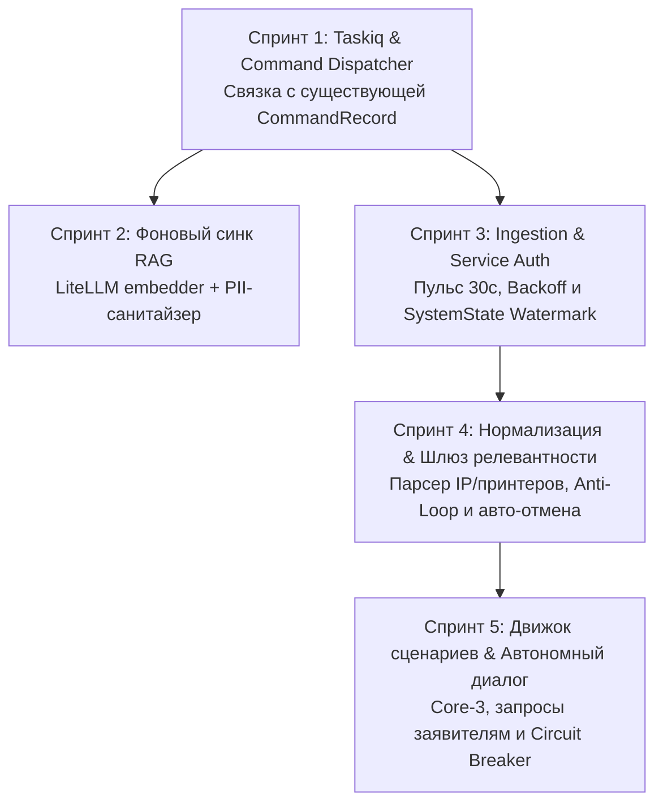

# 📋 Инженерный план реализации: Автономный конвейер и воркер IntraLink v2 (v2.1 Refined)

> **Статус:** Утверждено к реализации (с учетом аудита активной кодовой базы и Big-Shot архитектуры)  
> **Связанные спецификации:** [v2-automation-pipeline.md](file:///docs/architecture/v2-automation-pipeline.md), [v2-contracts-and-schemas.md](file:///docs/architecture/v2-contracts-and-schemas.md), [GEMINI.md](file:///GEMINI.md)

---

## 🎯 1. Архитектурный манифест и Big-Shot решения

1. **Единый журнал команд (Zero Redundant Tables):**
   * Мы **не создаем** отдельную таблицу `AutopilotRun`.
   * В кодовой базе уже есть [core/database/models.py:CommandRecord](file:///core/database/models.py). Мы используем `CommandRecord` как единый Outbox/Inbox журнал для всех действий (и человека в UI, и Автопилота).
   * Taskiq принимает `command_id: UUID`, исполняет сценарий и переводит `CommandRecord` в статус `succeeded` / `failed` с сохранением `result_json`.
   * Фронтенд для Short-Polling обращается напрямую к `GET /api/v2/tasks/{command_id}`.
2. **Переиспользование готового ядра v2 (100% Code Reuse):**
   * Сетевые пробы портов: используем готовый модуль [core/diagnostic/ports.py:probe_diagnostic_ports](file:///core/diagnostic/ports.py) (SMB 445 и WinRM 5985 за 300 мс).
   * Векторизация RAG: используем готовый клиент LiteLLM [core/rag/embedder.py:get_embedding_vector](file:///core/rag/embedder.py) (`bge-m3`).
   * XML-парсер тикетов: расширяем готовый [core/intraservice/parser.py](file:///core/intraservice/parser.py).

---

## 🛡️ 2. Покрытие слепых зон и Edge Cases

* **Edge Case 1: Защита от бесконечного цикла автоответчиков (Anti-Loop):**
  * Игнорирование любых событий, где автор — бот (`author_id == service_bot_id`).
  * Фильтрация почтовых автоответов (`is_auto_reply` по заголовкам и фразам: `out of office`, `автоматический ответ`, `в отпуске`).
  * Жесткий лимит `clarification_rounds <= 2`.
* **Edge Case 2: Состояние гонки с оператором (Optimistic Lock):**
  * Перед вызовом `update_task` в IntraService автопилот выполняет Read-before-Write проверку: если тикет уже взят в работу инженером или сменил статус, действие автопилота аннулируется.
* **Edge Case 3: Авторизация фонового воркера (Service Auth Bootstrap):**
  * Воркер поднимает сервисный токен из `.env` (`INTRASERVICE_BOT_LOGIN`, `INTRASERVICE_BOT_PASSWORD`) или из защищенного Vault в Redis при старте контейнера.
* **Edge Case 4: Защита сервера IntraService от перегрузки (Rate Limiting & Backoff):**
  * Семафор троттлинга на клиенте (максимум 3 одновременных запроса).
  * Экспоненциальный откат (Exponential Backoff: 30с ➔ 60с ➔ 120с) при получении 5xx ошибок или сетевых таймаутов.

---

## 🚀 3. Пошаговые спринты реализации

---

### 📦 Спринт 1: Taskiq Runtime и подключение к `CommandRecord`
* **Цель:** Оживить `CommandRecord`, связав существующий метод `execute_action` с воркером Taskiq.

#### Задачи:
1. **Зависимости:** В `worker/pyproject.toml` добавить `taskiq`, `taskiq-redis`, `taskiq-fastapi`.
2. **Брокер очередей (`worker/src/broker.py`):**
   * Инициализация `ListQueueBroker` с очередями: `default`, `rag_compute`, `windows_exec`.
3. **Диспетчер команд (`worker/src/tasks/command_dispatcher.py`):**
   * Задача `@broker.task` принимающая `command_id: UUID`.
   * Загрузка `CommandRecord` из PostgreSQL, вызов обработчика действия, обновление статуса на `running` ➔ `succeeded` / `failed`.
4. **Связка с API (`api/src/features/tickets/service.py`):**
   * При создании `CommandRecord` в `execute_action` отправлять вызов в Taskiq: `await command_task.kiq(cmd.id)`.
5. **Эндпоинт статуса (`api/src/features/tickets/router.py`):**
   * Эндпоинт `GET /api/v2/tasks/{command_id}` для Short-Polling фронтенда, отдающий состояние `CommandRecord`.

* **DoD:** Нажатие действия в UI (или curl-запрос к API) создает `CommandRecord`, Taskiq воркер берет его в работу, переводит в `succeeded`, а фронтенд видит изменение статуса за 1.5 секунды.

---

### 📚 Спринт 2: Фоновый синк Базы знаний (RAG)
* **Цель:** Наладить регулярное ночное обучение базы знаний на закрытых тикетах через существующий `core.rag.embedder`.

#### Задачи:
1. **PII-Санитайзер (`core/rag/sanitizer.py`):**
   * Маскирование телефонов (`[PHONE]`), email (`[EMAIL]`), паролей и токенов.
   * Обрезка дампов логов до 2000 символов.
2. **Сервис инкрементального синка (`api/src/features/knowledge_base/sync_service.py`):**
   * Запрос в IntraService по статусам `[3, 4, 30]` за последние 48 часов с троттлингом (семафор 3 запроса).
   * Отсечение односложных отписок («ок», «сделано»).
   * Семантический фильтр Cosine Gate > 0.90 (пропуск дубликатов).
   * Лимит 30–50 решений на листовой сервис каталога.
3. **Периодическая джоба (`worker/src/tasks/sync_kb.py`):**
   * Задача по расписанию в Taskiq на **02:00 ежедневно**.
   * Векторизация через `get_embedding_vector` и вставка в `task_knowledge_base`.

* **DoD:** Векторная база автоматически пополняется новыми записями без дублей и утечек персональных данных.

---

### 📡 Спринт 3: Мониторинг очереди и Ingestion (с защитой от сбоев)
* **Цель:** Непрерывный пульс 30с с автоматической авторизацией и защитой от падений IntraService.

#### Задачи:
1. **Таблица состояния (`core/database/models.py`):**
   * Модель `SystemState` (`key`, `last_check_time`, `last_task_id`, `updated_at`).
2. **Service Auth Bootstrap (`worker/src/services/auth.py`):**
   * Чтение сервисного логина/пароля из окружения, формирование `service_auth_b64`.
3. **Поллер с защитой (`worker/src/tasks/poller.py`):**
   * Пульс 30 секунд.
   * Двойной срез: `filterid=984` + `ChangedMoreThan=<watermark>`.
   * **Exponential Backoff:** при сетевом сбое или 5xx ошибке интервал плавно растет до 120с.
   * При обнаружении новых тикетов ➔ постановка в очередь триажа.
   * При обнаружении сервисной учетки в `ExecutorIds` ➔ постановка в очередь автопилота.

* **DoD:** Поллер бесперебойно отслеживает очередь, переживает перезапуски без потери точки отсчета и не роняет IntraService при сетевых сбоях.

---

### 🔍 Спринт 4: Нормализация сущностей, Anti-Loop и Шлюз релевантности
* **Цель:** Точное извлечение параметров оргтехники и мгновенная автоматическая отмена нецелевых обращений.

#### Задачи:
1. **Расширение парсера (`core/intraservice/parser.py` и `dto.py`):**
   * Добавление полей в `ExtractedEntitiesDTO`: `printer_address` (IPv4/сеть), `printer_model` (вендор/модель), `target_user`.
   * Нормализация имен хостов (приведение к `WKS-XXXX`).
2. **Anti-Loop Guard (`worker/src/services/anti_loop.py`):**
   * Проверка `is_auto_reply` (отсечение почтовых автоответчиков).
   * Проверка автора (`author_id != service_bot_id`).
3. **Фоновый триаж и Шлюз релевантности (`worker/src/tasks/triage.py`):**
   * Прогон через детерминированные правила (Личные ЭЦП, 1С не в том разделе).
   * При 100% нецелевом обращении:
     * **Optimistic check:** проверка, что тикет еще не взят инженером.
     * Перевод статуса в `30` («Отменена»).
     * Публикация регламентного комментария заявителю.
     * Публикация скрытой заметки аудита (`IsPrivateComment: true`).

* **DoD:** Нецелевой тикет отменяется за 1.5 секунды, в тикете появляется скрытый аудит, а почтовые роботы не вызывают зацикливания.

---

### ⚙️ Спринт 5: Движок сценариев, диалоговый цикл и матрица автономии
* **Цель:** Полноценный замкнутый автопилот Core-3 сценариев с диалогом и Circuit Breaker.

#### Задачи:
1. **Матрица автономии (`core/database/models.py`):**
   * Модель `AutopilotPolicy` (`scenario_key`, `mode`, `min_confidence`, `consecutive_failures`).
   * Базовый файл по умолчанию `config/autopilot_defaults.yaml`.
   * Эндпоинты `GET/PUT /api/v2/autopilot/policies`.
2. **Предохранитель (Circuit Breaker):**
   * При 3 ошибках подряд — авто-откат сценария из `FULL_AUTO` в `ASSISTED`.
3. **Реализация сценариев Core-3 (`worker/src/scenarios/`):**
   * `install_printer` — использует `core.diagnostic.ports` для preflight, отправляет в очередь `windows_exec`, верифицирует.
   * `ad_password_reset` — прямое исполнение через LDAP/LDAPS.
   * `rag_consultation` — автономный ответ на типовые вопросы через базу знаний.
4. **Автономный диалоговый цикл:**
   * Нехватка данных или ПК выключен ➔ вежливый комментарий заявителю + статус `6` («Приостановлена»).
   * Ответ заявителя ➔ поллер обнаруживает комментарий ➔ парсинг данных ➔ продолжение исполнения.
   * Лимит уточнений: не более 2 раундов.
5. **UI-интеграция в веб-панель:**
   * Вкладка «Автопилот» (журнал запусков на базе `CommandRecord`, тумблеры сценариев, алерты Circuit Breaker).

* **DoD:** Сценарии Core-3 автономно решают задачи, ведут диалог с заявителями и защищены предохранителем от массовых сбоев.
