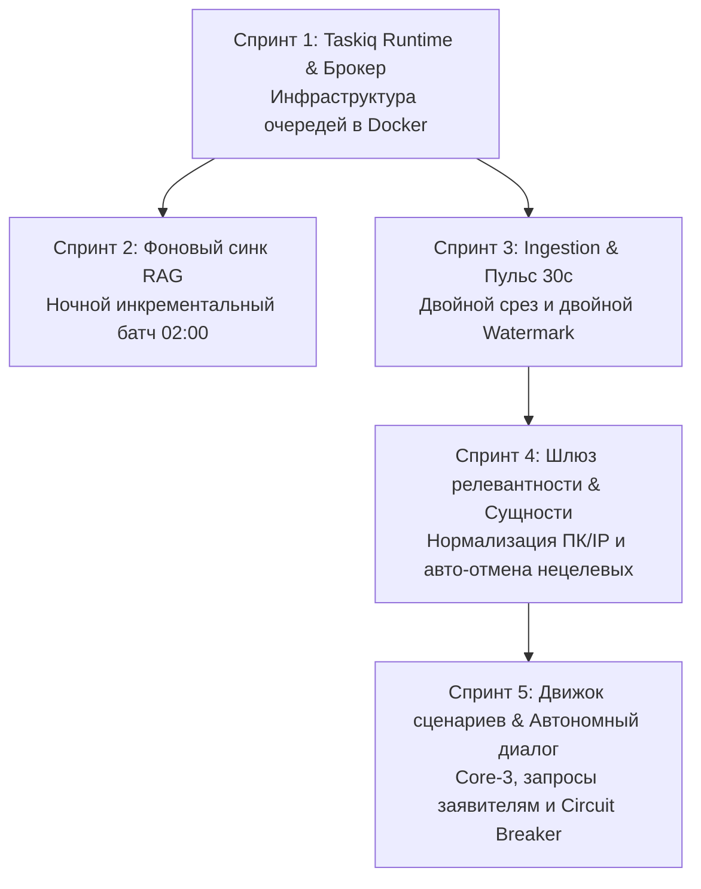

# 📋 Инженерный план реализации: Автономный конвейер и воркер IntraLink v2

> **Статус:** Утверждено к реализации  
> **Связанные спецификации:** [v2-automation-pipeline.md](file:///docs/architecture/v2-automation-pipeline.md), [domain-model-and-contracts.md](file:///docs/architecture/domain-model-and-contracts.md), [GEMINI.md](file:///GEMINI.md)

---

## 🎯 1. Архитектурные инварианты и цели

1. **Zero-Stub Policy:** Каждая фоновая функция, модель и UI-компонент обязаны иметь реальный источник данных и сквозное тестирование.
2. **VSA (Vertical Slice Architecture):** Задачи воркера вызывают доменные сервисы через внедрение зависимостей (`TaskiqDepends`), не нарушая границ модулей.
3. **Двухконтурная модель:** Единый движок сценариев работает как в полуавтомате (`ASSISTED`, валидация оператором в UI), так и в полном автомате (`FULL_AUTO`, триггер — назначение сервисной учетки или Шлюз релевантности).

---

## 🚀 2. Спринты реализации

---

### 📦 Спринт 1: Taskiq Runtime и инфраструктура очередей
* **Цель:** Заменить пустой `sleep(60)` воркера на полноценный асинхронный Taskiq рантайм с подключением к Redis и готовностью к масштабированию.

#### Задачи:
1. **Зависимости:** Добавить в `worker/pyproject.toml` зависимости `taskiq`, `taskiq-redis`, `taskiq-fastapi`.
2. **Инициализация брокера (`worker/src/broker.py`):**
   * Создать `ListQueueBroker` на базе Redis с префиксами очередей.
   * Настроить разделение очередей: `default`, `rag_compute`, `windows_exec`.
3. **Рантайм воркера (`worker/src/main.py`):**
   * Настройка жизненного цикла startup/shutdown (пул соединений БД, Redis).
   * Подключение middleware логирования и обработки исключений.
4. **Инфраструктура (`deploy/docker-compose.yml` и `worker/Dockerfile`):**
   * Проверить конфигурацию контейнера `worker` для запуска команды `taskiq worker worker.src.broker:broker`.
   * Добавить сервис `scheduler` для запуска `taskiq scheduler worker.src.broker:scheduler`.

* **Definition of Done (DoD):**
  * `docker compose up -d worker scheduler` запускается без ошибок.
  * Тестовая задача `@broker.task` успешно ставится из API и выполняется воркером с фиксацией в Redis.

---

### 📚 Спринт 2: Фоновый инкрементальный синк Базы знаний (RAG)
* **Цель:** Обеспечить регулярное ночное самообучение базы знаний на реальных закрытых заявках.

#### Задачи:
1. **Модуль очистки текста (`core/rag/sanitizer.py`):**
   * Маскирование телефонов (`[PHONE]`), email (`[EMAIL]`), паролей и токенов.
   * Обрезка дампов логов до 2000 символов.
2. **Логика отбора и дедупликации (`api/src/features/knowledge_base/sync_service.py`):**
   * Выборка заявок со статусами `3` («Выполнена»), `4` («Закрыта»), `30` («Отменена») за последние 48 часов.
   * Отсечение односложных решений («ок», «готово»).
   * Семантический фильтр Cosine Gate > 0.90 (пропуск дубликатов).
   * Лимит 30–50 тикетов на листовой сервис каталога.
3. **Периодическая джоба (`worker/src/tasks/sync_kb.py`):**
   * Регистрация cron-расписания в Taskiq на **02:00 ежедневно**.
   * Батчевая векторизация через FastEmbed и запись в `task_knowledge_base`.

* **Definition of Done (DoD):**
  * Ручной вызов задачи через API запускает батчевый синк, очищает данные и сохраняет векторы в PostgreSQL.
  * Юнит-тесты покрывают PII-санитайзер и фильтр качества.

---

### 📡 Спринт 3: Мониторинг очереди и событийная модель (Ingestion)
* **Цель:** Организовать непрерывный цикл отслеживания новых тикетов и реакцию на назначение сервисной учетки.

#### Задачи:
1. **Модель состояния (`core/database/models.py`):**
   * Создать таблицу `SystemState` с полями `key` (PK), `last_check_time`, `last_task_id`, `updated_at`.
2. **Менеджер Watermark (`worker/src/services/watermark.py`):**
   * Двойное сохранение метки времени: горячий кэш в Redis (`worker:last_check_time`) + персистентная запись в PostgreSQL.
3. **Фоновый поллер (`worker/src/tasks/poller.py`):**
   * Cron-задача каждые 30 секунд.
   * Двойной срез:
     * Новые заявки по фильтру 1-й линии (`filterid=984`).
     * Измененные заявки (`ChangedMoreThan=<watermark>`).
   * Маршрутизация событий:
     * Новый тикет ➔ отправка задачи на фоновый триаж.
     * `ExecutorIds` содержит сервисную учетку ➔ триггер автопилота.
     * Новый комментарий заявителя в статусе 6 ➔ пробуждение диалогового цикла.

* **Definition of Done (DoD):**
  * Поллер каждые 30 секунд фиксирует новые события без дублирования.
  * При перезапуске воркера watermark восстанавливается из БД без повторной обработки тикетов.

---

### 🔍 Спринт 4: Нормализация сущностей и Шлюз релевантности
* **Цель:** Автоматически извлекать реквизиты ПК/оргтехники и отсекать нецелевые заявки в фоне.

#### Задачи:
1. **Расширение контракта сущностей (`core/intraservice/dto.py` и `parser.py`):**
   * Добавить поля: `printer_address`, `printer_model`, `target_user` в `ExtractedEntitiesDTO`.
   * Реализовать нормализатор хостов и извлечение IPv4/моделей оргтехники.
2. **Фоновый пайплайн триажа (`worker/src/tasks/triage.py`):**
   * При получении тикета из поллера:
     * Прогон через детерминированные правила Шлюза релевантности.
     * Поиск дубликатов по заявителю.
     * Вызов LiteLLM `helpdesk-fast` (Ollama Qwen2.5) для классификации.
3. **Авто-отмена нецелевых обращений:**
   * При 100% срабатывании правила (Личные ЭЦП, 1С не в том разделе):
     * Перевод статуса в `30` («Отменена»).
     * Публикация официального регламентного комментария заявителю.
     * Публикация скрытой заметки аудита (`IsPrivateComment: true`).

* **Definition of Done (DoD):**
  * Нецелевой тикет отменяется автоматически за < 2 секунд с записью скрытой заметки в тикет.
  * В веб-интерфейсе для новых тикетов отображаются извлеченные сущности и статус анализа.

---

### ⚙️ Спринт 5: Движок сценариев, диалоговый цикл и матрица автономии
* **Цель:** Замкнуть конвейер: выполнение сценариев Core-3, автономный диалог с заявителем и управление тумблерами в UI.

#### Задачи:
1. **Схемы БД и API управления политиками (`core/database/models.py`):**
   * Таблица `AutopilotPolicy` (`scenario_key`, `mode`, `min_confidence`, `circuit_breaker_failures`).
   * Эндпоинты `GET/PUT /api/v2/autopilot/policies`.
2. **Предохранитель (Circuit Breaker):**
   * Счётчик ошибок в Redis. При 3 сбоях подряд — автоматический откат сценария в `ASSISTED`.
3. **Реализация сценариев Core-3 (`worker/src/scenarios/`):**
   * `install_printer` — проверка портов, отправка в `windows_exec`, верификация.
   * `ad_password_reset` / `ad_unlock` — прямое исполнение через LDAP/LDAPS.
   * `rag_consultation` — автономное закрытие типовых вопросов через базу знаний.
4. **Автономный диалоговый цикл (Autonomous Dialogue):**
   * Нехватка данных / выключен ПК ➔ комментарий заявителю + статус `6` («Приостановлена»).
   * Ответ заявителя ➔ пробуждение сценария и доводка до решения.
5. **UI-интеграция:**
   * Вкладка «Автопилот» в веб-интерфейсе (журнал запусков, метрики, тумблеры сценариев).
   * Short-polling статуса выполнения задач (`GET /api/v2/tasks/{task_id}`).

* **Definition of Done (DoD):**
  * Сквозной сценарий установки принтера отрабатывает в Happy Path и умеет запрашивать данные у заявителя при их нехватке.
  * Все действия прозрачно отображаются на вкладке «Автопилот» в веб-интерфейсе.
