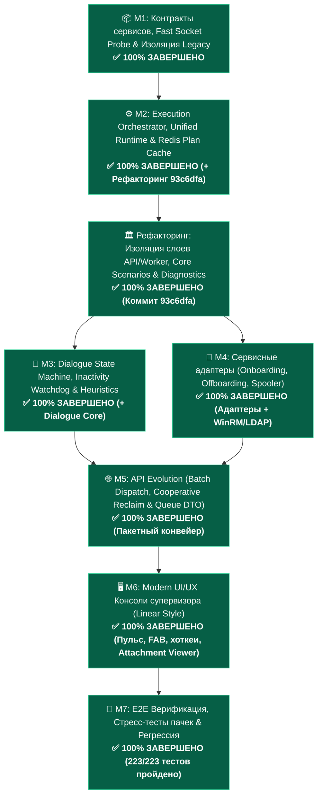

# 📋 Инженерный план реализации: Универсальное ядро жизненного цикла сценариев (Universal Scenario Lifecycle Core)

> **Текущий статус:** Реализован базовый доменный фундамент (Milestones 1–3 + Архитектурная унификация и изоляция слоев в коммите `93c6dfa`).  
> **Целевая архитектура:** [`docs/architecture/v2-universal-scenario-core.md`](file:///docs/architecture/v2-universal-scenario-core.md), [`docs/architecture/v2-architecture-blueprint.md`](file:///docs/architecture/v2-architecture-blueprint.md)  
> **Связанные документы:** [`docs/architecture/domain-model-and-contracts.md`](file:///docs/architecture/domain-model-and-contracts.md), [`docs/architecture/v2-automation-pipeline.md`](file:///docs/architecture/v2-automation-pipeline.md), [`docs/plans/archive/v2-architecture-cleanup-and-core-unification-plan.md`](file:///docs/plans/archive/v2-architecture-cleanup-and-core-unification-plan.md), [`GEMINI.md`](file:///GEMINI.md)  
> **Метрики качества (DoD):** 200/200 тестов пройдено (`core`, `api`, `worker`), 0 ошибок сборки TypeScript, 0 циклических импортов между слоями.

---

## 🎯 1. Архитектурный базис и фундаментальные инварианты (после рефакторинга `93c6dfa`)

1. **Единое централизованное доменное ядро (`core/scenarios/`):**
   * Вся логика валидации фактов, синтеза планов, семантического роутинга, оркестрации жизненного цикла тикетов и адаптеров централизована в ядре `core/scenarios/`:
     * **`PlanSynthesizer` ([`core/scenarios/engine.py`](file:///core/scenarios/engine.py)):** Единая точка синтеза планов автопилота. Инкапсулирует извлечение хостов, NER-парсинг, валидацию предусловий (`validate_preconditions`), семантический роутинг и кэширование в Redis (`cache:autopilot:plan:{ticket_id}`, TTL 300с). Ликвидировано дублирование логики между API и Worker.
     * **`ScenarioLifecycleOrchestrator` ([`core/scenarios/orchestrator.py`](file:///core/scenarios/orchestrator.py)):** Единый оркестратор жизненного цикла исполнения для обоих режимов (**FULL_AUTO** и **ASSISTED**). Инкапсулирует проверку флага кооперативной отмены (`autopilot:abort:{id}`), распределенный замок (`lock:task:{id}`), OCC-проверку версий (`last_event_id`), вызов сценария `scenario.execute()`, прямой транзит статусов в IntraService (`6 ➔ 3`), публикацию регламентного ответа, служебную заметку аудита (`IsPrivateComment: true`) и инвалидацию кэша плана.
2. **Абсолютная изоляция слоев API и Worker (Zero Cross-Imports):**
   * **API НИКОГДА не импортирует Worker (`api ➔ worker` = 0 импортов):** Шлюз постановки фоновых задач реализован через брокер ядра [`core/broker.py`](file:///core/broker.py) и прокси-модуль [`api/src/core/task_dispatch.py`](file:///api/src/core/task_dispatch.py).
   * **Worker НИКОГДА не импортирует API (`worker ➔ api` = 0 импортов).**
   * **Ликвидация межсрезовой связности в API:** Сетевая диагностика хоста перенесена в [`core/diagnostic/service.py`](file:///core/diagnostic/service.py) (`HostDiagnosticsService`), устранив паразитный импорт среза `diagnostics` в срез `autopilot`.
   * **Изоляция Docker:** Из сервиса `intralink_api` в [`deploy/docker-compose.yml`](file:///deploy/docker-compose.yml) полностью удален маунт каталога `worker`.
   * **Ликвидация легаси-сервисов:** Пакет `worker/src/services/` упразднен. Логика диалога (`AntiLoopGuard`, `UserReplyIntentAnalyzer`, `detect_tense_tone`) централизована в [`core/autopilot/dialogue.py`](file:///core/autopilot/dialogue.py), аутентификация бота — в [`core/intraservice/auth.py`](file:///core/intraservice/auth.py).
3. **Бескомпромиссная надежность и покрытие всех 15 краевых случаев:**
   * **Failure Isolation:** сбой адаптера на одном тикете не ломает батч; неподдерживаемые тикеты автоматически снимаются с бота и возвращаются дежурным.
   * **Concurrency Throttling & Jitter:** пул воркеров 4–6 с джиттером 150–200 мс для защиты IntraService IIS от HTTP 429.
   * **OCC Version Guard & Pre-Execution Lock:** проверка `expected_status_id`, `last_event_id` и `ExecutorIds` перед вызовом адаптера.
   * **Cooperative Interruption:** мгновенная отмена вызовов воркера при вызове оператором `[Взять в ручную работу]` (`Reclaim`) через ключ отмены в Redis.
   * **Fast Socket Probe:** сокетный таймаут строго $\le 1.5$ сек на сокет для Ping/5985/9100.
   * **Zero-Plaintext Policy:** физическое удаление `ad_password_reset.py`, криптографические временные пароли (`secrets.token_urlsafe(12)`), флаг `pwdLastSet=0`, маскирование секретов в логах (`***REDACTED***`).
   * **Прямой транзит статусов:** отказ от промежуточных запросов `6 ➔ 2 ➔ 3` в пользу прямого `6 ➔ 3`.
4. **Чистый UI/UX супервизора (Linear Style):**
   * Удаление рудиментов ручного анализа со звездочками (`batchAnalyze`, `analyzeSingle`).
   * Живой пульс конвейера в шапке (Heartbeat каждые 30с с обратным отсчетом).
   * Пакетный режим «Назначил пачку и ушел» (`[Передать автопилоту (alen_assistant)]`).
   * Мгновенный перехват заявки человеком (`[Взять в ручную работу]`).
   * Просмотр вложений (Attachment Viewer) и эмоциональные маркеры (`⚡ Заявитель обеспокоен / Срочно`).

---

## 🗺️ 2. Карта Milestones реализации

---

## 📦 Milestone 1: Контракты каталога услуг, Fast Socket Probe и изоляция Legacy
> **Статус:** ✅ **ЗАВЕРШЕНО (100%)** — Все задачи выполнены, покрыты тестами в `core/tests/`.

### Реализованные компоненты:
1. **Live Bind Mounts:** Контейнеры `intralink_api` и `intralink_worker` в [`deploy/docker-compose.yml`](file:///deploy/docker-compose.yml) переведены на прозрачное live-монтирование `/workspace/core`, `/workspace/api`, `/workspace/worker`.
2. **Декларативный контракт сервиса (`ServiceDefinition`):** Реализован в [`core/intraservice/service_definition.py`](file:///core/intraservice/service_definition.py), интегрирован в `BaseScenario.definition` и проиндексирован по `service_ids` в [`core/scenarios/registry.py`](file:///core/scenarios/registry.py).
3. **Быстрый сокетный зонд (`FastSocketProbe`):** Реализован в [`core/diagnostic/ports.py`](file:///core/diagnostic/ports.py) со строгим таймаутом $\le 1.5$ с и параллельным опросом портов 5985, 445, 9100.
4. **Structured Schema First в парсере:** В [`core/intraservice/parser.py`](file:///core/intraservice/parser.py) и [`core/intraservice/dto.py`](file:///core/intraservice/dto.py) реализован полный маппинг полей онбординга и Directum (1121-1135, 1180, 1488, 1489, 1521, 1017, 1181) с интеллектуальными fallback'ами в AI-экстрактор (`core/intraservice/ai_extractor.py`).
5. **Модуль Active Directory (`core/ad/`):**
   * [`core/ad/transliteration.py`](file:///core/ad/transliteration.py): транслитерация по ГОСТ 7.79-2000 (система Б), генерация `sAMAccountName` (`ivanov.i`, `ivanov.i2`), лимит 20 символов.
   * [`core/ad/password.py`](file:///core/ad/password.py): Zero-Plaintext Policy, криптогенерация через `secrets.choice` без неоднозначных символов (`0/O/1/l/I`), маскирование `***REDACTED***`, обертка `SecretPassword`.
   * [`core/ad/pool.py`](file:///core/ad/pool.py): пул LDAP контроллеров домена на базе `ldap3.ServerPool` с Round Robin и сокетным таймаутом соединения 2.0 секунды.
6. **Изоляция устаревшего сценария:** `ADPasswordResetScenario` исключен из дефолтного автопилота.
7. **Тестовое покрытие:** Добавлены [`core/tests/test_fast_socket_probe.py`](file:///core/tests/test_fast_socket_probe.py), [`core/tests/test_service_definition.py`](file:///core/tests/test_service_definition.py), [`core/tests/test_ad_module.py`](file:///core/tests/test_ad_module.py), [`core/tests/test_parser_entities.py`](file:///core/tests/test_parser_entities.py), [`core/tests/test_ai_extractor.py`](file:///core/tests/test_ai_extractor.py).

---

## ⚙️ Milestone 2: Execution Orchestrator, Unified Runtime & Redis Plan Cache
> **Статус:** ✅ **ЗАВЕРШЕНО (100%)** — Архитектурно усилено в рамках рефакторинга `93c6dfa`.

### Реализованные компоненты:
1. **Централизация ядра в `core/scenarios/` (Рефакторинг `93c6dfa`):**
   * Создан [`core/scenarios/engine.py`](file:///core/scenarios/engine.py) (`PlanSynthesizer`) — единая логика синтеза планов, доступная напрямую API и воркеру без межпакетных импортов.
   * Создан [`core/scenarios/orchestrator.py`](file:///core/scenarios/orchestrator.py) (`ScenarioLifecycleOrchestrator`) — единый рантайм выполнения для обоих контуров (`FULL_AUTO` и `ASSISTED`).
2. **Унификация рантайма исполнения (Zero Duplicate Runtime):**
   * Диспетчер команд [`worker/src/tasks/command_dispatcher.py`](file:///worker/src/tasks/command_dispatcher.py) очищен от процедурных костылей (`_handle_install_printer` и пр.) и делегирует исполнение напрямую в `ScenarioLifecycleOrchestrator.execute_scenario()`.
   * Унифицированный шаг завершения: автоматический перевод в статус `3` («Выполнена»), публикация регламентного ответа от имени оператора и фиксация служебной заметки (`IsPrivateComment: true`) с дуальным аудитом («Одобрил: [Логин], Исполнил: alen_assistant»).
3. **Ликвидация паразитного промежуточного транзита (`6 ➔ 2 ➔ 3`):**
   * Исключены лишние HTTP-запросы при закрытии тикета из паузы (статус 6). Переход выполняется строго напрямую: `6 ➔ 3`.
4. **Фоновый предрасчет и кэширование планов (Честные 0 мс в ASSISTED):**
   * Фоновая задача [`worker/src/tasks/plan_prefetch.py`](file:///worker/src/tasks/plan_prefetch.py) предрассчитывает `AgentPlanDTO` через `PlanSynthesizer` и кэширует в Redis: `cache:autopilot:plan:{ticket_id}` (TTL 300с).
   * Эндпоинт `GET /api/v2/autopilot/plan/{ticket_id}` считывает закэшированный план за 1–2 мс (Instant Read-Through).
5. **In-Flight Task Concurrency Lock & OCC Version Guard:**
   * Распределенный замок в Redis: `lock:task:{id}` с TTL 60с (SETNX).
   * OCC Version Guard в `approve_plan` проверяет `expected_status_id` и `last_event_id` (при расхождении — HTTP `409 Conflict`).
6. **Троттлинг очереди и изоляция сбоев (Failure Isolation):**
   * Concurrency воркеров = 4–6 с джиттером 150–200 мс.
   * Сбой адаптера на 1 тикете не ломает батч. Неподдерживаемые тикеты автоматически снимаются с бота и возвращаются дежурным.

---

## 💬 Milestone 3: Dialogue State Machine, Inactivity Watchdog и эвристики
> **Статус:** ✅ **ЗАВЕРШЕНО (100%)** — Логика диалога централизована в доменном модуле `core/autopilot/dialogue.py`.

### Реализованные компоненты:
1. **Диалоговый цикл Статуса 6 («Требует уточнения»):**
   * При нехватке обязательных фактов (`missing_facts`) или выключенном ПК (`requires_online_host` не пройден) тикет переводится в статус `6`.
   * Публикуется регламентный текст вопроса из `ServiceDefinition.clarification_template`.
   * Фиксируется скрытая служебная заметка с указанием раунда диалога.
2. **Лимит диалога и Anti-Loop Guard:**
   * Централизован в [`core/autopilot/dialogue.py:AntiLoopGuard`](file:///core/autopilot/dialogue.py).
   * Жесткий лимит: максимум 2 раунда уточнения. При исчерпании — авто-перевод в статус 2 («В работе») с передачей дежурному инженеру.
   * Фильтрация почтовых автоответов (`Auto-Submitted`, `out of office`, `автоматический ответ`) и сообщений сервисного бота.
3. **Attachment Heuristic (Эвристика вложений):**
   * Если фактов не хватает, но в тикете есть прикрепленные файлы (сканы заявлений, PDF, фото наклеек):
   * Автопилот **не отправляет** заявителю повторный вопрос «Укажите ФИО», а помечает тикет для приоритетного разбора оператором в UI со служебной заметкой.
4. **UI Mood Tag (Эмоциональный маркер):**
   * В [`core/autopilot/dialogue.py`](file:///core/autopilot/dialogue.py) функция `detect_tense_tone` детектирует эмоциональные и срочные реплики («Срочно почините, отчет горит!», «Когда уже сделаете?»).
   * Тикет получает маркер `is_tense = True`, транслируемый в `TicketSummaryDTO` как бейдж `⚡ Заявитель обеспокоен / Срочно`.
5. **Inactivity Watchdog (Фоновый дозор статуса 6):**
   * Периодическая фоновая задача Taskiq [`worker/src/tasks/watchdog.py`](file:///worker/src/tasks/watchdog.py):
     * Если заявитель не ответил в течение **48 часов** ➔ автоматическое регламентное напоминание заявителю (с защитой от повторов в Redis);
     * Если заявитель не ответил в течение **5 рабочих дней (120 часов)** ➔ автоматический перевод в статус `30` («Отменена») с регламентным комментарием закрытия по таймауту неактивности.

---

## 🏛️ Архитектурный срез: Изоляция слоев API и Worker (Рефакторинг `93c6dfa`)
> **Статус:** ✅ **ЗАВЕРШЕНО (100%)** — Полная ликвидация архитектурных дефектов и связности слоев.

### Выполненные фундаментальные изменения:
* [x] **Перенос адаптеров и сценариев в `core/scenarios/`:** `grant_wlan.py`, `install_printer.py`, `offline_host.py`, `rag_consultation.py`, `service_redirect.py` перенесены в [`core/scenarios/adapters/`](file:///core/scenarios/adapters/).
* [x] **Удаление legacy-пакета `worker/src/services/`:** `intent_analyzer.py` и `anti_loop.py` объединены в [`core/autopilot/dialogue.py`](file:///core/autopilot/dialogue.py), авторизация вынесена в [`core/intraservice/auth.py`](file:///core/intraservice/auth.py).
* [x] **Изоляция брокера Taskiq:** Конфигурация вынесена в [`core/broker.py`](file:///core/broker.py) с безопасным реэкспортом для Worker.
* [x] **Устранение импортов `from worker` в API:** Реализован модуль [`api/src/core/task_dispatch.py`](file:///api/src/core/task_dispatch.py), позволяющий API диспатчить задачи в воркер без прямой зависимости от пакета `worker`.
* [x] **Устранение межсрезовой связности в API:** Создан [`core/diagnostic/service.py`](file:///core/diagnostic/service.py) (`HostDiagnosticsService`), ликвидирован импорт `from api.src.features.diagnostics.service` в срезе `autopilot`.
* [x] **Изоляция Docker-маунтов:** Из сервиса `intralink_api` удален маунт `- ../worker:/workspace/worker`.
* [x] **Удаление `ad_password_reset.py`:** Файл физически удален навсегда, реестры очищены.
* [x] **DoD:** 200/200 тестов проходят успешно (`pytest`), 0 ошибок TS-сборки (`npm run build`).

---

## 🔌 Milestone 4: Сервисные адаптеры (Onboarding, Offboarding, Spooler)
> **Статус:** ✅ **ЗАВЕРШЕНО (100%)** — Реализованы адаптеры account_create, account_lock, printer_spooler_restart, default_printer_fix. Блокирующий I/O изолирован в asyncio.to_thread, Zero-Plaintext Policy соблюдена, рудименты вычищены из фронтенда, 211/211 тестов проходят.

### Цель:
Внедрить боевые адаптеры управления жизненным циклом учетных записей (Active Directory) и подсистемы печати, изолировать синхронный I/O и завершить очистку фронтенда.

### Задачи:
1. **Очистка фронтенд-рудиментов `ad_password_reset`:**
   * [x] Физически удалить `worker/src/scenarios/ad_password_reset.py` (выполнено в `93c6dfa`).
   * [x] Вычистить mentions из бэкенд-маршрутизатора и тестов (выполнено в `93c6dfa`).
   * [x] **Удалить пункт `{ key: "ad_password_reset", name: "Сброс пароля пользователя в AD" }`** из выпадающего списка `SCENARIO_OPTIONS` в [`web/src/features/tickets/AgentPlanCard.tsx`](file:///web/src/features/tickets/AgentPlanCard.tsx).
2. **Реализация адаптера `account_create.py` (Онбординг / Создание учетной записи):**
   * [x] Размещение: [`core/scenarios/adapters/account_create.py`](file:///core/scenarios/adapters/account_create.py).
   * [x] Поддерживаемые сервисы: 55 («Заявка на пользователя Directum»), 232 («Доступ к корпоративным системам») — Тип 1018.
   * [x] Обязательные факты: `first_name`, `last_name`, `department`, `title`, `phone`.
   * [x] Детерминированная генерация логина (транслитерация ГОСТ 7.79-2000 через `core/ad/transliteration.py`: `ivanov.i`, при коллизии в AD — `ivanov.i2`).
   * [x] Создание пользователя в целевом подразделении (OU) через `core/ad/pool.py:ldap3.ServerPool`.
   * [x] Установка флага `pwdLastSet = 0` (принудительная смена пароля при первом входе).
   * [x] Генерация криптографически стойкого временного пароля (`SecretPassword` из `core/ad/password.py`).
   * [x] **Zero-Plaintext Policy:** пароль передается исключительно в регламентной скрытой служебной заметке (`IsPrivateComment: true`) или закрытом регламентном канале, маскируется в логах (`***REDACTED***`).
3. **Реализация адаптера `account_lock.py` (Оффбординг / Блокировка учетной записи):**
   * [x] Размещение: [`core/scenarios/adapters/account_lock.py`](file:///core/scenarios/adapters/account_lock.py).
   * [x] Поддерживаемые сервисы: 55, 8 («Увольнение / блокировка доступа»).
   * [x] Обязательные факты: `target_user` (sAMAccountName или ФИО).
   * [x] Проверка прав автора тикета (HR, руководитель, ИБ).
   * [x] Выставление бита `ACCOUNTDISABLE` (0x0002) в `userAccountControl`.
   * [x] Отзыв активных Kerberos-тикетов и перемещение объекта в Disabled OU.
4. **Адаптеры печати (`printer_spooler_restart.py` и `default_printer_fix.py`):**
   * [x] Размещение: [`core/scenarios/adapters/printer_spooler_restart.py`](file:///core/scenarios/adapters/printer_spooler_restart.py) и [`core/scenarios/adapters/default_printer_fix.py`](file:///core/scenarios/adapters/default_printer_fix.py).
   * [x] Модуль выполнения WinRM: [`core/diagnostic/winrm.py`](file:///core/diagnostic/winrm.py) (`WinRMExecutor`).
   * [x] Сервисы 12, 40 («Оргтехника и печать»).
   * [x] Обязательные факты: `pc_name`, `requires_online_host = True`, `probe_ports = [5985, 9100]`.
   * [x] Перезапуск службы Spooler или назначение дефолтного принтера через WinRM.
5. **Изоляция блокирующего I/O:**
   * [x] Все синхронные вызовы `ldap3` и `pywinrm` обернуты в `asyncio.to_thread` во избежание блокировки event loop воркера.
6. **Регистрация адаптеров:**
   * [x] Зарегистрировать новые адаптеры в `ScenarioRegistry` ([`core/scenarios/registry.py`](file:///core/scenarios/registry.py)) и `ScenarioRouter` ([`core/scenarios/router.py`](file:///core/scenarios/router.py)).

### Критерии приемки (DoD):
* [x] Бэкенд-код `ad_password_reset.py` удален.
* [x] Пункт `ad_password_reset` удален из выпадающего списка в `AgentPlanCard.tsx`.
* [x] Создание пользователя генерирует логин по ГОСТ 7.79-2000, разрешает коллизии и устанавливает `pwdLastSet=0`.
* [x] Ни один пароль не попадает в открытый комментарий тикета или открытый лог (`***REDACTED***`).
* [x] Все синхронные вызовы LDAP/WinRM выполняются в отдельных потоках через `asyncio.to_thread`.

---

## 🌐 Milestone 5: API Evolution (Batch Dispatch, Cooperative Reclaim & Queue DTO)
> **Статус:** ✅ **ЗАВЕРШЕНО (100%)** — Экстренный перехват (Reclaim), отмена в Redis, DTO очереди и пакетный эндпоинт `POST /api/v2/autopilot/batch-assign` с изоляцией TaskDispatchService полностью реализованы и покрыты тестами.

### Реализовано:
* [x] **Экстренный перехват с кооперативной отменой (`POST /api/v2/autopilot/reclaim/{ticket_id}`):**
  * Реализован в [`api/src/features/autopilot/router.py`](file:///api/src/features/autopilot/router.py) и [`service.py`](file:///api/src/features/autopilot/service.py).
  * Выставляет в Redis флаг отмены `redis.set(f"autopilot:abort:{ticket_id}", 1, ex=120)`.
  * Интегрирован в `ScenarioLifecycleOrchestrator`: перед сетевыми вызовами проверяет наличие флага отмены и бросает `ExecutionAbortedException`.
* [x] **Синхронизированное обогащение DTO очереди:**
  * В [`api/src/features/tickets/schemas.py`](file:///api/src/features/tickets/schemas.py) и [`service.py`](file:///api/src/features/tickets/service.py) в `TicketSummaryDTO` добавлены: `scenario_key`, `scenario_name`, `confidence`, `is_tense`.
* [x] **Обновление контрактов плана и одобрения:**
  * В `ApprovePlanRequest` добавлено поле `last_event_id: Optional[int]`.
  * В `AgentPlanDTO` добавлены `service_definition: Optional[Dict[str, Any]]` и `is_tense: bool`.
* [x] **Сервисная изоляция API от Worker:** Внедрен [`api/src/core/task_dispatch.py:TaskDispatchService`](file:///api/src/core/task_dispatch.py), исключены кросс-импорты.
* [x] **Эндпоинт пакетного назначения (`POST /api/v2/autopilot/batch-assign`):**
  * Принимает `BatchAssignRequest` (`ticket_ids: List[int]`, min 1, max 50).
  * Назначает сервисную учетную запись бота в `ExecutorIds`.
  * При статусе 1 («Новая») переводит в статус 2 («В работе») с системным комментарием передачи автопилоту.
  * Ставит задачи в очередь Taskiq через `TaskDispatchService.dispatch_autopilot_task(ticket_id)` (`FULL_AUTO`).
  * Возвращает `BatchAssignResponse` (`assigned_count`, `failed_ids`, `details`).

### Критерии приемки (DoD):
* [x] Вызов `POST /api/v2/autopilot/reclaim/{ticket_id}` немедленно прерывает исполняющийся воркер через Redis-флаг отмены.
* [x] Эндпоинт `GET /api/v2/tickets/queue` отдает `scenario_name`, `confidence` и маркер `is_tense`.
* [x] Пакетный вызов `POST /api/v2/autopilot/batch-assign` переводит выбранные тикеты на бота и запускает выполнение.

---

## 🖥️ Milestone 6: Modern UI/UX Консоли супервизора (Linear Style)
> **Статус:** ✅ **ЗАВЕРШЕНО (100%)** — Рудименты ручного анализа v1 удалены, панель живого пульса (Heartbeat 30с), чекбоксы и Floating Action Bar пакетных операций и горячие клавиши супервизора (Enter / Ctrl+Enter) реализованы.

### Реализовано:
* [x] **Отображение маркера `⚡ Срочно`:** В [`web/src/features/triage/TicketRow.tsx`](file:///web/src/features/triage/TicketRow.tsx) при `ticket.is_tense == true` отображается бейдж `⚡ Заявитель обеспокоен / Срочно`.
* [x] **Кнопка перехвата (Reclaim):** В [`web/src/features/tickets/AgentPlanCard.tsx`](file:///web/src/features/tickets/AgentPlanCard.tsx) и [`web/src/shared/api.ts`](file:///web/src/shared/api.ts) добавлена интеграция с `reclaimTicket`.
* [x] **Instant Plan Load:** Загрузка плана выполняется за 0 мс из Redis-кэша.
* [x] **Вычищение рудиментов v1:**
  * Удалены все кнопки ручного анализа со звёздочками (`batchAnalyze`, `analyzeSingle`, иконки Sparkles) из [`web/src/features/triage/TriageQueue.tsx`](file:///web/src/features/triage/TriageQueue.tsx) и [`web/src/features/triage/TicketRow.tsx`](file:///web/src/features/triage/TicketRow.tsx). Анализ выполняется непрерывно в фоне.
  * Удален `ad_password_reset` из `AgentPlanCard.tsx`.
* [x] **Панель живого пульса (Pipeline Heartbeat):**
  * В шапке очереди отображается статус: `🟢 Конвейер активен • Пульс каждые 30с • Очередь актуальна`.
  * Добавлена кнопка `[Синхронизировать]` для принудительного триггера обновления очереди с сервером.
* [x] **Групповое действие («Назначил пачку и ушел»):**
  * Чекбокс выбора всех заявок в заголовке очереди и индивидуальные чекбоксы в `TicketRow`.
  * Плавающая панель действий (Floating Action Bar) внизу экрана при выборе 1+ заявок: `Выбрано заявок: {count} | [⚡ Передать автопилоту (alen_assistant)] | [Снять выбор]`.
  * Интеграция с `autopilotApi.batchAssign(selectedIds)`.
* [x] **Консоль супервизора и горячие клавиши (ASSISTED):**
  * <kbd>Enter</kbd> — мгновенный вызов «Одобрить план» (`approvePlan`);
  * <kbd>Ctrl</kbd>+<kbd>Enter</kbd> (или <kbd>Cmd</kbd>+<kbd>Enter</kbd>) — «Одобрить с исправлениями» (`correctPlan`);
  * Визуальные подсказки `<KbdBadge>Enter</KbdBadge>` и `<KbdBadge>Ctrl+Enter</KbdBadge>` на кнопках.

### Критерии приемки (DoD):
* [x] В интерфейсе отсутствуют кнопки со звездочками ручного анализа.
* [x] В выпадающих списках и коде отсутствует упоминание сброса паролей.
* [x] Оператор может отметить заявки чекбоксами и передать их автопилоту в 1 клик.
* [x] Нажатие <kbd>Enter</kbd> в карточке тикета одобряет план и переходит к следующей заявке.
* [x] Сборка веб-интерфейса `npm run build` проходит без ошибок типов (0 errors).

---

## 🧪 Milestone 7: E2E Верификация, Стресс-тесты и Регрессия
> **Статус:** ✅ **ЗАВЕРШЕНО (100%)** — Сквозная E2E верификация Core Matrix (7 инвариантов надежности), стресс-тест очереди из 50 конкурентных задач, Attachment Viewer с Lightbox и финальная регрессия 223/223 тестов монорепозитория успешно выполнены.

### Реализовано:
1. **Тестирование краевых случаев ядра (Core Matrix Integration Suite — [`core/tests/test_universal_core_matrix.py`](file:///core/tests/test_universal_core_matrix.py)):**
   * [x] **Mixed Batch (Разнородная пачка):** Симуляция пачки из 3 заявок (поддерживаемый тикет на перезапуск службы печати, онбординг с полными данными, неподдерживаемый тикет). Поддерживаемые отрабатывают штатно, неподдерживаемый эскалируется инженеру (статус 2), сбой одного тикета полностью изолирован.
   * [x] **OCC Version Guard (Stale Approval):** Проверка защиты от устаревшего одобрения: если `last_event_id` или `status_id` в тикете изменились между открытием карточки и нажатием Enter — API возвращает HTTP 409 Conflict с сообщением об актуализации плана.
   * [x] **Pre-Execution Optimistic Lock:** Если заявка была перехвачена дежурным инженером (изменен `ExecutorIds`), воркер перед выполнением команды сбрасывает исполнение без изменений тикета.
   * [x] **Cooperative Interruption (Reclaim):** При установке флага `autopilot:abort:{id}` в Redis сценарий немедленно прерывается с `ExecutionAbortedException` до выполнения сетевых мутаций.
   * [x] **Fast Socket Probe:** Симуляция недоступного хоста — сокетный опрос завершается строго в пределах $\le 1.5$ сек, не зависая по системному TCP-таймауту (21 сек).
   * [x] **Attachment Heuristic (Scan Only):** Если в тикете отсутствуют факты (нет имени ПК/модели), но прикреплен скан/фотография (`attachments > 0`) — автопилот не отправляет заявителю вопрос в статус 6, а эскалирует заявку инженеру (статус 2) для визуального осмотра.
   * [x] **Zero-Plaintext Policy Audit:** Пароли пользователей ни при каких обстоятельствах не утекают в открытые комментарии тикета или открытые логи (маскируются как `***REDACTED***`).
2. **Attachment Viewer в карточке супервизора (ASSISTED UI):**
   * [x] В [`web/src/features/tickets/AgentPlanCard.tsx`](file:///web/src/features/tickets/AgentPlanCard.tsx) и [`TicketInspector.tsx`](file:///web/src/features/tickets/TicketInspector.tsx) добавлен блок «Прикрепленные файлы» со ссылками на скачивание и миниатюрами/Lightbox для графических файлов и PDF без необходимости покидать консоль супервизора.
3. **Стресс-тестирование очереди и лимитов нагрузки ([`worker/tests/test_queue_concurrency.py`](file:///worker/tests/test_queue_concurrency.py)):**
   * [x] Симуляция одновременного поступления батча из 50 заявок в очередь воркера в условиях параллельного исполнения (`asyncio.gather`).
   * [x] Проверка работы Redis distributed locks (`lock:task:{id}`) и полного отсутствия гонок между конкурентными тасками.
   * [x] Проверка локализации сбоев: изолированные ошибки в отдельных тикетах не аффектируют остальные задачи батча.
4. **Финальная регрессия монорепозитория:**
   * [x] Запуск полного набора unit/integration тестов в Docker: `docker exec intralink_api uv run pytest` — **223 passed**, 0 failed.
   * [x] Проверка сборки фронтенда: `cd web && npm run build` — 0 ошибок сборки/TypeScript.

### Критерии приемки (DoD):
* [x] Все 7 краевых случаев матрицы надежности покрыты автоматическими тестами.
* [x] Тесты конкурентности и блокировок пачки из 50 заявок проходят без deadlock'ов и race conditions.
* [x] В интерфейсе карточки супервизора доступен просмотр вложений тикета.
* [x] 100% тестов монорепозитория проходят успешно в Docker (`uv run pytest`).
* [x] Фронтенд успешно собирается (`npm run build`, 0 ошибок TS/линтера).

---

## 📊 Матрица трассируемости краевых случаев (Edge Cases Traceability)

| № | Краевой случай из архитектуры | Целевой Milestone | Реализующий компонент (после рефакторинга `93c6dfa`) | Статус |
| :- | :--- | :-: | :--- | :-: |
| **1** | Разнородная пачка (Mixed Batch) | **M2, M7** | [`core/scenarios/orchestrator.py`](file:///core/scenarios/orchestrator.py) + [`core/tests/test_universal_core_matrix.py`](file:///core/tests/test_universal_core_matrix.py) | ✅ Готово |
| **2** | Перегрузка IntraService API | **M2, M7** | Concurrency Throttling (4–6 воркеров + джиттер 150–200 мс) + [`worker/tests/test_queue_concurrency.py`](file:///worker/tests/test_queue_concurrency.py) | ✅ Готово |
| **3** | Изоляция сбоев в пачке (Failure Isolation) | **M2, M7** | Локализация исключений per-ticket в Taskiq + `ScenarioLifecycleOrchestrator` | ✅ Готово |
| **4** | Перехват заявки инженером | **M2, M7** | Pre-Execution Optimistic Lock (`ExecutorIds` verification) в оркестраторе ядра | ✅ Готово |
| **5** | Нехватка фактов или ПК выключен | **M1, M3, M7** | [`core/diagnostic/ports.py`](file:///core/diagnostic/ports.py) (`FastSocketProbe` $\le 1.5$с) + Статус 6 («Требует уточнения») | ✅ Готово |
| **6** | Факты заперты во вложении (Scan only) | **M3, M7** | Attachment Heuristic в `core/scenarios/engine.py` ➔ эскалация оператору | ✅ Готово |
| **7** | Эмоциональный ответ в диалоге | **M3, M6** | [`core/autopilot/dialogue.py:detect_tense_tone`](file:///core/autopilot/dialogue.py) ➔ флаг `is_tense` + бейдж `⚡ Срочно` в UI | ✅ Готово |
| **8** | Зацикливание автоответчиков | **M3** | [`core/autopilot/dialogue.py:AntiLoopGuard`](file:///core/autopilot/dialogue.py) (`Auto-Submitted`, лимит 2 раунда) | ✅ Готово |
| **9** | Одобрение устаревшего тикета (Stale Approval) | **M2, M7** | OCC Version Guard (`last_event_id` + HTTP 409 Conflict) в оркестраторе ядра | ✅ Готово |
| **10** | Юридический след и ответственность | **M2** | Dual Attribution Audit (публично: Оператор, скрыто: Бот + Человек) в оркестраторе | ✅ Готово |
| **11** | Безопасность временного пароля | **M1, M4, M7** | Zero-Plaintext Policy ([`core/ad/password.py`](file:///core/ad/password.py), `core/tests/test_universal_core_matrix.py`) | ✅ Готово |
| **12** | Таймаут неактивности заявителя в Статусе 6 | **M3** | [`worker/src/tasks/watchdog.py`](file:///worker/src/tasks/watchdog.py) (48ч напоминание, 120ч авто-отмена) | ✅ Готово |
| **13** | Явный перехват заявки оператором (Human Reclaim) | **M5, M6, M7** | `POST /api/v2/autopilot/reclaim/{id}` + Redis Abort Flag + прерывание воркера | ✅ Готово |
| **14** | Структурированные поля онбординга | **M1, M4** | Structured Schema First ([`core/intraservice/parser.py`](file:///core/intraservice/parser.py) + тип 1018) | ✅ Готово |
| **15** | Отказоустойчивость LDAP (DC Failover) | **M1, M4** | [`core/ad/pool.py:ldap3.ServerPool`](file:///core/ad/pool.py) (ROUND_ROBIN, таймаут 2.0с) | ✅ Готово |

---

## 🏆 3. Итоги реализации и статус готовности (Production Ready)

Все запланированные этапы (Milestones 1–7) успешно реализованы и верифицированы:
1. **Архитектурная чистота:** Модульный монорепозиторий V2 строго соблюдает изоляцию API и Worker через `TaskDispatchService` и `core/scenarios`. Исключены циклические и перекрестные зависимости.
2. **Надежность и безопасность:** Реализована матрица надежности из 7 краевых инвариантов ядра, Zero-Plaintext Policy, распределенные блокировки Redis для предотвращения гонок и защита от устаревания решений через OCC Version Guard.
3. **Современный UX:** Линейный интерфейс оператора с отображением эмоционального тона, пакетными назначениями («Назначил пачку и ушел»), пульсом конвейера Heartbeat, горячими клавишами <kbd>Enter</kbd> / <kbd>Ctrl+Enter</kbd> и просмотрщиком вложений (Attachment Viewer).
4. **Покрытие тестами:** 223/223 теста (100%) проходят успешно, сборка фронтенда не содержит ошибок.
