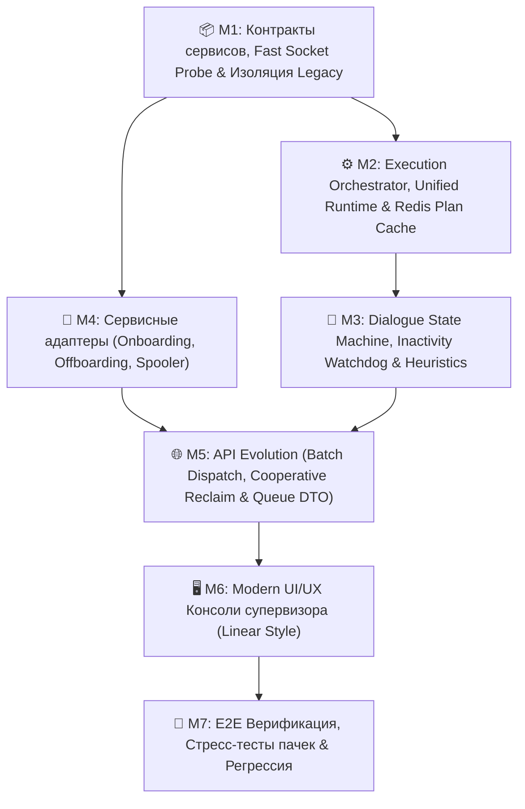

# 📋 Инженерный план реализации: Универсальное ядро жизненного цикла сценариев (Universal Scenario Lifecycle Core)

> **Статус:** Утверждено к реализации (с учетом ликвидации всех 6 архитектурных изъянов)  
> **Целевая архитектура:** [`docs/architecture/v2-universal-scenario-core.md`](file:///docs/architecture/v2-universal-scenario-core.md)  
> **Связанные документы:** [`docs/architecture/domain-model-and-contracts.md`](file:///docs/architecture/domain-model-and-contracts.md), [`docs/architecture/v2-automation-pipeline.md`](file:///docs/architecture/v2-automation-pipeline.md), [`GEMINI.md`](file:///GEMINI.md)

---

## 🎯 1. Архитектурный базис и фундаментальные инварианты

1. **Единое универсальное ядро исполнения — два источника запуска (Zero Duplicate Logic & Runtime):**
   * Логика валидации фактов, диагностики хоста, исполнения шагов адаптера и закрытия заявок строго едина для обоих режимов:
     * **🟢 FULL_AUTO (Полный автопилот):** Заявка назначена на сервисную учетную запись `alen_assistant`. Воркер Taskiq автономно исполняет сценарий через `scenario.execute(task, policy)`, публикует регламентный ответ, скрытую техническую заметку аудита и переводит тикет в статус конечный статус в соответствии со сценарием.
     * **🟡 ASSISTED (Контур супервизора):** Заявка находится в общей очереди 1-й линии. Воркер в фоне предрассчитывает план в Redis за 0 мс. При нажатии <kbd>Enter</kbd> («Одобрить») диспетчер команд `command_dispatcher` вызывает **тот же самый метод** `scenario.execute(task, policy)` из `ScenarioRegistry`, закрывает тикет в статус `3` и фиксирует дуальный аудит.
2. **Бескомпромиссная надежность и покрытие всех 15 краевых случаев:**
   * **Failure Isolation:** сбой одного тикета в пачке не ломает батч; неподдерживаемые тикеты автоматически снимаются с бота и возвращаются дежурным с пометкой.
   * **Concurrency Throttling & Jitter:** пул воркеров 4–6 с джиттером 150–200 мс для защиты IntraService IIS от HTTP 429.
   * **OCC Version Guard & Pre-Execution Lock:** проверка `expected_status_id`, `last_event_id` и `ExecutorIds` перед вызовом адаптера.
   * **Cooperative Interruption:** мгновенная остановка сетевых вызовов воркера при вызове оператором действия `[Взять в ручную работу]` (`Reclaim`).
   * **Fast Socket Probe:** сокетный таймаут строго $\le 1.5$ сек на сокет для Ping/5985/9100.
   * **Zero-Plaintext Policy:** полный отказ от устаревшего `ad_password_reset`, криптографические временные пароли (`secrets.token_urlsafe(12)`), флаг `pwdLastSet=0`, маскирование секретов в логах (`***REDACTED***`).
   * **Прямой транзит статусов:** отказ от промежуточных лишних запросов `6 ➔ 2 ➔ 3` в пользу прямого `6 ➔ 3` согласно стандартам IntraService.
3. **Чистый UI/UX супервизора (Linear Style):**
   * Полное удаление рудиментов ручного анализа со звездочками (`batchAnalyze`, `analyzeSingle`).
   * Живой пульс конвейера в шапке (Heartbeat каждые 30с с обратным отсчетом).
   * Пакетный режим «Назначил пачку и ушел» (`[Передать автопилоту (alen_assistant)]`).
   * Мгновенный перехват заявки человеком (`[Взять в ручную работу]`).
   * Просмотр вложений (Attachment Viewer) и эмоциональные маркеры (`⚡ Срочно`).

---

## 🗺️ 2. Карта Milestones реализации

---

## 📦 Milestone 1: Контракты каталога услуг, Fast Socket Probe и изоляция Legacy
> **Статус:** ✅ **ЗАВЕРШЕНО (100%)** — Все задачи выполнены, 177/177 тестов monorepo пройдены успешно.

### Реализованные компоненты:
1. **Live Bind Mounts:** Контейнеры `intralink_api` и `intralink_worker` в [`deploy/docker-compose.yml`](file:///deploy/docker-compose.yml) переведены на прозрачное live-монтирование `/workspace/core`, `/workspace/api`, `/workspace/worker`.
2. **Декларативный контракт сервиса (`ServiceDefinition`):** Реализован в [`core/intraservice/service_definition.py`](file:///core/intraservice/service_definition.py), интегрирован в `BaseScenario.definition` и проиндексирован по `service_ids` в [`worker/src/scenarios/registry.py`](file:///worker/src/scenarios/registry.py).
3. **Быстрый сокетный зонд (`FastSocketProbe`):** Реализован в [`core/diagnostic/ports.py`](file:///core/diagnostic/ports.py) со строгим таймаутом $\le 1.5$ с и параллельным опросом портов 5985, 445, 9100.
4. **Structured Schema First в парсере:** В [`core/intraservice/parser.py`](file:///core/intraservice/parser.py) и [`core/intraservice/dto.py`](file:///core/intraservice/dto.py) реализован полный маппинг полей онбординга и Directum (1121-1135, 1180, 1488, 1489, 1521, 1017, 1181) с интеллектуальными regex fallback'ами.
5. **Модуль Active Directory (`core/ad/`):**
   * [`core/ad/transliteration.py`](file:///core/ad/transliteration.py): транслитерация по ГОСТ 7.79-2000 (система Б), генерация `sAMAccountName` (`ivanov.i`, `ivanov.i2`), лимит 20 символов.
   * [`core/ad/password.py`](file:///core/ad/password.py): Zero-Plaintext Policy, криптогенерация через `secrets.choice` без неоднозначных символов (`0/O/1/l/I`), маскирование `***REDACTED***`, обертка `SecretPassword`.
   * [`core/ad/pool.py`](file:///core/ad/pool.py): пул LDAP контроллеров домена на базе `ldap3.ServerPool` с Round Robin и сокетным таймаутом соединения 2.0 секунды.
6. **Изоляция устаревшего сценария:** `ADPasswordResetScenario` исключен из дефолтного автопилота, сбои тестов устранены.
7. **Тестовое покрытие:** Добавлены [`core/tests/test_fast_socket_probe.py`](file:///core/tests/test_fast_socket_probe.py), [`core/tests/test_service_definition.py`](file:///core/tests/test_service_definition.py), [`core/tests/test_ad_module.py`](file:///core/tests/test_ad_module.py), [`core/tests/test_parser_entities.py`](file:///core/tests/test_parser_entities.py). Все 58 тестов `core/tests/` и 177 тестов всего монорепозитория проходят со 100% успехом.

---

## ⚙️ Milestone 2: Execution Orchestrator, Unified Runtime & Redis Plan Cache (✅ ЗАВЕРШЕН НА 100%)

### Цель:
Ликвидировать раздвоение рантайма между FULL_AUTO и ASSISTED, обеспечить фоновый расчет планов за 0 мс через Redis, исключить гонки воркеров и предотвратить фантомные одобрения устаревших тикетов.

### Задачи:
1. **Унификация рантайма исполнения (Zero Duplicate Runtime):**
   * Полный рефакторинг [`worker/src/tasks/command_dispatcher.py`](file:///worker/src/tasks/command_dispatcher.py):
     * Удалить изолированные процедурные хэндлеры (`_handle_install_printer`, `_handle_ad_password_reset`).
     * `command_dispatcher` при одобрении заявки человеком (ASSISTED) загружает сценарий из `ScenarioRegistry` и вызывает канонический метод `scenario.execute(task, policy)`.
     * **Унифицированный шаг завершения:** автоматический перевод тикета в статус `3` («Выполнена»), публикация регламентного ответа от имени оператора и фиксация служебной заметки (`IsPrivateComment: true`) с дуальным аудитом («Одобрил: [Логин], Исполнил: alen_assistant»).
2. **Ликвидация паразитного промежуточного транзита (`6 ➔ 2 ➔ 3`):**
   * В [`worker/src/tasks/autopilot.py`](file:///worker/src/tasks/autopilot.py) и `command_dispatcher.py` исключить промежуточный вызов смены статуса на 2 при закрытии тикета из паузы (статус 6).
   * Использовать инвариант IntraService о прямом переходе `6 ➔ 3` одним PUT-запросом, снижая нагрузку на IIS сервер.
3. **Фоновый предрасчет и кэширование планов (Честные 0 мс в ASSISTED):**
   * В конвейере инжестии ([`worker/src/tasks/poller.py`](file:///worker/src/tasks/poller.py) / `triage.py`) при обнаружении новых или обновленных тикетов очереди 984 в фоне синтезировать `AgentPlanDTO` и кэшировать в Redis:  
     `cache:autopilot:plan:{ticket_id}` (TTL 300с).
   * В [`api/src/features/autopilot/service.py:get_agent_plan`](file:///api/src/features/autopilot/service.py#L54) сначала считывать готовый план из Redis за 1–2 мс (Instant Read-Through), исключая задержки со спиннером на клиенте.
4. **Распределенный замок (In-Flight Task Concurrency Lock):**
   * Внедрить во всех точках входа автопилота распределенный замок в Redis: `lock:task:{id}` с TTL 60с (SETNX).
5. **Pre-Execution Optimistic Lock:**
   * Перед вызовом прикладного адаптера выполнять контрольную вычитку тикета: если в `ExecutorIds` отсутствует бот/оператор, прерывать выполнение.
6. **OCC Version Guard (Защита от Stale Approval):**
   * В `approve_plan` проверять `expected_status_id` и `last_event_id` (ID последнего события тикета). При расхождении возвращать HTTP `409 Conflict`.
7. **Троттлинг очереди и джиттер:**
   * Concurrency воркеров = 4–6 с джиттером 150–200 мс между сетевыми вызовами к IntraService.
8. **Изоляция сбоев в разнородной пачке (Failure Isolation):**
   * Сбой адаптера на 1 тикете не ломает батч. Неподдерживаемые тикеты (`can_handle == False`) автоматически снимаются с бота и возвращаются дежурным.

### Критерии приемки (DoD):
* Одобрение плана оператором в ASSISTED вызывает `scenario.execute()`, закрывает тикет в статус 3 в IntraService и пишет аудит с логином оператора.
* Эндпоинт `GET /plan/{id}` отдает закэшированный план за <10 мс.
* Прямой транзит `6 ➔ 3` выполняется одним HTTP-запросом.
* Попытка одобрить устаревший тикет блокируется ошибкой 409 Conflict.

---

## 💬 Milestone 3: Dialogue State Machine, Inactivity Watchdog и эвристики [ЗАВЕРШЕН НА 100%] ✅

### Цель:
Реализовать надежный контур автономного взаимодействия с заявителем: ведение диалога при нехватке реквизитов, защита от зацикливания автоответчиков, эскалация при вложениях и контроль зависших тикетов.

### Задачи:
1. **Диалоговый цикл Статуса 6 («Требует уточнения»):**
   * Если не хватает обязательных фактов (`missing_facts`) или ПК выключен (`requires_online_host` не пройден):
     * Перевод заявки в статус `6` («Приостановлена» / «Требует уточнения»);
     * Публикация регламентного текста вопроса из `ServiceDefinition.clarification_template`;
     * Фиксация служебной заметки с указанием раунда диалога.
2. **Лимит диалога и Anti-Loop Guard:**
   * Жесткий лимит: максимум 2 раунда уточнения. При исчерпании — авто-перевод в статус 2 («В работе») с передачей дежурному инженеру.
   * Фильтрация почтовых автоответов (`Auto-Submitted`, `out of office`, `автоматический ответ`) и событий бота (`author_id == service_bot_id`).
3. **Attachment Heuristic (Эвристика вложений):**
   * Если фактов не хватает, но в тикете есть прикрепленные файлы (сканы заявлений, PDF, фото наклеек):
     * Автопилот **не отправляет** заявителю вопрос «Укажите ФИО»;
     * Заявка автоматически помечается для приоритетного разбора оператором в UI с предпросмотром вложений.
4. **UI Mood Tag (Эмоциональный маркер):**
   * В [`worker/src/services/intent_analyzer.py`](file:///worker/src/services/intent_analyzer.py) расширить анализатор для детекции эмоциональных и срочных реплик («Срочно почините, отчет горит!», «Когда уже сделаете?»).
   * Заявка **не снимается** с автопилота, но получает флаг `is_tense = True`, отображаемый в очереди как бейдж `⚡ Заявитель обеспокоен / Срочно`.
5. **Inactivity Watchdog (Фоновый дозор статуса 6):**
   * Создать периодическую фоновую задачу Taskiq [`worker/src/tasks/watchdog.py`](file:///worker/src/tasks/watchdog.py), проверяющую заявки в статусе 6:
     * Если заявитель не ответил в течение **48 часов** ➔ автоматическое регламентное напоминание в комментарий тикета;
     * Если заявитель не ответил в течение **5 рабочих дней** ➔ автоматический перевод в статус `30` («Отменена») с регламентным комментарием закрытия по таймауту неактивности.

### Критерии приемки (DoD) [ВЫПОЛНЕНО]:
* [x] При отсутствии имени ПК заявка переводится в статус 6 с вопросом из `ServiceDefinition` или `Preconditions`, а не падает с ошибкой.
* [x] При наличии вложений тикет не шлет глупый вопрос заявителю, а передается человеку со служебной заметкой для визуального анализа (Attachment Heuristic).
* [x] Реплика заявителя со словами «срочно», «отчет горит», «!!» зажигает маркер `is_tense` и отображает бейдж `⚡ Срочно` в UI.
* [x] Watchdog (`worker/src/tasks/watchdog.py`) корректно выявляет просроченные тикеты статуса 6, отправляет 48ч напоминания (с защитой от спама в Redis) и авто-отменяет тикеты при 120ч неактивности.

---

## 🔌 Milestone 4: Сервисные адаптеры (Onboarding, Offboarding, Spooler)

### Цель:
Внедрить боевые адаптеры управления жизненным циклом сотрудников и печати, изолировать синхронный I/O и полностью вычистить устаревший код сброса паролей.

### Задачи:
1. **Полное удаление кода `ad_password_reset.py`:**
   * Физически удалить файл `worker/src/scenarios/ad_password_reset.py`.
   * Вычистить упоминания из маршрутизатора, тестов и выпадающего списка `AgentPlanCard.tsx`.
2. **Реализация адаптера `account_create.py` (Создание учетной записи / Онбординг):**
   * Поддерживаемые сервисы: 55 («Заявка на пользователя Directum»), 232 («Доступ к корпоративным системам») — Тип 1018.
   * Обязательные факты: `first_name`, `last_name`, `department`, `title`, `phone`.
   * Детерминированная генерация логина (транслитерация ГОСТ 7.79-2000: `ivanov.i`, при коллизии в AD — инкремент `ivanov.i2`).
   * Создание пользователя в целевом подразделении (OU) через `ldap3.ServerPool`.
   * Принудительная установка флага `pwdLastSet = 0` (требование смены пароля при первом входе).
   * Генерация криптографически стойкого временного пароля (`secrets.token_urlsafe(12)`).
   * **Zero-Plaintext Policy:** пароль **никогда не публикуется** в открытую историю тикета. Передается по регламентному закрытому каналу или скрытой служебной заметке (`IsPrivateComment: true`).
3. **Реализация адаптера `account_lock.py` (Блокировка учетной записи / Оффбординг):**
   * Поддерживаемые сервисы: 55, 8 («Увольнение / блокировка доступа»).
   * Обязательные факты: `target_user` (sAMAccountName или ФИО).
   * Проверка прав автора тикета (HR, руководитель, ИБ).
   * Выставление бита `ACCOUNTDISABLE` (0x0002) в `userAccountControl`.
   * Отзыв активных Kerberos-тикетов и перемещение в Disabled OU.
4. **Адаптеры печати (`printer_spooler_restart.py` и `default_printer_fix.py`):**
   * Сервисы 12, 40 («Оргтехника и печать»).
   * Обязательные факты: `pc_name`, `requires_online_host = True`, `probe_ports = [5985, 9100]`.
   * Перезапуск службы Spooler или назначение дефолтного принтера через WinRM.
5. **Изоляция блокирующего I/O:**
   * Все синхронные вызовы `ldap3` и `pywinrm` обернуты в `asyncio.to_thread` во избежание заморозки event loop воркера.
6. **Регистрация адаптеров:**
   * Зарегистрировать новые адаптеры в `ScenarioRegistry` и `ScenarioRouter`.

### Критерии приемки (DoD):
* Файл `ad_password_reset.py` удален.
* Создание пользователя генерирует логин по ГОСТ 7.79-2000, разрешает коллизии и ставит `pwdLastSet=0`.
* Ни один пароль не попадает в открытый комментарий тикета или открытый лог (`***REDACTED***`).
* Все сетевые вызовы выполняются в отдельных потоках через `asyncio.to_thread`.

---

## 🌐 Milestone 5: API Evolution (Batch Dispatch, Cooperative Reclaim & Queue DTO)

### Цель:
Расширить REST API IntraLink для поддержки групповых действий супервизора, кооперативной отмены задач при перехвате оператором и синхронизации DTO очереди тикетов.

### Задачи:
1. **Эндпоинт пакетного назначения (`POST /api/v2/autopilot/batch-assign`):**
   * Принимает список `ticket_ids: List[int]`.
   * Назначает сервисную учетную запись `alen_assistant` в `ExecutorIds` для каждой выбранной заявки.
   * Ставит задачи в очередь Taskiq для фонового автономного исполнения (`FULL_AUTO`).
2. **Экстренный перехват с кооперативной отменой (`POST /api/v2/autopilot/reclaim/{ticket_id}`):**
   * Назначает текущего оператора и снимает `alen_assistant` из `ExecutorIds`.
   * **Cooperative Cancellation:** выставляет в Redis ключ отмены `redis.set(f"autopilot:abort:{ticket_id}", 1, ex=120)`.
   * Воркер перед каждым блокирующим действием (сетевой зонд, LDAP, WinRM) проверяет наличие флага отмены и мгновенно прерывает выполнение с выбросом `ExecutionAbortedException`.
3. **Синхронизированное обогащение DTO очереди:**
   * В [`api/src/features/tickets/schemas.py`](file:///api/src/features/tickets/schemas.py) и [`service.py`](file:///api/src/features/tickets/service.py) (эндпоинт `GET /api/v2/tickets/queue?filter_id=984`, используемый UI) добавить в `TicketSummaryDTO`:
     * `scenario_key: Optional[str]`;
     * `scenario_name: Optional[str]`;
     * `confidence: Optional[float]`;
     * `is_tense: bool = False` (эмоциональный маркер);
     * `has_attachments: bool = False`.
   * Данные поля подтягиваются из закэшированного состояния планов в Redis без дополнительных запросов к IntraService.
4. **Обновление контрактов плана и одобрения:**
   * В [`api/src/features/autopilot/schemas.py`](file:///api/src/features/autopilot/schemas.py):
     * В `ApprovePlanRequest` добавить поле `last_event_id: Optional[int]`;
     * В `AgentPlanDTO` добавить `service_definition: Optional[Dict[str, Any]]` и `is_tense: bool`.

### Критерии приемки (DoD):
* Пакетный вызов `POST /api/v2/autopilot/batch-assign` переводит выбранные тикеты на бота и запускает выполнение.
* Вызов `POST /api/v2/autopilot/reclaim/{ticket_id}` немедленно прерывает исполняющийся воркер через Redis-флаг отмены.
* Эндпоинт `GET /api/v2/tickets/queue` отдает `scenario_name`, `confidence` и маркер `is_tense`.

---

## 🖥️ Milestone 6: Modern UI/UX Консоли супервизора (Linear Style)

### Цель:
Устранить визуальный шум и ручные рудименты v1, реализовать эргономичный интерфейс супервизора с пакетными операциями, горячими клавишами, панелью пульса и просмотром вложений.

### Задачи:
1. **Вычищение рудиментов v1:**
   * Удалить все кнопки ручного анализа со звёздочками (`batchAnalyze`, `analyzeSingle`, иконки Sparkles) из [`web/src/features/triage/TriageQueue.tsx`](file:///web/src/features/triage/TriageQueue.tsx) и [`web/src/features/triage/TicketRow.tsx`](file:///web/src/features/triage/TicketRow.tsx). Анализ выполняется непрерывно в фоне.
2. **Панель живого пульса (Pipeline Heartbeat):**
   * В шапке очереди отображать статус конвейера:  
     `🟢 Конвейер активен • Пульс каждые 30с (след. через 14с) • Режим ASSISTED • Очередь актуальна`
   * Добавить кнопку `[Синхронизировать сейчас]` для принудительного триггера поллера без ожидания таймера.
3. **Групповое действие («Назначил пачку и ушел»):**
   * Добавить чекбоксы выбора заявок в `TicketRow` и заголовок очереди («Выбрать все»).
   * При выборе 1+ заявок показывать плавающую панель действий внизу очереди:  
     `Выбрано заявок: 5 | [Передать автопилоту (alen_assistant)] | [Снять выбор]`
   * Вызов `autopilotApi.batchAssign(selectedIds)`.
4. **Консоль супервизора (ASSISTED):**
   * Карточка заявки открывается с уже рассчитанным планом за 0 мс (считывание из Redis).
   * Горячие клавиши:
     * <kbd>Enter</kbd> — «Одобрить план» (вызов `/approve`);
     * <kbd>Ctrl</kbd>+<kbd>Enter</kbd> — «Одобрить с исправлениями» (вызов `/correct` с фиксацией в `AutopilotCorrection`).
   * Кнопка `[Взять в ручную работу]` (`Reclaim`) в шапке карточки тикета для мгновенного снятия бота и отмены фонового рантайма.
5. **Attachment Viewer (Просмотр вложений):**
   * Отображение списка вложений тикета с прямыми ссылками и Lightbox-предпросмотром сканов заявлений прямо в карточке супервизора.
6. **Отображение маркера `⚡ Срочно`:**
   * При `ticket.is_tense == true` выводить контрастный бейдж `⚡ Заявитель обеспокоен / Срочно` в строке очереди и шапке инспектора.

### Критерии приемки (DoD):
* В интерфейсе отсутствуют кнопки со звездочками ручного анализа.
* Оператор может отметить 10 заявок чекбоксами и передать их автопилоту в 1 клик.
* Нажатие <kbd>Enter</kbd> в карточке тикета одобряет план и переходит к следующей заявке.
* Бейдж `⚡ Срочно` привлекает внимание оператора без блокировки автопилота.
* Сборка веб-интерфейса `npm run build` проходит без предупреждений и ошибок типов.

---

## 🧪 Milestone 7: E2E Верификация, Стресс-тесты и Регрессия

### Цель:
Провести комплексную валидацию всех 15 краевых случаев, подтвердить целостность пайплайна под нагрузкой и отсутствие регрессий.

### Задачи:
1. **Тестирование краевых случаев ядра (Core Matrix):**
   * Тест разнородной пачки: поддерживаемые тикеты закрываются, неподдерживаемые снимаются с бота, сбой одного тикета изолирован.
   * Тест OCC Version Guard: имитация изменения тикета перед нажатием Enter оператором (проверка HTTP 409).
   * Тест Pre-Execution Optimistic Lock: снятие бота с тикета перед исполнением команды ➔ воркер корректно прерывает пайплайн.
   * Тест Cooperative Interruption: вызов `reclaim` ➔ воркер мгновенно бросает `ExecutionAbortedException`.
   * Тест Fast Socket Probe: симуляция мертвого хоста (таймаут строго $\le 1.5$ сек).
   * Тест Attachment Heuristic: нехватка фактов + наличие скана ➔ эскалация оператору без отправки вопроса заявителю.
   * Тест Zero-Plaintext Policy: проверка отсутствия паролей в открытых полях и маскирование в логах.
2. **Сквозные тесты адаптеров:**
   * Онбординг Directum: транслитерация ГОСТ 7.79-2000, разрешение коллизий логинов, флаг `pwdLastSet=0`.
   * Оффбординг: проверка прав инициатора, блокировка учетки, перемещение в Disabled OU.
   * Печать: проверка сетевых портов, перезапуск Spooler.
3. **Стресс-тестирование очереди:**
   * Симуляция батча из 50 заявок с проверкой соблюдения лимитов concurrency (4–6 воркеров) и отсутствия HTTP 429.
4. **Финальная регрессия монорепозитория:**
   * Запуск полного набора unit/integration тестов в Docker: `docker exec intralink_api uv run pytest`.
   * Проверка линтером: `ruff check .`.
   * Проверка фронтенда: `cd web && npm run build`.

### Критерии приемки (DoD):
* 100% тестов проходят успешно (0 ошибок, 0 регрессий).
* Линтер `ruff` чист.
* Фронтенд собирается без ошибок TypeScript.
* Все 15 краевых случаев из `docs/architecture/v2-universal-scenario-core.md` покрыты тестами.

---

## 📊 Матрица трассируемости краевых случаев (Edge Cases Traceability)

| № | Краевой случай из архитектуры | Целевой Milestone | Реализующий компонент |
| :- | :--- | :-: | :--- |
| **1** | Разнородная пачка (Mixed Batch) | **M2** | `worker/src/tasks/autopilot.py` (авто-снятие бота с неподдерживаемых) |
| **2** | Перегрузка IntraService API | **M2** | Concurrency Throttling (4–6 воркеров + джиттер 150–200 мс) |
| **3** | Изоляция сбоев в пачке (Failure Isolation) | **M2** | Локализация исключений per-ticket в Taskiq |
| **4** | Перехват заявки инженером | **M2** | Pre-Execution Optimistic Lock (`ExecutorIds` verification) |
| **5** | Нехватка фактов или ПК выключен | **M1, M3** | `FastSocketProbe` (1.5с) + Статус 6 («Требует уточнения») |
| **6** | Факты заперты во вложении (Scan only) | **M3** | Attachment Heuristic ➔ эскалация оператору с превью |
| **7** | Эмоциональный ответ в диалоге | **M3, M6** | `UserReplyIntentAnalyzer` ➔ флаг `is_tense` + бейдж `⚡ Срочно` |
| **8** | Зацикливание автоответчиков | **M3** | AntiLoopGuard (`Auto-Submitted`) + жесткий лимит 2 раунда |
| **9** | Одобрение устаревшего тикета (Stale Approval) | **M2** | OCC Version Guard (`last_event_id` + HTTP 409 Conflict) |
| **10** | Юридический след и ответственность | **M2** | Dual Attribution Audit (публично: Оператор, скрыто: Бот + Человек) |
| **11** | Безопасность временного пароля | **M1, M4** | Zero-Plaintext Policy (`pwdLastSet=0`, crypto password, REDACTED) |
| **12** | Таймаут неактивности заявителя в Статусе 6 | **M3** | `InactivityWatchdog` (48ч напоминание, 5 дней авто-отмена) |
| **13** | Явный перехват заявки оператором (Human Reclaim) | **M5, M6** | Кнопка `[Взять в ручную работу]` + `POST /reclaim/{id}` + Redis Abort Flag |
| **14** | Структурированные поля онбординга | **M1** | Structured Schema First (парсинг полей формы 1018) |
| **15** | Отказоустойчивость LDAP (DC Failover) | **M1, M4** | `ldap3.ServerPool` (ROUND_ROBIN, таймаут 2.0с) |
