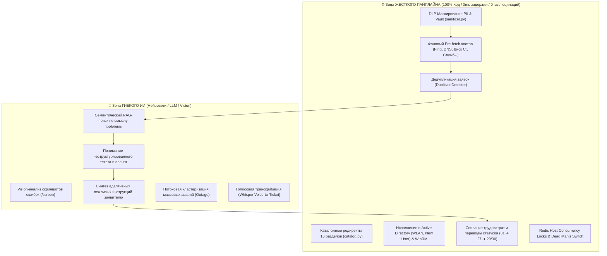
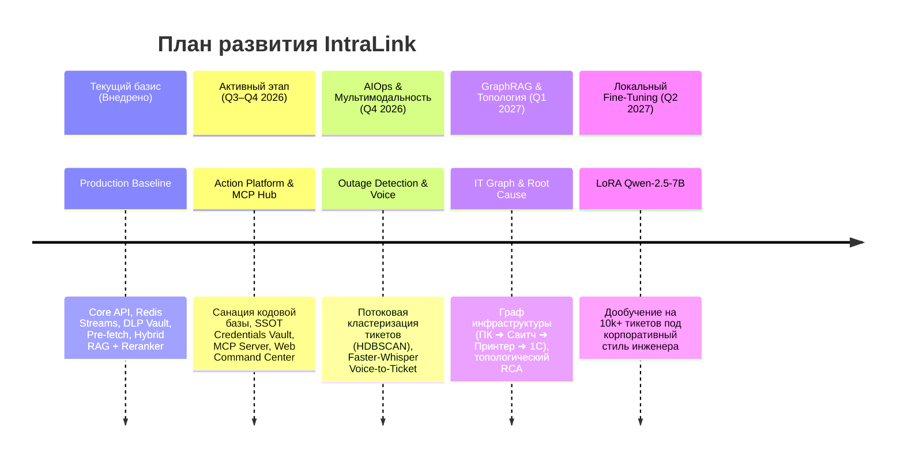

# 🗺️ Дорожная карта развития проекта IntraLink (Product & AI Roadmap)

Документ фиксирует стратегические горизонты, этапы технологической эволюции и архитектурные инварианты системы **IntraLink**.

---

## 🏛️ Ключевой архитектурный принцип: Детерминизм vs Гибкий ИИ

Система намеренно избегает тяжелых и недетерминированных Multi-Agent фреймворков (LangGraph, CrewAI). Архитектура строится на **строгом разделении зон ответственности**:

---

## 📊 Матрица технологической эволюции (2026–2027)

---

## 📍 Текущее состояние платформы (Production Baseline — Внедрено)

> [!NOTE]
> Полная спецификация уже реализованных компонентов зафиксирована в [**docs/architecture.md**](architecture.md).

* **Ядро и шина:** FastAPI Gateway + Poller Daemon (Leader Lock) + Redis Streams (`stream:intraservice_events`) с Consumer Groups и `XAUTOCLAIM`.
* **Безопасность (Zero Trust DLP):** Трехконтурная маршрутизация инференса (🔴 RED On-Prem / 🟡 YELLOW PII Vault / 🟢 GREEN Cloud).
* **Фоновая телеметрия (0ms latency):** Fail-Fast сетевой опрос (Ping 400ms, SMB:445, WinRM:5985, CIM Spooler/1C) с защитой подсетей и кэшем в Redis.
* **Защитные контуры:** Distributed Host Concurrency Lock (`lock:host:<pc>`, TTL 30s) и аварийный тормоз Dead Man's Switch (Rate-Limiter).
* **База знаний (Hybrid RAG):** Dense pgvector (1024-dim, BGE-M3) + Sparse tsvector + Reciprocal Rank Fusion (RRF $k=60$) + локальный Cross-Encoder Reranker (`bge-reranker-base`).
* **Клиенты:** React SPA (`/operator-panel`), Telegram-бот (aiogram 3.x) и Tooling SDK `helpdesk-cli` для AI-агента Antigravity.

---

## 🚀 Этап 1. Платформа автоматизации (Action Platform) & MCP Hub (Q3–Q4 2026 — ✅ Завершено)

**Цель:** Ликвидация накопленного техдолга, централизация секретов в едином SSOT Vault, стандартизация воркеров и запуск официального протокола MCP для симметричного управления через AI-агента AGY и Web UI Command Center.

### Ключевые компоненты:
1. **✅ Санация кодовой базы и устранение рудиментов (Внедрено):**
   - Ликвидированы дубликаты `core-api/app/utils/normalizer.py` и `json_utils.py` с переходом на единый пакет `shared/` (SSOT).
   - Удален мертвый модуль `core-api/app/routers/admin/printers.py` и заброшенный Pub/Sub канал `printer_actions`.
   - Заменен захардкоженный словарь `admin/templates.py` на динамическую базу PostgreSQL `triage_templates` (`rules_admin.py` + `templates-catalog`).
2. **✅ Единое хранилище учетных записей (SSOT Credentials Vault) (Внедрено):**
   - Миграция всех паролей (IntraService API, Domain WinRM/LDAPS, Local Admin) в таблицу PostgreSQL `system_settings` с шифрованием Fernet (`vault.py`).
   - Автоматический прогрев и синхронизация кэша в Redis (`worker:domain_auth`, `worker:service_auth_b64`) при старте в `lifespan` и после сохранения.
   - Единая карточка управления доступами в Web UI (`/admin`) с 1-клик тестированием связности (LDAPS / WinRM).
3. **✅ Конвергенция очередей и триажа (Queue Convergence) (Внедрено):**
   - Ликвидирован устаревший роутер `admin/queue.py` с захардкоженными ID исполнителей.
   - Логика разделена без создания god-модуля: тонкий контроллер `triage.py`, сервисы `TriageService` и `TriageSessionManager`.
   - Web UI (`intra-web`) полностью переведен на современный эндпоинт `/api/v1/triage/batch` (фоновый pre-fetch телеметрии 0ms, DLP PII Vault, детекция дубликатов, защита Dead Man's Switch).
4. **✅ Стандартизация воркера и реанимация принтеров (Внедрено):**
   - Восстановлена база знаний принтеров `shared/printers_knowledge_base.json` и типизированный модуль `shared/printers.py` (SSOT).
   - Внедрен стандарт `BaseActionExecutor`: цикл `Preflight ➔ Execute ➔ Verify`, распределенная блокировка хоста `lock:host:<pc_name>` (TTL 30s) и динамический WMI Bootstrap WinRM.
   - `PrinterExecutor` унаследован от `BaseActionExecutor` с установкой принтеров через PowerShell и контролем через `Get-Printer`.
   - Telegram-бот (`printer_approvals.py`) и клиент API переведены на вызовы Command Bus (`/api/v1/commands/submit` и `/api/v1/commands/{job_id}/confirm`).
5. **✅ Декларативный реестр навыков и Dynamic Policy Engine (Внедрено):**
   - Реестр `ActionRegistry` с декларацией схем параметров и типов целей: `install_printer`, `grant_wlan`, `diagnose_host`, `create_user`, `reset_password`, `apply_triage`, `rag_sync`.
   - Движок `PolicyEngine` с поддержкой режимов `auto`, `confirm` (HitL) и мгновенного Killswitch (`disabled`) с хранением оверрайдов в Redis.
   - REST API управления политиками в роутере `skills_admin.py` (`GET /api/v1/skills`, `PATCH /api/v1/skills/{id}/policy`).
   - Защита Killswitch и проверка политик встроена в шлюз команд `POST /api/v1/commands/submit`.
6. **✅ Шлюз инструментов FastMCP для AI-агента (`intralink-mcp`) (Внедрено):**
   - Реализован MCP-сервер инструментов по спецификации Model Context Protocol (JSON-RPC 2.0 stdio): `triage_batch`, `get_ticket_details`, `apply_triage_decision`, `diagnose_host`, `search_kb`, `submit_action_command`, `list_skills`.
   - Сервер покрыт тестами `test_mcp_server.py` и документирован в `intralink-mcp/README.md`.
7. **✅ Automation Command Center в Web UI (`intra-web`) (Внедрено):**
   - Вкладка **Skills Hub** в панели администратора (`/admin`): интерактивное управление навыками, переключатели режимов Auto / HitL / Killswitch и тестовый запуск.
   - **Live SSE Terminal:** консольный мониторинг шины событий и прогресса выполнения команд в реальном времени (`/api/v1/events/stream`).
   - **1-Click Actions:** контекстные виджеты быстрых действий в карточке заявки `TicketInspector.tsx` (установка принтера, выдача Wi-Fi, экспресс-диагностика).

### 🛡️ 5 критических инженерных нюансов исполнения:
1. **WMI Bootstrap Lifecycle (Динамическое управление WinRM):**
   - Перед операцией WinRM динамически включать службу `WinRM` на целевом ПК по WMI (RPC:135).
   - В блоке `finally` (при успехе или сбое) гарантированно отключать `WinRM` обратно для минимизации поверхности сетевых атак.
2. **Distributed Host Concurrency Lock (`lock:host:<pc_name>`):**
   - Защитить выполнение любых задач мьютексом в Redis (TTL 30s) с токеном владельца и Lua-скриптом — предотвращение коллизий WinRM/CIM сессий и сбоев `0x80338029`.
3. **Единый омниканальный контур HitL (Unified Approval Inbox):**
   - Запрос подтверждения деструктивного действия публикуется в `job:{id}:confirm` и рассылается параллельно в Web UI (Live Modal), Telegram-бот и MCP-клиент. Первый ответивший атомарно разблокирует выполнение.
4. **Сетевая топология (Linux Docker vs Windows Runner):**
   - Изоляция окружений: Core API и базы живут в Docker, а `execution-worker` запущен строго на Windows-хосте домена `corporate.loc`. Общение только через Redis Streams без прямых файловых шарингов.
5. **Универсальный One-Liner Fallback (`self_service.py`):**
   - Расширение токен-генератора (`/api/v1/run/{token}`) на любое действие (софт, 1С, диагностика) при изоляции ПК за брандмауэром.

---

## ⚡ Этап 2. AIOps Кластеризация и Мультимодальность (Q4 2026)

**Цель:** Проактивное связывание массовых аварий до реакции оператора и поддержка голосовых обращений.

### Ключевые задачи:
1. **Потоковая детекция массовых инцидентов (Real-time Outage Detection):**
   - Векторная кластеризация входящего потока тикетов в скользящем окне 15 минут (HDBSCAN по эмбеддингам).
   - При превышении порога семантической близости и совпадении сетевого сегмента / сервиса 1С: автоматическое создание **Master-инцидента** и Pager-алерт дежурному инженеру в Telegram.
2. **Голосовой ввод (Faster-Whisper Voice-to-Ticket):**
   - Локальная транскрибация голосовых сообщений пользователей в Telegram-боте.
   - Извлечение именованных сущностей (ФИО, кабинет, имя ПК, суть проблемы) $\rightarrow$ структурированная карточка заявки.
3. **Гибридная классификация намерений (Hybrid Intent Routing Cascade):**
   - Полный отказ от хрупких регулярных выражений в пользу трехуровневого каскада: `Regex Guard (Tier 1) ➔ FastEmbed Semantic Anchors (Tier 2) ➔ SLM Qwen-2.5 Intent Verifier (Tier 3)`.
   - Защита от ложных срабатываний на отрицаниях (*«пока не принес»*), нечувствительность к сленгу и опечаткам.
   - Детальный план и архитектура: [**docs/roadmap_intent_classification.md**](roadmap_intent_classification.md).

---

## 🌐 Этап 3. GraphRAG и Топология ИТ-инфраструктуры (Q1 2027)

**Цель:** Понимание системных взаимосвязей оборудования при анализе сложных локальных сбоев.

### Ключевые задачи:
1. **Граф зависимостей оборудования:**
   - Моделирование связей: `Сотрудник ➔ Кабинет/Коммутатор ➔ ПК ➔ Сетевой порт ➔ Принтер ➔ Сервер 1С`.
2. **Топологический RAG и Root Cause Analysis (RCA):**
   - Учет графа при генерации диагностических гипотез (например, локализация сбоя до конкретного сетевого свитча при падении группы ПК).

---

## 🎙️ Этап 4. Локальный Fine-Tuning модели (Q2 2027)

**Цель:** Идеальный корпоративный стиль ответов и знание специфики предприятия без внешних API.

### Ключевые задачи:
1. **LoRA / QDoRA Fine-Tuning на базе тикетов:**
   - Дообучение открытой локальной модели (`Qwen-2.5-7B-Instruct`) на архиве из 10 000+ исторических тикетов компании.
   - Идеальное соответствие регламентам инженера Беликова Алена без необходимости передачи длинных промптов.

---

## 📈 Целевые метрики эффективности (KPI)

| Метрика | До внедрения | Текущий уровень (v1.0) | Цель (v2.0 / 2027) |
|---|:---:|:---:|:---:|
| **Среднее время первичного триажа (MTTA)** | 15–30 мин | **< 1 мин** (пакетный разбор) | **< 10 сек** (авто-триаж + pre-fetch) |
| **Время закрытия типовых заявок (MTTR)** | 20–40 мин | **3–5 мин** (AD / Wi-Fi CLI) | **< 1 мин** (Zero-Touch execution) |
| **Точность RAG-рекомендаций** | — | **~70%** (косинусный поиск) | **95%+** (Hybrid + Reranker) |
| **Утечки конфиденциальных данных (DLP)** | Высокий риск | **0%** (DLP Sanitizer + Vault) | **0%** (Формально верифицировано) |
| **Доля рутинных операций (Zero-Touch)** | 0% | **25%** | **65%+** |
