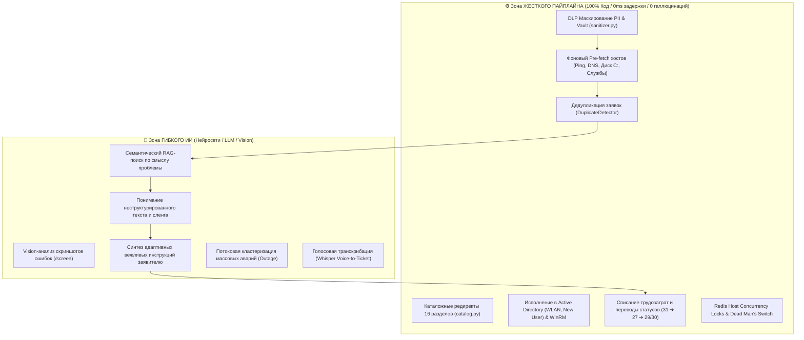
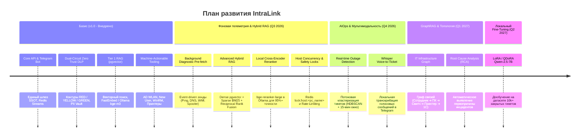

# 🗺️ Дорожная карта развития проекта IntraLink (Product & AI Roadmap)

Документ фиксирует стратегические горизонты, этапы технологической эволюции и архитектурные инварианты системы IntraLink.

---

## 🏛️ Ключевой архитектурный принцип: Детерминизм vs Гибкий ИИ

Система намеренно избегает тяжелых и недетерминированных Multi-Agent фреймворков (LangGraph, CrewAI). Архитектура строится на **строгом разделении зон ответственности**:

---

## 📊 Матрица технологической эволюции (2026–2027)

---

## 📍 Этап 0. Текущее состояние (Baseline v1.0 — Внедрено)

- [x] **Модульный монорепозиторий:** `core-api`, `execution-worker`, `helpdesk-cli`, `telegram-bot`, `shared`.
- [x] **Многоконтурная безопасность данных (Dual-Circuit DLP):**
  - 🔴 **RED (On-Prem):** Изолированное исполнение на локальной Ollama (`bge-m3`, `qwen`) без выхода в интернет.
  - 🟡 **YELLOW (Sanitized):** Автоматическое маскирование PII (ФИО, IP, хосты, телефоны, email) с сохранением в Redis PII Vault и обратным восстановлением (Rehydration).
  - 🟢 **GREEN (Cloud):** Прямой защищенный инференс через LiteLLM Proxy / Gemini Cloud.
- [x] **Tier 1 pgvector RAG:** Векторный поиск по исторической базе решений с авто-индексацией при закрытии задач.
- [x] **Human-in-the-Loop (HitL) Триаж:** Пакетный разбор очереди (Filter 984), детекция дубликатов, списание трудозатрат и адаптивные шаблоны инженера Беликова Алена.
- [x] **Прямое машинное действие:** Управление группами Active Directory (WLAN-WORKNET), создание учетных записей, сетевая экспресс-диагностика, WinRM-оркестрация принтеров.

---

## 🚀 Этап 1. Фоновая телеметрия, Защитные механизмы и Hybrid RAG (Q3 2026 — Внедрено)

**Цель:** Обеспечить инженера 100% контекстом хоста с нулевой задержкой при открытии карточки и довести точность базы знаний до 95%+.

### Реализованные компоненты:
1. [x] **Асинхронный фоновый Pre-fetch телеметрии хостов (`host_telemetry.py`):**
   - Сеть: Fast ICMP Ping (400ms), DNS-разрешение (`.corporate.loc`), TCP-пробы портов SMB:445 и WinRM:5985 (300ms).
   - Защита сетевой инфраструктуры: `subnet_rate_limit` (не более 3 одновременных зондов на подсеть `/24`).
   - Система: CIM WinRM сбор метрик под защитой лока (`disk_free_gb`, службы `Spooler` и `1C:Enterprise`, активный пользователь).
   - Кэширование в Redis (`diag:<task_id>`, `diag:host:<pc>`, TTL 10 мин, мгновенный вывод 0ms added latency).
2. [x] **Защитные контуры исполнения (Safety & Resiliency — `safety.py`):**
   - **Distributed Host Concurrency Lock:** распределенный лок в Redis (`lock:host:<pc_name>`, TTL 30s) с токеном владельца и Lua-скриптом — предотвращение конфликтов параллельных WinRM/WMI сессий (`0x80338029`).
   - **Аварийный тормоз (Dead Man's Switch):** скользящее окно Redis ZSET (`ratelimit:triage:apply`) — блокировка массового применения > 10 заявок/мин без явного подтверждения оператором (`confirmed_by_human=True`).
3. [x] **Advanced Hybrid RAG (Dense + Sparse RRF — `rag.py`):**
   - **Query Distillation (AI):** нормализация запроса за <10ms: отсечение эмоционального шума и сохранение кодов ошибок (`0x80070005`, `0x0000011b`), моделей оборудования и служб.
   - Полнотекстовый sparse-поиск (PostgreSQL `tsvector` / ILIKE) с ранжированием по ключевым термам и кодам ошибок.
   - Слияние векторов и ключевых слов по алгоритму **Reciprocal Rank Fusion (RRF, $k=60$)**.
4. [x] **Локальный Cross-Encoder Reranker (`rag.py`):**
   - Двухэтапная переоценка кандидатов через модель `BAAI/bge-reranker-base` в неблокирующем потоке (`asyncio.to_thread`) с порогом релевантности $\ge 0.85$ и прозрачным fallback.
5. [x] **Интеллектуальный синтез ответов и Канонизация базы знаний (`ai_synthesis.py`):**
   - **Telemetry-Guided Response Synthesis:** органичное включение данных телеметрии и прецедентов RAG в экспертный каркас инженера Беликова Алена с соблюдением Zero Trust DLP (RED/YELLOW/GREEN).
   - **Auto-KB Canonical Structuring:** автоматическое извлечение канонической триады `[Проблема] ➔ [Первопричина] ➔ [Решение]` из переписки закрытых заявок при синхронизации в базу знаний.

---

## ⚡ Этап 2. AIOps Кластеризация и Мультимодальность (Q4 2026)

**Цель:** Проактивное связывание массовых аварий до реакции оператора и поддержка голосовых обращений.

### Ключевые задачи:
1. **Потоковая детекция массовых инцидентов (Real-time Outage Detection):**
   - Векторная кластеризация входящего потока тикетов в скользящем окне 15 минут (HDBSCAN по эмбеддингам).
   - При превышении порога семантической близости и совпадении сетевого сегмента / сервиса 1С: автоматическое создание **Master-инцидента** и Pager-алерт дежурному инженеру в Telegram.
2. **Голосовой ввод (Faster-Whisper Voice-to-Ticket):**
   - Локальная транскрибация голосовых сообщений пользователей в Telegram-боте.
   - Извлечение именованных сущностей (ФИО, кабинет, имя ПК, суть проблемы) $\rightarrow$ структурированная карточка заявки.

---

## 🌐 Этап 3. GraphRAG и Топология ИТ-инфраструктуры (Q1 2027)

**Цель:** Понимание системных взаимосвязей оборудования при анализе сложных локальных сбоев.

### Ключевые задачи:
1. **Граф зависимостей оборудования:**
   - Моделирование связей: `Сотрудник ➔ Кабинет/Коммутатор ➔ ПК ➔ Сетевой порт ➔ Принтер ➔ Сервер 1С`.
2. **Топологический RAG и Root Cause Analysis (RCA):**
   - Учет графа при генерации диагностических гипотез (например, локализация сбоя до конкретного сетевого свитча при падении группы ПК).

---

## 🎙️ Этап 4. Локальный Fine-Tuning модели (Q2 2027)

**Цель:** Идеальный корпоративный стиль ответов и знание специфики предприятия без внешних API.

### Ключевые задачи:
1. **LoRA / QDoRA Fine-Tuning на базе тикетов:**
   - Дообучение открытой локальной модели (`Qwen-2.5-7B-Instruct`) на архиве из 10 000+ исторических тикетов компании.
   - Идеальное соответствие регламентам инженера Беликова Алена без необходимости передачи длинных промптов.

---

## 📈 Целевые метрики эффективности (KPI)

| Метрика | До внедрения | Текущий уровень (v1.0) | Цель (v2.0 / 2027) |
|---|:---:|:---:|:---:|
| **Среднее время первичного триажа (MTTA)** | 15–30 мин | **< 1 мин** (пакетный разбор) | **< 10 сек** (авто-триаж + pre-fetch) |
| **Время закрытия типовых заявок (MTTR)** | 20–40 мин | **3–5 мин** (AD / Wi-Fi CLI) | **< 1 мин** (Zero-Touch execution) |
| **Точность RAG-рекомендаций** | — | **~70%** (косинусный поиск) | **95%+** (Hybrid + Reranker) |
| **Утечки конфиденциальных данных (DLP)** | Высокий риск | **0%** (DLP Sanitizer + Vault) | **0%** (Формально верифицировано) |
| **Доля рутинных операций (Zero-Touch)** | 0% | **25%** | **65%+** |
