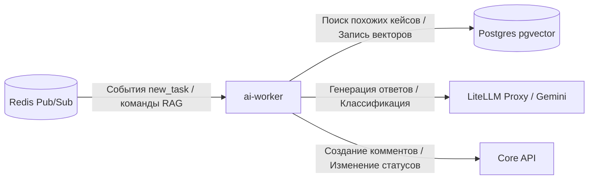

# AI Worker Service

Сервис `ai-worker` является частью системы IntraLink и предназначен для интеллектуальной обработки, классификации и автоответов на заявки в системе IntraService с использованием языковых моделей (LLM через LiteLLM/Gemini) и векторного поиска RAG (PostgreSQL с расширением `pgvector`).

## Основной функционал

1. **Классификация заявок на основе ИИ (AI Classifier):**
   - Автоматически проверяет новые поступающие заявки на корректность выбранного пользователем раздела.
   - Использует векторный поиск по базе знаний (RAG) для нахождения похожих решенных или отмененных задач в прошлом.
   - Оценивает релевантность текущего раздела через LLM (`gemini-2.5-flash`).
   - Если раздел выбран ошибочно, отправляет в IntraService комментарий с рекомендацией верного раздела и автоматически переводит заявку в статус «Отменена» (ID 30).

2. **AI-автоответчик (AI Responder):**
   - Для корректных IT-заявок генерирует автоматические ответы или инструкции по самообслуживанию.
   - Использует RAG-контекст, собранный из базы знаний, для предоставления точных, специфичных для компании ответов.

3. **Синхронизация базы знаний RAG (RAG Builder):**
   - Выполняет фоновое перестроение и наполнение базы знаний эмбеддингами решенных заявок.
   - Поддерживает гибкие квоты (глобальные и персональные на услугу) для ограничения объема собираемых данных.
   - Транслирует процесс сборки и логирование в реальном времени через Redis Pub/Sub канал `rag_build_logs` и сохраняет историю в Redis-список `rag_build_logs_history` для веб-панели администратора.

4. **Ранняя фильтрация задач:**
   - Игнорирует не-IT разделы (например, АХО, хоз. деятельность, клининг, охрана) на основе ключевых слов в названии услуги до вызова ресурсоемких функций ИИ.

5. **Централизованная диспетчеризация (Event Dispatching):**
   - Подписывается на канал `intraservice_events` для отслеживания событий создания задач (`new_task`) и ручного назначения исполнителя (`executor_assigned`).
   - При перехвате события назначения исполнителя (`executor_assigned`) на сервисную учетную запись автоматически переопределяет тип события на `new_task`, пропуская его через AI-классификатор и публикуя в `ai_validated_events` для обработки специализированными воркерами (например, `printer-worker`). Это позволяет запускать автоматическое выполнение не только для новых заявок, но и при ручном делегировании задач сервисному аккаунту.

## Конфигурация (.env)

Основные переменные окружения:

- `CORE_API_URL` — URL адрес Core API (например, `http://core-api:8000/api/v1`).
- `DATABASE_URL` — строка подключения к PostgreSQL (с поддержкой `asyncpg` и pgvector).
- `REDIS_URL` — строка подключения к Redis (по умолчанию `redis://redis:6379/0`).
- `LITELLM_BASE_URL` — адрес прокси-сервера LiteLLM (например, `http://litellm:4000/v1`).
- `LITELLM_MODEL` — используемая модель (по умолчанию `gemini/gemini-2.5-flash`).
- `LITELLM_API_KEY` — API-ключ для работы с провайдером моделей через LiteLLM.
- `ENCRYPTION_KEY_FILE` — путь к Docker Secret с ключом шифрования токенов (Fernet).
- `INTRASERVICE_SERVICE_PASSWORD_FILE` — путь к Docker Secret с паролем сервисного аккаунта IntraService.

## Структура папок сервиса

- `/core` — конфигурация приложения (`config.py`), утилиты для шифрования и логирования.
- `/services` — бизнес-логика:
  - `classifier.py` — классификатор заявок с интеграцией RAG и LLM.
  - `responder.py` — модуль генерации автоответов.
  - `rag_builder.py` — построение векторного индекса (генерация эмбеддингов, работа с pgvector).
  - `is_client.py` — клиент для работы с API IntraService (через Core API или напрямую).
  - `redis_client.py` — инициализация и закрытие соединений Redis.
- `worker_main.py` — точка входа в микросервис. Подписывается на каналы Redis и запускает обработку событий.

## Взаимодействие в системе

## Отладка и тестирование (LLM-as-judge)

Для проверки качества работы классификатора и логики RAG в папке `debug_tools` подготовлены специальные CLI-инструменты:
- **Одиночная отладка:** `python -m debug_tools.cli ai --task-id <id>`
  Загружает заявку, выполняет RAG-поиск в Postgres с выводом Топ-5 похожих кейсов (включая косинусное сходство, тему, решение и статус) и прогоняет LLM-классификатор.
- **Батч-тестирование:** `python -m debug_tools.cli ai --batch <id1,id2>` или `--batch-file <путь>`
  Позволяет оценить точность классификации на большом наборе данных с формированием итогового JSON-отчета.

