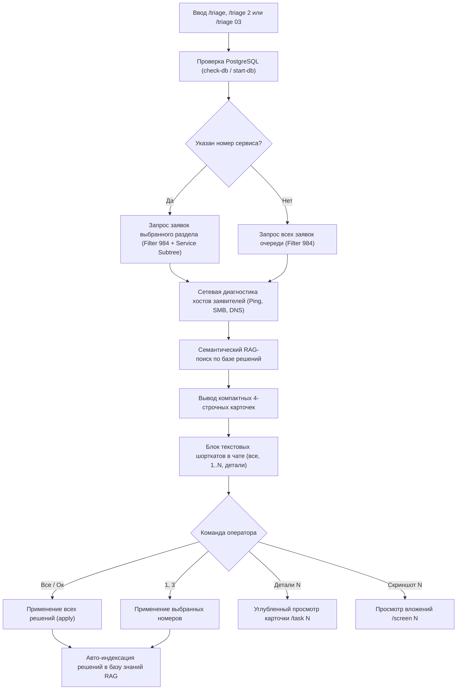
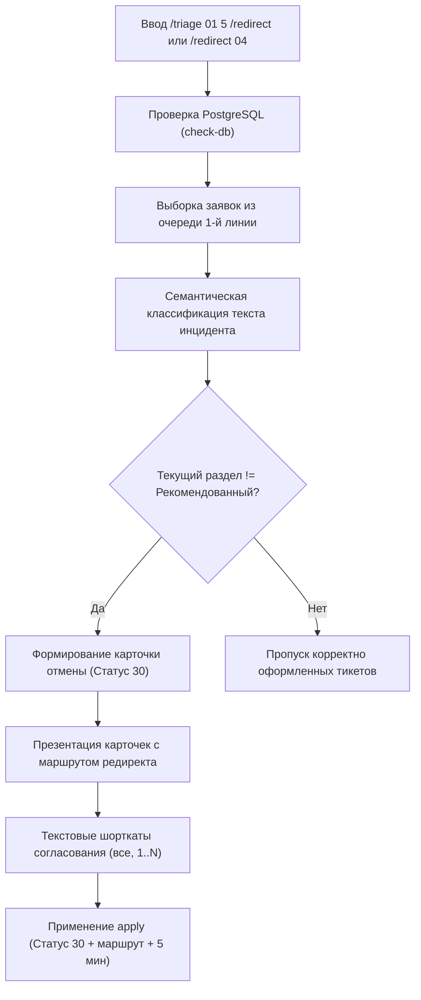
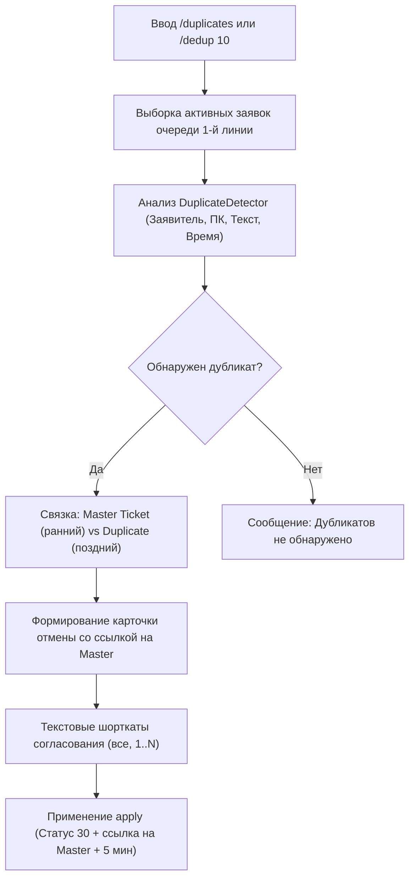

# 📖 Справочник оперативных Workflow и команд Helpdesk Agent

Настоящее руководство описывает все поддерживаемые рабочие процессы (Workflows), диалоговые слэш-команды и текстовые шорткаты AI-ассистента технической поддержки в среде Antigravity (AGY).

---

## 💡 Принцип работы команд и Workflows в Antigravity CLI

> [!NOTE]
> **Как устроены команды в Antigravity (`agy`):**
> 1. **Встроенные системные команды CLI (`/help`, `/exit`, `/goal`, `/schedule`, `/plan`, `/grill-me`, `/learn`, `/teamwork-preview`):**
>    Зашиты в бинарный TUI-интерфейс терминала и отображаются в системном автокомплите по нажатию клавиши `/`.
> 2. **Пользовательские рабочие процессы и навыки (Skills & Workflows):**
>    Определяются через файлы навыков (`.agents/skills/intraservice-helpdesk/SKILL.md`) и системные правила (`helpdesk_agent/GEMINI.md`).
>    Команды вроде `/triage`, `/task`, `/diag`, `/screen`, `/kb`, `/sync`, `/db` — это **высокоуровневые диалоговые команды агента**. Вы вводите их прямо в чат, и агент мгновенно распознает их, запускает соответствующие I/O-инструменты и выводит результат с интерактивными модальными окнами согласования.

---

## ⚡ Быстрая таблица команд

| Команда | Альтернативные фразы | Назначение |
|---|---|---|
| `/triage` `[сервис]` `[N]` | `разбери 2 сервис`, `триаж 03`, `пачка 5`, `разбери 1С` | Пакетный разбор очереди 1-й линии (Filter 984). Поддерживает фильтрацию по **человеческому номеру сервиса** (`01`..`16`) и лимиту N |
| `/redirect` `[сервис]` `[N]`<br>`/triage [сервис] [N] /redirect` | `отмени редиректы 01`, `заявки на перенаправление`, `триаж 04 /redirect` | Поиск и пакетная отмена заявок, ошибочно зарегистрированных не в том разделе каталога (Статус 30: **Отменена** + маршрутизация) |
| `/services` | `каталог сервисов`, `номера разделов` | Список корневых разделов каталога услуг с человеческими номерами (`01`..`16`) для фильтрации в `/triage` |
| `/task <ID>` | `детали <ID>`, `покажи тикет <ID>` | Полная карточка заявки: заявитель, кастомные поля, история, сетевой статус и RAG |
| `/diag <ХОСТ/IP>` | `проверь <ХОСТ>`, `пинг <IP>` | Экспресс-диагностика хоста (ICMP Ping, DNS, порт SMB:445, WinRM:5985) |
| `/screen <ID>` | `скриншот <ID>`, `покажи вложения <ID>` | Скачивание и визуальный анализ скриншотов ошибок из вложений заявки |
| `/kb <запрос>` | `поиск в базе <запрос>`, `как решали <...>` | Семантический RAG-поиск в базе исторических решений (FastEmbed / pgvector) |
| `/sync` `[N]` | `синхронизируй базу`, `обнови знания` | Индексация и автообучение на выполненных (29) и отмененных (30) заявках |
| `/db` | `статус бд`, `проверь базу` | Проверка состояния контейнера PostgreSQL + pgvector и автозапуск при необходимости |
| `/skip <ID>` | `пропусти <ID>`, `отложи <ID>` | Исключение заявки (или списка через запятую) из показов в текущей смене (до сброса) |
| `/reset-session` | `сбрось сессию`, `верни пропущенные` | Сброс сессионного кэша и возврат всех отложенных заявок обратно в очередь разбора |
| `/reflect` | `саморефлексия`, `аудит скорости`, `оптимизируй память` | Анализ траектории сессии, устранение лишних чтений файлов (Zero-Read) и обновление оперативной памяти |

---

## 🔄 Основные сценарии (Workflows)

### Сценарий 1: Пакетный разбор очереди (`/triage`)

Самый частый ежедневный процесс инженера первой линии. Позволяет разбирать как всю очередь целиком, так и точечно фокусироваться на конкретном разделе каталога (например, только заявки по 1С или только по оргтехнике/принтерам).



#### Примеры вызова:
- `/triage` — разбор всей стопки заявок из фильтра 1-й линии (по умолчанию 5 заявок).
- `/triage 2` (или `/triage 02`, `триаж 2`) — разбор заявок **только по разделу 02** («Установка и настройка программ»).
- `/triage 3` (или `/triage 03`, `триаж оргтехника`) — разбор заявок **только по разделу 03** («Установка и обслуживание оргтехники / Принтеры / ПК»).
- `/triage 6` (или `/triage 06`, `триаж 1с`) — разбор заявок **только по разделу 06** («Вопросы по 1С»).
- `/triage 2 10` — разбор до 10 заявок по разделу 02.

---

### Сценарий 1.1: Поиск и отмена заявок на редирект (`/redirect` / `/triage ... /redirect`)

Используется для быстрого выявления и закрытия неверно оформленных заявок (например, пользователь оформил заявку на доступ к папке или ошибку 1С в разделе учетных записей или сети).



#### Примеры вызова:
- `/triage 01 5 /redirect` (или `/redirect 01 5`) — поиск до 5 заявок в разделе 01, требующих отмены и редиректа.
- `/triage 04 /redirect` (или `/redirect 04`) — поиск заявок на редирект в разделе 04 («Сеть и интернет») с лимитом 5.
- `/triage /redirect` (или `/redirect`) — поиск заявок на редирект по всей очереди 1-й линии.
- `/redirect 01 10` — шорткат прямого вызова (раздел 01, до 10 заявок).

#### Справочник человеческих номеров сервисов:
| Номер | Название раздела | Типовые заявки в поддереве |
|:---:|---|---|
| **`01`** | **Учетные записи пользователей** | Создание/изменение УЗ, почта, 1С, Directum |
| **`02`** | **Установка и настройка программ** | Активация Office/Windows, установка ПО, сброс кэша |
| **`03`** | **Установка и обслуживание оргтехники** | Компьютеры, ноутбуки, МФУ, принтеры, ремонт |
| **`04`** | **Проблемы с сетью и интернетом** | Сетевые папки, монтаж, Wi-Fi доступ |
| **`05`** | **Вопросы по DIRECTUM, B2B** | Directum, B2B площадки |
| **`06`** | **Вопросы по 1С** | 1С:УПП, 1С:ERP, Бухгалтерия, ЗУП, Документооборот |
| **`07`** | **Вопросы по терминалу сбора данных** | Настройка и связь с базой ТСД |
| **`08`** | **Информационная безопасность** | Доступы, USB, внешние подключения |
| **`09`** | **Электронная цифровая подпись** | ЭЦП для банков, СБИС, Госуслуг |
| **`10`** | **Телефония** | Подключение, переадресация, сбои связи |
| **`11`** | **Общие вопросы** | Прочие инциденты и консультации |
| **`12`** | **Архив КТД** | Централизованное хранилище КД и ТД |
| **`14`** | **MDC системы** | АИС "Диспетчер", DPA |
| **`15`** | **Вопросы по HelpDesk** | Работа и база знаний HelpDesk |
| **`16`** | **Вопросы по IPS PDM\PLM** | ПО конструкторских рабочих мест |

#### Порядок действий:
1. Вы отправляете в чат `/triage` (или `/triage 2`, `/triage 03 5`, `разбери 6 сервис`).
2. Агент проверяет базу pgvector (Tier 1) и при необходимости запускает её.
3. Если указан номер раздела, агент автоматически находит все подсервисы этой ветки каталога и запрашивает тикеты исключительно из выбранного раздела.
4. Агент проводит параллельную сетевую диагностику ПК заявителей и ищет аналогичные решения в RAG.
5. В чат выводятся **лаконичные 4-строчные карточки** (статус текстом, сеть хоста, оценка уверенности 1..10, заявитель, суть проблемы и готовый ответ).
6. Агент выводит блок понятных текстовых шорткатов (`все`, `1, 2, 4`, `детали N`).
7. После подтверждения оператора агент выполняет `apply`, меняет статусы, оставляет комментарии инженера Беликова Алена и списывает трудозатраты.

---

### Сценарий 1.2: Очистка очереди от заявок-дубликатов (`/duplicates` / `/dedup`)

Позволяет автоматически просканировать очередь 1-й линии, выявить повторные отправки (дабл-клики, повторы по тому же ПК или коллективные жалобы), связать дубликат с основной заявкой (Master Ticket) и пакетно отменить дубликаты со статусом **30 («Отменена»)**.



#### Примеры вызова:
- `/duplicates` — поиск дубликатов по всей очереди 1-й линии (по умолчанию до 10 дублей).
- `/duplicates 20` — расширенный поиск до 20 дубликатов.
- `/dedup` — короткий слэш-псевдоним.
- `найди дубликаты`, `почисти дубли` — фразы на естественном языке.

---

### Сценарий 2: Детальный анализ единичной заявки (`/task <ID>`)

Используется для глубокого изучения сложного тикета.

**Пример вызова:**
```text
/task 139022
детали 139022
```

**Что делает агент:**
1. Загружает полные данные по задаче через `helpdesk_tool.py task 139022`.
2. Извлекает распарсенные кастомные поля (ПК заявителя, инвентарный номер, кабинет, телефон).
3. Проверяет доступность ПК в сети.
4. Подтягивает историю переписки и комментариев инженеров.
5. Выполняет RAG-поиск по базе аналогичных проблем и предлагает проект решения.

---

### Сценарий 3: Диагностика рабочей станции (`/diag <ХОСТ>`)

Используется для проверки сетевого состояния ПК пользователя без перехода в сторонние утилиты.

**Пример вызова:**
```text
/diag NTEMW0047
проверь 10.245.9.14
```

**Что делает агент:**
1. Проверяет корректность имени по правилам именования корпоративных хостов (`normalizer.py`).
2. Выполняет DNS-резолвинг в локальном домене.
3. Проверяет ICMP-пинг.
4. Проверяет открытие портов `SMB (445)` и `WinRM (5985)`. Если брандмауэр блокирует ICMP, но SMB открыт — агент сигнализирует, что хост **онлайн**.

---

### Сценарий 4: Анализ вложений и скриншотов (`/screen <ID>`)

Используется, когда заявитель прикрепил скриншот с ошибкой программы или отчета 1С.

**Пример вызова:**
```text
/screen 139063
скриншот 139063
```

**Что делает агент:**
1. Скачивает вложение задачи в локальную директорию через `helpdesk_tool.py attachment <ID>`.
2. Анализирует изображение с помощью встроенного инструмента `view_file`.
3. Описывает текст ошибки на экране, анализирует причину и предлагает готовое решение.

---

### Сценарий 5: Поиск и обучение базы знаний (`/kb` и `/sync`)

**Семантический поиск:**
```text
/kb сбой печати на HP LaserJet в 1С
как решали ошибку заблокированной таблицы 1С?
```

**Синхронизация и автообучение:**
```text
/sync
/sync 100
обнови базу знаний
```

**Что делает агент:**
1. Выгружает закрытые (`29`) и отмененные (`30`) заявки из IntraService.
2. Пропускает их через умный фильтр качества (отсекает пустые отписки вида «сделано», «ок»).
3. Генерирует векторные эмбеддинги (FastEmbed / Gemini Embeddings) и сохраняет в pgvector и локальный кэш.

---

### Сценарий 6: Саморефлексия и оптимизация агента (`/reflect`)

Используется для аудита производительности работы агента, устранения медленных или ошибочных паттернов и дополнения оперативной памяти (`helpdesk_agent/GEMINI.md`).

**Пример вызова:**
```text
/reflect
саморефлексия
как улучшить твою скорость?
```

**Что делает агент:**
1. Анализирует историю вызовов инструментов в текущей сессии на предмет избыточных чтений файлов (`view_file`, `grep_search`).
2. Оценивает соблюдение инвариантов (Zero-Read Execution, Tier 1 БД, 4-строчный формат карточек).
3. Формирует краткий аудит: задержки, лишние действия, отсутствовавшие знания.
4. Предлагает и после подтверждения оператором точечно вносит оптимизации в `helpdesk_agent/GEMINI.md` и `templates.json`.

---

### Сценарий 7: Управление сессией и пропуск заявок (`/skip` и `/reset-session`)

Используется для исключения отложенных или сложных тикетов из повторных выборок `/triage` и `/redirect` в течение рабочей смены.

**Пример вызова:**
```text
/skip 136197, 135296
пропусти 136197
эти заявки пока что пропустим
/reset-session
верни пропущенные заявки
```

**Что делает агент:**
1. При команде `/skip <ID>` сохраняет ID заявок в локальный сессионный кэш (`.session_state.json`, TTL 8 часов).
2. При последующих вызовах `/triage` и `/redirect` эти тикеты автоматически исключаются из анализируемой пачки и не показываются оператору.
3. При команде `/reset-session` кэш сбрасывается, и все отложенные заявки снова становятся доступны в очереди.
4. При выполнении `apply` тикет автоматически удаляется из списка пропущенных.

---

## ⌨️ Шорткаты при интерактивном согласовании

Когда агент вывел карточки стопки заявок, вы можете ответить любым удобным способом:

- **Интерактивный UI:** Отметить чекбоксы в модальном окне `ask_question` и нажать **Submit**.
- **`все` / `+` / `ок`** $\rightarrow$ Согласовать все предложенные действия.
- **`1, 2, 4`** $\rightarrow$ Применить действия только по номерам 1, 2 и 4.
- **`детали 3`** $\rightarrow$ Показать расширенную историю по заявке №3.
- **`скриншот 2`** $\rightarrow$ Скачать и проанализировать скриншот из заявки №2.
- **`шаблон hardware_repair для 1`** $\rightarrow$ Переключить шаблон для заявки №1.
- **`для 2 напиши: <ваш комментарий>`** $\rightarrow$ Отправить кастомный текст в заявку №2.

---

## 📋 Каталог системных статусов IntraService

| ID | Название статуса | Типовое применение |
|---|---|---|
| `27` | **В работе** | Стандартное принятие задачи к исполнению |
| `35` | **Требует уточнения** | ПК не в сети / требуется дополнительная информация от заявителя |
| `48` | **Ожидание устройства** | Аппаратный ремонт / принести системный блок в каб. 112 |
| `30` | **Отменена** | Неверный раздел каталога услуг / дубликат / перенаправление |
| `29` | **Выполнена** | Услуга оказана (Wi-Fi настроен, доступ выдан, инцидент закрыт) |
| `31` | **Открыта** | Первичный статус новой входящей заявки |
