# Спецификация раздела администрирования и автоматизации (`/admin`)

Данный документ описывает функциональные модули, API-контракты и сценарии использования административного раздела системы **IntraLink** (`/admin`), вынесенного за рамки оперативного рабочего пространства инженера 1-й линии.

---

## 1. Назначение и целевая аудитория

Раздел `/admin` предназначен для:
- **Ведущих инженеров и системных администраторов**: управление доменными интеграциями, базами знаний, драйверами оргтехники.
- **Мониторинга инфраструктуры**: отслеживание состояния очередей Redis Streams, шлюза IntraService, Circuit Breaker и PostgreSQL.
- **Настройки аутентификации**: сервисный аккаунт IntraService, доменные учётные данные WinRM/SMB, операторы Telegram-бота.

---

## 2. Модули административной панели

```mermaid
graph TD
    ADMIN["/admin Панель управления"]
    ADMIN --> M1["1. База знаний и RAG (pgvector)"]
    ADMIN --> M2["2. Execution Broker (Windows Domain RPC)"]
    ADMIN --> M3["3. Оркестрация печати и оргтехники"]
    ADMIN --> M4["4. Системные настройки и шлюз Core API"]

    M1 --> M1_1["Семантический поиск FastEmbed"]
    M1 --> M1_2["Синхронизация закрытых заявок"]
    M1 --> M1_3["Индексация кастомных решений"]

    M2 --> M2_1["Выдача Wi-Fi (WLAN-WORKNET)"]
    M2 --> M2_2["Создание пользователей AD (New-ADUser)"]
    M2 --> M2_3["Сетевые WMI/RPC сценарии"]

    M3 --> M3_1["База моделей (printers_knowledge_base.json)"]
    M3 --> M3_2["Индексатор драйверов (.inf)"]
    M3 --> M3_3["SSE-стриминг логов установки"]
    M3 --> M3_4["Доменная авторизация (Fernet)"]

    M4 --> M4_1["Circuit Breaker & статус IntraService"]
    M4 --> M4_2["Сервисный аккаунт IntraService"]
    M4 --> M4_3["Операторы Telegram-бота"]
    M4 --> M4_4["События Redis Streams"]
```

---

## 3. Модуль 1: Семантическая база знаний и RAG (pgvector)

### Назначение
Хранилище решений исторических инцидентов Helpdesk в PostgreSQL с расширением `pgvector` и векторными эмбеддингами `FastEmbed` (`sentence-transformers/paraphrase-multilingual-MiniLM-L12-v2`).

### Функционал
1. **Семантический поиск (`POST /api/v1/triage/rag/search`):**
   - Поиск решений по смысловому описанию проблемы без строгого совпадения ключевых слов.
   - Фильтрация по косинусному расстоянию (порог `0.70`).
2. **Синхронизация закрытых заявок (`POST /api/v1/triage/rag/sync`):**
   - Фоновая выгрузка выполненных (статус 29) и отмененных (статус 30) заявок из IntraService.
   - Очистка комментариев от шума и автогенерация векторных эмбеддингов.
3. **Ручная индексация (`POST /api/v1/triage/rag/index`):**
   - Добавление эталонных решений инженеров в базу знаний.

---

## 4. Модуль 2: Execution Broker (Windows Domain RPC)

### Назначение
Асинхронная очередь задач в `Redis Streams` (`stream:execution_queue`) для удаленного исполнения PowerShell и WMI-скриптов на хостах домена Active Directory.

### Сценарии
1. **Выдача доступа к Wi-Fi (`grant_wlan`):**
   - Добавление учетной записи заявителя в группу безопасности `WLAN-WORKNET` в Active Directory.
   - Автоматический перевод заявки в статус 29 («Выполнена») с инструкцией по подключению.
2. **Создание учетной записи AD (`create_user`):**
   - Создание пользователя по шаблону подразделения через командлет `New-ADUser`.
3. **Сетевая экспресс-диагностика (`diagnose_host`):**
   - WMI-опрос операционной системы, сетевых адаптеров и состояния служб на удаленном ПК.

---

## 5. Модуль 3: Оркестрация печати и оргтехники

### Назначение
Автоматизированная установка сетевых и локальных принтеров на рабочие станции под управлением ОС Windows с WMI-bootstrap (динамическое включение WinRM) и подбором драйверов.

### Функционал
1. **Каталог моделей (`GET /admin/api/knowledge-base`):**
   - Просмотр и редактирование файла `printers_knowledge_base.json`.
2. **Индексатор драйверов (`POST /admin/api/printers/rebuild-index`, `POST /admin/api/printers/fast-reindex`):**
   - Парсинг `.inf`-файлов в сетевом каталоге драйверов и сопоставление Hardware ID принтеров.
3. **Мониторинг заданий и логи (`GET /admin/api/print-jobs`, `GET /admin/api/print-jobs/{id}/logs`):**
   - Просмотр очереди заданий установки оргтехники.
   - Потоковое чтение логов установки в реальном времени через **Server-Sent Events (SSE)**.
4. **Доменные учетные данные (`POST /admin/api/domain-auth`):**
   - Хранение зашифрованных доменных учетных данных администратора для WinRM и SMB.

---

## 6. Модуль 4: Системное администрирование и интеграции

### Назначение
Конфигурация параметров взаимодействия компонентов монорепозитория, авторизации и мониторинга работоспособности шлюза.

### Функционал
1. **Мониторинг соединений (`GET /admin/api/status`):**
   - Статус Circuit Breaker шлюза IntraService (`CLOSED`, `OPEN`, `HALF_OPEN`).
   - Доступность Redis и PostgreSQL.
2. **Управление сервисным аккаунтом (`POST /admin/api/service-user`, `DELETE /admin/api/service-user`):**
   - Хранение зашифрованного Basic Auth токена в Redis для работы фонового воркера.
3. **Операторы Telegram-бота (`GET /admin/api/users`, `POST /admin/api/users/add`, `DELETE /admin/api/users/{id}`):**
   - Управление доступом инженеров к боту техподдержки.
4. **Журнал событий (`GET /admin/api/worker-logs`):**
   - Просмотр последних push-событий из потока `stream:intraservice_events`.

---

## 7. Безопасность и разграничение доступа

- Доступ ко всем эндпоинтам `/admin/api/*` защищен HttpOnly JWT-токеном сессии `admin_session`, валидируемым через [`verify_admin_jwt`](../core-api/README.md).
- Пароли и сервисные ключи сохраняются в Redis исключительно в зашифрованном виде (Fernet через ключ `settings.ENCRYPTION_KEY`).
