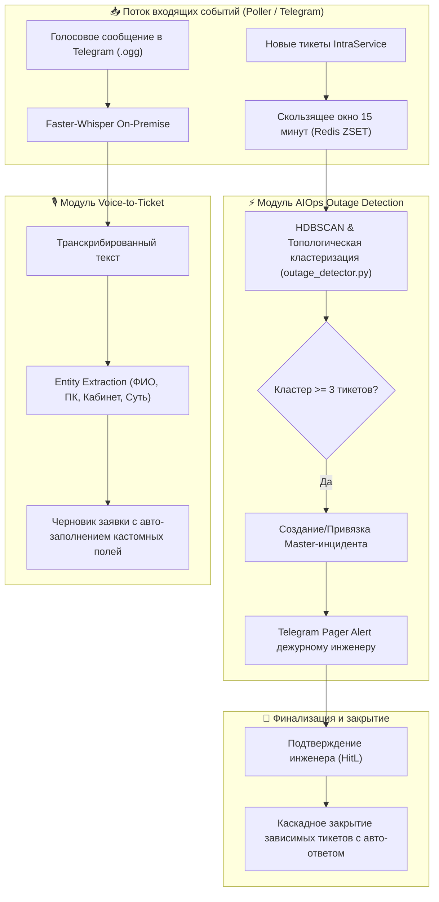

# 📋 План реализации: Этап 2 (Q4 2026) — AIOps Кластеризация и Мультимодальность

Данный документ является **техническим заданием и пошаговым архитектурным планом** реализации Этапа 2 развития системы IntraLink согласно [`docs/roadmap.md`](docs/roadmap.md).

---

## 🎯 Архитектурный контекст и Инварианты

1. **Базис системы:**
   - Единый шлюз состояния `core-api` (FastAPI + SQLAlchemy Async + Redis Streams).
   - Двухконтурный Zero Trust DLP (`sanitizer.py` + Redis PII Vault).
   - Фоновый Fail-Fast Pre-fetch телеметрии хостов (`host_telemetry.py`).
   - Двухэтапный Hybrid RAG (`rag.py`: pgvector + tsvector + RRF + Cross-Encoder Reranker).
   - Синтез ответов и авто-канонизация базы знаний (`ai_synthesis.py`).
2. **Ключевой принцип Этапа 2:**
   - **Privacy-First & On-Premise Voice:** Голосовые файлы пользователей обрабатываются строго внутри периметра через `faster-whisper` без передачи аудиоданных во внешние облачные API.
   - **Детерминированная кластеризация + HitL:** Массовые аварии (Outages) детектируются автоматически на базе векторных и топологических корреляций, но подтверждаются инженером в Telegram/Web перед массовыми действиями (Human-in-the-Loop).



---

## 🛠 Детальный план по фазам реализации

---

### 🚨 Фаза 1. Скользящее окно событий и Детекция аварий (Real-time Outage Engine)

**Цель:** Автоматическое обнаружение всплесков однотипных инцидентов (падение сервиса 1С, сетевого коммутатора, почтового сервера) в реальном времени.

1. **Сервис кластеризации (`core-api/app/services/aiops/outage_detector.py`):**
   - **Скользящее временное окно:** Redis ZSET `stream:active_tickets_window` (окно 15 минут с авто-очисткой устаревших записей).
   - **Векторно-топологический вектор заявки:**
     - Семантический вектор проблемы (3072-dim / FastEmbed).
     - Номер раздела каталога (`ServiceId` / `RootNumber`).
     - Сетевой сегмент хоста (`subnet_24` из IP заявителя или ПК).
   - **Алгоритм детекции кластеров:**
     - Расчет матрицы косинусного сходства между активными тикетами в окне.
     - Порог объединения: семантическое сходство $\ge 0.82$ + совпадение сервиса или подсети.
     - Условие срабатывания аварии: размер кластера $N \ge 3$ заявок за 15 минут.
2. **Модель состояния аварии (`OutageCluster`):**
   - Поля: `outage_id`, `title`, `service_id`, `root_service_name`, `subnet`, `master_task_id`, `related_task_ids`, `status` (`suspected`, `confirmed`, `resolved`), `detected_at`, `resolved_at`.
   - Хранение в PostgreSQL (`outage_clusters`) и Redis кэше активных инцидентов (`outage:active:<id>`).
3. **Тестирование:** `core-api/tests/test_outage_detector.py`.

---

### 📱 Фаза 2. Pager-оповещения и Управление авариями (HitL Outage Hub)

**Цель:** Мгновенное оповещение дежурного инженера в Telegram с кнопками подтверждения и роутер управления авариями в Core API.

1. **Роутер управления авариями (`core-api/app/routers/outages.py`):**
   - `GET /api/v1/outages/active` — получение списка текущих активных аварийных кластеров.
   - `GET /api/v1/outages/{outage_id}` — детальная карточка аварии со списком связанных заявок и заявителей.
   - `POST /api/v1/outages/{outage_id}/confirm` — подтверждение аварии инженером (перевод статуса в `confirmed`).
   - `POST /api/v1/outages/{outage_id}/resolve` — разрешение аварии и каскадное закрытие зависимых заявок.
   - `POST /api/v1/outages/{outage_id}/attach` — ручная привязка заявки к существующему Outage.
2. **Интеграция с Telegram Bot (`telegram-bot/handlers/outages.py`):**
   - Доставка алерта через Redis Streams в Consumer Group `bot_group`.
   - Интерактивная карточка:
     ```text
     🚨 [МАССОВАЯ АВАРИЯ ОБНАРУЖЕНА]
     Сервис: 06. 1С:Предприятие (База Бухгалтерия)
     Заявок в кластере: 4 шт. за 8 минут
     Подсеть / Локация: 10.244.12.0/24 (АБК-1)
     Основная заявка: #14520 (Иванов И.И.)
     ```
   - Inline-кнопки: `[✅ Подтвердить Outage]` | `[❌ Ложная тревога]` | `[📋 Список тикетов]`.
3. **Тестирование:** `core-api/tests/test_outage_hub.py`.

---

### 🎙️ Фаза 3. Локальная голосовая транскрибация (Faster-Whisper Engine)

**Цель:** Локальная, быстрая и безопасная транскрибация голосовых сообщений без отправки аудио во внешние облачные сервисы.

1. **Сервис транскрибации (`core-api/app/services/voice/transcriber.py`):**
   - Использование библиотеки `faster-whisper` (модель `Systran/faster-whisper-small` / `base` с русской локализацией).
   - Запуск инференса в отдельном пуле потоков (`asyncio.to_thread`) с семафором параллелизма (не более 2 одновременных транскрибаций).
   - Поддержка форматов аудио: `.ogg` (Opus voice из Telegram), `.wav`, `.mp3`, `.m4a`.
   - Автоматическая очистка временных аудиофайлов после обработки.
2. **Тестирование:** `core-api/tests/test_voice_transcriber.py`.

---

### 📝 Фаза 4. Извлечение сущностей и Генератор заявок (Voice-to-Ticket)

**Цель:** Преобразование сырого транскрибированного текста в готовую структурированную заявку IntraService.

1. **Модуль извлечения сущностей (`core-api/app/services/voice/entity_extractor.py`):**
   - Извлечение:
     - ФИО заявителя и контактный телефон.
     - Имя компьютера (`NTEMW0144`, `ZTEP...`) через `shared/normalizer.py`.
     - Номер кабинета / здания (например: *«АБК 3, 112 кабинет»*).
     - Целевой сервис IntraService (по классификатору `rules/catalog.py`).
     - Чистое техническое описание проблемы (с удалением слов-паразитов и пауз).
2. **Интеграция в Telegram-бот:**
   - Пользователь отправляет голосовое сообщение $\rightarrow$ бот транскрибирует и присылает интерактивный черновик:
     ```text
     🎤 Ваша заявка распознана:
     👤 Заявитель: Петров П.П.
     📍 Кабинет: АБК-1, каб. 305 | 💻 ПК: NTEMW0144
     📂 Раздел: 03. Оргтехника и печать
     📝 Проблема: Замятие бумаги в принтере Kyocera M2040dn
     ```
   - Кнопки: `[🚀 Отправить заявку]` | `[✏️ Редактировать]`.
3. **Тестирование:** `core-api/tests/test_voice_entity_extractor.py`.

---

### ⚡ Фаза 5. Каскадное разрешение инцидентов (Outage Resolution Cascade)

**Цель:** Одновременное закрытие всех тикетов аварии с отправкой персонализированных ответов заявителям при устранении корневого сбоя.

1. **Каскадный обработчик (`core-api/app/services/aiops/resolution_cascade.py`):**
   - При вызове `resolve_outage(outage_id, resolution_comment, engineer_id)`:
     - Мастер-инцидент переводится в статус `29 Выполнена` со списанием трудозатрат.
     - Все зависимые заявки кластера переводятся в статус `29 Выполнена` с подстановкой канонического комментария (например: *«Работа сервиса 1С восстановлена после устранения сбоя СУБД. Проверьте, пожалуйста, доступ.»*).
     - Канонизация и авто-индексация корневой причины в `task_knowledge_base`.
     - Push-уведомления заявителям через Telegram-бот / IntraService.
2. **Тестирование:** `core-api/tests/test_outage_cascade.py`.

---

### 🏁 Фаза 6. Сквозная интеграция, Web SPA дашборд аварий и Документация

**Цель:** Финализация, сквозное тестирование и фиксация в документации.

1. **Обновление Web UI (`intra-web`):**
   - Виджет активных аварий (Outage Banner) на дашборде триажа.
2. **Обновление документации:**
   - `docs/architecture.md`, `docs/roadmap.md`, `docs/services/core-api/README.md`.
3. **Полный проверочный запуск тестов:**
   - 100% прохождение `pytest core-api/tests`.

---

## 🧪 План верификации (Verification Plan)

### Автоматизированные тесты (`pytest core-api/tests`)
1. `test_outage_detector.py` — корректность группировки $\ge 3$ заявок в окне 15 минут по эмбеддингам и подсетям.
2. `test_outage_hub.py` — эндпоинты `/api/v1/outages/*` и переходы состояний `suspected` $\rightarrow$ `confirmed` $\rightarrow$ `resolved`.
3. `test_voice_transcriber.py` — локальная транскрибация аудиофайлов `.ogg` / `.wav`.
4. `test_voice_entity_extractor.py` — извлечение имени ПК, кабинета и сервиса из голоса.
5. `test_outage_cascade.py` — каскадное закрытие связанных заявок при разрешении Master-инцидента.
