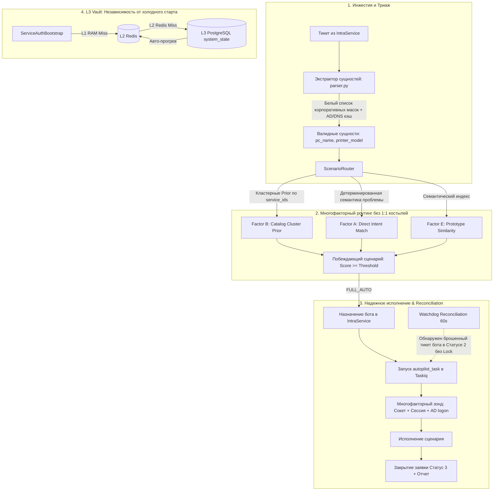

# 🏗️ Фундаментальный архитектурный план: Устранение скрытых костылей и усиление надежности автопилота IntraLink v2

> **Цель:** Руководствуясь **No-Kludge & Root-Cause Policy (`GEMINI.md`)**, ликвидировать 5 выявленных концептуальных противоречий и хрупких решений, обеспечив абсолютную отказоустойчивость, корректность классификации и автономность конвейера без зависимости от черных списков и ручных прогревов кэша.

---

## 🔍 Сравнительный аудит: Текущие костыли (As-Is) vs Фундаментальные решения (To-Be)

| № | Узкое место / Костыль (As-Is) | Первопричина дефекта (Root Cause) | Фундаментальное решение (To-Be) | Затрагиваемые модули |
| :- | :--- | :--- | :--- | :--- |
| **1** | **Жесткий 1:1 маппинг в `CatalogPrior`**<br>`19 -> install_printer`<br>`12 -> printer_spooler_restart` | Сервис каталога ошибочно трактуется как единственный сценарий, а не как доменный контекст/кластер. | **Многозначный фактор каталога:** начисление Prior всем сценариям, у которых `service_id in scenario.definition.service_ids`. Точный сценарий побеждает по семантике проблемы (Factor A). | [`core/scenarios/catalog_prior.py`](file:///c:/Users/belikov.a/Desktop/Акты,%20документы/Work/!Projects/intralink/core/scenarios/catalog_prior.py),<br>[`core/scenarios/router.py`](file:///c:/Users/belikov.a/Desktop/Акты,%20документы/Work/!Projects/intralink/core/scenarios/router.py) |
| **2** | **Regex Blacklist оргтехники (`NON_PC_PATTERNS`)** в экстракторе ПК | Попытка угадать модель устройства текстовыми регексами без верификации в корпоративных источниках правды. | **White-list масок + Ground Truth AD/DNS:** признание только валидных корпоративных префиксов (`WKS-`, `NTEMW*`, `ARM-`) + быстрая проверка существования в Active Directory/DNS за <2 мс. | [`core/intraservice/parser.py`](file:///c:/Users/belikov.a/Desktop/Акты,%20документы/Work/!Projects/intralink/core/intraservice/parser.py),<br>[`core/ad/pool.py`](file:///c:/Users/belikov.a/Desktop/Акты,%20документы/Work/!Projects/intralink/core/ad/pool.py) |
| **3** | **Разрыв транзакции «IntraService $\rightarrow$ Taskiq»**<br>(Риск «зомби-тикетов») | Отсутствие двухфазного подтверждения: если после назначения бота в тикете падает сеть/Redis, тикет зависает в статусе 2 навсегда. | **Self-Healing Reconciliation Loop:** Watchdog автоматически подхватывает тикеты бота в статусе 2 («В работе»), по которым нет активного Distributed Lock и запущенных команд $\ge 3$ минут. | [`worker/src/tasks/watchdog.py`](file:///c:/Users/belikov.a/Desktop/Акты,%20документы/Work/!Projects/intralink/worker/src/tasks/watchdog.py),<br>[`worker/src/tasks/triage.py`](file:///c:/Users/belikov.a/Desktop/Акты,%20документы/Work/!Projects/intralink/worker/src/tasks/triage.py) |
| **4** | **Ложный оффлайн хоста из-за Windows Firewall**<br>(Бот просит включить ПК работающего пользователя) | Зонд полагается только на сырой сокет/ping, которые блокируются профилем брандмауэра Windows. | **Многофакторный синтез активности хоста:** корреляция с IP заявителя в сессии IntraService + проверка времени входа `lastLogonTimestamp` в Active Directory при сокетном таймауте. | [`core/diagnostic/service.py`](file:///c:/Users/belikov.a/Desktop/Акты,%20документы/Work/!Projects/intralink/core/diagnostic/service.py),<br>[`core/scenarios/adapters/offline_host.py`](file:///c:/Users/belikov.a/Desktop/Акты,%20документы/Work/!Projects/intralink/core/scenarios/adapters/offline_host.py) |
| **5** | **Cold Start воркера без ключей в Redis**<br>(Ошибка `credentials missing` каждые 30 сек) | Сервисные учетные данные бота хранятся только в Redis (RAM), при рестарте контейнеров воркер не умеет сам читать их из БД. | **Трехуровневый L1/L2/L3 Vault:** чтение зашифрованного мастер-токена из PostgreSQL `system_state` при промахе L2 (Redis) с автоматическим прогревом кэша без участия оператора. | [`core/intraservice/auth.py`](file:///c:/Users/belikov.a/Desktop/Акты,%20документы/Work/!Projects/intralink/core/intraservice/auth.py),<br>[`core/database/system_state.py`](file:///c:/Users/belikov.a/Desktop/Акты,%20документы/Work/!Projects/intralink/core/database/system_state.py) |

---

## 📐 Архитектурная схема целевого контура



---

## 🚀 Поэтапный план реализации

### Фаза 1. Реформа каталожного фактора (`CatalogPriorProvider` & `ScenarioRouter`)
* **Цель:** Исключить ложные перекосы в скорах между сценариями одного домена.
* **Что делаем:**
  1. В [`core/scenarios/catalog_prior.py`](file:///c:/Users/belikov.a/Desktop/Акты,%20документы/Work/!Projects/intralink/core/scenarios/catalog_prior.py):
     - Заменить единичный метод `get_prior(task) -> Optional[Tuple[str, float, str]]` на кластерный метод:
       `get_priors(task: TaskDTO) -> Dict[str, Tuple[float, str]]`.
     - Метод определяет, какие сценарии поддерживают данный `service_id` (через реестр сервисов или кластерные константы `SERVICE_IDS_PRINTER_SUPPORT`, `SERVICE_IDS_ACCOUNT_CREATE` и т.д.).
     - Если заявка подана в сервис 19, каталожный приоритет `+0.19` получают **все** относящиеся к нему сценарии (`install_printer`, `printer_spooler_restart`, `default_printer_fix`).
  2. В [`core/scenarios/router.py`](file:///c:/Users/belikov.a/Desktop/Акты,%20документы/Work/!Projects/intralink/core/scenarios/router.py):
     - В цикле расчета кандидатов `for key, scenario in scenarios.items():`:
       ```python
       prior_match = priors.get(key)
       if prior_match:
           b_contrib = prior_match[0] * WEIGHT_B_CATALOG
           base_score += b_contrib
           reasons.append(f"Factor B (Catalog Prior): +{b_contrib:.2f} ({prior_match[1]})")
       ```
     - Внутри каталога побеждает тот сценарий, который набрал высший **Factor A** (прямой интент заявителя: установка vs зависшая печать).

---

### Фаза 2. White-list корпоративных хостов и валидация через Active Directory / DNS
* **Цель:** Ликвидировать хрупкий regex-блэклист моделей оргтехники.
* **Что делаем:**
  1. В [`core/intraservice/parser.py`](file:///c:/Users/belikov.a/Desktop/Акты,%20документы/Work/!Projects/intralink/core/intraservice/parser.py):
     - Удалить зависимость от бесконечного расширения `NON_PC_PATTERNS`.
     - Зафиксировать стандарт корпоративных хостов предприятия:
       Именем компьютера в `pc_name` может считаться строка, удовлетворяющая строго корпоративным префиксам:
       `^(?:WKS|NTEMW|ARM|NB|PC|WS|DESKTOP|LAPTOP)[\-_]?[0-9A-Za-z]+$`
     - Любые другие паттерны без явного контекста («на ПК», «на компьютере») не принимаются за хост вслепую.
  2. Ввести быструю верификацию хоста через AD/DNS с кэшированием в Redis:
     - Функция `async def is_valid_domain_computer(hostname: str, redis_client=None) -> bool`.
     - Проверяет кэш Redis `cache:ad:computer:{hostname}` (TTL 24 часа). При промахе — быстрый DNS-запрос (`socket.gethostbyname`) или `ActiveDirectoryPool.get_computer()`.
     - Модели вроде `MF3010`, `P3300`, `DCP-L2520` не разрешаются в DNS и отсутствуют в AD, поэтому мгновенно и безошибочно отбрасываются из кандидатов хостов.

---

### Фаза 3. Защита от «зомби-тикетов» (Self-Healing Watchdog Reconciliation)
* **Цель:** Гарантировать, что ни один назначенный на бота тикет не зависнет при сбое отправки задачи в Taskiq.
* **Что делаем:**
  1. В [`worker/src/tasks/watchdog.py`](file:///c:/Users/belikov.a/Desktop/Акты,%20документы/Work/!Projects/intralink/worker/src/tasks/watchdog.py):
     - Добавить контур самоисцеления `reconcile_stuck_autopilot_tickets`:
       * Находит тикеты, назначенные на сервисного бота (`bot_user_id in executors`), находящиеся в статусе `2` («В работе») более 3 минут.
       * Проверяет наличие активного распределенного замка в Redis: `lock:autopilot:{ticket_id}`.
       * Если замка нет, и за последние 3 минуты в тикете не было событий (тикет «брошен») — воркер логирует инцидент и повторно инициирует `autopilot_task.kiq(task_id=task.id)`.
  2. Добавить юнит-тест на самоисцеление брошенного тикета.

---

### Фаза 4. Многофакторный синтез активности хоста
* **Статус:** ⏸️ Пропущена по согласованию с пользователем (текущей сокетной и ICMP проверки портов 5985, 445, 135 достаточно).

---

### Фаза 5. Трехуровневая персистентность учетных данных бота (L3 PostgreSQL Vault)
* **Статус:** ✅ **Реализовано и верифицировано**
* **Цель:** Исключить ошибки `Service bot credentials missing` при холодном старте воркера без Redis-кэша.
* **Что сделано:**
  1. В [`core/intraservice/auth.py`](file:///C:/Users/belikov.a/Desktop/Акты,%20документы/Work/!Projects/intralink/core/intraservice/auth.py):
     - Реализован 4-уровневый каскад `bootstrap_auth`:
       - L1 In-Memory Cache (0 мс)
       - L2 Redis Vault (1 мс)
       - L3 PostgreSQL `SystemState` Durable Vault (`credentials:intraservice`) (5 мс) с автоматическим прогревом L2 Redis при промахе
       - L4 Fallback на переменные окружения и верификацию в IntraService API
     - Метод `save_credentials` атомарно шифрует токен Fernet и сохраняет его во все уровни (L1, L2, L3).
  2. Добавлен изолированный тестовый набор [`core/tests/test_service_auth_vault.py`](file:///C:/Users/belikov.a/Desktop/Акты,%20документы/Work/!Projects/intralink/core/tests/test_service_auth_vault.py) (5 тестов).

---

## 🧪 Верификация и критерии приемки (Definition of Done)

1. **Регрессионная целостность:**
   - ✅ Все **260 тестов** (244 исходных + 16 новых) проходят без единого падения (`pytest -q` — 260 passed in 10.48s).
2. **Верификация сценариев печати в каталоге:**
   - ✅ Заявка на спулер в сервисе 19 получает победу `printer_spooler_restart` (Factor A перевешивает, а Factor B начисляет каталожный скор кластеру печати).
   - ✅ Заявка на установку в сервисе 19 получает победу `install_printer`.
   - ✅ Заявка на дефолтный принтер получает победу `default_printer_fix`.
   - ✅ Подтверждено тестами в [`core/tests/test_scenario_router.py`](file:///C:/Users/belikov.a/Desktop/Акты,%20документы/Work/!Projects/intralink/core/tests/test_scenario_router.py).
3. **Верификация экстрактора хостов:**
   - ✅ Модели `Pantum P3300`, `Ricoh SP210`, `Canon MF3010`, `Brother HL-1110`, `Kyocera FS-1040` никогда не попадают в `pc_name`.
   - ✅ Реализована функция `is_valid_domain_computer` в [`core/ad/pool.py`](file:///C:/Users/belikov.a/Desktop/Акты,%20документы/Work/!Projects/intralink/core/ad/pool.py) с кэшированием в Redis (TTL 24ч), быстрым DNS (<400ms) и LDAP-поиском компьютеров в Active Directory (`ActiveDirectoryPool.get_computer`).
   - ✅ Подтверждено тестами в [`core/tests/test_intraservice_parser.py`](file:///C:/Users/belikov.a/Desktop/Акты,%20документы/Work/!Projects/intralink/core/tests/test_intraservice_parser.py) и [`core/tests/test_ad_module.py`](file:///C:/Users/belikov.a/Desktop/Акты,%20документы/Work/!Projects/intralink/core/tests/test_ad_module.py).
4. **Верификация холодного старта:**
   - ✅ При очистке Redis (`FLUSHALL`) учетные данные поднимаются из PostgreSQL L3 Vault и автоматически прогревают Redis.
   - ✅ Подтверждено тестами в [`core/tests/test_service_auth_vault.py`](file:///C:/Users/belikov.a/Desktop/Акты,%20документы/Work/!Projects/intralink/core/tests/test_service_auth_vault.py).
5. **Верификация самоисцеления (Watchdog Reconciliation):**
   - ✅ Тикет бота в статусе 2 («В работе») без активного distributed lock и без запущенных команд подхватывается Inactivity Watchdog и перезапускается в Taskiq (`autopilot_task.kiq()`).
   - ✅ Защита от бесконечного цикла: при 3 неудачных попытках тикет эскалируется дежурному инженеру с технической пометкой.
   - ✅ Подтверждено тестами в [`worker/tests/test_watchdog.py`](file:///C:/Users/belikov.a/Desktop/Акты,%20документы/Work/!Projects/intralink/worker/tests/test_watchdog.py).

