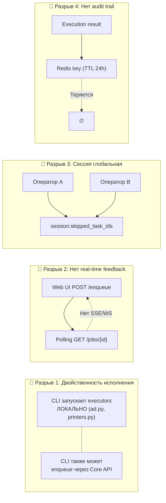
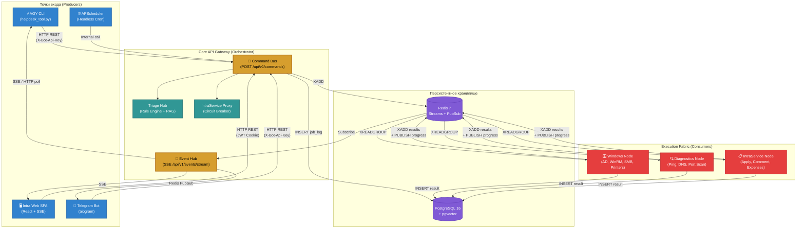
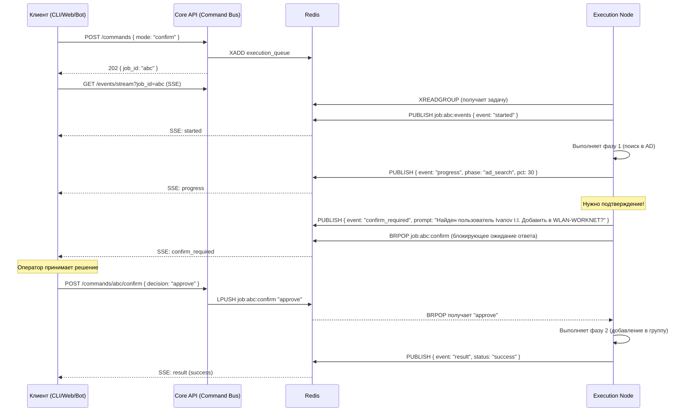
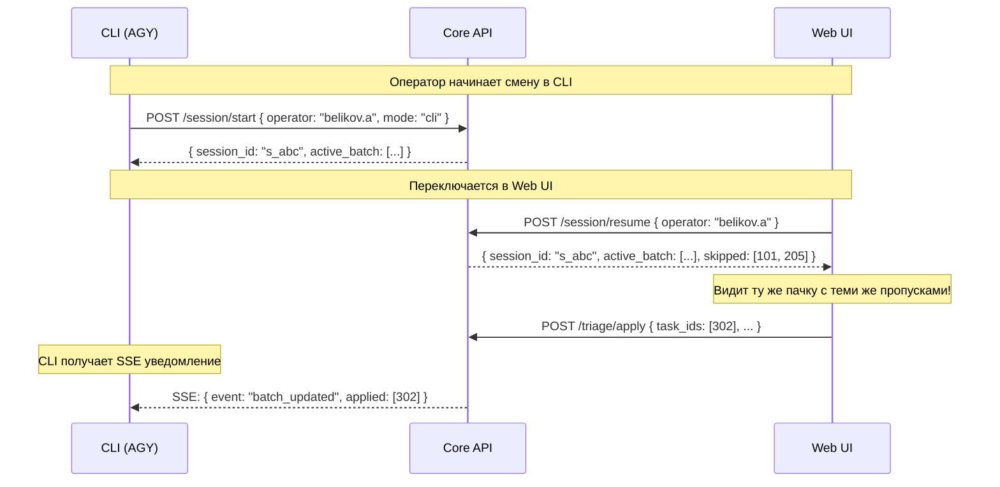

# Архитектурный Брейншторм: Унифицированная Платформа Исполнения IntraLink

## Цель

Спроектировать целевую архитектуру взаимодействия **CLI ↔ Web UI ↔ Core API ↔ Execution Hub**, обеспечивающую:
- 100% паритет функционала между терминалом и браузером
- Единый защищённый конвейер исполнения инфраструктурных задач
- Бесшовный переход Headless Autopilot ↔ Human-in-the-Loop

---

## 1. Анализ текущего состояния (AS-IS)

### 1.1. Компоненты и их роли

| Компонент | Стек | Роль | Точка входа |
|---|---|---|---|
| **Core API** | FastAPI, SQLAlchemy, APScheduler, Redis | Шлюз к IntraService, Rule Engine, RAG, Execution Broker | `http://host:8000/api/v1/*` |
| **Telegram Bot** | aiogram 3.x | Push-уведомления, мобильный интерфейс заявителей | Redis Streams (consumer) |
| **Intra Web** | React 19, Vite, Tailwind v4 | SPA-панель оператора (`/admin`) | JWT Cookie + REST |
| **Helpdesk Agent** | Python CLI + PowerShell | CLI-кокпит инженера в AGY, локальные executors | `helpdesk_tool.py <cmd>` |
| **Execution Worker** | Python asyncio + Redis Streams | Фоновый обработчик AD/WinRM задач | `execution_worker.py` (daemon) |

### 1.2. Выявленные архитектурные разрывы



> [!WARNING]
> **Критический разрыв #1**: CLI запускает `ActiveDirectoryExecutor` и `diagnostics.py` **напрямую** в процессе AGY-агента, минуя Redis Streams и Core API. При этом Execution Worker (`execution_worker.py`) дублирует ту же логику для задач из очереди. Это создаёт **два параллельных пути исполнения** одних и тех же операций с разными гарантиями, аудитом и контролем доступа.

> [!WARNING]
> **Критический разрыв #2**: Web UI не имеет механизма real-time обратной связи от Execution Worker. После `POST /enqueue` клиент вынужден поллить `GET /jobs/{id}`, не получая промежуточных статусов и логов.

---

## 2. Целевая архитектура (TO-BE)

### 2.1. Ключевой принцип: **Command Bus + Unified Execution Fabric**

Все клиенты (CLI, Web UI, Telegram Bot, Cron) отправляют **команды** (Commands) в единый **Command Bus** через Core API. Execution Nodes потребляют команды из шины и рапортуют прогресс через **Event Stream** обратно всем подписчикам.



### 2.2. Три столпа архитектуры

#### Столп 1: **Command Bus** — Единая точка приёма задач

```
POST /api/v1/commands
{
  "type": "grant_wlan | create_user | diagnose_host | apply_triage | ...",
  "target": { "task_id": 12345, "host": "PC-SALES-001", ... },
  "params": { ... },
  "mode": "auto | confirm | dry_run",
  "callback_channel": "sse | redis_pubsub | webhook",
  "initiator": { "type": "cli | web | bot | cron", "identity": "belikov.a" }
}
```

**Гарантии:**
- Идемпотентность через `idempotency_key` (UUID v4, генерируется клиентом)
- Валидация Pydantic-схемы команды **до** постановки в очередь
- Персистентная запись в `job_log` (PostgreSQL) **до** публикации в Redis Stream
- Возврат `job_id` + `estimated_duration` немедленно (HTTP 202)

#### Столп 2: **Event Hub** — Real-time обратная связь

```
GET /api/v1/events/stream?job_id=xxx&channel=progress
← SSE: { "event": "progress", "data": { "phase": "searching_ad", "pct": 40 } }
← SSE: { "event": "progress", "data": { "phase": "adding_to_group", "pct": 80 } }
← SSE: { "event": "result",   "data": { "status": "success", "message": "..." } }
```

**Реализация:**
- Core API подписывается на Redis PubSub канал `job:{job_id}:events`
- Execution Node публикует промежуточные статусы в этот канал
- Event Hub транслирует их через SSE клиентам
- Для CLI: используется `aiohttp` SSE-клиент или HTTP long-poll с `?wait=true`
- Для Web: нативный `EventSource` API
- Для Telegram: Redis PubSub → aiogram push

#### Столп 3: **Execution Fabric** — Специализированные ноды

| Node Type | Расположение | Задачи | Масштабирование |
|---|---|---|---|
| **Windows Node** | Рабочая станция инженера (Windows 10/11) | AD operations, WinRM, SMB, принтеры | 1 нода (привязка к домену) |
| **Diagnostics Node** | Docker / Windows host | Ping, DNS, TCP port probes | Горизонтально (stateless) |
| **IntraService Node** | Docker (core-api process) | Apply, Comment, Expenses через IS API | Внутри Core API (co-located) |

---

## 3. Детальное проектирование компонентов

### 3.1. Command Bus (Core API)

#### Новый роутер: `commands.py`

```python
# core-api/app/routers/commands.py

@router.post("/commands", status_code=status.HTTP_202_ACCEPTED)
async def submit_command(
    cmd: CommandRequest,
    initiator: str = Depends(verify_admin_or_api_key),
    db: AsyncSession = Depends(get_db),
):
    """
    Единая точка входа для всех команд исполнения.
    1. Валидация + идемпотентность
    2. Персистентная запись в job_log (PG)
    3. Публикация в Redis Stream (execution_queue)
    4. Возврат job_id
    """
```

#### Pydantic-модель команды

```python
class CommandRequest(BaseModel):
    type: CommandType  # Enum: grant_wlan, create_user, diagnose_host, apply_triage, install_printer, ...
    target: CommandTarget  # task_id, host, identity, etc.
    params: dict[str, Any] = {}
    mode: ExecutionMode = ExecutionMode.AUTO  # auto | confirm | dry_run
    idempotency_key: str | None = None
    priority: int = Field(default=5, ge=1, le=10)  # 1=low, 10=critical
```

#### Таблица `job_log` (PostgreSQL)

```sql
CREATE TABLE job_log (
    id            UUID PRIMARY KEY DEFAULT gen_random_uuid(),
    idempotency_key VARCHAR(64) UNIQUE,
    command_type  VARCHAR(50) NOT NULL,
    target_json   JSONB NOT NULL,
    params_json   JSONB DEFAULT '{}',
    mode          VARCHAR(20) DEFAULT 'auto',
    initiator     VARCHAR(100) NOT NULL,  -- 'cli:belikov.a', 'web:admin', 'bot:12345', 'cron:triage'
    source        VARCHAR(20) NOT NULL,   -- 'cli', 'web', 'bot', 'cron'
    status        VARCHAR(20) DEFAULT 'queued',  -- queued → running → success | failed | cancelled
    priority      SMALLINT DEFAULT 5,
    
    -- результат
    result_json   JSONB,
    error_message TEXT,
    
    -- таймстемпы
    created_at    TIMESTAMPTZ DEFAULT NOW(),
    started_at    TIMESTAMPTZ,
    completed_at  TIMESTAMPTZ,
    
    -- связь с IntraService
    task_id       INTEGER,
    
    -- индексы для быстрого поиска
    INDEX idx_job_status (status),
    INDEX idx_job_task_id (task_id),
    INDEX idx_job_created (created_at DESC)
);
```

### 3.2. Event Hub (SSE Gateway)

#### Новый роутер: `events.py`

```python
# core-api/app/routers/events.py

@router.get("/events/stream")
async def event_stream(
    job_id: str | None = Query(None),
    channel: str = Query("all"),  # all | progress | triage_updates
    initiator: str = Depends(verify_admin_or_api_key),
):
    """
    Server-Sent Events endpoint.
    Подписка на события исполнения через Redis PubSub.
    """
    async def generate():
        async with redis.pubsub() as pubsub:
            if job_id:
                await pubsub.subscribe(f"job:{job_id}:events")
            else:
                await pubsub.psubscribe("job:*:events")
            
            async for message in pubsub.listen():
                if message["type"] in ("message", "pmessage"):
                    yield f"data: {message['data']}\n\n"
    
    return StreamingResponse(generate(), media_type="text/event-stream")
```

#### Протокол событий

```typescript
// Типы событий (TypeScript для Web UI)
type JobEvent = 
  | { event: "queued";   job_id: string; command_type: string; estimated_ms: number }
  | { event: "started";  job_id: string; node_id: string }
  | { event: "progress"; job_id: string; phase: string; pct: number; detail?: string }
  | { event: "confirm_required"; job_id: string; prompt: string; options: string[] }
  | { event: "result";   job_id: string; status: "success" | "failed"; data: any }
  | { event: "log";      job_id: string; level: "info" | "warn" | "error"; message: string }
```

### 3.3. Human-in-the-Loop (HITL) Protocol

> [!IMPORTANT]
> Ключевое нововведение: **режим `confirm`** позволяет Execution Node приостановить выполнение и запросить подтверждение от оператора через любой интерфейс.



#### HITL в разных модальностях

| Модальность | Как выглядит `confirm_required` | Как оператор отвечает |
|---|---|---|
| **CLI (AGY)** | Текстовый prompt в терминале: `⚠️ Подтвердите: Ivanov I.I. → WLAN-WORKNET? [y/n]` | Текстовый ввод `y` / `n` |
| **Web UI** | Модальное окно с кнопками «Подтвердить» / «Отклонить» | Клик по кнопке |
| **Telegram** | Inline-клавиатура под сообщением | Нажатие inline-кнопки |
| **Cron (Headless)** | Автоматический `approve` (если `mode: auto`) или `skip` с эскалацией | Не требуется |

### 3.4. Миграция Helpdesk Agent CLI

#### Текущая проблема: Двойной путь исполнения

```
# СЕЙЧАС (AS-IS) — два пути к одной операции:
CLI → diagnostics.py → Ping/DNS/SMB (ЛОКАЛЬНО)
CLI → core_api_client.py → POST /execution/enqueue → Redis → execution_worker.py → diagnostics (УДАЛЁННО)
```

#### Решение: CLI как «тонкий клиент» Command Bus

```
# ЦЕЛЕВОЕ (TO-BE) — единый путь:
CLI → core_api_client.py → POST /api/v1/commands → Redis Stream → Execution Node → результат через SSE
```

> [!IMPORTANT]
> **Исключение для Fast-Path операций:** Диагностика хостов (`ping`, `nslookup`, `Test-NetConnection`) остаётся **локальной** в CLI, так как:
> 1. Она stateless и идемпотентна (безопасно запускать из любой точки)
> 2. Требует минимальной латентности для интерактивного триажа
> 3. Результат не мутирует состояние IntraService
>
> **Все мутирующие операции** (AD, apply, WinRM) — только через Command Bus.

#### Новая архитектура `core_api_client.py`

```python
class CoreApiClient:
    """Unified Command Bus клиент для CLI и Execution Worker."""
    
    async def submit_command(
        self,
        command_type: str,
        target: dict,
        params: dict = {},
        mode: str = "auto",
        wait: bool = True,          # CLI по умолчанию ждёт результат
        timeout: float = 120.0,
        on_progress: Callable | None = None,    # callback для progress bar
        on_confirm: Callable | None = None,      # callback для HITL prompt
    ) -> CommandResult:
        """
        Отправляет команду через Command Bus и опционально ожидает результат через SSE.
        """
        # 1. POST /api/v1/commands
        job = await self._post_command(command_type, target, params, mode)
        
        if not wait:
            return CommandResult(job_id=job["job_id"], status="queued")
        
        # 2. Подписка на SSE для ожидания результата
        async for event in self._subscribe_sse(job["job_id"], timeout):
            if event["event"] == "progress" and on_progress:
                on_progress(event["data"])
            elif event["event"] == "confirm_required" and on_confirm:
                decision = on_confirm(event["data"]["prompt"])
                await self._confirm_command(job["job_id"], decision)
            elif event["event"] == "result":
                return CommandResult.from_event(event)
```

### 3.5. Расширение Web UI для Feature Parity

#### Новые компоненты React

| Компонент | Назначение | Паритет с CLI |
|---|---|---|
| `<CommandPanel />` | Единая панель отправки команд (WLAN, AD, принтеры) | `helpdesk_tool.py <cmd>` |
| `<JobTracker />` | Real-time трекер выполнения задач (SSE progress bar) | Терминальный progress bar |
| `<ConfirmDialog />` | HITL-модальное окно подтверждения | Текстовый `[y/n]` prompt |
| `<DiagnosticsPanel />` | Визуализация результатов сетевой диагностики | `--json` + Mermaid в AGY |
| `<AuditLog />` | История всех выполненных команд из `job_log` | `git log` стиль в терминале |
| `<BatchTriageBoard />` | Kanban-доска триажа с drag-and-drop статусами | `/triage` дашборд |

#### SSE-интеграция в React

```typescript
// hooks/useJobStream.ts
function useJobStream(jobId: string) {
  const [status, setStatus] = useState<JobStatus>("queued");
  const [progress, setProgress] = useState(0);
  const [confirmPrompt, setConfirmPrompt] = useState<string | null>(null);

  useEffect(() => {
    const es = new EventSource(`/api/v1/events/stream?job_id=${jobId}`);
    
    es.addEventListener("progress", (e) => {
      const data = JSON.parse(e.data);
      setProgress(data.pct);
      setStatus("running");
    });
    
    es.addEventListener("confirm_required", (e) => {
      const data = JSON.parse(e.data);
      setConfirmPrompt(data.prompt);  // показать модальное окно
    });
    
    es.addEventListener("result", (e) => {
      const data = JSON.parse(e.data);
      setStatus(data.status);
      es.close();
    });
    
    return () => es.close();
  }, [jobId]);

  return { status, progress, confirmPrompt };
}
```

---

## 4. Сессионная модель оператора

### 4.1. Изоляция сессий (Per-Operator State)

**Проблема:** Текущий `session:skipped_task_ids` — глобальный Redis Set. Если работают два оператора, их пропуски конфликтуют.

**Решение:** Ключ Redis с привязкой к identity оператора:

```
session:{operator_id}:skipped_task_ids  → Redis SET (TTL 12h)
session:{operator_id}:current_batch     → Redis HASH (текущая пачка)
session:{operator_id}:preferences       → Redis HASH (фильтры, лимиты)
```

### 4.2. Синхронизация сессий между CLI и Web



---

## 5. Матрица Feature Parity

| Функция | CLI (AS-IS) | Web UI (AS-IS) | CLI (TO-BE) | Web UI (TO-BE) |
|---|:---:|:---:|:---:|:---:|
| Batch Triage | ✅ `/triage` | ✅ Таблица | ✅ | ✅ + Kanban |
| Task Details + RAG | ✅ `/task N` | ✅ Инспектор | ✅ | ✅ |
| Apply (finalize) | ✅ `apply` | ✅ Кнопка | ✅ через CMD Bus | ✅ через CMD Bus |
| Duplicates | ✅ `/duplicates` | ⚠️ Частично | ✅ | ✅ |
| KB Search (RAG) | ✅ `/kb` | ❌ Нет | ✅ | ✅ Панель KB |
| KB Sync | ✅ `/sync` | ❌ Нет | ✅ | ✅ Кнопка + Progress |
| Host Diagnostics | ✅ `/diag` (локально) | ❌ Нет | ✅ (локально) | ✅ через CMD Bus |
| Screenshot Analysis | ✅ `/screen` | ❌ Нет | ✅ | ✅ Lightbox |
| AD: Grant WLAN | ✅ Локально | ❌ Нет | ✅ через CMD Bus | ✅ через CMD Bus |
| AD: Create User | ✅ Локально | ❌ Нет | ✅ через CMD Bus | ✅ через CMD Bus |
| Printer Install | ✅ Локально | ❌ Нет | ✅ через CMD Bus | ✅ через CMD Bus |
| Execution Progress | ❌ Нет | ❌ Нет | ✅ SSE progress | ✅ SSE progress bar |
| HITL Confirmation | ✅ Текстовые шорткаты | ❌ Нет | ✅ Текст + SSE | ✅ Модальное окно |
| Audit Log | ❌ Нет | ❌ Нет | ✅ `job_log` query | ✅ Таблица аудита |
| Session Sync | ❌ Глобальная | ❌ Глобальная | ✅ Per-operator | ✅ Per-operator |
| Cron/Headless | ✅ `/schedule` | ❌ Нет | ✅ Auto-mode | ✅ Scheduled jobs UI |
| Redirect Detection | ✅ `/redirect` | ❌ Нет | ✅ | ✅ Фильтр + Badge |

---

## 6. Безопасность и контроль доступа

### 6.1. Матрица авторизации Command Bus

| Тип команды | CLI (API Key) | Web (JWT) | Bot (API Key) | Cron (Internal) |
|---|:---:|:---:|:---:|:---:|
| `diagnose_host` | ✅ | ✅ | ❌ | ✅ |
| `apply_triage` | ✅ | ✅ | ❌ | ✅ |
| `grant_wlan` | ✅ | ✅ | ❌ | ✅ (auto) |
| `create_user` | ✅ | ✅ (с HITL) | ❌ | ❌ |
| `install_printer` | ✅ | ✅ (с HITL) | ❌ | ❌ |
| `rag_sync` | ✅ | ✅ | ❌ | ✅ |

### 6.2. Rate Limiting по source

```python
# Лимиты по источнику команды
RATE_LIMITS = {
    "cli":  {"rpm": 60,  "concurrent": 10},
    "web":  {"rpm": 30,  "concurrent": 5},
    "bot":  {"rpm": 10,  "concurrent": 2},
    "cron": {"rpm": 120, "concurrent": 20},
}
```

---

## 7. Стратегия миграции (Phased Rollout)

### Фаза 1: Command Bus + Job Log (1-2 недели)
- [ ] Создать таблицу `job_log` в PostgreSQL
- [ ] Создать роутер `commands.py` с Command Bus
- [ ] Мигрировать `execution.py` → `commands.py` (обратная совместимость через alias)
- [ ] Добавить запись результатов в `job_log` из Execution Worker

### Фаза 2: Event Hub + SSE (1-2 недели)
- [ ] Создать роутер `events.py` с SSE endpoint
- [ ] Добавить `PUBLISH` прогресса в Execution Worker
- [ ] Обновить `core_api_client.py` с поддержкой SSE
- [ ] Добавить `useJobStream` hook в React

### Фаза 3: HITL Protocol (1 неделя)
- [ ] Реализовать `confirm_required` / `BRPOP` протокол в Execution Worker
- [ ] Добавить `POST /commands/{id}/confirm` эндпоинт
- [ ] Создать `<ConfirmDialog />` в Web UI
- [ ] Добавить HITL callback в CLI client

### Фаза 4: Per-Operator Sessions (1 неделя)
- [ ] Мигрировать `session:skipped_task_ids` → `session:{op}:skipped_task_ids`
- [ ] Создать `POST /session/start` и `/session/resume`
- [ ] Добавить SSE уведомления об изменениях в сессии

### Фаза 5: Web UI Feature Parity (2-3 недели)
- [ ] `<CommandPanel />` — панель отправки AD/WinRM/Printer команд
- [ ] `<DiagnosticsPanel />` — визуализация диагностики
- [ ] `<AuditLog />` — история из `job_log`
- [ ] `<BatchTriageBoard />` — Kanban-доска триажа
- [ ] KB Search/Sync UI

### Фаза 6: CLI Migration (1 неделя)
- [ ] Перевести AD executor commands на Command Bus
- [ ] Сохранить локальные diagnostics (Fast-Path)
- [ ] Удалить дублирующий локальный путь исполнения

---

## 8. Метрики успеха

| Метрика | Текущее | Целевое |
|---|---|---|
| Время от создания заявки до решения (среднее) | Ручное | < 2 мин (авто-триаж) |
| % операций через единый Command Bus | 0% | 100% |
| Audit trail покрытие | 0% (Redis TTL) | 100% (PostgreSQL) |
| Feature parity CLI ↔ Web | ~40% | 100% |
| Mean Time to Detect сбоя исполнения | Неизвестно | < 10 сек (SSE) |
| Concurrent operators без конфликтов | 1 | ∞ (per-op sessions) |

---

## Open Questions

> [!IMPORTANT]
> **Q1: Размещение Windows Execution Node.**
> Сейчас `execution_worker.py` запускается на рабочей станции инженера. При переходе на Command Bus — оставить на рабочей станции (доступ к домену) или выделить отдельный Windows Server в DMZ с доменной связностью?

> [!IMPORTANT]
> **Q2: Ollama для AI-воркера.**
> В `docker-compose.yml` уже есть контейнер Ollama с GPU. Планируется ли использовать LLM для автоматической классификации заявок в Command Bus (AI Triage Node) или это остаётся в Rule Engine?

> [!IMPORTANT]
> **Q3: Приоритет фаз.**
> Какие фазы наиболее критичны для текущих операционных потребностей? Рекомендую начать с **Фазы 1 + 2** (Command Bus + Event Hub), так как они закрывают оба критических разрыва.

> [!WARNING]
> **Q4: Обратная совместимость.**
> Текущие навыки AGY (skills) вызывают `helpdesk_tool.py` напрямую. Нужно сохранить обратную совместимость CLI-интерфейса на весь период миграции. Предлагаю паттерн Strangler Fig — новые команды через Command Bus, старые работают параллельно до полной миграции.
