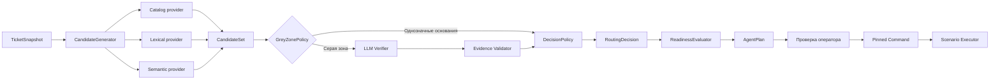

# План реализации доказательного каскада с LLM-verifier

Рекомендую одно breaking-изменение в отдельной ветке `codex/evidence-routing-cascade`: заменить текущий взвешенный `ScenarioRouter`, обновить API/UI/worker одним релизом и сразу удалить старый путь. Долгий compatibility-контур здесь не нужен.

Текущий worktree содержит незакоммиченные изменения, поэтому перед созданием ветки необходимо сначала зафиксировать их отдельным baseline-коммитом или другим недеструктивным способом. `reset`/потеря существующих изменений недопустимы.

## 1. Целевая архитектура



Главное правило: маршрутизация, полнота параметров и исполнение — три независимых слоя.

## 2. Новая структура модулей

Создать отдельный пакет:

```text
core/routing/
├── contracts.py
├── snapshot.py
├── service.py
├── candidate_generator.py
├── decision_policy.py
├── readiness.py
├── evidence_validator.py
├── prompts/
│   └── candidate_verifier_v1.py
├── providers/
│   ├── catalog.py
│   ├── lexical.py
│   └── semantic.py
└── verifier/
    ├── base.py
    ├── deterministic.py
    └── llm.py
```

`core/scenarios/` после рефакторинга отвечает только за:

- определения возможностей сценариев;
- обязательные параметры;
- уточнения;
- инфраструктурное исполнение;
- проверку результата.

Он больше не классифицирует заявки.

## 3. Новые контракты

### `TicketSnapshot`

Неизменяемый снимок:

```python
class TicketSnapshot(BaseModel):
    task_id: int
    status_id: int
    service_id: int | None
    service_name: str | None
    title: str
    description: str
    public_comments: list[SnapshotComment]
    custom_fields: dict[str, str]
    entities: ExtractedEntitiesDTO
    attachments: list[AttachmentRef]
    last_event_id: int | None
    snapshot_hash: str
```

Хэш строится из нормализованных полей, влияющих на решение. Пароли и защищённые поля в снимок маршрутизации не включаются.

### Доказательства

```python
class RoutingEvidence(BaseModel):
    id: str
    candidate_key: str
    source: Literal[
        "service_id",
        "service_name",
        "title",
        "description",
        "comment",
        "custom_field",
        "semantic",
    ]
    polarity: Literal["supports", "contradicts"]
    strength: Literal["exact", "strong", "weak"]
    source_ref: str
    text_span: str | None
```

### Кандидаты

```python
class ScenarioCandidate(BaseModel):
    scenario_key: str
    scenario_version: str
    evidence_ids: list[str]
    contradiction_ids: list[str]
    sources: set[str]
```

Не вводить общий арифметический `confidence` на этапе генерации.

### Результат verifier

```python
class CandidateVerification(BaseModel):
    scenario_key: str
    verdict: Literal["supported", "contradicted", "insufficient"]
    evidence_spans: list[str]
    contradictions: list[str]
    missing_information: list[str]
```

### Итоговое решение

```python
class RoutingDecision(BaseModel):
    id: UUID
    task_id: int
    snapshot_hash: str
    router_version: str
    prompt_version: str | None

    state: Literal[
        "selected",
        "needs_clarification",
        "ambiguous",
        "unmatched",
        "degraded",
    ]

    selected_scenario: str | None
    candidates: list[ScenarioCandidate]
    evidence: list[RoutingEvidence]
    verifier_result: list[CandidateVerification] | None
    missing_facts: list[str]
    degradation_reason: str | None
```

`RoutingDecision` становится единственным источником результата маршрутизации.

## 4. Candidate Generator

### Catalog provider

Перенести полезные таблицы из `catalog_prior.py`, но изменить семантику:

- точный `ServiceId` возвращает допустимый набор сценариев;
- название услуги создаёт кандидата, но не выбирает его;
- общий раздел каталога не ограничивает множество;
- конфликт каталога и текста отмечается доказательством, а не числовым штрафом.

### Lexical provider

Строгие признаки оставить только там, где они действительно строгие:

- `WLAN-WORKNET`;
- точный hostname;
- IP-адрес;
- явное действие «создать пользователя»;
- явное отрицание;
- известный идентификатор услуги.

Списки разговорных синонимов не должны самостоятельно выбирать сценарий.

### Semantic provider

Переписать текущий `SemanticPrototypeIndex`:

- он возвращает top-K кандидатов;
- embedding score используется только для retrieval;
- score не считается вероятностью;
- все `semantic_prototypes` берутся из зарегистрированных определений сценариев;
- API и worker используют одну фабрику и одинаковый `router_version`;
- недоступность embeddings не ломает каталог и строгие правила.

## 5. Определение серой зоны

LLM вызывается только если выполняется хотя бы одно условие:

- найдено несколько правдоподобных сценариев;
- кандидат появился только из `service_name`;
- кандидат появился только из semantic retrieval;
- каталог и текст указывают на разные сценарии;
- найдены отрицания или несколько намерений;
- услуга общая;
- отсутствует подтверждающий текст для изменяющего сценария;
- строгие источники противоречат друг другу.

LLM не вызывается, если:

- точный `ServiceId` однозначно соответствует сценарию;
- нет текстового противоречия;
- либо существует уникальное строгое прямое основание.

Пустые технические параметры не делают маршрут серой зоной. Они обрабатываются после выбора сценария.

## 6. LLM-verifier

Использовать существующий LiteLLM-контур, не добавляя новый ML-фреймворк на первом этапе.

Verifier получает:

- нормализованный текст заявки;
- максимум три кандидата;
- краткие определения кандидатов;
- найденные доказательства и противоречия.

Verifier не может:

- создавать отсутствующий в запросе `scenario_key`;
- выбирать статус заявки;
- разрешать выполнение;
- генерировать технические параметры;
- менять каталог;
- подменять отсутствующие факты;
- видеть пароль или защищённые поля.

Параметры вызова:

- `temperature=0`;
- строгая JSON-схема;
- фиксированная версия prompt;
- ограниченный timeout;
- одна попытка исправления невалидного JSON;
- затем `degraded`, без скрытого повторного классификатора.

### Проверка результата

Backend валидирует:

- все `scenario_key` принадлежат входному набору;
- каждый `evidence_span` дословно существует в снимке;
- модель не добавила сущности;
- противоречия относятся к переданному тексту;
- JSON соответствует Pydantic-схеме.

Невалидный ответ verifier считается отсутствующим ответом, а не частичным успехом.

## 7. Decision Policy

Последовательность:

1. Отфильтровать явно противоречащие кандидаты.
2. Если остался один кандидат со строгим основанием — выбрать его.
3. Если серая зона — применить валидированный verifier.
4. Один `supported`, остальные `contradicted` → `selected`.
5. Один `supported`, но не хватает параметров исполнения → `needs_clarification`.
6. Несколько `supported` → `ambiguous`.
7. Только `insufficient` → `ambiguous` либо `unmatched`.
8. Verifier недоступен:
   - строгий однозначный маршрут сохраняется;
   - иначе `degraded`, оператор выбирает сценарий.

`rag_consultation` больше не является техническим fallback для любой неизвестной заявки. Он выбирается только при подтверждённом консультационном намерении.

## 8. Разделение сценария и готовности

Из `BaseScenario` удалить:

- `can_handle()`;
- `evaluate_match()`;
- `ScenarioMatch`;
- участие `semantic_score` в сценарии.

Вместо этого сценарий предоставляет декларацию:

```python
class ScenarioDefinition(BaseModel):
    key: str
    version: str
    service_ids: set[int]
    prototypes: list[str]
    required_facts: list[FactRequirement]
    clarification_template: str | None
    executor_capability: str | None
```

`ReadinessEvaluator` после маршрутизации проверяет:

- обязательные параметры;
- неоднозначные сущности;
- инфраструктурные prerequisites;
- поддерживаемого исполнителя.

Результат readiness не изменяет выбранный сценарий.

## 9. Перестройка PlanSynthesizer

Заменить `PlanSynthesizer` на `AgentPlanCompiler`.

Текущий дефект, при котором сначала вызывается `find_scenario()`, а затем отдельно `evaluate_match()`, полностью исчезает.

Новый поток:

```python
decision = await routing_service.route(snapshot)
readiness = readiness_evaluator.evaluate(decision, snapshot)
plan = agent_plan_compiler.compile(decision, readiness)
```

Кэшировать не только по `task_id`, а по:

```text
task_id + snapshot_hash + router_version
```

Это исключит возврат плана для изменившейся заявки.

## 10. Закрепление операторского решения

Approve API принимает:

```json
{
  "routing_decision_id": "...",
  "snapshot_hash": "...",
  "scenario_key": "grant_wlan",
  "corrected_params": {},
  "last_event_id": 123
}
```

Backend проверяет:

- решение относится к этой заявке;
- снимок не устарел;
- выбранный сценарий присутствовал среди кандидатов либо явно выбран оператором;
- применены операторские параметры;
- сервисная учётная запись назначена;
- заявка не завершена;
- активного исполнения нет.

В `CommandRecord` сохраняются:

- `routing_decision_id`;
- закреплённый `scenario_key`;
- версия сценария;
- параметры;
- `snapshot_hash`;
- инициатор и оператор.

Worker выполняет `registry.get(command.action)`. Любые вызовы `find_scenario()` в worker после подтверждения удалить.

## 11. Хранение решений и feedback

Создать миграцию:

### `routing_decisions`

- `id UUID`;
- `task_id`;
- `snapshot_hash`;
- `router_version`;
- `prompt_version`;
- `state`;
- `selected_scenario`;
- `snapshot_json`;
- `candidates_json`;
- `evidence_json`;
- `verifier_json`;
- `missing_facts_json`;
- `degradation_reason`;
- `created_at`.

### `routing_feedback`

- `decision_id`;
- `operator_username`;
- `verdict`: `confirmed`, `corrected`, `rejected`, `manual`;
- `corrected_scenario`;
- `corrected_params`;
- `reason_tag`;
- `notes`;
- `created_at`.

Таблица `autopilot_corrections` сейчас пуста, поэтому её можно удалить и заменить `routing_feedback` без backfill.

## 12. UI

Карточка плана должна показывать отдельно:

- выбранный сценарий;
- состояние маршрутизации;
- основания;
- противоречия;
- альтернативные кандидаты;
- недостающие параметры;
- состояние verifier;
- готовность к исполнению.

Убрать непрозрачный процент `confidence`.

Оператор может:

- подтвердить выбранный сценарий;
- выбрать альтернативного кандидата;
- найти сценарий вручную;
- скорректировать параметры;
- пометить причину исправления.

При ручном выборе UI не вызывает повторную классификацию.

## 13. Что удалить

После переключения тестов удалить:

| Удалить или переписать | Замена |
|---|---|
| `core/scenarios/router.py` | `core/routing/service.py` |
| `core/scenarios/catalog_prior.py` | `core/routing/providers/catalog.py` |
| `core/scenarios/coherence_guard.py` | Evidence/contradiction validation |
| `core/scenarios/semantic_index.py` | `core/routing/providers/semantic.py` |
| `ScenarioMatch` | `RoutingDecision` |
| `BaseScenario.can_handle()` | `ScenarioDefinition` |
| `BaseScenario.evaluate_match()` | Candidate providers + verifier |
| `ScenarioRegistry.find_scenario()` | `RoutingService.route()` |
| `ScenarioRegistry.match_scenario()` | `RoutingService.route()` |
| старый `PlanSynthesizer` | `AgentPlanCompiler` |
| `worker/src/scenarios/*` re-export | прямые импорты из `core` |
| `autopilot_corrections` | `routing_feedback` |
| тесты арифметических Factors A–E | тесты evidence/decision policy |

`openai`, LiteLLM и существующий embedder пока оставить: они используются не только старым роутером. Новых тяжёлых ML-зависимостей не добавлять.

## 14. Тестовая матрица

### Маршрутизация

- точный сервис и согласованный текст;
- точный сервис без описания;
- конфликт сервиса и текста;
- только название услуги;
- только semantic candidate;
- несколько намерений;
- отрицание;
- неизвестная заявка;
- консультационное намерение;
- №142135.

### Readiness

- сценарий определён, параметры полные;
- сценарий определён, отсутствует пользователь;
- неоднозначный пользователь;
- отсутствует ПК;
- неподдерживаемый исполнитель.

### LLM

- один поддержанный кандидат;
- несколько поддержанных;
- все `insufficient`;
- выдуманный `scenario_key`;
- выдуманный evidence span;
- невалидный JSON;
- timeout;
- LiteLLM недоступен;
- prompt injection внутри текста заявки;
- RED-заявка с защищёнными данными.

### Исполнение

- подтверждённый сценарий исполняется без повторной маршрутизации;
- исправленный оператором сценарий исполняется без замены;
- устаревший `snapshot_hash` даёт `409`;
- смена исполнителя блокирует действие;
- повторный command идемпотентен;
- LLM недоступен после подтверждения и не влияет на исполнение.

### Сквозная проверка

- полный `pytest`;
- Ruff;
- frontend build;
- миграция `upgrade → downgrade → upgrade`;
- Docker rebuild;
- health API/worker/LiteLLM;
- одинаковый снимок в API и prefetch worker даёт эквивалентный `RoutingDecision`;
- пароль отсутствует в prompt, БД маршрутизации, Redis, Taskiq и логах.

## 15. Порядок реализации

### Коммит 1 — контракты и БД

- `TicketSnapshot`;
- evidence/candidate/decision contracts;
- новые таблицы;
- версии router/prompt.

### Коммит 2 — ScenarioDefinition

- отделить определения от исполнителей;
- убрать matching из адаптеров;
- перевести все девять сценариев.

### Коммит 3 — candidate providers

- catalog;
- lexical;
- semantic retrieval;
- единая инициализация API/worker.

### Коммит 4 — verifier и policy

- gray-zone predicate;
- LLM adapter;
- schema/evidence validation;
- degradation;
- decision policy.

### Коммит 5 — API, plan и persistence

- `RoutingService`;
- `AgentPlanCompiler`;
- новый plan DTO;
- кэш по snapshot/version;
- feedback API.

### Коммит 6 — worker и execution boundary

- убрать повторную классификацию;
- закрепить decision в `CommandRecord`;
- выполнять только утверждённый сценарий.

### Коммит 7 — UI

- новая карточка решения;
- кандидаты и evidence;
- ручной выбор;
- feedback.

### Коммит 8 — удаление legacy

- удалить Factors A–E;
- удалить compatibility re-export;
- удалить старые тесты и DTO;
- очистить документацию.

### Коммит 9 — регрессия и документация

Обновить:

- [architecture.md](<C:/Users/belikov.a/Desktop/Акты, документы/Work/!Projects/intralink/docs/architecture.md>);
- [v2-universal-scenario-core.md](<C:/Users/belikov.a/Desktop/Акты, документы/Work/!Projects/intralink/docs/architecture/v2-universal-scenario-core.md>);
- `Сценарии работы агента.md`;
- operations/runbook;
- создать `docs/architecture/adr/evidence-routing-cascade.md`.

## 16. Критерии готовности

Работа завершена, когда:

- в коде отсутствует числовая сумма Factors A–E;
- intent и readiness не смешиваются;
- один immutable `RoutingDecision` проходит от анализа до команды;
- LLM вызывается только в формально определённой серой зоне;
- любое модельное доказательство проверяется по исходному снимку;
- отказ LLM приводит к `degraded/ambiguous`, а не к ложному выбору;
- операторский выбор после подтверждения не пересматривается;
- №142135 больше не становится `unmatched` только из-за отсутствия прямого ключевого слова;
- все рабочие сценарии остаются `ASSISTED`;
- старые модули маршрутизации удалены, а не оставлены вторым источником правды.

Это big-shot изменение по объёму, но не хаотичный big bang: одна ветка, один новый архитектурный контур, последовательные проверяемые коммиты и полное удаление старого роутера до слияния.